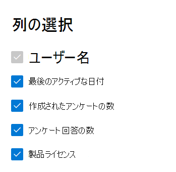

# 管理センターでレポートをMicrosoft 365する - Dynamics 365 Customer Voice アクティビティ

Microsoft 365 の [レポート] ダッシュボードには、組織内での製品全体に関するアクティビティが表示されます。 これにより、個別の製品レベルのレポートを詳細に確認して、各製品内のアクティビティについてより詳しく知ることができます。 [レポートの概要トピック](activity-reports.md)を参照してください。
  
たとえば、Microsoft Dynamics 365 Customer Voice を使用するライセンスを持つすべてのユーザーのアクティビティを理解するには、Dynamics 365 Customer Voice との対話を確認します。 また、作成されたProアンケートの数と、ユーザーが回答したアンケートのProを調べて、共同作業のレベルを把握するのにも役立ちます。 
  
## Dynamics 365 Customer Voice アクティビティ レポートにアクセスする方法

1. 管理センターで、[**レポート**] \> [<a href="https://go.microsoft.com/fwlink/p/?linkid=2074756" target="_blank">使用状況</a>] ページの順に移動します。 
2. ダッシュボードのホームページで、Dynamics 365 Customer Voice カードの [ **その他の表示** ] ボタンをクリックします。
  
## Dynamics 365 Customer Voice アクティビティ レポートを解釈する

[アクティビティ] タブを選択すると、Dynamics 365 Customer Voice レポートで **アクティビティ** を表示できます。 

[ **列の選択] を選択** して、レポートに列を追加または削除します。    

また、[**エクスポート**] リンクを選択して、レポート データを Excel の .csv ファイルにエクスポートすることもできます。 これにより、すべてのユーザーのデータがエクスポートされ、単純な並べ替えとフィルター処理を行ってさらに分析することができます。 ユーザー数が 2000 未満である場合は、レポート自体のテーブル内で並べ替えとフィルター処理を行うことができます。 2,000 人を超えるユーザーがいる場合は、フィルター処理と並べ替えを行うために、データをエクスポートする必要があります。 

**Dynamics 365 Customer Voice アクティビティ** レポートは、過去 7 日間、30 日間、90 日間、または 180 日間の傾向を確認できます。 ただし、レポートで特定の日を選択した場合、テーブルには現在の日付から最大 28 日間のデータが表示されます (レポートが生成された日付ではありません)。
  
|アイテム|説明|
|:-----|:-----|
|**測定基準**|**定義**|
|Username    |Microsoft Formsでアクティビティを実行したユーザーの電子メール アドレス。    |
|最終アクティビティ日 (UTC)    |選択した日付範囲に対してユーザーがフォーム アクティビティを実行した最新の日付。 特定の日付に発生したアクティビティを表示するには、直接グラフ内の日付を選択します。 これによりテーブルがフィルター処理され、特定の日にアクティビティを実行したユーザーに対してのみファイル アクティビティ データが表示されます。    |
|作成されたアンケートの数    |ユーザーが作成したアンケートの数。     |
|アンケート回答の数    |アンケートが配布されたレスポンダーからの回答の数。|
|||