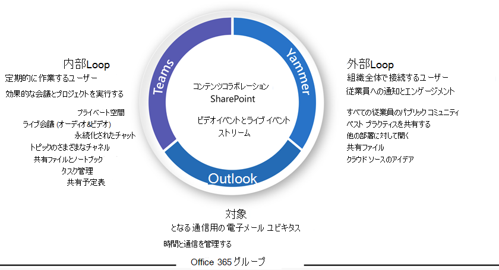

# ユーザーへのMicrosoft 365 グループの説明

Microsoft 365 グループ共有するリソースのコレクション (共有メールボックスと予定表、OneNote ノートブックを含むSharePoint サイト、その他のMicrosoft Plannerなど) を設定できます。 Microsoft Teamsは、グループを作成するときに含めることもできます。後で追加することもできます。 アクセス許可グループリソースは、グループを介して管理されます。

グループは、任意の共有リソースを作成して作成できます。 Outlookでグループを作成すると、Planner でグループに接続されたSharePoint チーム サイトまたはプランを作成した場合と同じ結果が得られます。 ユーザーがMicrosoft 365 グループを使用していない場合は、このことに気付かない可能性があります。 これにより、ユーザーが混乱し、リソースが重複する可能性が生じる可能性があります。 (たとえば、ドキュメント コラボレーション用のSharePoint サイトを作成し、後で Planner の別のインスタンスを作成する場合があります。Planner がグループの一部として既に使用されたことは認識されません)。

グループは複数の方法で作成できるため、組織に最適な方法を使用するようにユーザーをトレーニングすることをお勧めします。

- 組織が電子メールを使用してほとんどの通信を行う場合は、Outlookでグループを作成するようにユーザーに指示します。
- 組織がSharePointを頻繁に使用している場合、またはオンプレミスから移行SharePoint場合は、共同作業のためにSharePointチーム サイトを作成するようにユーザーに指示します。
- 組織がTeamsを展開している場合は、コラボレーションスペースが必要なときにチームを作成するようにユーザーに指示します。

他のユーザーと共同作業するスペースが必要な場合に、ユーザーが作業方法に最も合ったグループ作成方法を常に使用するようにトレーニングする場合は、リソースの混乱や重複を回避できます。 ユーザーの経験が深まるにつれて、グループに付属するサービスのコレクションが向上し、異なる作成方法が同じ結果につながることを理解できるようになります。

[ビジネス ユーザー向けのMicrosoft 365 グループ - PowerPoint テンプレート](https://www.microsoft.com/download/details.aspx?id=102396)を、ユーザーのプレゼンテーションのトレーニングの出発点として使用できます。

## 関連項目

[Microsoft 365 グループについて](https://support.microsoft.com/office/b565caa1-5c40-40ef-9915-60fdb2d97fa2)
