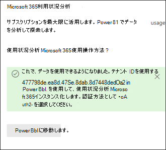
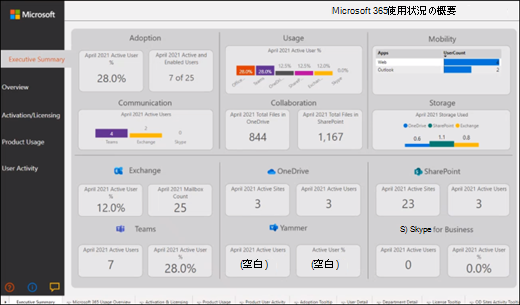

# Usage Analytics を使用してデータをMicrosoft 365 Government Community Cloud (GCC) するConnect

次の手順に従って、Microsoft 365 Government Community Cloud (GCC) テナントのMicrosoft 365利用状況分析レポートを使用してデータに接続します。 

> [!NOTE]
> これらの手順は、Microsoft 365 GCC テナント専用です。 

## はじめに

Microsoft 365 Usage Analytics を最初に構成するには: 

- データ収集を有効にするには、Microsoft 365 グローバル管理者である必要があります。 
- テンプレート ファイルを使用するには[、Power BI Desktop](https://powerbi.microsoft.com/en-us/desktop/) アプリケーションが必要です。 
- レポートを発行して表示するには[、Power BI Pro ライセンス](https://go.microsoft.com/fwlink/p/?linkid=845347)またはプレミアム容量が必要です。 

## 手順 1: 組織のデータを Microsoft 365 Usage Analytics レポートで使用できるようにする

1. Microsoft 365 管理センターでナビゲーション メニューを展開し、[**レポート**] を選択し、[**利用状況**] を選択します。 
2. [**利用状況レポート**] ページの [Microsoft 365 Usage Analytics] セクションで、**はじめに** を選択します。 
3. [**利用状況分析のPower BIを有効にする**] の [**Microsoft 利用状況分析で組織の使用状況データをPower BIに使用できるようにする**] を選択し、[**保存**] を選択します。

     

    これにより、組織のデータにこのレポートにアクセスできるようにするプロセスが開始され、**使用状況分析をMicrosoft 365する準備** が整っていることを示すメッセージが表示されます。 このプロセスの完了には 24 時間かかる場合があることに注意してください。 

4. 組織のデータの準備ができたら、ページを更新すると、データが使用可能になったことを示すメッセージが表示され、 **テナント ID** 番号も提供されます。 テナント データへの接続を試みる場合は、後の手順でテナント ID を使用する必要があります。 
 
     
 
    > [!IMPORTANT]
    > データを利用できる場合は、[**Power BIに移動**] を選択しないと、Power BI Marketplace に移動します。  GCC テナントに必要なこのレポートのテンプレート アプリは、Power BI Marketplace では使用できません。  

## 手順 2: Power BI テンプレートをダウンロードし、データに接続し、レポートを発行する

Microsoft 365 GCCユーザーは、Microsoft 365 Usage Analytics レポート テンプレート ファイルをダウンロードして使用してデータに接続できます。 テンプレート ファイルを開いて使用するには、Power BI Desktopが必要です。 

 > [!NOTE]
 > 現在、Microsoft 365 Usage Analytics レポートのテンプレート アプリは、Power BI Marketplace のGCC テナントでは使用できません。  

1. [Power BI テンプレート](https://download.microsoft.com/download/7/8/2/782ba8a7-8d89-4958-a315-dab04c3b620c/Microsoft%20365%20Usage%20Analytics.pbit)をダウンロードしたら、Power BI Desktopを使用して開きます。 
2. **TenantID** の入力を求められたら、手順 1. でこのレポートの組織のデータを準備したときに受け取ったテナント ID を入力します。 次に、[ **読み込み**] を選択します。 データの読み込みには数分かかります。 

     

3. 読み込みが完了すると、レポートが表示され、データの概要が表示されます。 

     
 

4. 変更をレポートに保存します。 
5. Power BI Desktop メニューで **[発行**] を選択して、レポートを表示できる Power BI Online サービスに発行します。 これには、Power BI Pro ライセンスまたはPower BI Premium容量のいずれかが必要です。 [発行プロセス](/power-bi/create-reports/desktop-upload-desktop-files#to-publish-a-power-bi-desktop-dataset-and-reports)の一環として、Power BI Online Service で使用可能なワークスペースに発行するコピー先を選択する必要があります。

## 関連コンテンツ

[利用状況分析について](usage-analytics.md)  
[利用状況分析の最新バージョンを取得する](get-the-latest-version-of-usage-analytics.md)  
[Microsoft 365 利用状況分析でレポート間を移動して活用する](navigate-and-utilize-reports.md)  