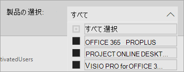

# Microsoft 365 利用状況分析でレポート間を移動して活用する

このダッシュボードでは、利用状況と導入状況の主なメトリックを簡単に確認できます。 トップ レベルの指標を選択すると、詳細と分析情報を提供するレポートにアクセスできます。 各レポート タブには、組織の利用状況と導入の側面に固有のデータの視覚化が含まれる。 収集されたデータは、各レポートのタイトルで説明され、表示しているレポート タブの視覚化に関する詳細を含むタイルが表示されます。

初めに、レポートのヒントをいくつか紹介します。

- 左側のナビゲーション タブ、または [エグゼクティブの概要]ページの関連する指標のナビゲーション タブを使用して、各トップ レベル レポートに移動します。

    

- 各トップ レベル レポートの上部にあるナビゲーション タブを使用して、そのレベル内の異なるレポートに移動します。

    

- 多くのレポートにはスライサーが含まれているので、表示する製品、AAD 属性、またはアクティビティをフィルター処理できます。 これらは、単一選択または複数選択のいずれかです。

    

    

- データ ポイントにマウス ポインターを移動すると、詳細な情報の吹き出しが表示されます。

    

テンプレート アプリをインスタンス化したユーザーは、必要に応じてレポートをカスタマイズできます。 テンプレート アプリをカスタマイズするには、次の方法を実行します。

- レポート **の上部にある** [レポートの編集] を選択します。

    

- 基になる[データセット](usage-analytics-data-model.md)を利用し、独自のビジュアルを作成します。

- 独自Power BI Desktopデータ ソースを取り込むには、このデータ ソースを使用します。

レポートを共有するには、[共有] ボタンを選択します。  ページの上部に表示されます。

レポートをカスタマイズする方法については、「使用状況分析でのレポートのカスタマイズ[」をMicrosoft 365参照してください](customize-reports.md)。

Power BI のヘルプドキュメントで多くの他の情報を見つけることができます。

- [Power BI基本的な概念](/power-bi/service-basic-concepts)

    ダッシュボード、データセット、レポート、その他の概念Power BIします。

- [Power BI の概要](/power-bi/service-get-started?wt.mc_id=O365_Reports_PBI_contentpack)

    Power BI の基本的な機能について説明します。PowerBI Desktop の使用方法へのリンクを参照してください。

- [ダッシュボードやレポートを共有する](/power-bi/service-share-dashboards)

    組織外の同僚やユーザーとレポートを共有する方法について学習します。 レポートまたはフィルター処理されたバージョンのレポートを共有できます。