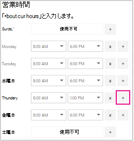

# 勤務先情報を入力する

> [!NOTE]
> この記事は、最新バージョンのMicrosoft Bookingsを操作するのに役立ちます。 以前のバージョンは、今後数か月で廃止される予定です。

Microsoft Bookingsでは、Web アプリ内の [ビジネス情報] ページには、通常、ビジネスの "About Us" ページで見つかるすべての詳細が含まれています。 これらの詳細には、関連する名前、住所、電話番号、Web サイトの URL、プライバシー ポリシーの URL、ロゴ、営業時間が含まれます。

ここで指定した情報は、顧客とクライアントが予約に使用するページ (予約ページと呼ばれます) と、Bookingsから送信されたメッセージとリマインダーに表示されます。 予約ページのこの情報の例を次に示します。

   ![Microsoft Bookingsの [ビジネス情報] ページの例の画像。](../media/bookings-business-info.png)

> [!NOTE]
> 作業を開始するには、「[Microsoft Bookingsへのアクセスを取得する」を](get-access.md)参照してください。 Bookingsのオンとオフを切り替えるには、「[組織のBookingsを有効または無効にする」を参照してください](turn-bookings-on-or-off.md)。

## 会社名と連絡先情報を指定する

1. Microsoft 365でアプリ起動ツールを選択し、**Bookings** を選択します。

1. ナビゲーション ウィンドウで、左側のウィンドウで **[Your** **calendarBusiness** ->  information] を選択します。

1. [**基本の詳細**] セクションで、Bookings予定表に使用する会社名、住所、電話番号を入力します。

:::image type="content" source="../media/bookings-business-basic-details.png" alt-text="スクリーンショット: 基本的なビジネス情報を入力するためのページ":::

[ **顧客からの返信の送信先] に**、予約確認とリマインダーに対する電子メール返信を転送する必要がある優先電子メール アドレスを入力します。

[ **Web サイトの URL]** フィールドに、ビジネスのホーム ページの URL を入力します。

**プライバシー ポリシー** と **利用規約&条件** URL を入力します。

1. **[ビジネス ロゴ**] セクションで、ビジネス ロゴを Bookings アプリにまだアップロードしていない場合は、ビジネス ロゴを追加します。

1. [ **営業時間の設定** ] セクションで、営業時間を運用時間に設定します。 これらは、すべての予約が制限されている時間です。 予定をいつ予約できるかに関する追加の時間制限は、サービスごとに、および **サービスと****スタッフ** ページのスタッフメンバーごとに設定できます。

[勤務先情報] ページの [勤務時間] で、ドロップダウンを使用して各日付の開始時間と終了時間を選びます。 クリックすると **+** 、開始時刻セレクターと終了時刻セレクターが追加されます。

予約 アプリの既定の勤務時間は、月曜日から金曜日の午前 8 時から午後 5 時に設定されています。時刻は 15 分間隔で表示されます。予約には 12 時間形式の時計が使用されています。

1. **[保存]** を選択します。

### 交替制勤務の時間を設定する方法

スタッフ会議、インベントリの更新、または他のビジネスのリズムの詳細の処理を行うには、毎日または週の一部をブロックすることが必要な場合があります。 Bookings アプリを使用すると、指定したタイム スロットに顧客の予定を制限できます。

たとえば、毎週木曜日の 1 時から 2 時 30 分までのスタッフ会議があり、すべてのスタッフが出席できるように、その時間をブロックする必要があります。 これを行うには、次の手順を実行します。

1. [勤務先情報] ページの [勤務時間] で、木曜日の開始時間と終了時間を選びます。この例では、午前 8:00 から午後 1:00 を設定します。

1. [ **+**] を選んで木曜日の新しい行を作成します。

   

1. 新しい行で開始時間に午後 2:30、終了時間に午後 6:00 を選びます。

   

1. [保存] を選択します。

    顧客が予約ページにアクセスすると、木曜日の午後 1:00 から 2:30 の時間は営業時間外と表示されます。

## ロゴをアップロードする

会社のロゴを Bookings アプリにまだアップロードしていない場合は、[勤務先情報] ページからアップロードできます。

1. [ビジネス情報] ページの [アップロード ロゴ] で [**変更**] を選択します。

1. [ **写真のアップロード**] を選びます。

   ![[写真のアップロード] ボタンの画像。](../media/bookings-upload-photo.png)

1. **[保存]** を選択します。
