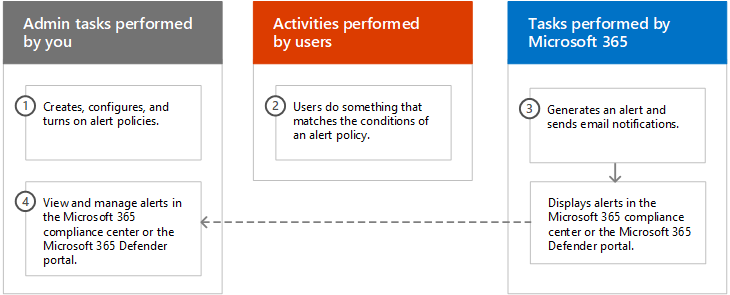

# <a name="alert-policies-in-microsoft-365"></a>Microsoft 365 のアラート ポリシー

[!include[Purview banner](../includes/purview-rebrand-banner.md)]

Microsoft Purview コンプライアンス ポータルまたは Microsoft 365 Defender ポータルのアラート ポリシーおよびアラート ダッシュボードを使用して、アラート ポリシーを作成し、ユーザーがアラート ポリシーの条件に一致するアクティビティを実行したときに生成されるアラートを表示できます。 Exchange Online での管理者権限の割り当て、マルウェア攻撃、フィッシング キャンペーン、異常なレベルのファイル削除や外部共有などのアクティビティを監視するのに役立つ既定のアラート ポリシーがいくつかあります。

> [!TIP]
> 使用可能なアラート ポリシーの一覧と説明については、この記事の「[既定のアラート ポリシー](#default-alert-policies)」セクションを参照してください。

アラート ポリシーを使用すると、ポリシーによってトリガーされるアラートを分類し、組織内のすべてのユーザーにポリシーを適用し、アラートがトリガーされるタイミングのしきい値レベルを設定し、アラートがトリガーされたときにメール通知を受信するかどうかを決定できます。 さらに、アラートの表示とフィルター処理、アラートを管理しやすくするアラート状態の設定、基になっているインシデントの対処または解決が済んだ後の通知の破棄などを行うことができる **[アラート]** ページもあります。

> [!NOTE]
> アラート ポリシーは、Microsoft 365 Enterprise、Office 365 Enterprise、または Office 365 米国政府の E1/F1/G1、E3/F3/G3、または E5/G5 サブスクリプションを持つ組織で利用できます。 高度な機能は、E5/G5 サブスクリプションをお持ちの組織、または E1/F1/G1 またはE3/F3/G3 サブスクリプションとMicrosoft Defender for Office 365 P2、Microsoft 365 E5 コンプライアンス、または E5 eDiscovery および監査アドオン サブスクリプションをお持ちの組織でのみご利用いただけます。 このトピックでは、E5/G5 またはアドオン サブスクリプションを必要とする機能について説明します。 また、アラート ポリシーは、Office 365 GCC、GCC High、および DoD の米国政府環境で利用できることにも注意してください。

## <a name="how-alert-policies-work"></a>アラート ポリシーの動作

これは、アラート ポリシーの仕組みと、ユーザーまたは管理者のアクティビティがアラート ポリシーの条件に一致したときにトリガーされるアラートの概要です。



1. 組織内の管理者は、コンプライアンス ポータルまたは Microsoft 365 Defender ポータルの **[アラート ポリシー]** ページを使用して、アラート ポリシーを作成、構成、およびオンにします。 セキュリティ/コンプライアンス センター PowerShell の [New-ProtectionAlert](/powershell/module/exchange/new-protectionalert) コマンドレットを使用して、アラート ポリシーを作成することもできます。

   アラート ポリシーを作成するには、コンプライアンス ポータルまたは Defender ポータルでアラートの管理ロールまたは組織構成ロールを割り当てる必要があります。

   > [!NOTE]
   > アラート ポリシーを作成または更新してから、ポリシーによってアラートがトリガーされるまでには、最大 24 時間かかります。 これは、ポリシーをアラート 検出エンジンに同期する必要があるためです。

2. ユーザーが、アラート ポリシーの条件に一致するアクティビティを実行します。 マルウェア攻撃の場合は、ウイルスに感染したメール メッセージが組織内のユーザーに送信されるとアラートが発生します。

3. Microsoft 365 は、コンプライアンス ポータルまたは Defender ポータルの **[アラート]** ページに表示されるアラートを生成します。 また、アラート ポリシーでメール アラートが有効になっている場合、Microsoft は受信者のリストにアラートを送信します。 管理者または他のユーザーが [アラート] ページで確認できるアラートは、ユーザーに割り当てられたロールによって決定されます。 詳細については、「[アラートを表示するために必要な RBAC アクセス許可](#rbac-permissions-required-to-view-alerts)」を参照してください。

4. 管理者は、コンプライアンス センターでアラートを管理します。 アラートの管理は、調査の追跡と管理に役立つアラート状態の割り当てで構成されます。

## <a name="alert-policy-settings"></a>アラート ポリシーの設定

アラート ポリシーは、アラートを生成するユーザーまたは管理者アクティビティを定義する一連のルールと条件、アクティビティを実行した場合にアラートをトリガーするユーザーのリスト、およびアラートがトリガーされる前にアクティビティが発生する必要がある回数を定義するしきい値で構成されます。  また、ポリシーを分類し、重大度のレベルを割り当てます。 これらの 2 つの設定は、コンプライアンス センターでポリシーを管理し、アラートを表示するときにこれらの設定をフィルタリングできるため、アラート ポリシー (およびポリシー条件が一致したときにトリガーされるアラート) の管理に役立ちます。 たとえば、同じカテゴリの条件に一致するアラートを表示したり、同じ重大度レベルのアラートを表示したりできます。

アラート ポリシーを表示して作成するには:

### <a name="microsoft-purview-compliance-portal"></a>Microsoft Purview コンプライアンス ポータル

<a href="https://go.microsoft.com/fwlink/p/?linkid=2077149" target="_blank">コンプライアンス ポータル</a>に移動し、**[ポリシー]** > **[アラート]** > **[アラート ポリシー]** の順に選択します。

![コンプライアンス センターで [ポリシー] を選択し、[アラート] で [アラート ポリシー] を選択してアラート ポリシーを表示および作成します。](../media/LaunchAlertPoliciesMCC.png)

### <a name="microsoft-365-defender-portal"></a>Microsoft 365 Defender ポータル

<a href="https://go.microsoft.com/fwlink/p/?linkid=2077139" target="_blank">Microsoft 365 Defender ポータル</a>に移動し、**[メールと共同作業]** で **[ポリシーとルール]** > **[アラート ポリシー]** の順に選択します。 または、<https://security.microsoft.com/alertpolicies> に直接移動することもできます。

![Defender ポータルで、[メールと共同作業] にある [電子メール &コラボレーション] で [ポリシーとルール] を選択し、[アラート ポリシー] を選択してアラート ポリシーを表示および作成します。](../media/LaunchAlertPoliciesDefenderPortal.png)

> [!NOTE]
> コンプライアンス センターまたは Defender ポータルでアラート ポリシーを表示するには、表示専用のアラート管理ロールが割り当てられている必要があります。 アラート ポリシーを作成および編集するには、アラート管理ロールを割り当てられている必要があります。 詳細については、「[セキュリティ/コンプライアンス センターのアクセス許可](../security/office-365-security/permissions-in-the-security-and-compliance-center.md)」を参照してください。

アラート ポリシーは、次の設定と条件で構成されます。

- **アラートが追跡しているアクティビティ**。 外部ユーザーとのファイルの共有、アクセス許可の割り当て、匿名リンクの作成など、1 つのアクティビティまたは場合によっては複数の関連するアクティビティを追跡するポリシーを作成します。 ポリシーによって定義されているアクティビティをユーザーが実行すると、アラートしきい値の設定に基づいてアラートがトリガーされます。

    > [!NOTE]
    > 追跡できるアクティビティは、組織の Office 365 Enterprise または Office 365 US Government の計画によって異なります。 一般に、マルウェア キャンペーンとフィッシング攻撃に関連するアクティビティには、E5 / G5サブスクリプション、または [Defender for Office 365](../security/office-365-security/defender-for-office-365.md) プラン 2 アドオン サブスクリプションを備えた E1/F1/G1 または E3/F3/G3 サブスクリプションが必要です。

- **アクティビティの条件**。 ほとんどのアクティビティでは、アラートをトリガーするために満たす必要のある追加の条件を定義できます。 一般的な条件は、IP アドレス (特定の IP アドレスまたは IP アドレス範囲内のコンピューターでユーザーがアクティビティを実行すると、通知がトリガーされます)、特定のユーザー (1 人または複数) がそのアクティビティを実行した場合に通知をトリガーするかどうか、アクティビティが特定のファイル名または URL に対して実行されたかどうか、などです。 また、組織内のユーザーによってアクティビティが実行されたときにアラートをトリガーする条件を構成することもできます。 使用可能な条件は、選択したアクティビティによって異なります。

アラート ポリシーの条件としてユーザー タグを定義することもできます。 これにより、ポリシーによってトリガーされるアラートに影響を受けるユーザーのコンテキストが含められます。 システム ユーザー タグまたはカスタム ユーザー タグを使用できます。 詳細については、「[Microsoft Defender for Office 365 のユーザー タグ](/microsoft-365/security/office-365-security/user-tags)」を参照してください。

- **アラートがトリガーされた場合**。 アラートがトリガーされる前にアクティビティが発生する頻度を定義する設定を構成できます。 これにより、アクティビティがポリシー条件に一致するたびに、特定のしきい値を超えたとき、またはアラートが追跡しているアクティビティの発生が組織にとって異常になったときにアラートを生成するポリシーを設定できます。

    

    異常なアクティビティに基づいて設定を選択した場合、Microsoft は、選択したアクティビティの通常の頻度を定義するベースライン値を確立します。 このベース ラインを確立するのに最大7日かかります。その間、アラートは生成されません。 基準値が設定された後は、通知ポリシーによって追跡されているアクティビティの頻度が基準値を大幅に超えると、通知がトリガーされます。 監査関連のアクティビティ (ファイルやフォルダーのアクティビティなど) の場合は、1 人のユーザーまたは組織内のすべてのユーザーを基にしてしきい値を設定できます。マルウェア関連のアクティビティの場合は、1 つのマルウェア ファミリ、1 人の受信者、または組織内のすべてのメッセージに基づいて、基準値を設定できます。

    > [!NOTE]
    > しきい値または異常なアクティビティに基づいてアラート ポリシーを構成するには、E5/G5 サブスクリプション、または Microsoft Defender for Office 365 P2、Microsoft 365 E5 コンプライアンスを備えた E1/F1/G1 または E3/F3/G3 サブスクリプション、または Microsoft 365 eDiscovery and Audit アドオン サブスクリプションが必要です。  E1/F1/G1 および E3/F3/G3 サブスクリプションを持つ組織は、アクティビティが発生するたびにアラートがトリガーされるアラート ポリシーのみを作成できます。

- **アラート カテゴリ**。ポリシーによって生成されたアラートの追跡と管理に役立つ場合は、次のいずれかのカテゴリをポリシーに割り当てできます。

  - データ損失防止

  - データ ライフサイクル管理

  - メール フロー

  - Permissions

  - 脅威の管理

  - Others

  アラート ポリシーの条件を満たすアクティビティが発生した場合、生成される通知に、この設定で定義されているカテゴリのタグが付けられます。 これにより、カテゴリに基づいてアラートを並べ替え、フィルター処理できるため、コンプライアンス センターの **[アラート]** ページで同じカテゴリ設定を持つアラートを追跡および管理できます。

- **アラートの重大度**。 アラート カテゴリと同様に、重大度属性 (**低**、**中**、**高**、または **情報**) をアラート ポリシーに割り当てます。 アラート カテゴリと同じく、アラート ポリシーの条件を満たすアクティビティが発生した場合、生成されるアラートには、アラート ポリシーに設定されているものと同じ重大度レベルのタグが付けられます。 これにより、やはり、同じ重大度が設定されているアラートを **[アラート]** ページでまとめて追跡および管理できます。 たとえば、アラートの一覧をフィルター処理し、**高** 重大度のアラートだけを表示できます。

    > [!TIP]
    > 通知ポリシーを設定するときは、ユーザーに配信した後でのマルウェアの検出、機密データの表示、外部ユーザーとのデータの共有、データ損失やセキュリティ脅威が発生する可能性のある他のアクティビティなど、重大な悪影響が発生するおそれのあるアクティビティに高い重大度を割り当てるようにします。 これは、アラートと、根本原因の調査と解決のアクションの優先順位を設定するのに役立ちます。

- **自動調査**。 一部のアラートでは、修復または軽減策が必要な潜在的な脅威とリスクを特定するための自動調査がトリガーされます。  ほとんどの場合、これらのアラートは悪意のあるメールやアクティビティの検出によってトリガーされますが、場合によっては、セキュリティ ポータルでの管理者の操作によってアラートがトリガーされます。  自動調査の詳細については、「[Microsoft Defender for Office 365 の自動調査と対応 (AIR)](../security/office-365-security/office-365-air.md)」を参照してください。

- **メール通知**。 アラートがトリガーされると、メール通知がユーザーのリストに送信 (または送信されない) 状態に設定できます。 また、メール通知の最大数に達したらその日はその通知についてそれ以上メールが送信されないように、1 日に送信できるメール通知の上限を設定することもできます。 管理者はメール通知に加えて、ポリシーによってトリガーされた通知を **[アラート]** ページで確認できます。 メール通知は、特定のカテゴリまたは高重大度設定のアラート ポリシーに対して有効にするようにしてください。

## <a name="default-alert-policies"></a>既定のアラート ポリシー

Microsoft には、管理者のアクセス許可の悪用、マルウェア アクティビティ、潜在的な外部および内部の脅威、データ ライフサイクル管理リスクExchange識別するのに役立つ組み込みのアラート ポリシーが用意されています。 [**通知ポリシー**] ページでは、これらの組み込みポリシーの名前は太字で表示され、ポリシーの種類は [**システム**] と定義されます。 これらのポリシーは既定で有効になっています。 これらのポリシーを無効にしたり (または有効に戻したり)、メール通知受信者のリストを設定したり、1 日の通知制限を設定したりできます。 これらのポリシーの他の設定を編集することはできません。

次の表に、使用可能なデフォルトのアラート ポリシーと、各ポリシーが割り当てられているカテゴリを示します。 カテゴリは、ユーザーが [アラート] ページで表示できるアラートを決定するために使用されます。 詳細については、「[アラートを表示するために必要な RBAC アクセス許可](#rbac-permissions-required-to-view-alerts)」を参照してください。

この表には、それぞれに必要な Office 365 Enterprise および Office 365 US Government の計画も示されています。 組織に E1/F1/G1 または E3/F3/G3 サブスクリプションに加えて適切なアドオン サブスクリプションがある場合、いくつかのデフォルトのアラート ポリシーを使用できます。
 
| 既定のアラート ポリシー | 説明 | カテゴリ | 自動調査 | エンタープライズ サブスクリプション |
|:-----|:-----|:-----|:-----|:-----|
|**悪意のある可能性がある URL のクリックが検出されました**|組織内の[セーフ リンク](../security/office-365-security/safe-links.md)で保護されているユーザーが悪意のあるリンクをクリックすると、アラートを生成します。 このイベントは、URL 判定の変更が Microsoft Defender for Office 365 によって識別されたとき、またはユーザーがセーフ リンク ページを上書きしたときにトリガーされます (組織の Microsoft 365 for Business セーフ リンク ポリシーに基づく)。 このアラート ポリシーの重大度設定は **高** です。 Defender for Office 365 P2、E5、G5 のお客様の場合、このアラートは [Office 365 での自動調査と応答を自動的にトリガーします](../security/office-365-security/office-365-air.md)。 このアラートをトリガーするイベントの詳細については、「[セーフリンク ポリシーの設定](../security/office-365-security/set-up-safe-links-policies.md)」を参照してください。|脅威の管理|はい|E5/G5 または Defenderfor Office 365 P2 アドオン サブスクリプション|
|**管理者の提出結果が完了しました**|[管理者送信](../security/office-365-security/admin-submission.md)が送信されたエンティティの再スキャンを完了すると、アラートを生成します。 管理者送信から再スキャン結果がレンダリングされるたびに、アラートがトリガーされます。 これらのアラートは、[以前の送信の結果を確認](https://compliance.microsoft.com/reportsubmission)し、ユーザーから報告されたメッセージを送信して最新のポリシー チェックを取得し、判定を再スキャンすることを通知し、組織のフィルタリング ポリシーが意図した影響を及ぼしているかどうかを判断するのに役立ちます。 このポリシーには、**情報** の重大度設定があります。|脅威の管理|不要|E1/F1、E3/F3、または E5|
|**管理者がメールの手動調査をトリガーする**|管理者が脅威エクスプローラーからの電子メールの手動調査をトリガーすると、アラートを生成します。 詳細については、「[例: セキュリティ管理者が脅威エクスプローラーから調査を開始する](../security/office-365-security/automated-investigation-response-office.md#example-a-security-administrator-triggers-an-investigation-from-threat-explorer)」を参照してください。 このアラートは、調査が開始されたことを組織に通知します。 アラートは、トリガーしたユーザーに関する情報を提供し、調査へのリンクを含めます。 このポリシーには、**情報** の重大度設定があります。|脅威の管理|はい|E5/G5 または Microsoft Defender for Office 365 P2 アドオン サブスクリプション|
|**管理者によってトリガーされたユーザー侵害調査**|管理者が脅威エクスプローラーからの電子メールの送信者または受信者の手動のユーザー侵害調査をトリガーすると、アラートを生成します。 詳細については、「[例: セキュリティ管理者が脅威エクスプローラーから調査を開始する](../security/office-365-security/automated-investigation-response-office.md#example-a-security-administrator-triggers-an-investigation-from-threat-explorer)」を参照してください。ここでは、メールの調査に関連する手動のトリガーが示されています。 このアラートは、ユーザー侵害調査が開始されたことを組織に通知します。 アラートは、トリガーしたユーザーに関する情報を提供し、調査へのリンクを含めます。 このポリシーの重大度設定は **中** です。|脅威の管理|はい|E5/G5 または Microsoft Defender for Office 365 P2 アドオン サブスクリプション|
|**転送/リダイレクト ルールの作成**|組織内の誰かが、メッセージを別のメール アカウントに転送またはリダイレクトするメール ボックスの受信ボックス ルールを作成すると、アラートを生成します。 このポリシーは、Outlook on the web (旧称 Outlook Web App) または Exchange Online PowerShell を使用して作成された受信トレイ ルールのみを追跡します。 このポリシーには、**情報** の重大度設定があります。 受信トレイ ルールを使用して Outlookon the Web でメールを転送およびリダイレクトする方法の詳細については、「[Outlook on the web でルールを使ってメッセージを別のアカウントに自動的に転送する](https://support.office.com/article/1433e3a0-7fb0-4999-b536-50e05cb67fed)」を参照してください。|脅威の管理|不要|E1/F1/G1、E3/F3/G3、または E5/G5|
|**eDiscovery 検索が開始またはエクスポートされました**|誰かがセキュリティおよびコンプライアンス センターのコンテンツ検索ツールを使用すると、アラートを生成します。 次のコンテンツ検索アクティビティが実行されると、アラートがトリガーされます。 <br><br> <li> コンテンツ検索が開始されました <li> コンテンツ検索の結果がエクスポートされました <li> コンテンツ検索レポートがエクスポートされました <br><br> アラートは、eDiscovery ケースに関連して以前のコンテンツ検索アクティビティが実行されたときにもトリガーされます。 このポリシーには、**情報** の重大度設定があります。 詳細については、「[監査ログで電子情報開示アクティビティを検索する](search-for-ediscovery-activities-in-the-audit-log.md#ediscovery-activities)」を参照してください。|脅威の管理|不要|E1/F1/G1、E3/F3/G3、または E5/G5|
|**Exchange 管理者権限の昇格**|Exchange Online 組織で誰かに管理者権限が割り当てられたときにアラートを生成します。 たとえば、ユーザーが Exchange Online の組織管理ロール グループに追加された場合です。 このポリシーの重大度設定は **低** です。|アクセス許可|不要|E1/F1/G1、E3/F3/G3、または E5/G5|
|**配信後に削除された悪意のあるファイルを含むメール メッセージ**|悪意のあるファイルを含むメッセージが組織内のメール ボックスに配信されたときにアラートを生成します。 このイベントが発生した場合、Microsoft は[ゼロ時間自動パージ](../security/office-365-security/zero-hour-auto-purge.md)を使用して Exchange Online メール ボックスから感染したメッセージを削除します。 このポリシーには **情報** の重大度設定があり、[Office 365 での自動調査と応答](../security/office-365-security/office-365-air.md)を自動的にトリガーします。 この新しいポリシーの詳細については、「[Microsoft Defender for Office 365 の新しいアラート ポリシー](new-defender-alert-policies.md)」を参照してください。|脅威の管理|はい|E5/G5 または Microsoft Defender for Office 365 P2 アドオン サブスクリプション|
|**配信後に削除された悪意のある URL を含む電子メール メッセージ**|悪意のある URL を含むメッセージが組織内のメール ボックスに配信されたときにアラートを生成します。 このイベントが発生した場合、Microsoft は[ゼロ時間自動パージ](../security/office-365-security/zero-hour-auto-purge.md)を使用して Exchange Online メール ボックスから感染したメッセージを削除します。 このポリシーには **情報** の重大度設定があり、[Office 365 での自動調査と応答](../security/office-365-security/office-365-air.md)を自動的にトリガーします。 この新しいポリシーの詳細については、「[Microsoft Defender for Office 365 の新しいアラート ポリシー](new-defender-alert-policies.md)」を参照してください。|脅威の管理|はい|E5/G5 または Defenderfor Office 365 P2 アドオン サブスクリプション|
|**配信後に削除されたキャンペーンからのメール メッセージ**|[キャンペーン](../security/office-365-security/campaigns.md)に関連づけられているメッセージが組織内のメール ボックスに配信されたときにアラートを生成します。 このイベントが発生した場合、Microsoft は[ゼロ時間自動パージ](../security/office-365-security/zero-hour-auto-purge.md)を使用して Exchange Online メール ボックスから感染したメッセージを削除します。 このポリシーには **情報** の重大度設定があり、[Office 365 での自動調査と応答](../security/office-365-security/office-365-air.md)を自動的にトリガーします。 この新しいポリシーの詳細については、「[Microsoft Defender for Office 365 の新しいアラート ポリシー](new-defender-alert-policies.md)」を参照してください。|脅威の管理|はい|E5/G5 または Defenderfor Office 365 P2 アドオン サブスクリプション|
|**メール メッセージが配信後に削除されました**|悪意のあるエンティティ (URL またはファイル) を含まない、またはキャンペーンに関連付けられている悪意のあるメッセージが組織内のメールボックスに配信されたときにアラートを生成します。 このイベントが発生した場合、Microsoft は[ゼロ時間自動パージ](../security/office-365-security/zero-hour-auto-purge.md)を使用して Exchange Online メール ボックスから感染したメッセージを削除します。 このポリシーには **情報** の重大度設定があり、[Office 365 での自動調査と応答](../security/office-365-security/office-365-air.md)を自動的にトリガーします。 この新しいポリシーの詳細については、「[Microsoft Defender for Office 365 の新しいアラート ポリシー](new-defender-alert-policies.md)」を参照してください。|脅威の管理|はい|E5/G5 または Defenderfor Office 365 P2 アドオン サブスクリプション|
|**ユーザーによってマルウェアまたはフィッシングとして報告されたメール**|組織内のユーザーが迷惑メール報告アドインを使用してメッセージをフィッシング メールとして報告すると、アラートを生成します。 このポリシーの重大度設定は **低** です。 このアドインの詳細については、「[迷惑メール報告アドインを使用する](https://support.office.com/article/b5caa9f1-cdf3-4443-af8c-ff724ea719d2)」を参照してください。 Defender for Office 365 P2、E5、G5 のお客様の場合、このアラートは [Office 365 での自動調査と応答を自動的にトリガーします](../security/office-365-security/office-365-air.md)。|脅威の管理|はい|E1/F1/G1、E3/F3/G3、または E5/G5|
|**メール送信制限を超えました**|組織内の誰かが送信スパム ポリシーで許可されているよりも多くのメールを送信したときにアラートを生成します。 これは通常、ユーザーが送信しているメールが多すぎるか、アカウントが侵害されている可能性があることを示しています。 このポリシーの重大度設定は **中** です。 このアラート ポリシーによって生成されたアラートを受け取った場合は、[ユーザー アカウントが侵害されていないかどうかを確認する](../security/office-365-security/responding-to-a-compromised-email-account.md)ことをお勧めします。|脅威の管理|不要|E1/F1/G1、E3/F3/G3、または E5/G5|
|**フィッシング詐欺の可能性が原因でブロックされたフォーム**|フィッシング詐欺の繰り返しが検出されたために、組織内の誰かが Microsoft Forms を使用したフォームの共有と応答の収集を制限されたときにアラートを生成します。 このポリシーの **重大度設定は高** です。|脅威の管理|不要|E1、E3/F3、または E5|
|**フラグが設定され、フィッシングが確認されたフォーム**|組織内から Microsoft Forms で作成されたフォームが、レポートの悪用によってフィッシングの可能性があると識別され、Microsoft によってフィッシングとして確認された場合に、アラートを生成します。 このポリシーの重大度設定は **高** です。|脅威の管理|不要|E1、E3/F3、または E5|
|**メッセージが遅れています**|マイクロソフトがコネクタを使用してオンプレミス組織またはパートナー サーバーにメール メッセージを配信できない場合にアラートを生成します。 これが発生すると、メッセージは Office 365 のキューに入れられます。 このアラートは、1 時間以上キューに入れられたメッセージが 2,000 以上ある場合にトリガーされます。 このポリシーの重大度設定は **高** です。|メール フロー|不要|E1/F1/G1、E3/F3/G3、または E5/G5|
|**配信後にマルウェア キャンペーンが検出されました**|マルウェアを含む非常に多くのメッセージが組織内のメール ボックスに配信されたときにアラートを生成します。 このイベントが発生した場合、Microsoft は感染したメッセージを Exchange Online メールボックスから削除します。 このポリシーの重大度設定は **高** です。|脅威の管理|不要|E5/G5 または Microsoft Defender for Office 365 P2 アドオン サブスクリプション|
|**マルウェア キャンペーンが検出され、ブロックされました**|誰かが特定の種類のマルウェアを含む異常に多数のメール メッセージを組織内のユーザーに送信しようとしたときにアラートを生成します。 このイベントが発生した場合、感染したメッセージは Microsoft によってブロックされ、メール ボックスに配信されません。 このポリシーの重大度設定は **低** です。|脅威の管理|不要|E5/G5 または Defenderfor Office 365 P2 アドオン サブスクリプション|
|**SharePoint と OneDrive でマルウェア キャンペーンが検出されました**|組織内の SharePoint サイトまたは OneDrive アカウントにあるファイルで、異常に大量のマルウェアまたはウイルスが検出されたときにアラートを生成します。 このポリシーの重大度設定は **高** です。|脅威の管理|不要|E5/G5 または Defenderfor Office 365 P2 アドオン サブスクリプション|
|**ZAP が無効になっているため、マルウェアはザッピングされません**| フィッシング メッセージのゼロアワー自動パージが無効になっているため、Microsoft がメール ボックスへのマルウェア メッセージの配信を検出するとアラートを生成します。 このポリシーには、**情報** の重大度設定があります。 |脅威の管理|不要|E5/G5 または Defenderfor Office 365 P2 アドオン サブスクリプション|
|**ユーザーの迷惑メール フォルダが無効になっているため、フィッシュが配信されました**|Microsoft がユーザーの迷惑メール フォルダが無効になっていることを検出するとアラートを生成し、信頼性の高いフィッシング メッセージをメール ボックスに配信できるようにします。 このポリシーには、**情報** の重大度設定があります。|脅威の管理|不要|E1/F1/G1、E3/F3/G3、または E5/G5|
|**ETR オーバーライドのために配信されたフィッシング**|マイクロソフトが、信頼性の高いフィッシング メッセージのメール ボックスへの配信を許可するExchange トランスポート ルール (ETR) を検出すると、アラートを生成します。 このポリシーには、**情報** の重大度設定があります。 Exchange トランスポート ルール (メール フロー ルール) の詳細については、「[Exchange Online のメール フロー ルール (トランスポート ルール)](/exchange/security-and-compliance/mail-flow-rules/mail-flow-rules)」を参照してください。|脅威の管理|不要|E1/F1/G1、E3/F3/G3、または E5/G5|
|**IP 許可ポリシーのために配信されたフィッシング**|マイクロソフトが、信頼性の高いフィッシング メッセージのメール ボックスへの配信を許可する IP 許可ポリシーを検出すると、アラートを生成します。 このポリシーには、**情報** の重大度設定があります。 接続フィルターの詳細については、「[接続フィルターポリシーを構成する - Office 365](../security/office-365-security/configure-the-connection-filter-policy.md)」を参照してください。|脅威の管理|不要|E1/F1/G1、E3/F3/G3、または E5/G5|
|**ZAP が無効になっているため、フィッシングがザッピングされません**| フィッシング メッセージのゼロアワー自動パージが無効になっているため、Microsoft がメール ボックスへの信頼性の高いフィッシング メッセージの配信を検出するとアラートを生成します。 このポリシーには、**情報** の重大度設定があります。|脅威の管理|不要|E5/G5 または Defenderfor Office 365 P2 アドオン サブスクリプション|
|**テナントまたはユーザーのオーバーライドにより配信されたフィッシング**<sup>1</sup>|管理者またはユーザーのオーバーライドがメールボックスへのフィッシング メッセージの配信を許可したことを Microsoft が検出すると、アラートを生成します。 オーバーライドの例には、特定の送信者またはドメインからのメッセージを許可する受信ボックスまたはメール フロー ルール、または特定の送信者またはドメインからのメッセージを許可するスパム対策ポリシーが含まれます。 このポリシーの重大度設定は **高** です。|脅威の管理|不要|E5/G5 または Defenderfor Office 365 P2 アドオン サブスクリプション|
|**疑わしいメール転送アクティビティ**|組織内の誰かが疑わしい外部アカウントにメールを自動転送したときにアラートを生成します。 これは、アカウントが侵害されていることを示す可能性のある動作に対する早期警告ですが、ユーザーを制限するほど深刻ではありません。 このポリシーの重大度設定は **高** です。 まれですが、このポリシーによって生成されるアラートは異常である可能性があります。 [ユーザー アカウントが侵害されていないかどうか](../security/office-365-security/responding-to-a-compromised-email-account.md)を確認することをお勧めします。|脅威の管理|不要|E1/F1/G1、E3/F3/G3、または E5/G5|
|**不審なメール送信パターンが検出されました**|組織内の誰かが疑わしいメールを送信し、電子メールの送信が制限されるリスクがある場合にアラートを生成します。 これは、アカウントが侵害されていることを示す可能性のある動作に対する早期警告ですが、ユーザーを制限するほど深刻ではありません。 このポリシーの重大度設定は **中** です。 まれですが、このポリシーによって生成されるアラートは異常である可能性があります。 ただし、[ユーザー アカウントが侵害されていないかどうか](../security/office-365-security/responding-to-a-compromised-email-account.md)を確認することをお勧めします。|脅威の管理|はい|E1/F1/G1、E3/F3/G3、または E5/G5  |
|**テナント許可/禁止一覧エントリの有効期限が間もなく終了します**|テナント許可/禁止一覧エントリを削除しようとしているときにアラートを生成します。 このイベントは、有効期限の 3 日前にトリガーされます。これは、エントリが作成または最後に更新された日時に基づきます。 このアラート ポリシーには、**情報** の重大度設定があります。 これは、許可または禁止が削除される可能性があるため、フィルターの今後の変更を管理者に通知するためです。 禁止の場合は、有効期限を延長して禁止を維持できます。 許可の場合は、アナリストがもう一度確認できるように、アイテムをもう一度送信する必要があります。 ただし、許可が既に誤検知として評価されている場合、エントリは、エントリを自然に許可するようにシステム フィルターが更新されたときにのみ期限切れになります。 このアラートをトリガーするイベントの詳細については、「[テナントの許可/禁止リストを管理する](../security/office-365-security/tenant-allow-block-list.md)」を参照してください。|脅威の管理|不要|E5/G5 または Defenderfor Office 365 P2 アドオン サブスクリプション|
|**テナントに対してメールの送信が制限されました**|組織からのメール トラフィックのほとんどが疑わしいものとして検出され、Microsoft が組織によるメールの送信を制限した場合に、アラートを生成します。 侵害された可能性のあるユーザー アカウントと管理者アカウント、新しいコネクタ、またはオープン リレーを調査してから、Microsoft サポートに連絡して組織のブロックを解除してください。 このポリシーの重大度設定は **高** です。 組織がブロックされる理由の詳細については、「[Exchange Online でエラーコード 5.7.7xx のメール配信の問題を修正する](/Exchange/mail-flow-best-practices/non-delivery-reports-in-exchange-online/fix-error-code-5-7-700-through-5-7-750)」を参照してください。|脅威の管理|不要|E1/F1/G1、E3/F3/G3、または E5/G5|
|**テナントに対してプロビジョニングされていないメールの送信が制限されました**|登録されていないドメイン (*プロビジョニングされていない* ドメインとも呼ばれます) から送信される電子メールが多すぎる場合にアラートを生成します。 Office 365 では、未登録ドメインから来るメールを妥当な量まで許容しますが、メールを送信するために使用するすべてのドメインを、承認済みドメインとして構成するようにしてください。 このアラートは、組織内のすべてのユーザーが電子メールを送信できなくなったことを示します。 このポリシーの重大度設定は **高** です。 組織がブロックされる理由の詳細については、「[Exchange Online でエラーコード 5.7.7xx のメール配信の問題を修正する](/Exchange/mail-flow-best-practices/non-delivery-reports-in-exchange-online/fix-error-code-5-7-700-through-5-7-750)」を参照してください。|脅威の管理|不要|E1/F1/G1、E3/F3/G3、または E5/G5|
|**異常な外部ユーザー ファイル アクティビティ**|組織外のユーザーが SharePoint または OneDrive のファイルに対して異常に多数のアクティビティを実行すると、アラートを生成します。 これには、ファイルへのアクセス、ファイルのダウンロード、ファイルの削除などのアクティビティが含まれます。 このポリシーの重大度設定は **高** です。|データ ライフサイクル管理|不要|E5/G5、Microsoft Defender for Office 365 P2 または Microsoft 365 E5 アドオン サブスクリプション|
|**異常な量の外部ファイル共有**|SharePoint または OneDrive 内の異常に多数のファイルが組織外のユーザーと共有された場合に、アラートを生成します。 このポリシーの重大度設定は **中** です。|データ ライフサイクル管理|不要|E5/G5、Defender for Office 365 P2 または Microsoft 365 E5 アドオン サブスクリプション|
|**異常な量のファイル削除**|異常な量のファイルが SharePoint または OneDrive で短い時間枠内に削除されたときにアラートを生成します。 このポリシーの重大度設定は **中** です。|データ ライフサイクル管理|不要|E5/G5、Defender for Office 365 P2 または Microsoft 365 E5 アドオン サブスクリプション|
|**フィッシングとして報告されたメールの異常な増加**|Outlook の迷惑メール報告アドインを使用してメッセージをフィッシング メールとして報告する組織内の人数が大幅に増加した場合に、アラートを生成します。 このポリシーの重大度設定は **中** です。 このアドインの詳細については、「[迷惑メール報告アドインを使用する](https://support.office.com/article/b5caa9f1-cdf3-4443-af8c-ff724ea719d2)」を参照してください。|脅威の管理|不要|E5/G5 または Defenderfor Office 365 P2 アドオン サブスクリプション|
|**受信トレイ/フォルダに配信されたユーザーのなりすましフィッシング**<sup>1、</sup><sup>2</sup>|管理者またはユーザーのオーバー ライドにより、メール ボックスの受信ボックス (または他のユーザーがアクセスできるフォルダー) へのユーザー偽装フィッシング メッセージの配信が許可されたことを Microsoft が検出すると、アラートが生成されます。 オーバーライドの例には、特定の送信者またはドメインからのメッセージを許可する受信ボックスまたはメール フロー ルール、または特定の送信者またはドメインからのメッセージを許可するスパム対策ポリシーが含まれます。 このポリシーの重大度設定は **中** です。|脅威の管理|不要|E5/G5 または Defenderfor Office 365 P2 アドオン サブスクリプション|
|**ユーザーが検疫済みメッセージの解放を要求しました**|ユーザーが検疫済みメッセージの解放を要求したときにアラートを生成します。 検疫済みメッセージの解放を要求するには、検疫ポリシー (**制限付きアクセス** プリセットのアクセス許可グループなど) で、**受信者が検疫からメッセージを解放要求することを許可** (_PermissionToRequestRelease_) アクセス許可が必要です。 詳細については、「[受信者が検疫アクセス許可からメッセージを解放する要求を許可する](../security/office-365-security/quarantine-policies.md#allow-recipients-to-request-a-message-to-be-released-from-quarantine-permission)」を参照してください。 このポリシーには、**情報** の重大度設定があります。|脅威の管理|不要|E1/F1/G1、E3/F3/G3、または E5/G5|
|**ユーザーに対してメールの送信が制限されました**|組織内の誰かが送信メールの送信を制限されたときにアラートを生成します。 これは通常、アカウントが侵害され、ユーザーがコンプライアンス ポータルの **[制限付きユーザー]** ページに表示された場合に発生します。 (このページにアクセスするには、**[脅威の管理] > [レビュー] > [制限付きユーザー]** に移動します)。 このポリシーの重大度設定は **高** です。 制限されたユーザーについての詳細については、「[ユーザー、ドメイン、または IP アドレスをスパム電子メール送信後のブロック一覧から削除する](/office365/securitycompliance/removing-user-from-restricted-users-portal-after-spam)」を参照してください。|脅威の管理|はい|E1/F1/G1、E3/F3/G3、または E5/G5|
|**フォームの共有と応答の収集について制限されたユーザー**|フィッシング詐欺の繰り返しが検出されたために、組織内の誰かが Microsoft Forms を使用したフォームの共有と応答の収集を制限されたときにアラートを生成します。 このポリシーの重大度設定は **高** です。|脅威の管理|不要|E1、E3/F3、または E5|

> [!NOTE]
> <sup>1</sup> お客様のフィードバックに基づいて、このデフォルトのアラート ポリシーを一時的に削除しました。 現在、改善に取り組んでおり、近い将来、新しいバージョンに置き換える予定です。 それまでは、次の設定を使用して、この機能を置き換えるカスタム アラート ポリシーを作成できます。 <ul><li>アクティビティは、配信時に検出されたフィッシング メールです</li> <li>メールは ZAP によって削除されていません</li> <li>メールの方向は受信です</li> <li>メール配信状況が配信されました</li> <li>検出テクノロジーは、悪意のある URL の保持、URL デトネーション、高度なフィッシュ フィルター、一般的なフィッシング フィルター、ドメインのなりすまし、ユーザーのなりすまし、ブランドのなりすましです。</li></ul> Office 365 でのフィッシング対策の詳細については、「[フィッシング対策およびフィッシング対策ポリシーを設定する](../security/office-365-security/set-up-anti-phishing-policies.md)」を参照してください。<br/><br/><sup>2</sup> このアラート ポリシーを再作成するには、前の脚注のガイダンスに従いますが、唯一の検出テクノロジーとしてユーザーのなりすましを選択します。

一部の組み込みポリシーによって監視される異常なアクティビティは、前に説明したアラートしきい値設定と同じプロセスに基づいています。 Microsoft は、「通常の」アクティビティの通常の頻度を定義するベースライン値を確立します。 組み込みのアラート ポリシーによって追跡されるアクティビティの頻度がベース ライン値を大幅に超えると、アラートがトリガーされます。

<a name="viewing-alerts"></a>

## <a name="view-alerts"></a>警告を表示する

組織内のユーザーによって実行されたアクティビティがアラート ポリシーの設定と一致すると、アラートが生成され、コンプライアンス センターまたは Defender ポータルの **[アラート]** ページに表示されます。 アラート ポリシーの設定によっては、アラートがトリガーされると、指定されたユーザーのリストにメール通知も送信されます。 **[アラート]** ページのダッシュボードには、アラートごとに、対応するアラート ポリシーの名前、アラートの重大度とカテゴリ (アラート ポリシーで定義されている)、アラートが生成される原因になったアクティビティの発生回数が表示されます。 この値は、アラート ポリシーのしきい値設定に基づいています。 ダッシュボードには、各アラートの状態も表示されます。 状態プロパティを使用してアラートを管理する方法の詳細については、「[アラートの管理](#manage-alerts)」を参照してください。

アラートを表示するには:

### <a name="microsoft-purview-compliance-portal"></a>Microsoft Purview コンプライアンス ポータル

 <https://compliance.microsoft.com> に移動し、**[アラート]** を選択します。 または、<https://compliance.microsoft.com/compliancealerts> に直接移動することもできます。

![コンプライアンス ポータルで、[アラート] を選択します。](../media/ViewAlertsMCC.png)

### <a name="microsoft-365-defender-portal"></a>Microsoft 365 Defender ポータル

<a href="https://go.microsoft.com/fwlink/p/?linkid=2077139" target="_blank">Microsoft 365 Defender ポータル</a>に移動し、**[インシデントとアラート]** > **[アラート]** を選択します。 または、<https://security.microsoft.com/alerts> に直接移動することもできます。

![Microsoft 365 Defender ポータルで、[インシデントとアラート]、[アラート] の順に選択します。](../media/ViewAlertsDefenderPortal.png)

**[アラート]** ページでは、次のフィルターを使ってすべての通知のサブセットを見ることができます。

- **状態。** このフィルターを使用して、特定のステータスが割り当てられているアラートを表示します。 デフォルトのステータスは **アクティブ** です。 管理者は状態の値を変更できます。

- **ポリシー。** 1 つ以上の通知ポリシーの設定に一致する通知を表示するには、このフィルターを使います。 すべての通知ポリシーのすべての通知を表示することもできます。

- **時間の範囲。** 特定の日時範囲内に生成された通知を表示するには、このフィルターを使います。

- **重要度。** 特定の重大度が割り当てられた通知を表示するには、このフィルターを使います。

- **カテゴリ。** 1 つ以上の通知カテゴリの通知を表示するには、このフィルターを使います。

- **タグ。** 1 つ以上のユーザー タグの通知を表示するには、このフィルターを使います。 タグは、アラートに表示されるタグ付きメール ボックスまたはユーザーに基づいて反映されます。 詳細については、「[Office 356 ATP のユーザー タグ](../security/office-365-security/user-tags.md)」を参照してください。

- **ソース。** このフィルターを使用して、コンプライアンス センターのアラート ポリシーによってトリガーされたアラート、または Office 365 Cloud App セキュリティ ポリシーによってトリガーされたアラート、あるいはその両方を表示します。 Office 365 Cloud App Security アラートの詳細については、「[Defender for Cloud アプリのアラートを表示する](#viewing-cloud-app-security-alerts)」を参照してください。

> [!IMPORTANT]
> ユーザー タグによるフィルタリングと並べ替えは現在公開プレビュー中です。
> 商業的にリリースされる前に大幅に変更される可能性があります。 Microsoft は、提供された情報に関して、明示または黙示を問わず、いかなる保証も行いません。

## <a name="alert-aggregation"></a>アラートの集計

アラート ポリシーの条件に一致する複数のイベントが短時間で発生すると、*アラート集約* と呼ばれるプロセスによって既存のアラートに追加されます。 イベントがアラートをトリガーすると、アラートが生成されて **[アラート]** ページに表示され、通知が送信されます。 集約間隔内に同じイベントが発生した場合、Microsoft 365 は、新しいアラートをトリガーする代わりに、新しいイベントに関する詳細を既存のアラートに追加します。 アラート集約の目標は、アラートの「疲労」を減らし、同じイベントのより少ないアラートに集中してアクションを実行できるようにすることです。

集計間隔の長さは、Office 365 または Microsoft 365 のサブスクリプションによって異なります。

|サブスクリプション|集約間隔|
|:---------|:---------:|
|Office 365 または Microsoft 365 E5/G5|1 分|
|Defender for Office 365 プラン 2 |1 分|
|E5 コンプライアンス アドオンまたは E5 検出および監査アドオン|1 分|
|Office 365 または Microsoft 365 E1/F1/G1 または E3/F3/G3|15 分|
|Office 365 Plan 1 または Exchange Online Protection のディフェンダー|15 分|

同じアラート ポリシーに一致するイベントが集約間隔内に発生すると、後続のイベントに関する詳細が元のアラートに追加されます。 すべてのイベントについて、集約されたイベントに関する情報が詳細フィールドに表示され、集約間隔でイベントが発生した回数がアクティビティ/ヒットカウント フィールドに表示されます。 アクティビティ リストを表示すると、すべての集約されたイベント インスタンスに関する詳細情報を表示できます。

次のスクリーン ショットは、4 つの集約されたイベントを含むアラートを示しています。 アクティビティ リストには、アラートに関連する 4 つのメール メッセージに関する情報が含まれています。


アラート集約について、次の点に注意してください。

- **潜在的に悪意のある URL クリックによってトリガーされた** アラートが検出されました。[デフォルトのアラート ポリシー](#default-alert-policies)は集約されません。 これは、このポリシーによってトリガーされるアラートが各ユーザーおよびメール メッセージに固有であるためです。

- 現時点では、**ヒット カウント** アラート プロパティは、すべてのアラート ポリシーの集約されたイベントの数を示しているわけではありません。 これらのアラート ポリシーによってトリガーされたアラートの場合、**[メッセージ リストの表示]** または **[アラートのアクティビティの表示]** をクリックして、集約されたイベントを表示できます。 **ヒット カウント** アラート プロパティにリストされている集計イベントの数をすべてのアラート ポリシーで利用できるように取り組んでいます。

## <a name="rbac-permissions-required-to-view-alerts"></a>アラートを表示するために必要な RBAC アクセス許可

組織内のユーザーに割り当てられた役割ベースの Access Control (RBAC) アクセス許可によって、ユーザーが **[アラート]** ページで表示できるアラートが決まります。 これはどのように達成されますか? (コンプライアンス ポータルまたは Microsoft 365 Defender ポータルのロール グループのメンバーシップに基づいて) ユーザーに割り当てられた管理ロールによって、ユーザーが **[アラート]** ページに表示できるアラート カテゴリが決まります。 次に、いくつかの例を示します:

- レコード管理役割グループのメンバーは、 **データ ライフサイクル管理** カテゴリが割り当てられたアラート ポリシーによって生成されたアラートのみを表示できます。

- コンプライアンス管理者ロールグ ループのメンバーは、**脅威管理** カテゴリが割り当てられているアラートポリシーによって生成されたアラートを表示できません。

- 割り当てられた役割のいずれもアラート カテゴリからのアラートを表示する権限を提供しないため、電子情報開示マネージャー役割グループのメンバーはアラートを表示できません。

この設計 (RBAC 権限に基づく) を使用すると、組織内の特定の職務のユーザーが表示 (および管理) できるアラートを決定できます。

次の表に、6 つの異なるアラート カテゴリからのアラートを表示するために必要な役割を示します。 テーブルの最初の列には、コンプライアンス ポータルまたは Microsoft 365 Defender ポータルのすべてのロールが一覧表示されます。  チェック マークは、そのロールが割り当てられているユーザーが、一番上の行にリストされている対応するアラート カテゴリのアラートを表示できることを示します。

既定のアラート ポリシーが割り当てられているカテゴリを確認するには、[既定のアラート ポリシーの表を参照してください](#default-alert-policies)。

|役割|データ ライフサイクル管理|データ損失防止|メール フロー|Permissions|脅威の管理|Others|
|:---------|:---------:|:---------:|:---------:|:---------:|:---------:|:---------:|
|監査ログ|||||||
|ケース管理|||||||
|コンプライアンス管理者|||||||
|コンプライアンス検索|||||||
|デバイスの管理|||||||
|処分管理|||||||
|DLP コンプライアンス管理|||||||
|Export|||||||
|Hold|||||||
|Information Protection アナリスト|||||||
|Information Protection 調査員|||||||
|通知の管理|||||||
|組織の構成|||||||
|Preview|||||||
|レコード管理|||||||
|保持管理|||||||
|レビュー|||||||
|RMS の暗号化解除|||||||
|ロール管理|||||||
|検索と消去|||||||
|セキュリティ管理者|||||||
|セキュリティ閲覧者||||||
|サービス アシュアランス ビュー|||||||
|監督レビュー管理者|||||||
|表示専用の監査ログ|||||||
|表示専用デバイス管理|||||||
|表示専用の DLP コンプライアンス管理|||||||
|表示専用のアラート管理|||||||
|"View-Only Recipients/表示専用受信者"|||||||
|表示専用のレコード管理サイト|||||||
|表示専用の保持マネージャー|||||||

> [!TIP]
> デフォルトの各役割グループに割り当てられている役割を表示するには、セキュリティ センターとコンプライアンス センターの PowerShell で次のコマンドを実行します。
>
> ```powershell
> $RoleGroups = Get-RoleGroup
> ```
>
> ```powershell
> $RoleGroups | foreach {Write-Output -InputObject `r`n,$_.Name,"-----------------------"; Get-RoleGroup $_.Identity | Select-Object -ExpandProperty Roles}
> ```
>
> コンプライアンス ポータルまたは Microsoft 365 Defender ポータルで、役割グループに割り当てられた役割を表示することもできます。 **[アクセス許可]** ページに移動し、役割グループを選択します。 割り当てられた役割は、ポップアップ ページに一覧表示されます。

<a name="manage-alerts"></a>

## <a name="manage-alerts"></a>アラートの管理

アラートが生成され、コンプライアンス センターの **[アラート]** ページに表示されたら、それらを優先順位付け、調査、および解決できます。 ユーザーにアラートへのアクセス権を付与するのと同じ [RBAC アクセス許可](#rbac-permissions-required-to-view-alerts)により、アラートを管理することもできます。

ここでは、アラートを管理するために実行できるタスクの一部を示します。

- **アラートにステータスを割り当てます。** 次のステータスのいずれかをアラートに割り当てることができます: **アクティブ** (既定値)、**調査中**、**解決済み**、または **却下**。 割り当てた後は、この設定を使ってフィルター処理を行い、同じ状態設定のアラート だけを表示できます。 この状態設定は、アラート 管理のプロセスの追跡に役立ちます。

- **アラートの詳細を表示します。** アラートを選択して、アラートの詳細を示すポップアップ ページを表示できます。 詳細情報は、対応するアラート ポリシーによって異なりますが、通常は次のものが含まれます。

  - アラートをトリガーした実際の操作の名前 (コマンドレットや監査ログ操作など)。

  - アラートをトリガーしたアクティビティの説明。

  - アラートをトリガーしたユーザー (またはユーザーの一覧)。 この情報は、1 人のユーザーまたは 1 つのアクティビティを追跡するように設定されているアラート ポリシーの場合にのみ含まれます。

  - アラートによって追跡されているアクティビティが実行された回数。 他にもアラートがトリガーされている可能性があるため、この値は [アラート] ページに一覧表示される関連するアラートの実際の値と一致しない場合があります。

  - 実行されてアラートをトリガーした各アクティビティの項目を含むアクティビティ リストへのリンク。 このリストの各エントリは、アクティビティが発生したとき、実際の操作の名前 ("FileDeleted" など) とアクティビティを実行したユーザーの名前、アクティビティが実行されたオブジェクト (ファイル、電子情報開示ケース、メールボックスなど)、ユーザーのコンピューターの IP アドレスを示します。 マルウェア関連のアラートの場合、メッセージ一覧にリンクされます。

  - 対応するアラート ポリシーの名前 (およびリンク)。

- **メール通知を抑制します。** アラートのポップアップ ページからのメール通知をオフ (または抑制) にすることができます。 メール通知を抑制すると、アラート ポリシーの条件に一致するアクティビティまたはイベントが発生しても、Microsoft はメール通知を送信しません。 ただし、ユーザーが実行したアクティビティがアラート ポリシーの条件に一致すると、アラートがトリガーされます。 アラート ポリシーを編集してメールアラートを無効にすることもできます。

- **アラートを解決します。** 通知のポップアップ ページでは、アラートを解決済みとしてマークすることができます (アラートの状態が **解決済み** に設定されます)。 フィルターを変更しない限り、解決済みのアラートは **[アラート]** ページに表示されません。

<a name="viewing-cloud-app-security-alerts"></a>

## <a name="view-defender-for-cloud-apps-alerts"></a>Defender for Cloud Apps のアラートを表示する

Office 365 Cloud App セキュリティ ポリシーによってトリガーされるアラートが、コンプライアンス センターの **[アラート]** ページに表示されるようになりました。 これには、アクティビティ ポリシーによってトリガーされるアラートと、Office 365 Cloud App Security の異常検出ポリシーによってトリガーされるアラートが含まれます。 これは、コンプライアンス センターですべてのアラートを表示できることを意味します。 Office 365 Cloud App Security は、Office 365 Enterprise E5 または Office 365 US Government G5 サブスクリプションを持つ組織でのみ利用できます。 詳細については、「[Defender for Cloud Apps の概要](/cloud-app-security/what-is-cloud-app-security)」を参照してください。

Enterprise Mobility + Security E5 サブスクリプションの一部として、またはスタンドアロン サービスとして Microsoft Defender for Cloud Apps を使用している組織は、コンプライアンス ポータルまたは Microsoft 365 Defender ポータルで Microsoft 365 アプリとサービスに関連する Defender for Cloud Apps アラートを表示することもできます。

コンプライアンス センターまたは Defender ポータルで Defender for Cloud Apps アラートのみを表示するには、**[ソース]** フィルターを使用して **[Defender for Cloud Apps]** を選択します。


コンプライアンス センターのアラート ポリシーによってトリガーされるアラートと同様に、Defender for Cloud Apps アラートを選択して、アラートの詳細を示すポップアップ ページを表示できます。 アラートには、Defender for Cloud Apps ポータルで詳細を表示してアラートを管理するためのリンクと、アラートをトリガーした対応する Defender for Cloud Apps ポリシーへのリンクが含まれています。 「[Defender for Cloud Apps でアラートを監視する](/cloud-app-security/monitor-alerts)」を参照してください。


> [!IMPORTANT]
> コンプライアンス センターで Defender for Cloud Apps アラートの状態を変更しても、Defender for Cloud Apps ポータルの同じアラートの解決の状態は更新されません。 たとえば、コンプライアンス センターでアラートのステータスを **解決済み** としてマークした場合、Defender for Cloud Apps ポータルのアラートの状態は変更されません。 Defender for Cloud Apps アラートを解決または無視するには、Defender for Cloud Apps ポータルでアラートを管理します。
