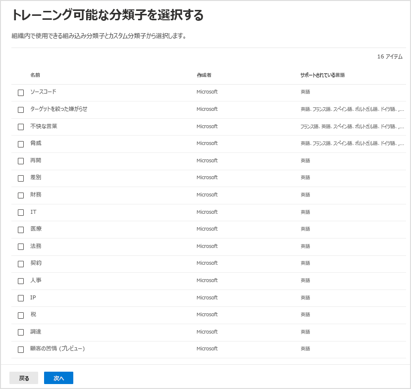

# <a name="automatically-apply-a-retention-label-to-retain-or-delete-content"></a>保持ラベルを自動的に適用してコンテンツを保持または削除する

>*[セキュリティとコンプライアンスのための Microsoft 365 ライセンス ガイダンス](/office365/servicedescriptions/microsoft-365-service-descriptions/microsoft-365-tenantlevel-services-licensing-guidance/microsoft-365-security-compliance-licensing-guidance)。*

> [!NOTE]
> このシナリオは、Microsoft Office SharePoint Online のドキュメント セットやライブラリ、Exchange のフォルダーなどの組織構造の[規制レコード](records-management.md#records)や既定のラベルではサポートされていません。これらのシナリオには、[発行済み保持ラベル ポリシー](create-apply-retention-labels.md)が必要です。

[保持ラベル](retention.md)の最も強力な機能の 1 つは、指定の条件に一致したコンテンツにラベルを自動的に適用する機能です。この場合、保持ラベルは Microsoft 365 によって適用されるため、組織内のユーザーがラベルを適用する必要はありません。
  
自動適用アイテム保持ラベルが強力な機能である理由は次のとおりです。
  
- ユーザーのトレーニングは、一部の分類方法についてのみ必要。
    
- ユーザーへの依存は、一部のコンテンツを正しく分類するためにのみ必要。
    
- ユーザーはデータ ガバナンス ポリシーについて把握する必要がなくなるので、仕事に集中できる。
    
コンテンツに保持ラベルがまだ適用されておらず、コンテンツに機密情報、キーワード、検索可能なプロパティ、または[トレーニング可能な分類子](classifier-get-started-with.md)のマッチが含まれている場合、保持ラベルをコンテンツに自動的に適用できます。 プレビュー版では、SharePoint や OneDrive に保存されているクラウドの添付ファイルに保持ラベルを自動的に適用することもできるようになりました。

> [!TIP]
> 検索可能なプロパティを使用して、[Teams 会議のレコーディング](#microsoft-teams-meeting-recordings)と[秘密度ラベルを適用済みのアイテム](#identify-files-and-emails-that-have-a-sensitivity-label)を識別します。

保持ラベルを自動的に適用するプロセスは、次の条件に基づいています。


次の手順を 2 つの管理手順に使用します。

> [!NOTE]
> 自動ポリシーで、アイテムに保持ラベルを自動的に適用するための条件によりサービス側でのラベル付けを使用します。 次の操作を行うときにラベル ポリシーを使用して保持ラベルを自動的に適用することもできます。 
>
> - SharePoint Syntex のドキュメント理解モデルに保持ラベルを適用する
> - SharePoint と Outlook の既定の保持ラベルを適用する
> - Outlook ルールを使用してメールに保持ラベルを適用する
>
> これらのシナリオについては、「[保持ラベルを発行してアプリに適用する](create-apply-retention-labels.md)」を参照してください。

## <a name="before-you-begin"></a>はじめに

組織のグローバル管理者には、保持ラベルとそれらのポリシーを作成および編集できる完全な権限があります。 グローバル管理者としてサインインしていない場合は、使用しているソリューションに応じて、["レコード管理"](get-started-with-records-management.md#permissions) または ["Information Governance"](get-started-with-information-governance.md#permissions-for-retention-policies-and-retention-labels) のアクセス許可情報を参照してください。

アイテムに適用する[保持ラベルが作成されていること](file-plan-manager.md#create-retention-labels)を確認します。

## <a name="how-to-create-an-auto-apply-retention-label-policy"></a>自動適用の保持ラベル ポリシーを作成する方法

保持ラベル ポリシーを作成する前に、**アダプティブ** か **静的** にするかどうかを決定します。 詳細については、「[保持用のアダプティブ ポリシー スコープまたは静的ポリシー スコープ](retention.md#adaptive-or-static-policy-scopes-for-retention)」を参照してください。 アダプティブ ポリシーの使用を決定する場合は、保持ラベル ポリシーの作成前に 1 つ以上のアダプティブ スコープを作成し、保持ラベル ポリシーの作成プロセス中に選択する必要があります。 手順については、「[アダプティブ スコープの構成情報](retention-settings.md#configuration-information-for-adaptive-scopes)」を参照してください。

自動適用ポリシーを作成する場合、指定した条件に基づいてコンテンツに自動的に適用する保持ラベルを選択します。

1. [Microsoft 365 コンプライアンス センター](https://compliance.microsoft.com/)で、次のいずれかの場所に移動します。
    
    - レコード管理を使用している場合:
        - **[ソリューション]** > **[レコード管理]** > > **[ラベル ポリシー]** タブ > **[ラベルの自動適用]**
    
    - Information Governance を使用している場合:
        - [**ソリューション**] > [**情報ガバナンス**] > [**ラベル ポリシー**] タブ > [**自動適用ラベル**]
    
    ナビゲーション ウィンドウにすぐに解決方法が表示されない場合は、まず、**[すべて表示]** を選択します。

2. この自動ラベル付けポリシーに名前と説明を入力して、[**次へ**] を選択します。

3. [**このラベルを適用するコンテンツの種類を選択する**] で、使用可能な条件のいずれかを選択します。 その選択に関する詳細については、このページの「[自動適用の保持ラベルの条件の構成](#configuring-conditions-for-auto-apply-retention-labels)」セクションをご覧ください。

4. [**作成するアイテム保持ポリシーの種類を選択する**] ページで、[[開始する前に](#before-you-begin)] で行った選択に従って、[**アダプティブ**] または [**静的**]を選択します。 アダプティブ スコープをまだ作成していない場合は、[**アダプティブ**] を選択できますが、選択するアダプティブ スコープがないため、このオプションを使用してウィザードを終了することはできません。

5. 選択したスコープに応じて、次の項目を実行します。
    
    - [**アダプティブ**] を選択した場合: [**アダプティブ ポリシー スコープと場所の選択**] ページで、[**スコープの追加**] を選択し、作成された 1 つ以上のアダプティブ スコープを選択します。 次に、1 つ以上の場所を選択します。 選択できる場所は、追加された[スコープの種類](retention-settings.md#configuration-information-for-adaptive-scopes)によって異なります。 たとえば、[**ユーザー**] のスコープの種類のみを追加した場合は、[**Exchange メール**] を選択できますが、[**SharePoint サイト**] は選択できません。 
    
    - [**静的**] を選択した場合: [**場所の選択**] ページで、場所のオンとオフを切り替えます。 場所ごとに、既定のままにして、[ポリシーを場所全体に適用する](retention-settings.md#a-policy-that-applies-to-entire-locations)か、[包含と除外を指定する](retention-settings.md#a-policy-with-specific-inclusions-or-exclusions)ことができます。
    
    場所の選択に関する詳細については、「[場所](retention-settings.md#locations)」を参照してください。

6. ウィザードの指示に従って保持ラベルを選択し、構成の選択肢を確認して送信します。

既存の保持ラベル ポリシー (ポリシーの種類は **"自動適用"**) を編集するには、それを選択してから、**[編集]** オプションを選択して、**[アイテム保持ポリシーの編集]** 構成を開始します。

自動適用ラベル ポリシーを使用してコンテンツにラベル付けをした後で、コンテンツやポリシーを変更したり、新しい自動適用ラベル ポリシーを使用したりして、適用されているラベルを自動的に削除したり変更したりすることはできません。詳細については、「[一度に 1 つの保持ラベルのみ](retention.md#only-one-retention-label-at-a-time)」を参照してください。

> [!NOTE]
> 保持ラベルの自動適用ポリシーは、コンテンツに適用されている既存の保持ラベルを置き換えることはありません。 構成した条件を使用してコンテンツにラベルを付け直す場合は、既存のコンテンツから現在の保持ラベルを手動で削除する必要があります。

### <a name="configuring-conditions-for-auto-apply-retention-labels"></a>自動適用の保持ラベルの条件の構成

コンテンツに次の内容が含まれている場合は、保持ラベルを自動的にコンテンツに適用できます。

- [特定の種類の機密情報](#auto-apply-labels-to-content-with-specific-types-of-sensitive-information)

- [作成したクエリに一致する特定のキーワードまたは検索可能なプロパティ](#auto-apply-labels-to-content-with-keywords-or-searchable-properties)

- [トレーニング可能な分類子の一致](#auto-apply-labels-to-content-by-using-trainable-classifiers)

または、新しく共有された[クラウドの添付ファイル](#auto-apply-labels-to-cloud-attachments)に保持ラベルを自動的に適用することもできます。

機密情報、キーワードや検索可能なプロパティ、トレーニング可能な分類子に基づいて保持ラベルを自動適用するように構成した場合、次の表を使用して、保持ラベルが自動的に適用されるタイミングを特定します。

Exchange:

|条件|転送中のアイテム (送信または受信) |既存のアイテム (保存データ)|
|:-----|:-----|:-----|
|機密情報の種類 - 組み込み| はい | 不要 |
|機密情報の種類 - カスタム| はい | 不要 |
|特定のキーワードまたは検索可能なプロパティ| はい |はい |
|トレーニング可能な分類子| はい | はい (過去 6 か月のみ) |

SharePoint と OneDrive

|条件|新規または変更されたアイテム |既存のアイテム |
|:-----|:-----|:-----|
|機密情報の種類 - 組み込み| はい | はい |
|機密情報の種類 - カスタム| はい | 不要 |
|特定のキーワードまたは検索可能なプロパティ| はい |はい |
|トレーニング可能な分類子| はい | はい (過去 6 か月のみ) |

さらに、下書きになっている、または一度も公開されていない Microsoft Office SharePoint Online のアイテムは、このシナリオではサポートされていません。

#### <a name="auto-apply-labels-to-content-with-specific-types-of-sensitive-information"></a>特定の種類の機密情報によるコンテンツへのラベルの自動適用

> [!IMPORTANT]
> 機密情報を特定して自動適用したメールの場合、Microsoft 365 グループからのメールボックスを含むすべてのメールボックスが自動的に含まれます。
> 
> 通常、グループ メールボックスは、**Microsoft 365 グループ** の場所を選択することで含まれますが、この特定のポリシー構成の場合、グループの場所には、Microsoft 365 グループに接続された SharePoint サイトのみが含まれます。

機密情報用に自動適用の保持ラベル ポリシーを作成するときに、データ損失防止 (DLP) ポリシーを作成するときと同じポリシー テンプレートの一覧が表示されます。 各テンプレートは、特定の種類の機密情報を見つけるように事前に設定されています。 以下の例では、機密情報の種類は、**[プライバシー]** カテゴリと **米国個人情報 (PII) データ** テンプレートのものです。


機密情報の種類の詳細については、「[機密情報の種類の詳細](sensitive-information-type-learn-about.md#learn-about-sensitive-information-types)」を参照してください。 現在、このシナリオでは、[完全なデータ一致に基づく機密情報の種類](sit-learn-about-exact-data-match-based-sits.md#learn-about-exact-data-match-based-sensitive-information-types)と[ドキュメント フィンガープリンティング](document-fingerprinting.md)はサポートされていません。

ポリシー テンプレートを選択すると、すべての種類の機密情報を追加または削除したり、信頼度やインスタンス数を変更したりすることができます。以前のスクリーンショットの例では、これらのオプションを変更し、保持ラベルは次の場合にのみ自動的に適用されます。
  
- 一致精度 (または [信頼度](sensitive-information-type-learn-about.md#more-on-confidence-levels)) が検出された機密情報の種類は、2 種類の機密情報については少なくとも **中程度の精度**、1 種類の機密情報については **高い確度** があります。機密情報の種類の多くは、複数のパターンで定義されています。高い一致精度が指定されたパターンにはより多くの証拠 (キーワード、日付、アドレスなど) が見つかることが必要とされるのに対して、低い一致精度が指定されたパターンでは必要とされる証拠は少なくなります。信頼度が低いほど、コンテンツが条件に一致しやすくなりますが、誤認識が増える可能性があります。

- 3 種類の機密情報のうち、1 から 9 個のインスタンスを含むコンテンツ。 **範囲の終了値 (To)** の既定値は、**任意** です。

これらのオプションの詳細については、DLP のドキュメント「[一致の難易度を上下するためにルールを調整する](data-loss-prevention-policies.md#tuning-rules-to-make-them-easier-or-harder-to-match)」にある次のガイダンスを参照してください。

> [!IMPORTANT]
> 機密情報の種類には、最大固有インスタンス数パラメーターを定義する 2 つの異なる方法があります。 詳細については、「[SIT のインスタンス数のサポート値](create-a-custom-sensitive-information-type.md#instance-count-supported-values-for-sit)」を参照してください。

機密情報の種類を使用して保持ラベルの自動適用を検討する場合:

- カスタムの機密情報の種類を使用する場合、SharePoint および OneDrive の既存のアイテムに自動ラベルを付けることはできません。

- メールの場合、含めるまたは除外する特定の受信者を選択することはできません。**[すべての受信者]** 設定のみがサポートされており、この構成の場合のみ、Microsoft 365 グループのメールボックスが含まれます。 

#### <a name="auto-apply-labels-to-content-with-keywords-or-searchable-properties"></a>キーワードまたは検索可能なプロパティによるコンテンツへの自動適用ラベル

特定の単語、フレーズ、または検索可能なプロパティの値を含むクエリを使用して、コンテンツにラベルを自動で適用できます。AND、OR、NOT などの検索演算子を使用してクエリを絞り込むことができます。


キーワード クエリ言語 (KQL) 構文の詳細については、「[キーワード クエリ言語 (KQL) 構文のリファレンス](/sharepoint/dev/general-development/keyword-query-language-kql-syntax-reference)」をご覧ください。

クエリ ベースの自動適用ポリシーは、電子情報開示コンテンツの検索と同じ検索インデックスを使用してコンテンツを識別します。 使用できる検索可能なプロパティの詳細については、「[キーワード クエリとコンテンツ検索の検索条件](keyword-queries-and-search-conditions.md)」を参照してください。

キーワードまたは検索可能なプロパティを使用して保持ラベルを自動適用する際の考慮事項:

- SharePoint の場合、クロールされたプロパティとカスタム プロパティは、これらの KQL クエリではサポートされていないため、ドキュメントには事前定義された管理プロパティのみを使用する必要があります。 ただし、既定で絞り込み条件として有効になっている管理プロパティ (RefinableDate00-19、RefinableString00-99、RefinableInt00-49、RefinableDecimals00-09、および RefinableDouble00-09) を使用して、テナント レベルでマッピングを使用できます。 詳細については、「[クロールされたプロパティと管理プロパティの概要 (SharePoint Server)](/SharePoint/technical-reference/crawled-and-managed-properties-overview)」を参照してください。手順については、「[新しい管理プロパティの作成](/sharepoint/manage-search-schema#create-a-new-managed-property)」を参照してください。

- カスタム プロパティを絞り込み条件プロパティの 1 つにマップする場合は、24 時間待ってから、保持ラベルの KQL クエリで使用してください。

- SharePoint の管理プロパティはエイリアスを使用して名前を変更できますが、ラベルの KQL クエリにはこれらを使用しないでください。 「RefinableString01」のように、管理プロパティの実際の名前を常に指定します。

- スペースまたは特殊文字を含む値を検索するには、二重引用符 (`subject:"Financial Statements"`) で語句を囲みます。例: `" "`

- *Path* の代わりに *DocumentLink* プロパティを使用して、URL に基​​づいてアイテムを照合します。 

- 後方一致ワイルドカード検索 (`*cat` など) や部分文字列ワイルドカード検索 (`*cat*` など) はサポートされていません。 ただし、プレフィックス ワイルドカード検索 (`cat*` など) はサポートされています。

- 部分的にインデックス付けされたアイテムは、想定するアイテムにラベルを付けない、または NOT 演算子を使用するときにラベル付けから除外されると想定するアイテムにラベルを付ける責任があることに注意してください。詳細については、「[コンテンツ検索で部分的にインデックスが作成されたアイテム](partially-indexed-items-in-content-search.md)」を参照してください。


クエリの例:

| Workload | 例 |
|:-----|:-----|
|Exchange   | `subject:"Financial Statements"` |
|Exchange   | `recipients:garthf@contoso.com` |
|SharePoint | `contenttype:document` |
|SharePoint | `site:https://contoso.sharepoint.com/sites/teams/procurement AND contenttype:document`|
|Exchange または SharePoint | `"customer information" OR "private"`|

より複雑な例:

次の SharePoint のクエリは、Word 文書または Excel スプレッドシートが、キーワード **password**、**passwords**、または **pw** を含む場合に、それらを識別します。

```
(password OR passwords OR pw) AND (filetype:doc* OR filetype:xls*)
```

次の Exchange のクエリは、単語 **nda** またはフレーズ **秘密保持契約書** を含む Word 文書または PDF を、それらの文書がメールに添付されている場合に識別します。

```
(nda OR "non disclosure agreement") AND (attachmentnames:.doc* OR attachmentnames:.pdf)
```

次の SharePoint のクエリは、クレジット カード番号を含むドキュメントを識別します。 

```
sensitivetype:"credit card number"
```

次のクエリには、合法的なコンテンツを含むドキュメントまたはメールを識別するのに役立ついくつかの一般的なキーワードが含まれています。

```
ACP OR (Attorney Client Privilege*) OR (AC Privilege)
```

次のクエリには、人事用のドキュメントまたはメールを識別するのに役立つ一般的なキーワードが含まれています。 

```
(resume AND staff AND employee AND salary AND recruitment AND candidate)
```

この最後の例では、キーワード間に常に演算子を含めるというベスト プラクティスを使用していることに注意してください。 キーワード (または 2 つの property:value 式) 間のスペースは、AND を使用することと同じになります。 演算子を常に追加することで、このクエリの例では、キーワードを含むコンテンツではなく、これらのキーワードをすべて含むコンテンツのみを識別することが容易になります。 キーワードのいずれかを含むコンテンツを識別する場合は、AND の代わりに OR を指定します。 この例が示すように、常に演算子を指定すると、クエリを正しく解釈するのが容易になります。 

##### <a name="microsoft-teams-meeting-recordings"></a>Microsoft Teams 会議のレコーディング

> [!NOTE]
> Teams 会議のレコーディングを保持したり削除したりする機能は、レコーディングを OneDrive や SharePoint に保存する前には機能しません。 詳細については、「[OneDrive for Business と SharePoint または Stream を使用して会議の記録を行う](/MicrosoftTeams/tmr-meeting-recording-change)」を参照してください。

ユーザーの OneDrive アカウントまたは SharePoint に保存されている Microsoft Teams 会議のレコーディングを特定するには、**キーワード クエリ エディター** で次のように指定します。

```
ProgID:Media AND ProgID:Meeting
```

会議のレコーディングは OneDrive に保存されている場合がほとんどですが、チャネル会議の場合は SharePoint に保存されています。

##### <a name="identify-files-and-emails-that-have-a-sensitivity-label"></a>秘密度ラベルの付いたファイルやメールを識別する

特定の [秘密度ラベル](sensitivity-labels.md)が適用された SharePoint または OneDrive 内のファイルと Exchange メールを識別するには、**キーワード クエリ エディター** に以下のように指定します。

```
InformationProtectionLabelId:<GUID>
```

GUID を見つけるには、[セキュリティ/コンプライアンス センター PowerShell](/powershell/exchange/scc-powershell) で [Get-Label](/powershell/module/exchange/get-label) コマンドレットを使用します。

````powershell
Get-Label | Format-Table -Property DisplayName, Name, Guid
````

#### <a name="auto-apply-labels-to-content-by-using-trainable-classifiers"></a>トレーニング可能な分類子を使用して、ラベルをコンテンツに自動的に適用する

トレーニング可能な分類子のオプションを選択する場合、1 つ以上の事前にトレーニングされた、またはカスタムのトレーニング可能な分類子を選択できます。



> [!CAUTION]
> 事前にトレーニングされた [**不快な言葉**] 分類子は、誤検知の数が多いため、廃止予定です。 この分類子は使用しないでください。現在使用している場合は、ビジネス プロセスを移動して、代わりに、事前にトレーニングされた **[対象へのハラスメント]**、**[冒とく]**、および **[脅威]** 分類子を使用することをお勧めします。

このオプションを使用してラベルを自動的に適用するには、SharePoint サイトとメールボックスには少なくとも 10 MB のデータが必要です。

トレーニング可能な分類子の詳細については、「[トレーニング可能な分類子の詳細 (プレビュー)](classifier-learn-about.md)」を参照してください。

> [!TIP]
> Exchange でトレーニング可能な分類子を使用している場合は、「[コンテンツ エクスプローラーで分類子を再トレーニングする方法 (プレビュー)](classifier-how-to-retrain-content-explorer.md)」を参照してください。

トレーニング可能な分類子を使用して保持ラベルの自動適用を検討する場合:

- 6 か月以上経過した SharePoint および OneDrive アイテムに自動ラベルを付けることはできません。

#### <a name="auto-apply-labels-to-cloud-attachments"></a>クラウド添付ファイルにラベルを自動適用する

> [!NOTE]
> このオプションは、プレビュー段階で徐々に展開され、変更される可能性があります。

ユーザーが通信を使用して送信するテナント内のすべてのファイルのコピーをキャプチャして保持する必要がある場合は、このオプションを使用する必要があります。 このオプションは、通信サービス自体、Exchange、および Teams のアイテム保持ポリシーと組み合わせて使用します。

> [!IMPORTANT]
> クラウドの添付ファイルに保持ラベルを自動適用するために使用するラベルを選択する場合は、ラベルの保持設定「**以下に基づき保持期間を開始する**」が「**アイテムのラベル付け日時**」であることを確認してください。

クラウドの添付ファイル (モダン ファイル添付機能とも呼ばれます) は、クラウドに保存されているファイルに組み込みのリンクを使用する共有メカニズムです。 これらの機能は、バージョン管理などのコラボレーションの利点を備えた、共有コンテンツの一元化されたストレージをサポートします。 クラウドの添付ファイルは、ファイルの添付されたコピーやファイルへの URL テキスト リンクではありません。 [Outlook](/office365/troubleshoot/retention/cannot-retain-cloud-attachments#cloud-attachments-in-outlook) と [Teams](/office365/troubleshoot/retention/cannot-retain-cloud-attachments#cloud-attachments-in-teams) でサポートされているクラウドの添付ファイルの視覚的なチェックリストを参照するのに役立つことがわかるでしょう。

コンプライアンスの目的で、クラウドの添付ファイルに保持ラベルを適用するオプションを選択した場合、共有時にそのファイルのコピーが作成されます。 選択した保持ラベルがコピーに適用され、電子情報開示を使用して特定できるようになります。 ユーザーは、アイテム保管ライブラリに保存されているコピーを認識していません。 保持ラベルは、メッセージ自体や元のファイルには適用されません。

ファイルを変更し、再び共有する場合、アイテム保管ライブラリ内に新しいバージョンとしての新しいファイルのコピーが保存されます。 **[アイテムのラベル付け日時]** ラベル設定を使用する理由などの詳細については、「[クラウド添付ファイルでのデータ保持の方法](retention-policies-sharepoint.md#how-retention-works-with-cloud-attachments)」を参照してください。

このオプション用にサポートされるクラウドの添付ファイルは、SharePoint や OneDrive に保存されているドキュメント、ビデオ、画像などのファイルです。 Teams の場合、チャット メッセージで共有されるクラウドの添付ファイル、および標準チャネルとプライベート チャネルがサポートされます。 会議の招待や Teams や Outlook 以外のアプリで共有されるクラウドの添付ファイルはサポートされていません。 クラウド添付ファイルは、ユーザーが共有する必要があります。ボット経由で送信されるクラウド添付ファイルはサポートされていません。

このオプションでは必須ではありませんが、共有されているバージョンを正確にキャプチャできるよう、SharePoint サイトと OneDrive アカウントのバージョン管理が有効になっているか確認することをお勧めします。 バージョン管理が有効になっていない場合は、最後に利用可能になったバージョンが保持されます。 下書きや未公開のドキュメントはサポートされていません。

クラウドの添付ファイルに保持ラベルを自動適用するために使用するラベルを選択する場合は、ラベルの保持設定「**以下に基づき保持期間を開始する**」が「**アイテムのラベル付け日時**」であることを確認してください。 

このオプションの場所を構成する場合は、次の項目を選択できます。

- SharePoint​​ コミュニケーション サイトに保存された共有ファイル、Microsoft 365 グループによって接続されていないチーム サイト、およびクラシック サイト用の **SharePoint サイト**。 
- Microsoft 365 グループで接続されたチーム サイトに保存された共有ファイル用の **Microsoft 365 グループ**。
- ユーザーの OneDrive に保存された共有ファイル用の **OneDrive アカウント**。

元のファイル、メール メッセージ、または Teams メッセージを保持または削除する場合は、個別のアイテム保持ポリシーを作成する必要があります。

> [!NOTE]
> 保持されたクラウドの添付ファイルを、その添付ファイルが含まれていたメッセージと同時に期限切れにする場合は、Exchange や Teams 用のアイテム保持ポリシーと同じ保持と削除のアクションとタイミングになるように保持ラベルを構成します。

クラウドの添付ファイルに保持ラベルを自動適用する場合には、次の内容を検討してください。

- 新しく共有されたクラウドの添付ファイルのみが、保持用に自動ラベル付けされます。

- Teams や Outlook の外部で共有されるクラウドの添付ファイルはサポートされていません。

- 次のアイテムは、保持可能なクラウドの添付ファイルとしてサポートされていません。
    - SharePoint サイト、ページ、リスト、フォーム、フォルダー、ドキュメント セット、OneNote ページ。
    - それらのファイルにアクセスできないユーザーが共有しているファイル。
    - クラウドの添付ファイルが送信される前に削除されたファイル。 これは、ユーザーが以前に共有した添付ファイルを他のメッセージからコピーして貼り付けた場合に、そのファイルがまだ使用可能であることを最初に確認しなかった場合に発生します。 または、ファイルが削除されたときに、他のユーザーが古いメッセージを転送した場合です。
    - ゲストまたは組織外のユーザーが共有するファイル。
    - 下書きメールや送信されていないメッセージのファイル。
    - 空のファイル。

## <a name="how-long-it-takes-for-retention-labels-to-take-effect"></a>保持ラベルが有効になるまでの所要時間

機密情報、キーワード、検索可能なプロパティ、またはトレーニング可能な分類子に基づいて保持ラベルを自動適用する場合、保持ラベルが適用されるまでに最大 7 日かかる場合があります。
  


予期されるラベルが 7 日経っても表示されない場合は、コンプライアンス センターの **[ラベル ポリシー]** ページから選択して、自動適用ポリシーの **状態** を確認します。 **オフ (エラー)** の状態が表示され、場所の詳細に、ポリシーの展開 (SharePoint の場合) またはポリシーの再展開 (OneDrive の場合) に予想よりも時間がかかっているというメッセージが表示される場合は、[Set-RetentionCompliancePolicy](/powershell/module/exchange/set-retentioncompliancepolicy) PowerShell コマンドを実行して、ポリシーの配布を再試行してください:

1. [セキュリティ/コンプライアンス センターの PowerShell に接続する](/powershell/exchange/connect-to-scc-powershell)。

2. 次のコマンドを実行します。
    
    ```PowerShell
    Set-RetentionCompliancePolicy -Identity <policy name> -RetryDistribution
    ```

## <a name="updating-retention-labels-and-their-policies"></a>保持ラベルとそのポリシーの更新

機密情報、キーワード、検索可能なプロパティ、またはトレーニング可能な分類子に一致するように構成された保持ラベル ポリシーを自動適用する場合: ポリシーからの保持ラベルが既にコンテンツに適用されている場合、選択したラベルとポリシーに対する構成の変更は、新しく識別されたコンテンツに加えて、このコンテンツに自動的に適用されます。

クラウド添付ファイル用に構成された保持ラベル ポリシーを自動適用する場合: このポリシーは既存のファイルではなく新しく共有されたファイルに適用されるため、選択したラベルとポリシーに対する構成の変更は、新しく共有されたコンテンツにのみ自動的に適用されます。

ラベルやポリシーを作成して保存した後には変更できない設定があり、それらは以下のものを含みます。
- 保持ラベルとそのポリシーの名前、範囲の種類 (アダプティブまたは静的)、保持期間を除く保持設定。 ただし、アイテムにラベルが付けられた時期に基づいて保持期間が設定されている場合、保持期間を変更することはできません。
- アイテムをレコードとしてマークするオプション。

### <a name="deleting-retention-labels"></a>保持ラベルの削除

どの保持ラベル ポリシーにも現在含まれていない保持ラベルや、イベントベースの保持用に構成されていない保持ラベルを削除したり、アイテムを規制レコードとしてマークしたりできます。

削除可能な保持ラベルについては、アイテムに適用されている場合、削除に失敗し、ラベル付きアイテムを識別するためのコンテンツ エクスプローラーへのリンクが表示されます。

ただし、コンテンツ エクスプローラーにラベルが付いているアイテムが表示されるまでに最大 2 日かかる場合があります。 このシナリオでは、コンテンツ エクスプローラーへのリンクを表示せずに保持ラベルが削除されることがあります。

## <a name="locking-the-policy-to-prevent-changes"></a>変更を防止するためにポリシーをロックする

ポリシーをオフにしたり、ポリシーを削除したり、制限を緩和したりすることができないようにする必要がある場合は、「[保管ロックを使用して、アイテム保持ポリシーと保持ラベル ポリシーへの変更を制限する](retention-preservation-lock.md)」を参照してください。

## <a name="next-steps"></a>次の手順

自動ラベル付けポリシーから適用されたラベルを追跡するために、次の方法を取ることができます。

- [保持ラベルの監視](retention.md#monitoring-retention-labels)
- [コンテンツ検索を使用した特定の保持ラベルを持つすべてのコンテンツの検索](retention.md#using-content-search-to-find-all-content-with-a-specific-retention-label)
- [保持アクションの監査](retention.md#auditing-retention-actions)

[保持ラベルを使用して、SharePoint に保存されているドキュメントのライフサイクルを管理する](auto-apply-retention-labels-scenario.md)を参照してください。例として、SharePoint の管理プロパティで、自動適用ポリシー保持ラベルを使用し、保持期間を開始するために、イベントベースの保持を使用するというシナリオがあります。
