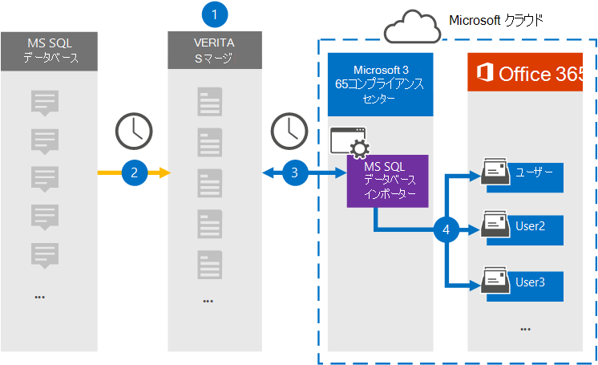

# MS SQL Databaseからデータをアーカイブするコネクタを設定する

Microsoft Purview コンプライアンス ポータルの Veritas コネクタを使用して、MS SQL Databaseから Microsoft 365 組織内のユーザー メールボックスにデータをインポートおよびアーカイブします。 Veritas には、XML 構成ファイルを使用してデータベースから項目をキャプチャし、それらの項目を Microsoft 365 にインポートするように構成された MS SQL Database Importer コネクタが用意されています。 コネクタは、MS SQL Databaseから電子メール メッセージ形式にコンテンツを変換し、それらのアイテムを Microsoft 365 のユーザー メールボックスにインポートします。

MS のコンテンツSQL Databaseユーザー メールボックスに格納された後、訴訟ホールド、電子情報開示、アイテム保持ポリシー、保持ラベルなどの Microsoft Purview 機能を適用できます。 MS SQL Database コネクタを使用して Microsoft 365 のデータをインポートおよびアーカイブすると、組織が政府および規制のポリシーに準拠し続けることができます。

## MS SQL データのアーカイブの概要

次の概要では、コネクタを使用して Microsoft 365 で MS SQL データをアーカイブするプロセスについて説明します。

1. 組織は MS SQL Database プロバイダーと連携して、MS SQL Database サイトを設定および構成します。

2. 24 時間に 1 回、MS SQL Database項目が Veritas Merge1 サイトにコピーされます。 コネクタでは、このコンテンツも電子メール メッセージ形式に変換されます。

3. コンプライアンス ポータルで作成する MS SQL Database Importer コネクタは、毎日 Veritas Merge1 サイトに接続し、Microsoft クラウドのセキュリティで保護された Azure Storage の場所にメッセージを転送します。

4. コネクタは、[手順 3](#step-3-map-users-and-complete-the-connector-setup). で説明したように、自動ユーザー マッピングの *Email* プロパティの値を使用して、変換された MS SQL Database アイテムを特定のユーザーのメールボックスにインポートします。 **MS SQL Database Importer** という名前の受信トレイ フォルダー内のサブフォルダーがユーザー メールボックスに作成され、アイテムがそのフォルダーにインポートされます。 コネクタは、 *Email* プロパティの値を使用して、アイテムをインポートするメールボックスを決定します。 MS SQL Databaseのすべてのアイテムには、アイテムのすべての参加者の電子メール アドレスが設定されたこのプロパティが含まれています。

## はじめに

- Microsoft コネクタの Veritas Merge1 アカウントを作成します。 アカウントを作成するには、 [Veritas カスタマー サポート](https://www.veritas.com/content/support/)にお問い合わせください。 手順 1 でコネクタを作成するときに、このアカウントにサインインする必要があります。

- 手順 1 で MS SQL Database Importer コネクタを作成し、手順 3 で完了したユーザーには、Data Connector 管理 ロールを割り当てる必要があります。 このロールは、コンプライアンス ポータルの **[データ コネクタ** ] ページでコネクタを追加するために必要です。 このロールは、既定で複数の役割グループに追加されます。 これらの役割グループの一覧については、「セキュリティ & コンプライアンス センターのアクセス許可」の「 [セキュリティとコンプライアンス センターの](../security/office-365-security/permissions-in-the-security-and-compliance-center.md#roles-in-the-security--compliance-center)ロール」セクションを参照してください。 または、組織内の管理者がカスタムロール グループを作成し、Data Connector 管理ロールを割り当ててから、適切なユーザーをメンバーとして追加することもできます。 手順については、[Microsoft Purview コンプライアンス ポータルのアクセス許可](microsoft-365-compliance-center-permissions.md#create-a-custom-role-group)の「カスタム ロール グループの作成」セクションを参照してください。

- この Veritas データ コネクタは、Microsoft 365 US Government クラウドの GCC 環境でパブリック プレビュー段階にあります。 サード パーティのアプリケーションとサービスには、Microsoft 365 インフラストラクチャの外部にあり、Microsoft Purview およびデータ保護コミットメントの対象外であるサード パーティ システムに対する組織の顧客データの保存、送信、処理が含まれる場合があります。 Microsoft は、この製品を使用してサード パーティ製アプリケーションに接続することは、これらのサードパーティ アプリケーションが FEDRAMP に準拠していることを意味することを示しません。

## 手順 1: MS SQL Database Importer コネクタを設定する

最初の手順は、コンプライアンス ポータルの **[データ コネクタ**] ページにアクセスし、MS SQL Databaseのコネクタを作成することです。

1. [https://compliance.microsoft.com](https://compliance.microsoft.com) **[データ コネクタ** > **MS SQL Database Importer**] に移動してクリックします。

2. **[MS SQL Database Importer** 製品の説明] ページで、[**新しいコネクタの追加**] をクリックします。

3. [利用規約] ページ **で** 、[ **同意** する] をクリックします。

4. コネクタを識別する一意の名前を入力し、[ **次へ**] をクリックします。

5. Merge1 アカウントにサインインしてコネクタを構成します。

## 手順 2: Veritas Merge1 サイトで MS SQL Database Importer コネクタを構成する

2 番目の手順では、Merge1 サイトで MS SQL Database Importer コネクタを構成します。 MS SQL Database インポーターを構成する方法については、「[Merge1 サード パーティ コネクタ ユーザー ガイド」を](https://docs.ms.merge1.globanetportal.com/Merge1%20Third-Party%20Connectors%20MS%20SQL%20Database%20Importer%20User%20Guide%20.pdf)参照してください。

[ **保存&完了**] をクリックすると、コンプライアンス ポータルのコネクタ ウィザードの **[ユーザー マッピング** ] ページが表示されます。

## 手順 3: ユーザーをマップし、コネクタのセットアップを完了する

ユーザーをマップし、コネクタのセットアップを完了するには、次の手順に従います。

1. [**Ms SQL Database Importer ユーザーを Microsoft 365 ユーザーにマップする**] ページで、自動ユーザー マッピングを有効にします。 MS SQL Database項目 *には、組織内* のユーザーの電子メール アドレスを含む Email というプロパティが含まれます。 コネクタがこのアドレスを Microsoft 365 ユーザーに関連付けることができる場合、アイテムはそのユーザーのメールボックスにインポートされます。

2. [ **次へ**] をクリックして設定を確認し、[ **データ コネクタ** ] ページに移動して、新しいコネクタのインポート プロセスの進行状況を確認します。

## 手順 4: MS SQL Database Importer コネクタを監視する

MS SQL Database Importer コネクタを作成した後、コンプライアンス ポータルでコネクタの状態を表示できます。

1. 左側の <https://compliance.microsoft.com/> ナビゲーションにある **[データ コネクタ** ] に移動してクリックします。

2. [**コネクタ**] タブをクリックし、**MS SQL Database** **Importer** コネクタを選択して、コネクタに関するプロパティと情報を含むポップアップ ページを表示します。

3. **[コネクタの状態とソース**] で、[**ログのダウンロード**] リンクをクリックして、コネクタの状態ログを開く (または保存) します。 このログには、Microsoft クラウドにインポートされたデータに関する情報が含まれています。 詳細については、「 [データ コネクタの管理者ログを表示する」を](data-connector-admin-logs.md)参照してください。

## 既知の問題

- 現時点では、10 MB を超える添付ファイルやアイテムのインポートはサポートされていません。 より大きなアイテムのサポートは、後日提供される予定です。