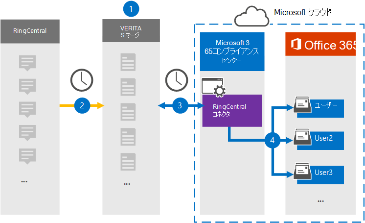

# RingCentral データをアーカイブするコネクタをセットアップする

サーバー内の Veritas コネクタをMicrosoft 365 コンプライアンス センター、RingCentral プラットフォームから組織のユーザー メールボックスにデータをインポートMicrosoft 365します。 Veritas には、サードパーティのデータ ソースからアイテムをキャプチャし、それらのアイテムを他のデータ ソースにインポートするように構成された [RingCentral](https://www.veritas.com/insights/merge1/ringcentral) コネクタMicrosoft 365。 コネクタは、チャット、添付ファイル、タスク、メモ、投稿などのコンテンツを RingCentral から電子メール メッセージ形式に変換し、それらのアイテムを Microsoft 365 のユーザー メールボックスにインポートします。

RingCentral データをユーザー メールボックスに格納した後、訴訟ホールド、電子情報開示、保持ポリシー、保持ラベルMicrosoft 365コンプライアンス機能を適用できます。 RingCentral コネクタを使用して、Microsoft 365データをインポートおよびアーカイブすると、組織が政府および規制ポリシーに準拠しつ付けるのに役立ちます。

## RingCentral データのアーカイブの概要

次の概要では、コネクタを使用して、アプリケーション内の RingCentral データをアーカイブするMicrosoft 365。

1. 組織は RingCentral を使用して、RingCentral サイトをセットアップおよび構成します。

2. 24 時間に 1 回、RingCentral アイテムは Veritas Merge1 サイトにコピーされます。 また、コネクタは RingCentral アイテムを電子メール メッセージ形式に変換します。

3. Microsoft 365 コンプライアンス センター で作成した RingCentral コネクタは、毎日 Veritas Merge1 サイトに接続し、RingCentral コンテンツを Microsoft クラウド内の安全な Azure Storage 場所に転送します。

4. コネクタは、手順 3 で説明したように、自動ユーザー マッピングの *Email* プロパティの値を使用して、変換されたアイテムを特定のユーザーのメールボックス [にインポートします](#step-3-map-users-and-complete-the-connector-setup)。 **RingCentral** という名前の受信トレイ フォルダー内のサブフォルダーがユーザー メールボックスに作成され、アイテムがそのフォルダーにインポートされます。 コネクタは、Email プロパティの値を使用してアイテムをインポートするメールボックスを *決定* します。 すべての RingCentral アイテムには、このプロパティが含まれるので、アイテムのすべての参加者の電子メール アドレスが設定されます。

## コネクタをセットアップする前に

- Microsoft コネクタ用の Merge1 アカウントを作成します。 このアカウントを作成するには、 [Veritas カスタマー サポートにお問い合わせください](https://www.veritas.com/form/requestacall/ms-connectors-contact)。 手順 1 でコネクタを作成する場合は、このアカウントにサインインする必要があります。

- RingCentral アカウントからデータをフェッチする RingCentral アプリケーションを作成します。 アプリケーションの作成の手順については、「Merge1 サードパーティ コネクタ ユーザー ガイド」 [を参照してください](https://docs.ms.merge1.globanetportal.com/Merge1%20Third-Party%20Connectors%20RingCentral%20User%20Guide.pdf)。

- 手順 1 で RingCentral コネクタを作成し (手順 3 で完了する) ユーザーには、データ コネクタ管理者の役割が割り当てられている必要があります。 この役割は、データ コネクタ ページの [データ  コネクタ] ページにコネクタを追加Microsoft 365 コンプライアンス センター。 この役割は、既定で複数の役割グループに追加されます。 これらの役割グループの一覧については、「セキュリティ とコンプライアンス センターのアクセス許可」の「セキュリティとコンプライアンス センターの役割& [してください](../security/office-365-security/permissions-in-the-security-and-compliance-center.md#roles-in-the-security--compliance-center)。 または、組織内の管理者がカスタム役割グループを作成し、データ コネクタ管理者の役割を割り当て、適切なユーザーをメンバーとして追加することもできます。 手順については、「アクセス許可」の「カスタム役割グループを作成する」[セクションを参照Microsoft 365 コンプライアンス センター](microsoft-365-compliance-center-permissions.md#create-a-custom-role-group)。

- この Veritas データ コネクタは、米国政府機関クラウドGCC環境Microsoft 365プレビュー中です。 サード パーティ製のアプリケーションとサービスには、Microsoft 365 インフラストラクチャの外部にある、Microsoft 365 コンプライアンスおよびデータ保護のコミットメントの対象となされていないサードパーティ システムに対して、組織の顧客データを保存、送信、および処理する必要があります。 Microsoft は、この製品を使用してサード パーティ製アプリケーションに接続する場合、これらのサード パーティ製アプリケーションが FEDRAMP に準拠しているという意味を示していません。

## 手順 1: RingCentral コネクタをセットアップする

最初の手順は、データ センターの  [データ コネクタ] ページにアクセスしMicrosoft 365 コンプライアンス センターリングCentral データのコネクタを作成することです。

1. [データ コネクタ <https://compliance.microsoft.com> RingCentral] に移動 **し** > **、[データ コネクタ] をクリックします**。

2. **[RingCentral 製品の説明]** ページで、[コネクタの追加] **をクリックします**。

3. [サービス条件 **] ページで、[** 同意する] を **クリックします**。

4. コネクタを識別する一意の名前を入力し、[次へ] を **クリックします**。

5. コネクタを構成するには、Merge1 アカウントにサインインします。

## 手順 2: Veritas Merge1 サイトで RingCentral を構成する

2 番目の手順は、Veritas Merge1 サイトで RingCentral コネクタを構成することです。 RingCentral コネクタを構成する方法の詳細については、「Merge1 サード パーティ コネクタ ユーザー ガイド」 [を参照してください](https://docs.ms.merge1.globanetportal.com/Merge1%20Third-Party%20Connectors%20RingCentral%20User%20Guide.pdf)。

[ファイルの **保存と&完了]** をクリックすると、コネクタ ウィザードの [ユーザー マッピング] ページが表示Microsoft 365 コンプライアンス センターされます。

## 手順 3: ユーザーをマップし、コネクタのセットアップを完了する

ユーザーをマップし、コネクタのセットアップを完了するには、次Microsoft 365 コンプライアンス センター手順を実行します。

1. [**RingCentral ユーザーをユーザーにMicrosoft 365する]** ページで、自動ユーザー マッピングを有効にします。 RingCentral アイテムには、組織内のユーザーのメール アドレスを含む *Email* というプロパティが含まれます。 コネクタでこのアドレスをユーザーに関連付Microsoft 365、アイテムはユーザーのメールボックスにインポートされます。

2. [**次へ**] をクリックし、設定を確認し、[データ コネクタ] ページに移動して、新しいコネクタのインポート プロセスの進行状況を確認します。

## 手順 4: RingCentral コネクタを監視する

RingCentral コネクタを作成した後は、コネクタの状態を [コネクタ] Microsoft 365 コンプライアンス センター。

1. 左側のナビゲーション <https://compliance.microsoft.com/> で [ **データ コネクタ] に** 移動してクリックします。

2. [コネクタ **] タブをクリック** し、 **RingCentral** コネクタを選択して、コネクタのプロパティと情報を含むフライアウト ページを表示します。

3. [**ソースを含むコネクタの** 状態] で、[ログのダウンロード] リンクをクリックして、コネクタの状態ログを開く (または保存) します。 このログには、Microsoft クラウドにインポートされたデータが含まれます。

## 既知の問題

- 現時点では、10 MB を超える添付ファイルやアイテムのインポートはサポートされていません。 大きいアイテムのサポートは、後日利用できます。
