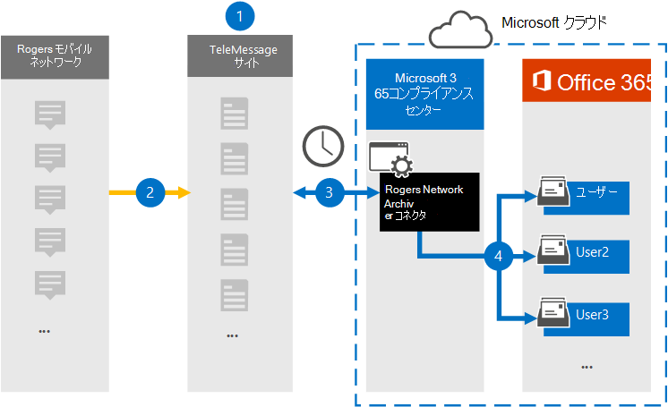

# Rogers Network データをアーカイブするコネクタを設定する

Microsoft Purview コンプライアンス ポータルの TeleMessage コネクタを使用して、Sms と MMS のデータを Rogers モバイル ネットワークにインポートしてアーカイブします。 [Rogers Network Archiver コネクタ](https://www.telemessage.com/mobile-archiver/network-archiver/rogers/)を設定して構成すると、組織の Rogers モバイル ネットワークに接続され、SMS および MMS データがMicrosoft 365のメールボックスにインポートされます。

ユーザー メールボックスに Rogers モバイル ネットワークからのデータが格納されたら、訴訟ホールド、コンテンツ検索、Microsoft 365アイテム保持ポリシーなどの Microsoft Purview 機能をデータに適用できます。 たとえば、コンテンツ検索または Microsoft Purview 電子情報開示 (Standard) ケースに関連付けられた検索を使用して、Rogers モバイル ネットワークから SMS および MMS メッセージを検索できます。 Microsoft 365のデータをインポートおよびアーカイブするために、Rogers Network Archiver コネクタを使用すると、組織が企業ガバナンスの規制や規制ポリシーに準拠し続けることができます。

## Rogers モバイル ネットワーク データのアーカイブの概要

次の概要では、コネクタを使用して、Microsoft 365で Rogers SMS および MMS データをアーカイブするプロセスについて説明します。

1. 組織は TeleMessage と連携して、Rogers Network Archiver コネクタを設定します。 詳細については、「[Microsoft 365の TeleMessage Rogers Network Archiver のアクティブ化」を](https://www.telemessage.com/microsoft-365-activation-for-the-rogers-network-archiver/)参照してください。

2. リアルタイムで、組織の Rogers モバイル ネットワーク データが TeleMessage サイトにコピーされます。

3. コンプライアンス ポータルで作成した Rogers Network Archiver コネクタは、毎日 TeleMessage サイトに接続し、前の 24 時間のメール メッセージを Microsoft Cloud のセキュリティで保護されたAzure Storage領域に転送します。

4. コネクタは、モバイル通信アイテムを特定のユーザーのメールボックスにインポートします。 Rogers SMS/MMS Network Archiver という名前の新しいフォルダーが特定のユーザーのメールボックスに作成され、アイテムがインポートされます。 コネクタは、 *ユーザーの電子メール アドレス* プロパティの値を使用してマッピングを行います。 すべての電子メール メッセージには、このプロパティが含まれています。このプロパティには、電子メール メッセージのすべての参加者の電子メール アドレスが設定されます。

   *ユーザーの電子メール アドレス* プロパティの値を使用した自動ユーザー マッピングに加えて、CSV マッピング ファイルをアップロードしてカスタム マッピングを定義することもできます。 このマッピング ファイルには、ユーザーの携帯電話番号と、各ユーザーの対応するMicrosoft 365メールボックス アドレスが含まれている必要があります。 自動ユーザー マッピングを有効にし、カスタム マッピングを指定する場合は、すべての電子メール アイテムについて、コネクタが最初にカスタム マッピング ファイルを確認します。 ユーザーの携帯電話番号に対応する有効なMicrosoft 365 ユーザーが見つからない場合、コネクタは電子メール アイテムのユーザーの電子メール アドレス プロパティを使用します。 コネクタで、カスタム マッピング ファイルまたは電子メール アイテムのユーザーの *電子メール アドレス* プロパティで有効なMicrosoft 365 ユーザーが見つからない場合、アイテムはインポートされません。

## コネクタを設定する前に

- [TeleMessage から Rogers Network Archiver サービス](https://www.telemessage.com/mobile-archiver/order-mobile-archiver-for-o365/)を注文し、組織の有効な管理アカウントを取得します。 コンプライアンス センターでコネクタを作成するときは、このアカウントにサインインする必要があります。

- TeleMessage アカウントに、Rogers Network のアーカイブを必要とするすべてのユーザーを登録します。 ユーザーを登録するときは、Microsoft 365 アカウントに使用するのと同じメール アドレスを必ず使用してください。

- 従業員は、O2 モバイル ネットワーク上に会社所有の携帯電話と会社の責任を負う携帯電話を持っている必要があります。 Microsoft 365のメッセージのアーカイブは、従業員所有のデバイスまたは "Bring Your Own Devices (BYOD) デバイスでは使用できません。

- 組織の Rogers アカウントと課金連絡先の詳細を取得して、オンボード フォームを完成させて、Rogers からメッセージ アーカイブ サービスを注文できるようにします。

- 手順 3 で Rogers Network Archiver コネクタを作成するユーザーには、データ コネクタ管理者ロールを割り当てる必要があります。 このロールは、コンプライアンス ポータルの **[データ コネクタ** ] ページでコネクタを追加するために必要です。 このロールは、既定で複数の役割グループに追加されます。 これらの役割グループの一覧については、「セキュリティ & コンプライアンス センターのアクセス許可」の「 [セキュリティとコンプライアンス センターの](../security/office-365-security/permissions-in-the-security-and-compliance-center.md#roles-in-the-security--compliance-center)ロール」セクションを参照してください。 または、組織内の管理者は、カスタム役割グループを作成し、Data Connector 管理者ロールを割り当て、適切なユーザーをメンバーとして追加することもできます。 手順については、 [Microsoft Purview コンプライアンス ポータル](microsoft-365-compliance-center-permissions.md#create-a-custom-role-group)のアクセス許可の「カスタム ロール グループの作成」セクションを参照してください。

- この TeleMessage データ コネクタは、Microsoft 365米国政府機関クラウドのGCC環境で使用できます。 サード パーティのアプリケーションとサービスには、組織の顧客データを、Microsoft 365 インフラストラクチャの外部にあるサード パーティ システムに格納、送信、処理する必要があるため、Microsoft Purview およびデータ保護のコミットメントの対象とされません。 Microsoft は、この製品を使用してサード パーティ製アプリケーションに接続することは、これらのサードパーティ アプリケーションが FEDRAMP に準拠していることを意味することを示しません。

## Rogers Network Archiver コネクタを作成する

前のセクションで説明した前提条件を完了したら、コンプライアンス ポータルで Rogers Network Archiver コネクタを作成できます。 コネクタは、指定した情報を使用して TeleMessage サイトに接続し、Microsoft 365の対応するユーザー メールボックス ボックスに Rogers SMS/MMS データを転送します。

1. **Data connectorsRogers** >  **Network Archiver** に<https://compliance.microsoft.com>移動してクリックします。

2. **[Rogers Network Archiver**] 製品の説明ページで、[**コネクタの追加**] をクリックします。

3. [利用規約] ページ **で** 、[ **同意** する] をクリックします。

4. [ **TeleMessage へのログイン** ] ページの [手順 3] で、次のボックスに必要な情報を入力し、[ **次へ**] をクリックします。

    - **名：** TeleMessage ユーザー名。

    - **パスワード：** TeleMessage のパスワード。

5. コネクタが作成されたら、ポップアップ ウィンドウを閉じて次のページに移動できます。

6. [ **ユーザー マッピング** ] ページで、自動ユーザー マッピングを有効にします。 カスタム マッピングを有効にするには、ユーザー マッピング情報を含む CSV ファイルをアップロードし、[ **次へ**] をクリックします。

7. 設定を確認し、[ **完了]** をクリックしてコネクタを作成します。

8. **[データ コネクタ**] ページの [コネクタ] タブに移動して、新しいコネクタのインポート プロセスの進行状況を確認します。

## 既知の問題

- 現時点では、10 MB を超える添付ファイルやアイテムのインポートはサポートされていません。 より大きなアイテムのサポートは、後日提供される予定です。
