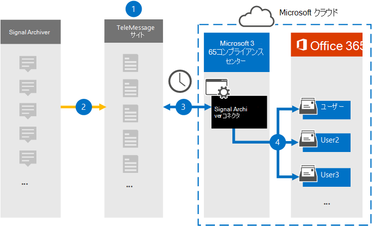

# シグナル通信データをアーカイブするコネクタをセットアップする

シグナル チャット、添付ファイル、ファイル、および削除されたメッセージと呼び出しをインポートおよびアーカイブするには、Microsoft 365 コンプライアンス センターの TeleMessage コネクタを使用します。 コネクタをセットアップして構成した後、そのコネクタは組織の TeleMessage アカウントに接続し、TeleMessage Signal Archiver を使用して従業員のモバイル通信を Microsoft 365 のメールボックスにインポートします。

Signal Archiver コネクタ データをユーザー メールボックスに格納した後、訴訟ホールド、コンテンツ検索、Microsoft 365 保持ポリシーなどの Microsoft 365 コンプライアンス機能をシグナル通信データに適用できます。 たとえば、コンテンツ検索を使用してシグナル通信を検索したり、Signal Archiver コネクタ データを含むメールボックスを管理担当者に関連付Advanced eDiscoveryできます。 Signal Archiver コネクタを使用して、Microsoft 365のデータをインポートおよびアーカイブすると、組織がコーポレート ガバナンス規制および規制ポリシーに準拠しつ付けるのに役立ちます。

## アーカイブシグナル通信データの概要

次の概要では、コネクタを使用して信号通信データをアーカイブするプロセスについて説明Microsoft 365。

1. 組織は TeleMessage と一緒にシグナル アーカイブ コネクタをセットアップします。 詳細については[、「TeleMessage Signal Archiver for the TeleMessage Signal Archiver for Microsoft 365」 を参照してください](https://www.telemessage.com/microsoft-365-activation-for-signal-archiver/)。

2. リアルタイムで、組織の Signal データが TeleMessage サイトにコピーされます。

3. Microsoft 365 コンプライアンス センター で作成した Signal Archiver コネクタは、毎日 TeleMessage サイトに接続し、過去 24 時間の電子メール メッセージを Microsoft Cloud のセキュリティで保護された Azure Storage 領域に転送します。

4. コネクタは、モバイル通信アイテムを特定のユーザーのメールボックスにインポートします。 Signal Archiver という名前の新しいフォルダーが特定のユーザーのメールボックスに作成され、アイテムがインポートされます。 コネクタは、User の [電子メール アドレス] プロパティの値を使用 *してマッピングを実行* します。 すべての電子メール メッセージには、このプロパティが含まれるので、電子メール メッセージのすべての参加者の電子メール アドレスが設定されます。

   *User* の [電子メール アドレス] プロパティの値を使用した自動ユーザー マッピングに加えて、CSV マッピング ファイルをアップロードしてカスタム マッピングを定義できます。 このマッピング ファイルには、ユーザーのモバイル番号と、各ユーザー Microsoft 365対応するメールボックス アドレスが含まれている必要があります。 自動ユーザー マッピングを有効にしてカスタム マッピングを提供する場合、すべての電子メール アイテムについて、コネクタは最初にカスタム マッピング ファイルを確認します。 ユーザーの携帯電話番号に対応する有効な Microsoft 365 ユーザーが見つからなかった場合、コネクタは電子メール アイテムのユーザーの電子メール アドレス プロパティを使用します。 コネクタがカスタム マッピング ファイルまたは電子メール アイテムのユーザーの電子メール アドレス プロパティに有効な Microsoft 365 ユーザーを見つからなかった場合、アイテムはインポートされません。

## コネクタをセットアップする前に

- [TeleMessage から Signal Archiver サービスを注文し](https://www.telemessage.com/mobile-archiver/order-mobile-archiver-for-o365/)、組織の有効な管理アカウントを取得します。 コンプライアンス センターでコネクタを作成する場合は、このアカウントにサインインする必要があります。

- TeleMessage アカウントにシグナル アーカイブが必要なすべてのユーザーを登録します。 ユーザーを登録する場合は、ユーザーのアカウントに使用するメール アドレスと同じMicrosoft 365してください。

- 従業員の携帯電話に Signal Archiver アプリをインストールし、アクティブ化します。 Signal Archiver アプリを使用すると、他の Signal ユーザーと通信してチャットできます。

- 手順 3 で Signal Archiver コネクタを作成するユーザーには、メールボックスインポートエクスポートの役割が割り当てられている必要Exchange Online。 これは、データ コネクタ ページの[データ コネクタ] ページにコネクタを追加Microsoft 365 コンプライアンス センター。 既定では、この役割は Exchange Online のどの役割グループにも割り当てられていません。 [メールボックスのインポートエクスポート] 役割は、組織の [組織の管理] 役割グループに追加Exchange Online。 または、役割グループを作成し、メールボックスインポートエクスポートの役割を割り当て、適切なユーザーをメンバーとして追加できます。 詳細については、「グループ内の[役割グループを](/Exchange/permissions-exo/role-groups#create-role-groups)管理する」の「役割グループの作成」または「役割グループの変更」セクションを参照Exchange Online。

- このデータ コネクタは、米国政府機関GCCのMicrosoft 365環境で使用できます。 サード パーティのアプリケーションとサービスには、Microsoft 365 インフラストラクチャの外部にあるサードパーティ システムに組織の顧客データを格納、送信、処理する必要がある場合があります。したがって、Microsoft 365 コンプライアンスとデータ保護のコミットメントの対象とはなってはいけなかっています。 Microsoft は、この製品を使用してサード パーティ製アプリケーションに接続する場合、これらのサード パーティ製アプリケーションが FEDRAMP に準拠しているという意味を示していません。

## 信号アーカイブ コネクタを作成する

前のセクションで説明した前提条件を完了したら、次のセクションで Signal Archiver コネクタを作成Microsoft 365 コンプライアンス センター。 コネクタは、指定した情報を使用して TeleMessage サイトに接続し、信号通信データをネットワーク内の対応するユーザー メールボックス ボックスに転送Microsoft 365。

1. [データ コネクタシグナル アーカイブ] に移動し、[ <https://compliance.microsoft.com> データ **コネクタ**  >  **] をクリックします**。

2. [Signal **Archiver 製品の説明]** ページで、[コネクタの追加] **をクリックします。**

3. [サービス条件 **] ページで、[** 同意する] を **クリックします**。

4. **[TeleMessage へのログイン]** ページの [手順 3] で、次のボックスに必要な情報を入力し、[次へ] を **クリックします**。

    - **ユーザー名:** TeleMessage ユーザー名。

    - **パスワード:** TeleMessage パスワード。

5. コネクタを作成したら、ポップアップ ウィンドウを閉じて次のページに移動できます。

6. [ユーザー マッピング **] ページで** 、自動ユーザー マッピングを有効にする。 カスタム マッピングを有効にするには、ユーザー マッピング情報を含む CSV ファイルをアップロードし、[次へ] を **クリックします**。

7. 設定を確認し、[完了] を **クリックして** コネクタを作成します。

8. [データ コネクタ] ページの [コネクタ] **タブに移動** して、新しいコネクタのインポート プロセスの進行状況を確認します。

## 既知の問題

- 現時点では、10 MB を超える添付ファイルやアイテムのインポートはサポートされていません。 大きいアイテムのサポートは、後日利用できます。
