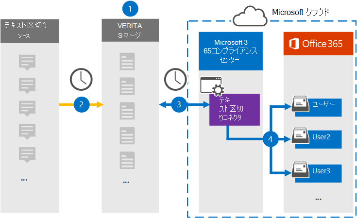

# テキスト区切りデータをアーカイブするコネクタをセットアップする

テキストで区切られたデータをインポートおよびアーカイブするには、Microsoft 365 コンプライアンス センターの Veritas コネクタを使用して、組織内のユーザー メールボックスMicrosoft 365します。 Veritas には、サードパーティのデータ ソースからアイテムを (定期的に) キャプチャし、それらのアイテムを Microsoft 365 にインポートするように構成されたテキスト区切りコネクタが提供されています。 コネクタは、テキストで区切られたデータ ソースから電子メール メッセージ形式にコンテンツを変換し、それらのアイテムをユーザーのメールボックスにインポートMicrosoft 365。

テキストで区切られたデータをユーザー のメールボックスに格納した後、訴訟ホールド、電子情報開示、保持ポリシーや保持ラベルMicrosoft 365コンプライアンス機能を適用できます。 テキストで区切られたデータ コネクタを使用して、データをインポートおよびアーカイブMicrosoft 365、組織が政府機関および規制ポリシーに準拠しつ付けるのに役立ちます。

## テキスト区切りデータのアーカイブの概要

次の概要では、コネクタを使用してテキストで区切られたソース情報をアーカイブするプロセスについて説明Microsoft 365。

1. 組織は、テキストで区切られたソースを使用して、テキストで区切られたサイトを設定および構成します。

2. 24 時間に 1 回、テキストで区切られたソースからのチャット メッセージが Veritas Merge1 サイトにコピーされます。 コネクタは、コンテンツを電子メール メッセージ形式に変換します。

3. Microsoft 365 コンプライアンス センター で作成するテキスト区切りコネクタは、毎日 Veritas Merge1 サイトに接続し、Microsoft クラウド内のセキュリティで保護された Azure Storage 場所にメッセージを転送します。

4. コネクタは、手順 3 で説明したように、自動ユーザー マッピングの *Email* プロパティの値を使用して、変換されたメッセージ アイテムを特定のユーザーのメールボックスにインポートします。 Text **- Delimited** という名前の受信トレイ フォルダー内の新しいサブフォルダーがユーザー のメールボックスに作成され、メッセージ アイテムがそのフォルダーにインポートされます。 コネクタは、Email プロパティの値を使用してアイテムをインポートするメールボックスを *決定* します。 すべてのメッセージには、このプロパティが含まれるので、すべての参加者の電子メール アドレスが設定されます。

## 始める前に

- Microsoft コネクタ用の Veritas Merge1 アカウントを作成します。 このアカウントを作成するには、 [Veritas カスタマー サポートにお問い合わせください](https://globanet.com/ms-connectors-contact)。 手順 1 でコネクタを作成するときに、このアカウントにサインインします。

- 手順 1 でテキスト区切りコネクタを作成し (および手順 3 で完了する) ユーザーには、データ コネクタ管理者の役割が割り当てられている必要があります。 この役割は、データ コネクタ ページの [データ  コネクタ] ページにコネクタを追加Microsoft 365 コンプライアンス センター。 この役割は、既定で複数の役割グループに追加されます。 これらの役割グループの一覧については、「セキュリティ とコンプライアンス センターのアクセス許可」の「セキュリティとコンプライアンス センターの役割& [してください](../security/office-365-security/permissions-in-the-security-and-compliance-center.md#roles-in-the-security--compliance-center)。 または、組織内の管理者がカスタム役割グループを作成し、データ コネクタ管理者の役割を割り当て、適切なユーザーをメンバーとして追加することもできます。 手順については、「アクセス許可」の「カスタム役割グループを作成する」[セクションを参照Microsoft 365 コンプライアンス センター](microsoft-365-compliance-center-permissions.md#create-a-custom-role-group)。

- この Veritas データ コネクタは、米国政府機関クラウドGCC環境Microsoft 365プレビュー中です。 サード パーティ製のアプリケーションとサービスには、Microsoft 365 インフラストラクチャの外部にある、Microsoft 365 コンプライアンスおよびデータ保護のコミットメントの対象となされていないサードパーティ システムに対して、組織の顧客データを保存、送信、および処理する必要があります。 Microsoft は、この製品を使用してサード パーティ製アプリケーションに接続する場合、これらのサード パーティ製アプリケーションが FEDRAMP に準拠しているという意味を示していません。

## 手順 1: テキスト区切りコネクタを設定する

最初の手順は、ページの [データ コネクタ] ページにアクセスしMicrosoft 365 コンプライアンス センター区切られたデータのコネクタを作成することです。

1. に移動し [https://compliance.microsoft.com](https://compliance.microsoft.com/) 、[ **データ コネクタ] [** > **テキスト区切り] をクリックします**。

2. [テキストで **区切られた製品の説明] ページ** で、[コネクタの追加] **をクリックします**。

3. [サービス条件 **] ページで、[** 同意する] を **クリックします**。

4. コネクタを識別する一意の名前を入力し、[次へ] を **クリックします**。

5. コネクタを構成するには、Merge1 アカウントにサインインします。

## 手順 2: Veritas Merge1 サイトでテキスト区切りコネクタを構成する

2 番目の手順は、Merge1 サイトでテキスト区切りコネクタを構成することです。 Veritas Merge1 サイトでテキスト区切りコネクタを構成する方法については、「Merge1 サード パーティ コネクタ ユーザー ガイド」 [を参照してください](https://docs.ms.merge1.globanetportal.com/Merge1%20Third-Party%20Connectors%20text-delimited%20User%20Guide%20.pdf)。

[ファイルの **保存と&完了**] をクリックすると、コネクタ ウィザードの [ユーザー マッピング] ページが表示Microsoft 365 コンプライアンス センターされます。

## 手順 3: ユーザーをマップし、コネクタのセットアップを完了する

ユーザーをマップし、コネクタのセットアップを完了するには、次Microsoft 365 コンプライアンス センター手順を実行します。

1. [外部ユーザー **をユーザーにマップMicrosoft 365] ページで**、自動ユーザー マッピングを有効にします。 テキスト区切りソース アイテムには、組織内のユーザーの電子メール アドレスを含む *Email* というプロパティが含まれます。 コネクタでこのアドレスをユーザーに関連付Microsoft 365、アイテムはユーザーのメールボックスにインポートされます。

2. [**次へ**] をクリックし、設定を確認し、[データ コネクタ] ページに移動して、新しいコネクタのインポート プロセスの進行状況を確認します。

## 手順 4: テキスト区切りコネクタを監視する

テキスト区切りコネクタを作成した後、コネクタの状態を [テキスト区切り] Microsoft 365 コンプライアンス センター。

1. 左側のナビゲーション [https://compliance.microsoft.com](https://compliance.microsoft.com) で [ **データ コネクタ] に** 移動してクリックします。

2. [コネクタ **] タブをクリック** し、[ **テキスト区切りコネクタ]** を選択して、フライアウト ページを表示します。 このページには、コネクタに関するプロパティと情報が含まれる。

3. [**ソースを含むコネクタの** 状態] で、[ログのダウンロード] リンクをクリックして、コネクタの状態ログを開く (または保存) します。 このログには、Microsoft クラウドにインポートされたデータに関する情報が含まれます。

## 既知の問題

- 現時点では、10 MB を超える添付ファイルやアイテムのインポートはサポートされていません。 大きいアイテムのサポートは、後日利用できます。