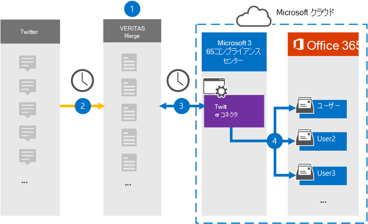

# Twitter データをアーカイブするコネクタをセットアップする (プレビュー)

Twitter プラットフォームからデータをインポートおよびアーカイブするには、Microsoft 365 コンプライアンス センターの Veritas コネクタを使用して、組織のユーザー Microsoft 365します。 Veritas には[、サードパーティのデータ](https://www.veritas.com/insights/merge1/twitter)ソースからアイテムをキャプチャし、それらのアイテムをデータ ソースにインポートするように構成された Twitter コネクタMicrosoft 365。 コネクタは、ツイート、リツイート、コメントなどのコンテンツを Twitter から電子メール メッセージ形式に変換し、それらのアイテムを Microsoft 365 のユーザー メールボックスにインポートします。

Twitter データをユーザー のメールボックスに保存した後、訴訟ホールド、電子情報開示、保持ポリシー、保持ラベルMicrosoft 365コンプライアンス機能を適用できます。 Twitter コネクタを使用してデータをインポートおよびアーカイブMicrosoft 365、組織が政府および規制ポリシーに準拠しつ付けるのに役立ちます。

## Twitter データのアーカイブの概要

次の概要では、コネクタを使用して Twitter データをアーカイブするプロセスについて説明Microsoft 365。

1. 組織は Twitter と一緒に Twitter サイトを設定および構成します。 また、組織は Veritas と共同で Merge1 サイトをセットアップします。

2. 24 時間に 1 回、Twitter アイテムは Veritas Merge1 サイトにコピーされます。 コネクタは、Twitter アイテムを電子メール メッセージ形式に変換します。

3. Microsoft 365 コンプライアンス センター で作成する Twitter コネクタは、毎日 Veritas Merge1 サイトに接続し、Twitter コンテンツを Microsoft クラウドの安全な場所Azure Storageに転送します。

4. コネクタは、手順 3 で説明したように、自動ユーザー マッピングの *Email* プロパティの値を使用して、変換されたアイテムを特定のユーザーのメールボックス [にインポートします](#step-3-map-users-and-complete-the-connector-setup)。 Twitter という名前の受信トレイフォルダー内のサブフォルダーがユーザー メールボックスに作成され、アイテムがそのフォルダーにインポートされます。 コネクタは *、Email* プロパティの値を使用してアイテムをインポートするメールボックスを決定します。 すべての Twitter アイテムには、このプロパティが含まれるので、アイテムのすべての参加者の電子メール アドレスが設定されます。

## コネクタをセットアップする前に

- Microsoft コネクタ用の Merge1 アカウントを作成します。 このアカウントを作成するには [、Veritas カスタマー サポートにお問い合わせください](https://www.veritas.com/form/requestacall/ms-connectors-contact)。 手順 1 でコネクタを作成する場合は、このアカウントにサインインする必要があります。

- Twitter アカウントからデータを <https://developer.twitter.com> 取得する Twitter アプリケーションを作成します。 アプリケーションの作成の手順については [、「Merge1 サード](https://docs.ms.merge1.globanetportal.com/Merge1%20Third-Party%20Connectors%20Twitter%20User%20Guide.pdf)パーティ コネクタ ユーザー ガイド」を参照してください。

- 手順 1 で YouTube コネクタを作成し (手順 3 で完了する) ユーザーは、次の手順でメールボックスインポートエクスポートの役割に割り当てる必要Exchange Online。 この役割は、データ コネクタ ページの[データ コネクタ] ページにコネクタを追加Microsoft 365 コンプライアンス センター。 既定では、この役割は、グループ内の任意の役割グループExchange Online。 [メールボックスのインポートエクスポート] 役割は、組織の [組織の管理] 役割グループに追加Exchange Online。 または、役割グループを作成し、メールボックスインポートエクスポートの役割を割り当て、適切なユーザーをメンバーとして追加できます。 詳細については、「グループ内の[役割グループを](/Exchange/permissions-exo/role-groups#create-role-groups)管理する」の「役割グループの作成」または「役割グループの変更」セクションを参照Exchange Online。

## 手順 1: Twitter コネクタをセットアップする

最初の手順は、[データ コネクタ] ページの [データ コネクタ] ページにアクセスしMicrosoft 365 コンプライアンス センター Twitter データ用のコネクタを作成することです。

1. [データ コネクタ <https://compliance.microsoft.com> ] Twitter に移動 **し、[データ コネクタ]**  >  **をクリックします**。

2. [Twitter 製品の **説明]** ページで、[コネクタの追加] **をクリックします**。

3. [サービス条件 **] ページで、[** 同意する] を **クリックします**。

4. コネクタを識別する一意の名前を入力し、[次へ] を **クリックします**。

5. コネクタを構成するには、Merge1 アカウントにサインインします。

## 手順 2: Veritas Merge1 サイトで Twitter を構成する

2 番目の手順は、Veritas Merge1 サイトで Twitter コネクタを構成することです。 Twitter コネクタを構成する方法の詳細については [、「Merge1 サード](https://docs.ms.merge1.globanetportal.com/Merge1%20Third-Party%20Connectors%20Twitter%20User%20Guide.pdf)パーティ コネクタ ユーザー ガイド」を参照してください。

[ファイルの **保存と&完了]** をクリックすると、コネクタ ウィザードの [ユーザー マッピング] ページが表示Microsoft 365 コンプライアンス センターされます。

## 手順 3: ユーザーをマップし、コネクタのセットアップを完了する

ユーザーをマップし、コネクタのセットアップを完了するには、次Microsoft 365 コンプライアンス センター手順を実行します。

1. [Twitter ユーザー **をユーザーにマップMicrosoft 365]** ページで、自動ユーザー マッピングを有効にします。 Twitter アイテムには、組織内のユーザーのメール アドレスを含む *Email* というプロパティが含まれます。 コネクタでこのアドレスをユーザーに関連付Microsoft 365、アイテムはユーザーのメールボックスにインポートされます。

2. [**次へ**] をクリックし、設定を確認し、[データ コネクタ] ページに移動して、新しいコネクタのインポート プロセスの進行状況を確認します。

## 手順 4: Twitter コネクタを監視する

Twitter コネクタを作成した後、コネクタの状態を[コネクタ] ページでMicrosoft 365 コンプライアンス センター。

1. 左側の <https://compliance.microsoft.com/> ナビゲーションで [ **データ コネクタ] に** 移動してクリックします。

2. [コネクタ **] タブをクリック** し **、Twitter** コネクタを選択して、コネクタのプロパティと情報を含むフライアウト ページを表示します。

3. [**ソースを含むコネクタの状態**] で、[ログのダウンロード] リンクをクリックして、コネクタの状態ログを開く (または保存) します。  このログには、Microsoft クラウドにインポートされたデータが含まれます。

## 既知の問題

- 現時点では、10 MB を超える添付ファイルやアイテムのインポートはサポートされていません。 大きいアイテムのサポートは、後日利用できます。
