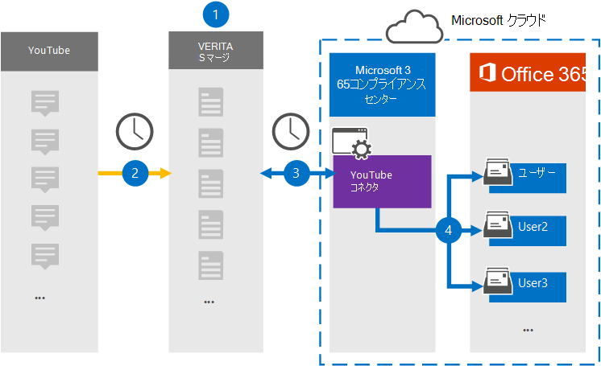

# YouTube データをアーカイブするコネクタを設定する

Microsoft Purview コンプライアンス ポータルで Veritas コネクタを使用して、YouTube からMicrosoft 365組織内のユーザー メールボックスにデータをインポートおよびアーカイブします。 Veritas には、サード パーティのデータ ソースからアイテムをキャプチャし、それらの項目をMicrosoft 365にインポートするように構成されたコネクタが用意されています。 コネクタは、チャット、添付ファイル、タスク、メモ、投稿などのコンテンツを YouTube から電子メール メッセージ形式に変換し、それらのアイテムをMicrosoft 365のユーザー メールボックスにインポートします。

YouTube データがユーザー メールボックスに保存された後、訴訟ホールド、電子情報開示、アイテム保持ポリシー、保持ラベルなどの Microsoft Purview 機能を適用できます。 YouTube コネクタを使用してMicrosoft 365のデータをインポートおよびアーカイブすると、組織が政府および規制のポリシーに準拠し続けることができます。

## YouTube データのアーカイブの概要

次の概要では、コネクタを使用して、Microsoft 365で YouTube データをアーカイブするプロセスについて説明します。

1. 組織は YouTube と連携して、YouTube サイトを設定および構成します。

2. 24 時間に 1 回、YouTube アイテムは Veritas Merge1 サイトにコピーされます。 また、コネクタは YouTube アイテムを電子メール メッセージ形式に変換します。

3. コンプライアンス ポータルで作成した YouTube コネクタは、毎日 Veritas Merge1 サイトに接続し、YouTube コンテンツを Microsoft クラウド内の安全なAzure Storageの場所に転送します。

4. コネクタは、[手順 3](#step-3-map-users-and-complete-the-connector-setup). で説明したように、自動ユーザー マッピングの *Email* プロパティの値を使用して、変換されたアイテムを特定のユーザーのメールボックスにインポートします。 **YouTube** という名前の受信トレイ フォルダー内のサブフォルダーがユーザー メールボックスに作成され、そのフォルダーにアイテムがインポートされます。 コネクタは、 *Email* プロパティの値を使用して、アイテムをインポートするメールボックスを決定します。 すべての YouTube アイテムにはこのプロパティが含まれています。このプロパティには、アイテムのすべての参加者のメール アドレスが入力されます。

## コネクタを設定する前に

- Microsoft コネクタの Merge1 アカウントを作成します。 このアカウントを作成するには、 [Veritas カスタマー サポート](https://www.veritas.com/form/requestacall/ms-connectors-contact)にお問い合わせください。 手順 1 でコネクタを作成するときに、このアカウントにサインインする必要があります。

- YouTube アカウントからデータをフェッチする YouTube アプリケーションを作成します。 アプリケーションの作成に関する詳細な手順については、「 [Merge1 サード パーティ コネクタ ユーザー ガイド」を](https://docs.ms.merge1.globanetportal.com/Merge1%20Third-Party%20Connectors%20YouTube%20User%20Guide.pdf)参照してください。

- 手順 1 で YouTube コネクタを作成し、手順 3 で完了したユーザーには、Data Connector 管理者ロールを割り当てる必要があります。 このロールは、コンプライアンス ポータルの **[データ コネクタ** ] ページでコネクタを追加するために必要です。 このロールは、既定で複数の役割グループに追加されます。 これらの役割グループの一覧については、「セキュリティ & コンプライアンス センターのアクセス許可」の「 [セキュリティとコンプライアンス センターの](../security/office-365-security/permissions-in-the-security-and-compliance-center.md#roles-in-the-security--compliance-center)ロール」セクションを参照してください。 または、組織内の管理者は、カスタム役割グループを作成し、Data Connector 管理者ロールを割り当て、適切なユーザーをメンバーとして追加することもできます。 手順については、 [Microsoft Purview コンプライアンス ポータル](microsoft-365-compliance-center-permissions.md#create-a-custom-role-group)のアクセス許可の「カスタム ロール グループの作成」セクションを参照してください。

## 手順 1: YouTube コネクタを設定する

最初の手順では、コンプライアンス ポータルの **[データ コネクタ** ] ページにアクセスし、YouTube データ用のコネクタを作成します。

1. **Data connectorsYouTube** >  に<https://compliance.microsoft.com>移動してクリックします。

2. **YouTube** 製品の説明ページで、[**コネクタの追加**] をクリックします。

3. [利用規約] ページ **で** 、[ **同意** する] をクリックします。

4. コネクタを識別する一意の名前を入力し、[ **次へ**] をクリックします。

5. Merge1 アカウントにサインインしてコネクタを構成します。

## 手順 2: Veritas Merge1 サイトで YouTube を構成する

2 番目の手順は、Veritas Merge1 サイトで YouTube コネクタを構成することです。 YouTube コネクタを構成する方法については、「 [Merge1 サード パーティ コネクタ ユーザー ガイド」を](https://docs.ms.merge1.globanetportal.com/Merge1%20Third-Party%20Connectors%20YouTube%20User%20Guide.pdf)参照してください。

[ **保存&完了** ] をクリックすると、コンプライアンス ポータルのコネクタ ウィザードの **[ユーザー マッピング** ] ページが表示されます。

## 手順 3: ユーザーをマップし、コネクタのセットアップを完了する

ユーザーをマップし、コンプライアンス ポータルでコネクタのセットアップを完了するには、次の手順に従います。

1. **[YouTube ユーザーを Microsoft 365 ユーザーにマップ** する] ページで、自動ユーザー マッピングを有効にします。 YouTube アイテムには、組織内のユーザーのメール アドレスを含む *Email* というプロパティが含まれています。 コネクタがこのアドレスをMicrosoft 365 ユーザーに関連付けることができる場合、アイテムはそのユーザーのメールボックスにインポートされます。

2. [ **次へ**] をクリックして設定を確認し、[ **データ コネクタ** ] ページに移動して、新しいコネクタのインポート プロセスの進行状況を確認します。

## 手順 4: YouTube コネクタを監視する

YouTube コネクタを作成したら、コンプライアンス ポータルでコネクタの状態を表示できます。

1. 左側の <https://compliance.microsoft.com/> ナビゲーションにある **[データ コネクタ** ] に移動してクリックします。

2. [ **コネクタ** ] タブをクリックし、 **YouTube** コネクタを選択してポップアップ ページを表示します。このページには、コネクタに関するプロパティと情報が表示されます。

3. **[コネクタの状態とソース**] で、[**ログのダウンロード**] リンクをクリックして、コネクタの状態ログを開く (または保存) します。 このログには、Microsoft クラウドにインポートされたデータが含まれています。

## 既知の問題

- 現時点では、10 MB を超える添付ファイルやアイテムのインポートはサポートされていません。 より大きなアイテムのサポートは、後日提供される予定です。
