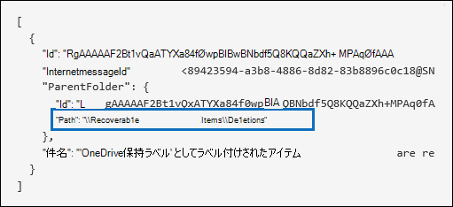

# <a name="search-the-audit-log-to-investigate-common-support-issues"></a>監査ログを検索して、一般的なサポートの問題を調査する

[!include[Purview banner](../includes/purview-rebrand-banner.md)]

この記事では、監査ログ検索ツールを使用して、一般的なサポートの問題を調査する方法について説明します。 これには、監査ログを使用して次の操作が含まれます。

- 侵害されたアカウントにアクセスするために使用されたコンピューターの IP アドレスを見つける
- 誰がメールボックスの電子メール転送を設定したかを判別する
- あるユーザーが自分のメールボックスのメール項目を削除したかどうかを判別する
- ユーザーが受信トレイ ルールを作成したかどうかを判別する
- 組織外のユーザーによるログインが成功した理由を調査する
- E5 以外のライセンスを持つユーザーが実行したメールボックス アクティビティを検索する
- 代理ユーザーによって実行されるメールボックス アクティビティを検索する

## <a name="using-the-audit-log-search-tool"></a>監査ログ検索ツールの使用

この記事で説明する各トラブルシューティング シナリオは、Microsoft Purview コンプライアンス ポータルの監査ログ検索ツールの使用に基づいています。 このセクションでは、監査ログを検索するために必要なアクセス許可の一覧と、監査ログ検索にアクセスして実行する手順について説明します。 各シナリオ セクションでは、監査ログ検索クエリを構成する方法と、検索条件に一致する監査レコードの詳細な情報を探す方法について説明します。

### <a name="permissions-required-to-use-the-audit-log-search-tool"></a>監査ログ検索ツールを使用するために必要なアクセス許可

監査ログを検索するには、Exchange OnlineでView-Only監査ログまたは監査ログロールを割り当てる必要があります。 既定では、これらの役割は <a href="https://go.microsoft.com/fwlink/p/?linkid=2059104" target="_blank">Exchange 管理センター</a>の [**アクセス許可**] ページでコンプライアンス管理役割グループまたは組織管理役割グループに割り当てられています。 Office 365 および Microsoft 365 のグローバル管理者は自動的に、組織管理役割グループのメンバーとして Exchange Online に追加されます。 詳細については、「[Exchange Online で役割グループを管理する](/Exchange/permissions-exo/role-groups)」を参照してください。

### <a name="running-audit-log-searches"></a>監査ログ検索の実行

このセクションでは、監査ログ検索の作成と実行の基本について説明します。 この記事の各トラブルシューティング シナリオの開始点として、次の手順を使用します。 詳細な手順については、「 [監査ログを検索する」を](search-the-audit-log-in-security-and-compliance.md#step-1-run-an-audit-log-search)参照してください。

1. <https://compliance.microsoft.com/auditlogsearch>に移動し、職場または学校アカウントを使用してサインインします。
  
    [**監査**] ページが表示されます。
  
    ![条件を構成し、[検索] を選択して検索を実行します。](../media/AuditLogSearchPage1.png)
  
2. 次の検索条件を構成できます。 この記事の各トラブルシューティング シナリオでは、これらのフィールドを構成するための具体的なガイダンスをお勧めします。
  
   a.  **開始日** と **終了日:** 日付と時刻の範囲を選択して、その期間内に発生したイベントを表示します。 既定では、過去 7 日間が選択されます。 日付と時間は、協定世界時 (UTC) 形式で指定します。 指定できる日付範囲は最大 90 日です。

   b. **活動：** ドロップダウン リストを選択すると、検索できるアクティビティが表示されます。 検索の実行後、選択したアクティビティの監査ログ エントリのみが表示されます。 **[すべてのアクティビティの結果を表示]** を選択すると、他の検索条件を満たすすべてのアクティビティの結果が表示されます。 また、一部のトラブルシューティング シナリオでは、このフィールドを空白のままにしておく必要もあります。
  
    c. **ユーザー：** このボックスをクリックし、検索結果を表示する 1 人以上のユーザーを選択します。 このボックスで選択したユーザーによって実行された選択したアクティビティの監査レコードが、結果の一覧に表示されます。 組織のすべてのユーザー (およびサービス アカウント) のエントリを返すには、このボックスを空白のままにします。
  
    d. **ファイル、フォルダー、またはサイト:** 指定したキーワードを含むフォルダーのファイルに関連するアクティビティを検索するには、ファイル名またはフォルダー名の一部またはすべてを入力します。 ファイルまたはフォルダーの URL を指定することもできます。 URL を使用する場合は、完全な URL パスを入力するか、URL の一部のみを入力する場合は、特殊文字やスペースを含めないでください。 組織内のすべてのファイルおよびフォルダーのエントリを返すには、このボックスを空白のままにします。 このフィールドは、この記事のすべてのトラブルシューティング シナリオでは空白のままです。
  
3. **検索条件** を使用して検索を実行するには、[検索] を選択します。
  
    検索結果が読み込まれ、しばらくすると監査ログ検索ツールのページに表示されます。 この記事の各セクションでは、特定のトラブルシューティング シナリオのコンテキストで探すべき点に関するガイダンスを提供します。

    監査ログ検索結果の表示とエクスポートの詳細については、次を参照してください。

    - [検索結果を表示する](search-the-audit-log-in-security-and-compliance.md#step-2-view-the-search-results)
  
    - [検索結果をエクスポートする](search-the-audit-log-in-security-and-compliance.md#step-3-export-the-search-results-to-a-file)

## <a name="find-the-ip-address-of-the-computer-used-to-access-a-compromised-account"></a>侵害されたアカウントにアクセスするために使用されたコンピューターの IP アドレスを見つける

ほとんどの監査レコードには、任意のユーザーによって実行されたアクティビティに対応する IP アドレスが含まれています。また、使用されたクライアントについての情報も監査レコードにも含まれます。

このシナリオで監査ログの検索クエリを構成する方法は次のとおりです。

**活動：** ケースに関連する場合は、検索する特定のアクティビティを選択します。 侵害されたアカウントのトラブルシューティングを行うには、**Exchangeメールボックス アクティビティの下でメールボックスアクティビティにサインインしているユーザー****を** 選択することを検討してください。 これにより、メールボックスへのサインイン時に使用された IP アドレスを示す監査レコードが返されます。 それ以外の場合は、すべてのアクティビティの監査レコードを返すには、このフィールドを空白のままにします。 

> [!TIP]
> このフィールドを空白のままにすると、**UserLoggedIn** アクティビティが返されます。これは、ユーザー アカウントにサインインしたことを示すAzure Active Directoryアクティビティです。 検索結果でフィルター処理を使用して **、UserLoggedIn** 監査レコードを表示します。

**開始日** と **終了日:** 調査に適用される日付範囲を選択します。

**ユーザー：** 侵害されたアカウントを調査している場合は、アカウントが侵害されたユーザーを選択します。 これにより、そのユーザー アカウントによって実行されるアクティビティの監査レコードが返されます。

**ファイル、フォルダー、またはサイト:** このフィールドは空白のままにします。

検索を実行すると、各アクティビティの IP アドレスが検索結果の **[IP アドレス** ] 列に表示されます。 検索結果でレコードを選択すると、ポップアップ ページで詳細な情報が表示されます。

## <a name="determine-who-set-up-email-forwarding-for-a-mailbox"></a>誰がメールボックスの電子メール転送を設定したかを判別する

あるメールボックスの電子メール転送が構成されている場合、メールボックスに送られた電子メール メッセージは別のメールボックスに転送されます。組織の内部ユーザーと外部ユーザーのどちらにもメッセージが転送される可能性があります。メールボックスで電子メール転送が設定されると、基盤となる Exchange Online cmdlet の **Set-Mailbox** が使用されます。

このシナリオで監査ログの検索クエリを構成する方法は次のとおりです。

**活動：** 検索によってすべてのアクティビティの監査レコードが返されるように、このフィールドは空白のままにします。 これは、 **Set-Mailbox** コマンドレットに関連するすべての監査レコードを返すために必要です。

**開始日** と **終了日:** 調査に適用される日付範囲を選択します。

**ユーザー：** 特定のユーザーのメール転送の問題を調査している場合を除き、このフィールドは空白のままにします。 これにより、メール転送が任意のユーザーに対して設定されているかどうかを特定できます。

**ファイル、フォルダー、またはサイト:** このフィールドは空白のままにします。

検索を実行した後、検索結果ページで **[フィルター結果** ] を選択します。 **[アクティビティ**] 列ヘッダーのボックスに **、「Set-Mailbox」と** 入力して、**Set-Mailbox** コマンドレットに関連する監査レコードのみが表示されるようにします。


この時点で、各監査レコードの詳細を調べて、アクティビティが電子メール転送に関連しているかどうかを判断する必要があります。 監査レコードを選択して **[詳細** ] ポップアップ ページを表示し、[ **詳細情報**] を選択します。 次のスクリーンショットと説明は、メールボックスに電子メール転送が設定されたことを示す情報を強調表示しています。


a. [**ObjectId**] フィールドに、電子メール転送が設定されたメールボックスのエイリアスが表示されます。また、このメールボックスは検索結果ページの [**項目**] 列にも表示されます。

b. [ **パラメーター]** フィールドの [ *ForwardingSmtpAddress* ] という値は、メールボックスに電子メール転送が設定されたことを示します。 この例では、メールは alpinehouse.onmicrosoft.com 組織の外部にある電子メール アドレス mike@contoso.com に転送されます。

c. *DeliverToMailboxAndForward* パラメーターの *True* 値は、メッセージのコピーが sarad@alpinehouse.onmicrosoft.com に配信 *され*、*ForwardingSmtpAddress* パラメーターで指定された電子メール アドレスに転送されることを示します。この例では mike@contoso.com。 *DeliverToMailboxAndForward* パラメーターの値が *False* に設定されている場合、Email は *ForwardingSmtpAddress* パラメーターで指定されたアドレスにのみ転送されます。 **ObjectId** フィールドで指定されたメールボックスには配信されません。

d. **UserId** フィールドは、**ObjectId** フィールドで指定されたメールボックスに電子メール転送を設定したユーザーを示します。 このユーザーは、検索結果ページの **[ユーザー** ] 列にも表示されます。 この場合、メールボックスの所有者が自分のメールボックスにメール転送を設定しているようです。

メールボックスのメール転送を設定すべきでないと判断される場合は、Exchange Online PowerShell で次のコマンドを実行して、この設定を削除できます:

```powershell
Set-Mailbox <mailbox alias> -ForwardingSmtpAddress $null 
```

電子メール転送に関連するパラメーターの詳細については、メールボックスの [設定](/powershell/module/exchange/set-mailbox) に関する記事を参照してください。

## <a name="determine-if-a-user-deleted-email-items"></a>ユーザーが電子メール アイテムを削除したかどうかを確認する

2019 年 1 月以降、Microsoft はすべてのOffice 365および Microsoft 組織に対して既定でメールボックス監査ログを有効にしています。 つまり、メールボックスの所有者によって実行される特定のアクションは自動的にログに記録され、メールボックス監査ログで検索すると、対応するメールボックス監査レコードを使用できます。 メールボックス監査を既定で有効にする前に、組織内のすべてのユーザー メールボックスに対して手動で有効にする必要がありました。 

既定でログに記録されるメールボックスアクションには、メールボックスの所有者によって実行される SoftDelete および HardDelete メールボックスアクションが含まれます。 つまり、次の手順を使用して、削除された電子メール アイテムに関連するイベントを監査ログで検索できます。 既定でのメールボックス監査の詳細については、「 [メールボックス監査の管理](enable-mailbox-auditing.md)」を参照してください。

このシナリオで監査ログの検索クエリを構成する方法は次のとおりです。

**活動：****[Exchange メールボックス アクティビティ**] で、次のいずれかのアクティビティまたは両方のアクティビティを選択します。

- **[削除済みアイテム] フォルダーから削除されたメッセージ:** このアクティビティは、 **SoftDelete** メールボックス監査アクションに対応します。 このアクティビティは、ユーザーがアイテムを完全に削除したときにもログに記録されます。このアクティビティを選択し **、Shift キーを押しながら Delete** キーを押します。 アイテムが完全に削除された後、ユーザーは、削除されたアイテムの保持期間の有効期限が切れるまでアイテムを回復できます。

- **メールボックスから削除されたメッセージ:** このアクティビティは、 **HardDelete** メールボックス監査アクションに対応します。 これは、ユーザーが回復可能なアイテム フォルダーからアイテムを消去したときにログに記録されます。 管理者は、セキュリティとコンプライアンス センターのコンテンツ検索ツールを使用して、削除されたアイテムの保持期間が経過するか、ユーザーのメールボックスが保留になっている場合に削除されたアイテムを検索して回復できます。

**開始日** と **終了日:** 調査に適用される日付範囲を選択します。

**ユーザー：** このフィールドでユーザーを選択すると、監査ログ検索ツールは、指定したユーザーによって削除された (SoftDeleted または HardDeleted) 電子メール アイテムの監査レコードを返します。 電子メールを削除するユーザーがメールボックスの所有者でない場合があります。

**ファイル、フォルダー、またはサイト:** このフィールドは空白のままにします。

検索を実行した後、検索結果をフィルター処理して、論理的に削除されたアイテムまたはハード削除されたアイテムの監査レコードを表示できます。 監査レコードを選択して **[詳細** ] ポップアップ ページを表示し、[ **詳細情報**] を選択します。 削除された項目に関する追加情報(件名、項目が削除されたときの場所など) は、 [**対象アイテム**] フィールドに表示されます。 次のスクリーンショットは、論理的に削除されたアイテムとハード削除されたアイテムの **AffectedItems** フィールドの例を示しています。

**ソフト削除された項目の AffectedItems フィールドの例**


**ハード削除された項目の AffectedItems フィールドの例**



### <a name="recover-deleted-email-items"></a>削除されたメール アイテムを回復する

ユーザーは、削除されたアイテムの保持期間の有効期限が切れていない場合、論理的に削除されたアイテムを回復できます。 Exchange Onlineでは、既定の削除済みアイテムの保持期間は 14 日ですが、管理者はこの設定を最大 30 日間に増やすことができます。 削除済みアイテムを回復する手順については、[Outlook on the web記事の削除済みアイテムの回復または電子メール](https://support.office.com/article/Recover-deleted-items-or-email-in-Outlook-Web-App-C3D8FC15-EEEF-4F1C-81DF-E27964B7EDD4)をユーザーにポイントします。

既に説明したように、削除されたアイテムの保持期間が経過していない場合や、メールボックスが保留中の場合は、アイテムが保持期間の期限が切れるまでアイテムが保持されている場合、管理者はハード削除されたアイテムを回復できる場合があります。 コンテンツ検索を実行すると、回復可能なアイテム フォルダー内の論理的に削除されたアイテムとハード削除されたアイテムが検索クエリと一致する場合、検索結果に返されます。 コンテンツ検索の実行の詳細については、「[Office 365でのコンテンツ検索](content-search.md)」を参照してください。

> [!TIP]
> 削除済み電子メール項目を検索するには、監査レコードの [**AffectedItems**] フィールドに表示されている件名行の全体または一部を検索します。

## <a name="determine-if-a-user-created-an-inbox-rule"></a>ユーザーが受信トレイ ルールを作成したかどうかを判別する

ユーザーが自分の Exchange Online メールボックスの受信トレイ ルールを作成すると、それに対応する監査レコードが監査ログに保存されます。受信トレイ ルールの詳細については、次を参照してください:

- [Web 上の Outlook で受信トレイ ルールを使用する](https://support.office.com/article/use-inbox-rules-in-outlook-on-the-web-8400435c-f14e-4272-9004-1548bb1848f2)
- [Outlook でルールを使用してメール メッセージを管理する](https://support.office.com/article/Manage-email-messages-by-using-rules-C24F5DEA-9465-4DF4-AD17-A50704D66C59)

このシナリオで監査ログの検索クエリを構成する方法は次のとおりです。

**活動：****[Exchange メールボックス アクティビティ**] で、次のいずれかのアクティビティまたは両方のアクティビティを選択します。

- **New-InboxRule Outlook Web Appから新しい受信トレイ ルールを作成** します。 このアクティビティは、Outlook Web アプリまたは PowerShell Exchange Onlineを使用して受信トレイ ルールが作成されたときに監査レコードを返します。

- **Outlook クライアントからの受信トレイ ルールを更新しました**。 このアクティビティは、Outlook デスクトップ クライアントを使用して受信トレイルールが作成、変更、または削除されたときに監査レコードを返します。

**開始日** と **終了日:** 調査に適用される日付範囲を選択します。

**ユーザー：** 特定のユーザーを調査している場合を除き、このフィールドは空白のままにします。 これにより、任意のユーザーによって設定された新しい受信トレイ ルールを識別できます。

**ファイル、フォルダー、またはサイト:** このフィールドは空白のままにします。

検索を実行すると、このアクティビティのすべての監査レコードが検索結果に表示されます。 監査レコードを選択して **[詳細** ] ポップアップ ページを表示し、[ **詳細情報**] を選択します。 受信トレイのルール設定に関する情報は、**[パラメーター]** フィールドに表示されます。 次のスクリーンショットと説明は、受信トレイルールに関する情報を強調表示しています。


a. [**ObjectId**] フィールドに受信トレイ ルールの完全な名前が表示されます。この名前には、ユーザーのメールボックスのエイリアス (たとえば SaraD) と受信トレイ ルールの名前 (たとえば「管理者からのメッセージを移動」) が含まれます。

b. [**パラメーター**] フィールドには受信トレイ ルールの条件が表示されます。この例では、[*送信者*] パラメーターによって条件が指定されます。[*送信者*] パラメーターに定義された値は、admin@alpinehouse.onmicrosoft.com から送られた電子メールを受信トレイ ルールで処理することを示しています。受信トレイ ルールの条件の定義に使用できるパラメーターの完全なリストについては、「[New-InboxRule](/powershell/module/exchange/new-inboxrule)」の記事を参照してください。

c. *MoveToFolder* パラメーターは、受信トレイルールのアクションを指定します。 この例では、admin@alpinehouse.onmicrosoft.com から受信したメッセージは *AdminSearch* という名前のフォルダーに移動されます。 受信トレイ ルールのアクションを定義するために使用できるパラメーターの完全な一覧については、 [New-InboxRule](/powershell/module/exchange/new-inboxrule) の記事も参照してください。

d. **UserId** フィールドは、**ObjectId** フィールドで指定された受信トレイルールを作成したユーザーを示します。 このユーザーは、検索結果ページの **[ユーザー** ] 列にも表示されます。

## <a name="investigate-why-there-was-a-successful-login-by-a-user-outside-your-organization"></a>組織外のユーザーによるログインが成功した理由を調査する

監査ログの監査レコードを確認すると、外部ユーザーがAzure Active Directoryによって認証され、組織に正常にログインされたことを示すレコードが表示される場合があります。 たとえば、contoso.onmicrosoft.com の管理者には、別の組織のユーザー (fabrikam.onmicrosoft.com など) が contoso.onmicrosoft.com に正常にログインしたことを示す監査レコードが表示される場合があります。 同様に、Outlook.com や Live.com などの Microsoft アカウント (MSA) を持つユーザーが組織に正常にログインしたことを示す監査レコードが表示される場合があります。 このような状況では、監査されたアクティビティは **ユーザー ログインです**。 

この動作は仕様です。 ディレクトリ サービスAzure Active Directory (Azure AD) では、外部ユーザーが組織内のSharePoint サイトまたはOneDriveの場所にアクセスしようとしたときに *パススルー認証* と呼ばれるものを許可します。 外部ユーザーがこれを行おうとすると、資格情報の入力を求めるメッセージが表示されます。 Azure ADは資格情報を使用してユーザーを認証します。つまりAzure ADユーザーが自分と言っているユーザーであることを確認するだけです。 監査レコードに正常にログインしたことが示されるのは、ユーザーを認証Azure AD結果です。 ログインが成功しても、ユーザーが組織内の任意のリソースにアクセスしたり、他のアクションを実行できたわけではありません。 ユーザーがAzure ADによって認証されたことを示すだけです。 パススルー ユーザーがSharePointまたはOneDriveリソースにアクセスするには、組織内のユーザーが共有招待または匿名共有リンクを送信して、リソースを外部ユーザーと明示的に共有する必要があります。 

> [!NOTE]
> Azure ADでは、SharePoint Online やOneDrive for Businessなどの *ファースト パーティアプリケーション* に対してのみパススルー認証を許可します。 他のサード パーティ製アプリケーションでは許可されません。

パススルー認証の結果である **ユーザー ログイン** イベントの監査レコード内の関連するプロパティの例と説明を次に示します。 監査レコードを選択して **[詳細** ] ポップアップ ページを表示し、[ **詳細情報**] を選択します。


   a.  このフィールドは、組織内のリソースにアクセスしようとしたユーザーが組織のAzure ADに見つからなかったことを示します。

   b. このフィールドには、組織内のリソースにアクセスしようとした外部ユーザーの UPN が表示されます。 このユーザー ID は、監査レコードの **User** プロパティと **UserId** プロパティでも識別されます。

   c. **ApplicationId** プロパティは、ログオン要求をトリガーしたアプリケーションを識別します。 この監査レコードの ApplicationId プロパティに表示される 00000003-0000-0ff1-ce00-00000000000 の値は、オンラインSharePoint示します。 OneDrive for Businessにも同じ ApplicationId があります。

   d. これは、パススルー認証が成功したことを示します。 つまり、ユーザーはAzure ADによって正常に認証されました。 

   e. **RecordType** 値 **15** は、監査されたアクティビティ (UserLoggedIn) が、Azure ADのセキュリティで保護されたトークン サービス (STS) ログオン イベントであることを示します。

UserLoggedIn 監査レコードに表示されるその他のプロパティの詳細については、[Office 365 Management Activity API スキーマ](/office/office-365-management-api/office-365-management-activity-api-schema#azure-active-directory-base-schema)のAzure AD関連のスキーマ情報を参照してください。

パススルー認証が原因 **でユーザーが** ログインした監査アクティビティが成功するシナリオの例を次に 2 つ示します。 

  - Microsoft アカウントを持つユーザー (SaraD@outlook.com など) が fourthcoffee.onmicrosoft.com のOneDrive for Business アカウント内のドキュメントにアクセスしようとしましたが、fourthcoffee.onmicrosoft.com に SaraD@outlook.com に対応するゲスト ユーザー アカウントがありません。

  - 組織内の職場または学校アカウントを持つユーザー (pilarp@fabrikam.onmicrosoft.com など) が contoso.onmicrosoft.com のSharePoint サイトにアクセスしようとしましたが、contoso.onmicrosoft.com に pilarp@fabrikam.com に対応するゲスト ユーザー アカウントがありません。

### <a name="tips-for-investigating-successful-logins-resulting-from-pass-through-authentication"></a>パススルー認証に起因する正常なログインを調査するためのヒント

- 監査ログで、ログインしているユーザーの監査レコードで識別された外部ユーザーによって実行されたアクティビティ **を** 検索します。 [ **ユーザー** ] ボックスに外部ユーザーの UPN を入力し、シナリオに関連する場合は日付範囲を使用します。 たとえば、次の検索条件を使用して検索を作成できます。

   

    **ユーザーがログインした** アクティビティに加えて、組織内のユーザーが外部ユーザーとリソースを共有していることや、外部ユーザーが共有されたドキュメントにアクセス、変更、またはダウンロードしたかどうかを示す他の監査レコードが返される場合があります。

- ファイルが、ログインした監査レコードによって識別された外部ユーザーと共有されたことを示す共有アクティビティをSharePoint **検索** します。 詳細については、「[監査ログで共有監査を使用する](use-sharing-auditing.md)」を参照してください。

- 調査に関連するレコードを含む監査ログ検索結果をエクスポートして、Excelを使用して外部ユーザーに関連する他のアクティビティを検索できるようにします。 詳細については、「  [監査ログ レコードのエクスポート、構成、および表示](export-view-audit-log-records.md)」を参照してください。

## <a name="search-for-mailbox-activities-performed-by-users-with-non-e5-licenses"></a>E5 以外のライセンスを持つユーザーが実行したメールボックス アクティビティを検索する

組織 [のメールボックス監査が既定で](enable-mailbox-auditing.md)オンになっている場合でも、コンプライアンス センター、**Search-UnifiedAuditLog** コマンドレット、または Office 365 Management アクティビティ API を使用した監査ログ検索で、一部のユーザーのメールボックス監査イベントが見つからない場合があります。 これは、以前の方法のいずれかで統合監査ログを検索した場合に、E5 ライセンスを持つユーザーに対してのみメールボックス監査イベントが返されるためです。

E5 以外のユーザーのメールボックス監査ログ レコードを取得するには、次のいずれかの回避策を実行します。

- 個々のメールボックスでメールボックス監査を手動で有効にします (powerShell でコマンドを実行`Set-Mailbox -Identity <MailboxIdentity> -AuditEnabled $true`Exchange Online)。 これを行った後、コンプライアンス センター、**Search-UnifiedAuditLog** コマンドレット、または Office 365 Management アクティビティ API を使用してメールボックス監査アクティビティを検索します。
  
  > [!NOTE]
  > メールボックスでメールボックスの監査が既に有効になっているように見えるが、検索で結果が返されない場合は、 _AuditEnabled_ パラメーターの値を `$false` 変更してから `$true`、 .
  
- PowerShell で次のコマンドレットExchange Online使用します。

  - [Search-MailboxAuditLog](/powershell/module/exchange/search-mailboxauditlog) を使用して、特定のユーザーのメールボックス監査ログを検索します。

  - [New-MailboxAuditLogSearch](/powershell/module/exchange/new-mailboxauditlogsearch) を使用して、特定のユーザーのメールボックス監査ログを検索し、指定した受信者に電子メールで結果を送信します。

## <a name="search-for-mailbox-activities-performed-in-a-specific-mailbox-including-shared-mailboxes"></a>特定のメールボックスで実行されるメールボックス アクティビティを検索する (共有メールボックスを含む)

コンプライアンス センターの監査ログ検索ツールの **[ユーザー**] ドロップダウン リストまたは powerShell の [**Search-UnifiedAuditLog -UserIds**] コマンドExchange Online使用すると、特定のユーザーによって実行されるアクティビティを検索できます。 メールボックス監査アクティビティの場合、この種類の検索では、指定したユーザーによって実行されたアクティビティが検索されます。 同じメールボックスで実行されたすべてのアクティビティが検索結果に返されるとは限りません。 たとえば、特定のユーザーが実行したメールボックス アクティビティを検索しても、別のユーザーのメールボックスにアクセスするアクセス許可が割り当てられている代理ユーザーによって実行されたアクティビティは返されないため、監査ログ検索では代理人ユーザーによって実行されたアクティビティの監査レコードは返されません。 (代理人ユーザーは、SendAs、SendOnBehalf、または FullAccess メールボックスのアクセス許可を別のユーザーのメールボックスに割り当てられているユーザーです)。

また、監査ログ検索ツールまたは **Search-UnifiedAuditLog -UserIds** で **[ユーザー**] ドロップダウン リストを使用しても、共有メールボックスで実行されたアクティビティの結果は返されません。

特定のメールボックスで実行されたアクティビティを検索したり、共有メールボックスで実行されるアクティビティを検索したりするには、 **Search-UnifiedAuditLog** コマンドレットを実行するときに次の構文を使用します。

```powershell
Search-UnifiedAuditLog  -StartDate <date> -EndDate <date> -FreeText (Get-Mailbox <mailbox identity).ExchangeGuid
```

たとえば、次のコマンドは、2020 年 8 月から 2020 年 10 月の間に Contoso コンプライアンス チーム共有メールボックスで実行されたアクティビティの監査レコードを返します。

```powershell
Search-UnifiedAuditLog  -StartDate 08/01/2020 -EndDate 10/31/2020 -FreeText (Get-Mailbox complianceteam@contoso.onmicrosoft.com).ExchangeGuid
```

または、 **Search-MailboxAuditLog** コマンドレットを使用して、特定のメールボックスで実行されるアクティビティの監査レコードを検索することもできます。 これには、共有メールボックスで実行されるアクティビティの検索も含まれます。

次の例では、Contoso コンプライアンス チーム共有メールボックスで実行されたアクティビティのメールボックス監査ログ レコードを返します。

```powershell
Search-MailboxAuditLog -Identity complianceteam@contoso.onmicrosoft.com -StartDate 08/01/2020 -EndDate 10/31/2020 -ShowDetails
```

次の例では、代理人ユーザーによって指定されたメールボックスで実行されたアクティビティのメールボックス監査ログ レコードを返します。

```powershell
Search-MailboxAuditLog -Identity <mailbox identity> -StartDate <date> -EndDate <date> -LogonTypes Delegate -ShowDetails
```

**New-MailboxAuditLogSearch** コマンドレットを使用して、特定のメールボックスの監査ログを検索し、結果を電子メールで指定された受信者に送信することもできます。