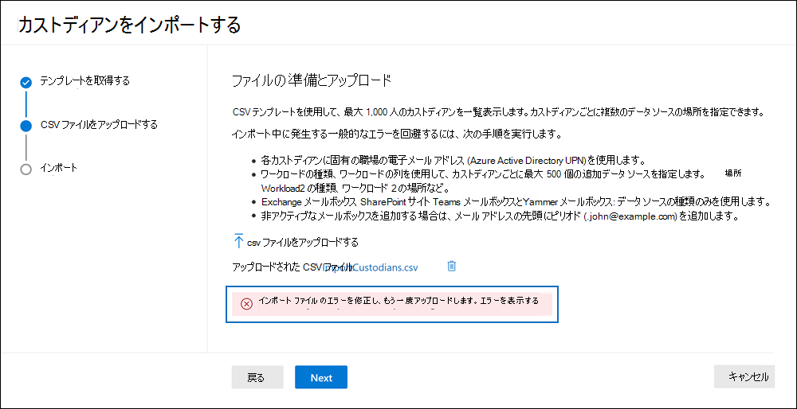

# 電子情報開示 (プレミアム) ケースにカストディアンをインポートする

[!include[Purview banner](../includes/purview-rebrand-banner.md)]

多くのカストディアンを含む Microsoft Purview 電子情報開示 (プレミアム) ケースの場合は、ケースに追加するために必要な情報を含む CSV ファイルを使用して、複数のカストディアンを一度にインポートできます。 インポート カストディアン ツールでは、インポート ジョブが作成される前に CSV ファイルも検証されます。 つまり、インポート ジョブが完了するまで待たなくても、カストディアンがケースに追加されないようにするエラーがあることを学習する前に、CSV ファイル内のエラーを修正できます。

## カストディアンをインポートする前に

- CSV ファイルあたり最大 1,000 個のカストディアン (行) をインポートできます。

- 各カストディアンに最大 500 個のデータ ソースを関連付けることができます。  

- 組織のAzure Active Directoryの一部であるカストディアンのみをインポートできます。

- 各カストディアンには一意の電子メール アドレスが必要です。

- 非アクティブなメールボックスをカストディアンとしてインポートしたり、非アクティブなメールボックスを別の管理者に関連付けるには、非アクティブなメールボックスの電子メール アドレス (.sarad@contoso.onmmicrosoft.com など) に "." プレフィックスを追加します。

## カストディアンをインポートする

1. 電子情報開示 (プレミアム) ケースを開き、[**データ ソース**] タブを選択します。

2. [ **データ ソース** > **の追加]Import カストディアンを** クリックします。

3. **[テンプレートの取得**] ウィザード ページで、[**CSV テンプレートのダウンロード**] をクリックして、カストディアン テンプレートの CSV ファイルをダウンロードします。

   ![[Import custodians]\(カストディアンのインポート\) ポップアップ ページから CSV テンプレートをダウンロードします。](../media/ImportCustodians1.png)

4. 保管情報を CSV ファイルに追加し、ローカル コンピューターに保存します。 CSV ファイルで必要なプロパティの詳細については、「 [カストディアン CSV ファイル](#custodian-csv-file) 」セクションを参照してください。

5. 保管担当者情報を含む CSV ファイルを準備したら、[ **データ ソース** ] タブに戻り、[ **データ ソース** > **の追加] を** 再度クリックします。

6. **アップロード CSV ファイル** ウィザード ページ **で、csv ファイルアップロード** クリックし、保管担当者情報を含む CSV ファイルをアップロードします。

   CSV ファイルをアップロードすると、インポート ウィザードによって CSV ファイルが検証されます。 検証エラーが存在する場合は、エラーを表示するためのリンクを含むエラー バナーがウィザードに表示されます。

   

   エラー情報は、エラーを含むセルの行と列を識別し、修復アクションを提案します。 検証エラーを修正し、固定 CSV ファイルを再アップロードする必要があります。 インポートカストディアン ジョブを作成する前に、CSV ファイルを正常に検証する必要があります。

7. CSV ファイルが正常に検証されたら、[ **次へ** ] をクリックし、[ **インポート** ] をクリックしてインポート ジョブを開始します。

インポート ジョブを開始すると、電子情報開示 (プレミアム) によって次の処理が実行されます。

- ケースの [ジョブ] タブに **BulkAddCustodian** という名前の **ジョブ** を作成します。

- 各カストディアンのすべてのデータ ソースの高度なインデックス作成を実行します。

- すべてのカストディアン データ ソースを保留にします (CSV ファイルの **Is OnHold** プロパティが TRUE に設定されている場合)

インポートカストディアン ジョブが完了すると、カストディアンとその関連データ ソースがケースの **[データ ソース]** ページに追加されます。

## カストディアン CSV ファイル

CSV カストディアン テンプレートをダウンロードしたら、各行にカストディアンとそのデータ ソースを追加できます。 ヘッダー行の列名は変更しないでください。 ワークロードの種類とワークロードの場所の列を使用して、他のデータ ソースをカストディアンに関連付けます。

| 列名|説明|
|:------- |:------------------------------------------------------------|
|**カストディアン contactEmail**     |カストディアンの UPN 電子メール アドレス。 たとえば、sarad@contoso.onmicrosoft.com。           |
|**Exchange有効** | 保管担当者のメールボックスを含めるか含まない場合は TRUE/FALSE 値。      |
|**OneDrive有効** | 保管担当者のOneDrive for Businessアカウントを含めるか含まない場合は TRUE/FALSE 値。 |
|**Is OnHold**        | 保管担当者データ ソースを保留にするかどうかを示す TRUE/FALSE 値。 1     |
|**Workload1 の種類**         |カストディアンに関連付けるデータ ソースの種類を示す文字列値。 次の値を指定できます。  - ExchangeMailbox  - SharePointSite - TeamsMailbox2 - YammerMailbox2。 これらのワークロードの種類の前の値では、大文字と小文字が区別されます。 CSV ファイルには、3 つのワークロードの種類とその対応するワークロードの場所の列が含まれています。 合計で 500 個のワークロードの種類と場所を追加できます。|
|**Workload1 の場所**     | ワークロードの種類に応じて、これはデータ ソースの場所になります。 たとえば、Exchange メールボックスの電子メール アドレスや、SharePoint サイトの URL などです。 |
|||

> [!NOTE]
> 1 ケースで 1,000 を超えるメールボックスまたは 100 個のサイトを保留にすると、必要に応じて電子情報開示ホールドが自動的にスケーリングされます。 つまり、1 つのポリシーにデータを追加する代わりに、データの場所が複数の保留ポリシーに自動的に追加されます。 ただし、1 組織あたり 10,000 件のケース ホールド ポリシーの制限は引き続き適用されます。 ホールド制限の詳細については、「[電子情報開示の制限 (プレミアム)」](limits-ediscovery20.md#hold-limits)を参照してください。
 
> 2 TEAMSMailbox と YammerMailbox ワークロードを CSV ファイルに含めると、グループ サイト (TeamSite と YammerSite) が既定で自動的に追加されます。 CSV ファイルで TeamsSite と YammerSite を個別に指定する必要はありません。

カストディアン情報を含む CSV ファイルの例を次に示します。  

|カストディアン contactEmail      | Exchange有効 | OneDrive有効 | Is OnHold | Workload1 の種類 | Workload1 の場所             |
| ----------------- | ---------------- | ---------------- | --------- | -------------- | ------------------------------ |
|robinc@contoso.onmicrosoft.com | TRUE             | TRUE             | TRUE      | SharePointSite | https://contoso.sharepoint.com |
|pillarp@contoso.onmicrosoft.com | TRUE             | TRUE             | TRUE      | |  |
|.johnj@contoso.onmicrosoft.com|TRUE|TRUE|TRUE||
|sarad@contoso.onmicrosoft.com|TRUE|TRUE|TRUE|ExchangeMailbox|.saradavis@contoso.onmicrosoft.com
||||||

> [!NOTE]
> 前述のように、非アクティブなメールボックスをカストディアンとしてインポートしたり、非アクティブなメールボックスを別のカストディアンに関連付けるために、非アクティブなメールボックスの UPN アドレスに "." プレフィックスを追加します。
