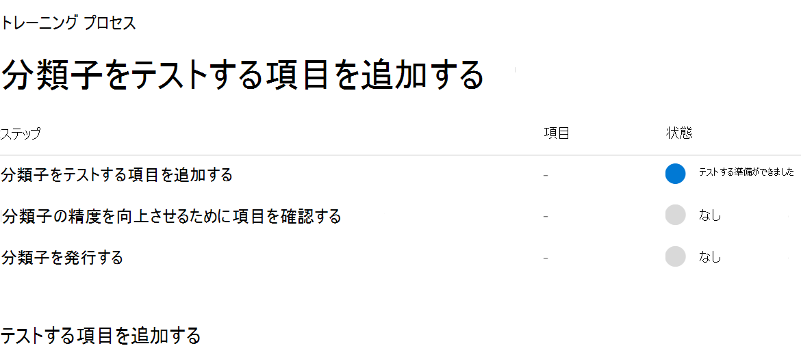

# トレーニング可能な分類子の使用を開始する

トレーニングMicrosoft 365分類子は、さまざまな種類のコンテンツを認識するトレーニングツールです。 トレーニングが完了したら、このラベルを使用して、Office、通信コンプライアンス ポリシー、および保持ラベル ポリシーを適用するためのアイテムを識別できます。

カスタムトレーニング可能な分類子を作成するには、まず、人間が選んだサンプルを与え、カテゴリに正の一致を与える必要があります。 次に、これらのサンプルを処理した後、正のサンプルと負のサンプルを組み合わせ、分類子が予測する能力をテストします。 この記事では、カスタム分類子を作成してトレーニングする方法と、再トレーニングを通じてカスタムトレーニング可能な分類子と事前トレーニング済みの分類子のパフォーマンスを向上させる方法について説明します。

分類子の種類の詳細については、「トレーニング可能な分類子について」 [を参照してください](classifier-learn-about.md)。

トレーニング可能な分類子の作成の概要については、このビデオをご覧ください。 詳細を取得するには、この記事の全文を読む必要があります。

 

> [!VIDEO https://www.microsoft.com/videoplayer/embed/RWyGL7]

## 前提条件

### ライセンスの要件

分類子は、Microsoft 365 E5 E5 コンプライアンス機能です。 それらを使用するには、これらのサブスクリプションのいずれかが必要です。

### アクセス許可

UI で分類子にアクセスするには、次の操作を行います。 

- グローバル管理者は、カスタム分類子を作成するためにテナントをオプトインする必要があります。
- 分類子をトレーニングするには、コンプライアンス管理者の役割が必要です。

次のシナリオで分類子を使用するには、次のアクセス許可を持つアカウントが必要です。

- アイテム保持ラベル ポリシーのシナリオ: レコード管理と保持管理の役割 
- 感度ラベル ポリシーのシナリオ: セキュリティ管理者、コンプライアンス管理者、コンプライアンス データ管理者
- コミュニケーション コンプライアンス ポリシーのシナリオ: Insider Risk Management Admin、Supervisory Review Administrator 

> [!IMPORTANT]
> 既定では、カスタム分類子を作成するユーザーだけが、その分類子によって行われた予測をトレーニングおよび確認できます。

## カスタムトレーニング可能な分類子の準備 

カスタムトレーニング可能な分類子を作成する際に何が関係しているのかを理解した上で、飛び込む前に役立ちます。 

### タイムライン

このタイムラインは、トレーニング可能な分類子の展開例を反映しています。

> [!TIP]
> トレーニング可能な分類子には、オプトインが初めて必要です。 組織のコンテンツのベースラインMicrosoft 365評価を完了するには、12 日かかります。 オプトイン プロセスを開始するには、グローバル管理者に問い合わせてください。

### 全体的なワークフロー

カスタムトレーニング可能な分類子を作成する全体的なワークフローの詳細については、「顧客のトレーニング可能な分類子を作成するためのプロセス フロー」 [を参照してください](classifier-learn-about.md#process-flow-for-creating-custom-classifiers)。

### シード コンテンツ

トレーニング可能な分類子が、特定のカテゴリのコンテンツとしてアイテムを独立して正確に識別するには、まず、カテゴリ内のコンテンツの種類の多くのサンプルを示す必要があります。 トレーニング可能な分類子へのサンプルのこの供給は、シード処理と *呼ばれる。* シード コンテンツは人間によって選択され、コンテンツのカテゴリを表すと判断されます。

> [!TIP]
> 50 以上の正のサンプルと最大 500 のサンプルが必要です。 トレーニング可能な分類子は、最新に作成された 500 のサンプル (ファイル作成日時スタンプ) まで処理されます。 提供するサンプルが多い場合、分類子が行う予測の精度が高い。

### コンテンツのテスト

トレーニング可能な分類子が予測モデルを構築するのに十分な正のサンプルを処理したら、分類子がカテゴリと一致しないアイテムを正しく区別できるのか、予測をテストする必要があります。 これを行うには、カテゴリに分類する必要があるサンプルと、選択しないサンプルで構成される、人間が選んだ別のより大きなコンテンツのセットを選択します。 最初に指定した初期シード データとは異なるデータでテストする必要があります。 それを処理したら、手動で結果を確認し、各予測が正しいか、正しくないか、または確信が持てないかを確認します。 トレーニング可能な分類子は、このフィードバックを使用して予測モデルを改善します。

> [!TIP]
> 最適な結果を得る場合は、テスト サンプル セット内に少なくとも 200 のアイテムを含め、正と負の一致の分布を示します。

## トレーニング可能な分類子を作成する方法

1. 50 ~ 500 のシード コンテンツ アイテムを収集します。 これらは、トレーニング可能な分類子が分類カテゴリにあると正に識別するコンテンツの種類を強く表すサンプルに限る必要があります。 サポートされている[ファイルの種類については](/sharepoint/technical-reference/default-crawled-file-name-extensions-and-parsed-file-types)、「既定のクロールされたファイル名の拡張子と解析されたファイルSharePointサーバー」を参照してください。

   > [!IMPORTANT]
   > シード セット内のアイテムがカテゴリの強力 **な** 例である必要があります。 トレーニング可能な分類子は、最初に、シード処理に基づいてモデルを構築します。 分類子は、すべてのシード サンプルが強い陽性であり、サンプルがカテゴリに対して弱い一致か負の一致かを知る方法はありません。

2. シード コンテンツのみを保持SharePointオンライン フォルダーにシード *コンテンツを配置します*。 サイト、ライブラリ、およびフォルダーの URL をメモします。

   > [!TIP]
   > シード データ用に新しいサイトとフォルダーを作成する場合は、そのシード データを使用するトレーニング可能な分類子を作成する前に、その場所のインデックス作成に少なくとも 1 時間を許可します。

3. コンプライアンス管理者またはセキュリティ管理者Microsoft 365 コンプライアンス センターアクセス権を持つユーザーにサインインし、セキュリティ センター <a href="https://go.microsoft.com/fwlink/p/?linkid=2077149" target="_blank">の</a>データMicrosoft 365 コンプライアンス センターまたはMicrosoft 365 <a href="https://go.microsoft.com/fwlink/p/?linkid=2077139" target="_blank">を</a>  >  **開きます**。

4. [トレーニング **可能な分類子] タブを選択** します。

5. [トレーニング **可能な分類子の作成] を選択します**。

6. このトレーニング可能な分類子で識別するアイテムのカテゴリのフィールドと、適切な値 `Name` `Description` を入力します。

7. 手順 2 SharePointシード コンテンツ サイトのオンライン サイト、ライブラリ、およびフォルダーの URL を選択します。 を選択します `Add` 。

8. 設定を確認し、[] を選択します `Create trainable classifier` 。

9. トレーニング可能な分類子は、24 時間以内にシード データを処理し、予測モデルを構築します。 分類子の状態は、 `In progress` シード データの処理中です。 分類子がシード データの処理を終了すると、状態は に変わります `Need test items` 。

10. 分類子を選択して詳細ページを表示できます。

    > [!div class="mx-imgBorder"]
    > 

11. 最適な結果を得る場合は、少なくとも 200 のテスト コンテンツ アイテム (最大 10,000) を収集します。 これらは、強い肯定的なアイテム、強い否定的なアイテム、およびそれらの性質で少し明白ではないアイテムの組み合わせである必要があります。 サポートされている[ファイルの種類については](/sharepoint/technical-reference/default-crawled-file-name-extensions-and-parsed-file-types)、「既定のクロールされたファイル名の拡張子と解析されたファイルSharePointサーバー」を参照してください。

12. テスト コンテンツのみを保持する専用SharePointオンライン フォルダーにテスト *コンテンツを配置します*。 オンライン サイト、ライブラリ、SharePoint URL に注意してください。

    > [!TIP]
    > テスト データ用に新しいサイトとフォルダーを作成する場合は、そのシード データを使用するトレーニング可能な分類子を作成する前に、その場所のインデックス作成に少なくとも 1 時間を許可します。

13. を選択します `Add items to test` 。

14. 手順 12 SharePointテスト コンテンツ サイトのオンライン サイト、ライブラリ、およびフォルダーの URL を選択します。 を選択します `Add` 。

15. を選択してウィザードを終了します `Done` 。 トレーニング可能な分類子は、テスト ファイルの処理に最大で 1 時間かかっています。

16. トレーニング可能な分類子がテスト ファイルの処理を完了すると、詳細ページの状態がに変わります `Ready to review` 。 テスト サンプルのサイズを大きくする必要がある場合は、トレーニング可能な分類子が追加のアイテムを処理するを `Add items to test` 選択して許可します。

    > [!div class="mx-imgBorder"]
    > 

17. タブを `Tested items to review` 選択してアイテムを確認します。

18. Microsoft 365一度に 30 アイテムが表示されます。 それらを確認し、ボックス `We predict this item is "Relevant". Do you agree?` でどちらかまたは `Yes` を `No` 選択します `Not sure, skip to next item` 。 モデルの精度は、30 アイテムごとに自動的に更新されます。

    > [!div class="mx-imgBorder"]
    > ![[アイテムの確認] ボックスをクリックします。](../media/classifier-trainable-review-detail.png)

19. 少 *なくとも* 200 アイテムを確認します。 精度スコアが安定すると **、発行オプション** が使用可能になり、分類子の状態が表示されます `Ready to use` 。

    > [!div class="mx-imgBorder"]
    > 

20. 分類子を発行します。

21. 公開された分類子は[、Office](apply-sensitivity-label-automatically.md)自動ラベル付けと感度ラベル付き条件として使用できます。条件に基づいて保持ラベル ポリシーを自動適用し、通信コンプライアンスで保持ラベル ポリシーを自動的に適用[します](communication-compliance.md)。
