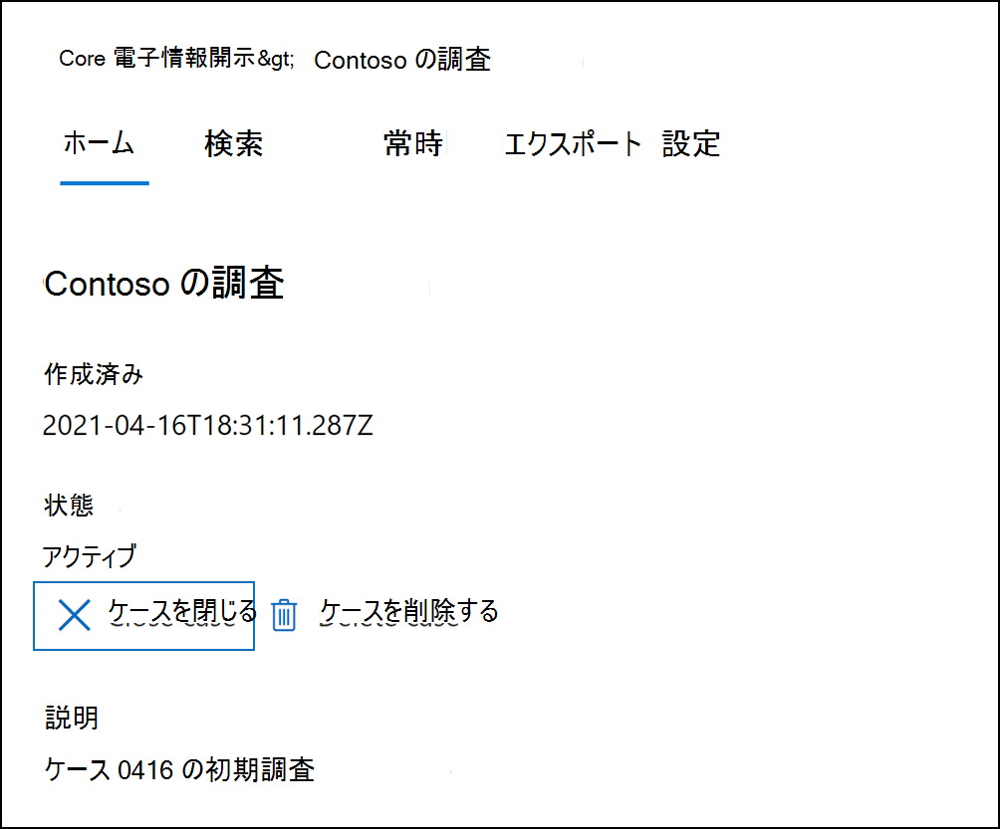
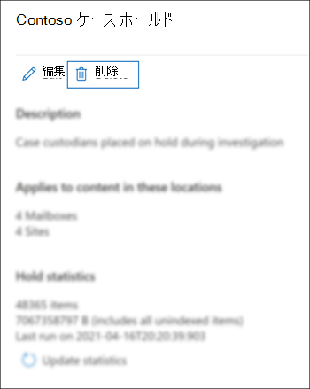

# 電子情報開示 (Standard) ケースを閉じる、再度開く、削除する

[!include[Purview banner](../includes/purview-rebrand-banner.md)]

この記事では、Microsoft 365の Microsoft Purview 電子情報開示 (Standard) ケースを閉じ、再度開き、削除する方法について説明します。

## ケースを閉じる

電子情報開示 (Standard) ケースでサポートされている訴訟または調査が完了したら、ケースを終了できます。 ケースを閉じた場合の動作は次のとおりです。
  
- ケースに電子情報開示保留が含まれている場合は、無効になります。 保留がオフになった後、保留されていたコンテンツの場所に 30 日間の猶予期間 ( *遅延ホールド* と呼ばれます) が適用されます。 これにより、コンテンツがすぐに削除されるのを防ぐのに役立ち、遅延保留期間の有効期限が切れた後に完全に削除される前に、コンテンツを検索して復元する機会を管理者に提供します。 詳細については、「 [電子情報開示ホールドからのコンテンツの場所の削除](create-ediscovery-holds.md#removing-content-locations-from-an-ediscovery-hold)」を参照してください。

- ケースを閉じると、そのケースに関連付けられている保留だけが無効になります。 他の保留がコンテンツの場所 (訴訟ホールド、アイテム保持ポリシー、別の電子情報開示 (Standard) ケースからの保留など) に配置されている場合、それらの保留は引き続き保持されます。

- このケースは、Microsoft Purview コンプライアンス ポータルの電子情報開示 (Standard) ページに引き続き一覧表示されます。 詳細、保有、検索、閉じたケースのメンバーは保持されます。

- ケースは、閉じた後に編集できます。 たとえば、メンバーを追加または削除したり、検索を作成したり、検索結果をエクスポートしたりできます。 アクティブケースとクローズケースの主な違いは、ケースが閉じられるときに電子情報開示ホールドがオフになる点です。

ケースを閉じるには、次のようにします。
  
1. コンプライアンス ポータルで **[電子情報開示** > **コア** ] をクリックして、組織内の電子情報開示 (Standard) ケースの一覧を表示します。

2. 閉じるケースの名前をクリックします。

   

3. ホーム ページの [ **状態]** で、[ **ケースを閉じる**] をクリックします。

    ケースに関連付けられた保留が無効になることを示す警告が表示されます。

4. [**はい**] をクリックしてケースを閉じます。

    ケースのホーム ページの状態は、[ **アクティブ]** から **[終了**] に変更されます。

5. **[電子情報開示 (Standard)]** ページで、[**更新**] をクリックして、クローズケースの状態を更新します。 閉じられるには最大で 60 分かかります。

    プロセスが完了すると、ケースの状態が **電子情報開示 (Standard)** ページで終了に変更 **されます**。

## 閉じたケースを再度開く

ケースを再度開くと、ケースが閉じられたときに配置されていた電子情報開示が保持された場合、自動的には復元されません。 ケースを再度開いた後は、[ **保留]** ページに移動し、前の保留を有効にする必要があります。 保留を有効にするには、選択してポップアップ ページを表示し、[**状態**] を[**On**] に切り替えます。
  
1. コンプライアンス ポータルで **[電子情報開示** > **コア** ] をクリックして、組織内の電子情報開示 (Standard) ケースの一覧を表示します。

2. 再度開くケースの名前をクリックします。

   

3. ホーム ページの [ **状態**] で、[ **ケースの再び開く**] をクリックします。

    ケースを閉じたときに関連付けられていた保留は自動的に有効にならないことを示す警告が表示されます。

4. [**はい**] をクリックしてケースを再度開きます。

    ケース ホーム ページのポップアップ ページの状態が **[終了]** から **[アクティブ]** に変更されます。

5. **[電子情報開示 (Standard)]** ページで、[**更新**] をクリックして、再び開いたケースの状態を更新します。 再び開くプロセスが完了するまでに最大で 60 分かかる場合があります。 

    プロセスが完了すると、**電子情報開示 (Standard)** ページでケースの状態が **[アクティブ]** に変更されます。

6. (省略可能)再度開いたケースに関連付けられている保留を有効にするには、[ **保留]** タブに移動し、保留を選択し、保留ポップアップ ページの **[状態]** の下にあるチェック ボックスをオンにします。
  
## ケースの削除

アクティブな電子情報開示 (Standard) ケースを削除することもできます。 ケースを削除すると、ケース内のすべての検索とエクスポートが削除され、ケースはコンプライアンス ポータルの **電子情報開示 (Standard)** ページのケースの一覧から削除されます。 削除されたケースを再度開くはできません。

ケースを削除する前に (アクティブかクローズかに関係なく) ケースに関連付けられている *すべての* 電子情報開示ホールドを削除する必要があります。 これには、 **状態が [オフ]** の保留の削除が含まれます。 

電子情報開示ホールドを削除するには:

1. 削除する場合は、[ **保留** ] タブに移動します。

2. 削除する保留リストを選択します。

3. ポップアップ ページで、[削除] をクリック **します**。

      

ケースを削除する方法は、次のとおりです。

1. コンプライアンス ポータルで **[電子情報開示** > **コア** ] をクリックして、組織内の電子情報開示 (Standard) ケースの一覧を表示します。

2. 削除するケースの名前をクリックします。

3. ケースのホーム ページの **[状態**] で、[ **ケースの削除**] をクリックします。

      

削除しようとしているケースに電子情報開示が保持されている場合は、エラー メッセージが表示されます。 ケースに関連付けられているすべての保留を削除してから、ケースを削除し直す必要があります。
