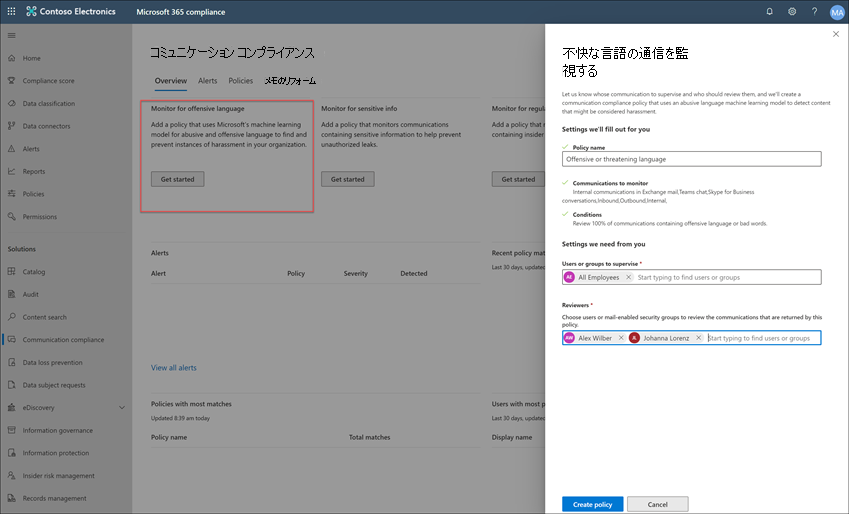

# ケース スタディ - Contoso は、Microsoft Teams、Exchange、Yammer 通信に不適切なテキスト ポリシーをすばやく構成します

[!include[Purview banner](../includes/purview-rebrand-banner.md)]

Microsoft Purview Communication Compliance は、組織内の不適切なテキストを含むメッセージを検出、キャプチャ、および操作できるようにすることで、コミュニケーション リスクを最小限に抑えるのに役立ちます。 不適切なテキストには、不適切な表現、脅威、嫌がらせ、不適切な画像が含まれる場合があります。 事前に定義されたカスタムポリシーを使用すると、指定されたレビュー担当者が調査できるように、ポリシーの一致の確認のために内部および外部の通信をスキャンできます。 校閲者は、組織内でスキャンされた電子メール、Microsoft Teams、Yammer、またはサードパーティの通信を調査し、適切な修復アクションを実行して、組織のメッセージ標準に準拠していることを確認できます。

Contoso Corporation は架空の組織であり、不適切なテキストを監視するポリシーをすばやく構成する必要があります。 主にユーザーのメール、Microsoft Teams、Yammer サポートに Microsoft 365 を使用していますが、職場での嫌がらせに関する会社のポリシーを適用するための新しい要件があります。 Contoso IT 管理者とコンプライアンス スペシャリストは、Microsoft 365 を使用する基礎を基本的に理解しており、コミュニケーション コンプライアンスを迅速に開始する方法に関するエンドツーエンドのガイダンスを探しています。

このケース スタディでは、不適切なテキストの通信を監視するための通信コンプライアンス ポリシーをすばやく構成するための基本について説明します。 このガイダンスは次のとおりです。

- 手順 1 : 通信コンプライアンスの計画
- 手順 2 - 通信コンプライアンスにアクセスする
- 手順 3 : 前提条件の構成および通信コンプライアンスポリシーの作成
- 手順 4 : 警告の調査および修復

## 手順 1: 通信コンプライアンスの計画

Contoso IT 管理者とコンプライアンス スペシャリストは、Microsoft 365 のコンプライアンス ソリューションに関するオンライン ウェビナーに参加し、コミュニケーション コンプライアンス ポリシーが職場の嫌がらせを減らすための更新された企業ポリシー要件を満たすのに役立つと判断しました。 共同で、不適切なメッセージを検出する通信コンプライアンス ポリシーを作成して有効にする計画を策定しました。 この構成には、Microsoft Teams で送信されたチャットのテキストの検出、Yammer でのプライベート メッセージとコミュニティの会話、および Exchange Online で送信された電子メール メッセージが含まれます。 計画には次のものが含まれます:

- 通信コンプライアンス機能にアクセスする必要がある IT 管理者。
- コミュニケーション ポリシーを作成および管理する必要があるコンプライアンス スペシャリスト。
- コミュニケーション コンプライアンス アラートを調査して修復する必要がある、他の部門 (人事、法務など) のコンプライアンス スペシャリストとその他の同僚。
- 通信コンプライアンスの不適切なテキスト ポリシーの対象となるユーザー。

### ライセンス

最初の手順は、Contoso の Microsoft 365 ライセンスに、通信コンプライアンス ソリューションのサポートが含まれていることを確認することです。 通信コンプライアンスにアクセスして使用するには、Contoso IT 管理者は Contoso に次のいずれかが含まれているか確認する必要があります。

- Microsoft 365 E5/A5/F5/G5 サブスクリプション (有料または試用版)
- Microsoft 365 E3/A3/F3/G5 サブスクリプション + Microsoft 365 E5/A5/F5/G5 コンプライアンス アドオン
- Microsoft 365 E3/A3/F3/G5 サブスクリプション + Microsoft 365 E5/A5/F5/G5 Insider Risk Management アドオン
- Office 365 Enterprise E5 サブスクリプション (有料または試用版)
- Office 365 A5 サブスクリプション (有料または試用版)
- Office 365 Enterprise E3 サブスクリプション + Office 365 Advanced Compliance アドオン (新しいサブスクリプションでは使用できなくなりました。注を参照)

コミュニケーション コンプライアンス ポリシーに含まれるユーザーには、上記のいずれかのライセンスを割り当てる必要があります。 サブスクリプションとライセンスの詳細については、 [セキュリティ&コンプライアンスに関する Microsoft 365 のガイダンスを](/office365/servicedescriptions/microsoft-365-service-descriptions/microsoft-365-tenantlevel-services-licensing-guidance/microsoft-365-security-compliance-licensing-guidance#communication-compliance)参照してください。

> [!IMPORTANT]
> Office 365 Advanced Compliance はスタンドアロン サブスクリプションとして販売されなくなりました。 現在のサブスクリプションの有効期限が切れると、お客様は、同じまたは追加のコンプライアンス機能を含む上記のいずれかのサブスクリプションに移行する必要があります。

Contoso IT 管理者は、次の手順に従って、Contoso のライセンス サポートを確認します。

1. IT 管理者は Microsoft 365 管理センター<https://admin.microsoft.com>にサインインし、**課金** > ライセンス> Microsoft 365 管理センターに移動 <a href="https://go.microsoft.com/fwlink/p/?linkid=842264" target="_blank">**します**</a>。

2. ここでは、通信コンプライアンスのサポートを含む [ライセンス オプション](communication-compliance-configure.md#subscriptions-and-licensing) の 1 つがあることを確認します。

### 通信コンプライアンスのアクセス許可

コミュニケーション コンプライアンス機能を管理するためのアクセス許可を構成するために 5 つのロール グループが使用されます。 Microsoft Purview コンプライアンス ポータルのメニュー オプションとして **コミュニケーション コンプライアンス** を利用できるようにし、これらの構成手順を続行するために、Contoso 管理者には *コミュニケーション コンプライアンス管理者* ロールが割り当てられます。

Contoso は *、コミュニケーション コンプライアンス* ロール グループを使用して、すべてのコミュニケーション コンプライアンス管理者、アナリスト、調査担当者、および閲覧者をグループに割り当てることにしました。 この役割グループの構成により、Contoso は簡単に作業を開始でき、コンプライアンス管理の要件に最も適しています。

|**役割**|**ロール権限**|
|:-----|:-----|
| **コミュニケーション コンプライアンス** | このロール グループを使用して、1 つのグループ内の組織のコミュニケーション コンプライアンスを管理します。 指定された管理者、アナリスト、調査担当者、閲覧者のすべてのユーザー アカウントを追加することで、コミュニケーション コンプライアンスのアクセス許可を 1 つのグループに構成できます。 このロール グループには、すべてのコミュニケーション コンプライアンスのアクセス許可ロールが含まれます。 この役割グループの構成は、通信コンプライアンスを迅速に開始する最も簡単な方法であり、個別のユーザー グループに対して個別のアクセス許可を定義する必要がない組織に適しています。 |
| **コミュニケーション コンプライアンス管理者** | このロール グループを使用して、最初にコミュニケーション コンプラいアナスを構成し、後でコミュニケーション コンプライアンス管理者を定義されたグループに分離します。 このロール グループに割り当てられたユーザーは、コミュニケーション コンプライアンス ポリシー、グローバル設定、およびロール グループの割り当てを作成、読み取り、更新、および削除できます。 この役割グループに割り当てられたユーザーは、メッセージ アラートを表示できません。 |
| **コミュニケーション コンプライアンス アナリスト** | このグループを使用して、コミュニケーション コンプライアンス アナリストとして機能するユーザーにアクセス許可を割り当てます。 この役割グループに割り当てられているユーザーは、レビュー担当者として割り当てられているポリシーを表示したり、メッセージ メタデータ (メッセージ コンテンツではなく) を表示したり、追加の校閲者にエスカレーションしたり、ユーザーに通知を送信したりできます。 アナリストは保留中のアラートを解決できません。 |
| **コミュニケーション コンプライアンス調査担当者** | このグループを使用して、コミュニケーション コンプライアンス調査担当者として機能するユーザーにアクセス許可を割り当てます。 この役割グループに割り当てられているユーザーは、メッセージ のメタデータとコンテンツを表示し、追加のレビュー担当者にエスカレーションし、電子情報開示 (Premium) ケースにエスカレートし、ユーザーに通知を送信し、アラートを解決できます。 |
| **コミュニケーション コンプライアンス閲覧者** | このグループを使用して、コミュニケーション レポートを管理するユーザーにアクセス許可を割り当てます。 このロール グループに割り当てられたユーザーは、コミュニケーション コンプライアンス ホーム ページのすべてのレポート ウィジェットにアクセスでき、すべてのコミュニケーション コンプライアンス レポートを表示できます。 |

1. Contoso IT 管理者は、グローバル管理者アカウントの資格情報を使用して [Microsoft Purview コンプライアンス ポータル](https://compliance.microsoft.com/permissions) のアクセス許可ページにサインインし、リンクを選択して Microsoft 365 のロールを表示および管理します。
2. Microsoft Purview コンプライアンス ポータルで、 <a href="https://go.microsoft.com/fwlink/p/?linkid=2173597" target="_blank">**アクセス許可**</a> に移動し、Office 365 のロールを表示および管理するリンクを選択します。
3. 管理者は *[コミュニケーション コンプライアンス]* 役割グループを選択し、[ **役割グループの編集]** を選択します。
4. 管理者は、左側のナビゲーション ウィンドウから **[メンバーの選択** ] を選択し、[編集] を選択 **します**。
5. [ **追加]** を選択し、通信コンプライアンスを管理し、アラートを調査して確認するすべての Contoso ユーザーのチェック ボックスをオンにします。
6. 管理者が **[追加]** を選択し、[完了] を選択 **します**。
7. [ **保存] を** 選択して、Contoso ユーザーを役割グループに追加します。 **[閉じる**] を選択して手順を完了します。

## 手順 2: 通信コンプライアンスにアクセスする

通信コンプライアンスのアクセス許可を構成した後、コミュニケーション コンプライアンス ロール グループに割り当てられた Contoso IT 管理者とコンプライアンス スペシャリストは、Microsoft Purview の通信コンプライアンス ソリューションにアクセスできます。 Contoso IT 管理者とコンプライアンス スペシャリストには、通信コンプライアンスにアクセスし、新しいポリシーの作成を開始する方法がいくつかあります。

- 通信コンプライアンス ソリューションから直接開始する
- Microsoft Purview コンプライアンス ポータルから開始する
- Microsoft Purview ソリューション カタログから開始する
- Microsoft 365 管理センターから開始する

### 通信コンプライアンス ソリューションから直接開始する

ソリューションにアクセスする最も簡単な方法は、 **Communication コンプライアンス** (<https://compliance.microsoft.com/supervisoryreview>) ソリューションに直接サインインすることです。 このリンクを使用すると、Contoso IT 管理者とコンプライアンス スペシャリストがコミュニケーション コンプライアンスの概要ダッシュボードに移動し、アラートの状態をすばやく確認し、定義済みのテンプレートから新しいポリシーを作成できます。

### Microsoft Purview コンプライアンス ポータルから開始する

Contoso IT 管理者とコンプライアンス スペシャリストが通信コンプライアンス ソリューションにアクセスするもう 1 つの簡単な方法は、 [Microsoft Purview コンプライアンス ポータル](https://compliance.microsoft.com)に直接サインインすることです。 サインイン後にすべてのコンプライアンス ソリューションを表示し、開始するには、**すべてを表示** を選択して、**通信コンプライアンス** ソリューションを選択すれば開始します。

### Microsoft Purview ソリューション カタログから開始する

Contoso IT 管理者とコンプライアンス スペシャリストは、Microsoft Purview ソリューション カタログを選択して、通信コンプライアンス ソリューションにアクセスすることもできます。 **Microsoft Purview コンプライアンス ポータル** で左側のナビゲーションの [**ソリューション**] セクションで **[カタログ**] を選択すると、すべての Microsoft Purview ソリューションを一覧表示するソリューション カタログを開くことができます。 **[Insider risk management**] セクションまでスクロールダウンすると、Contoso IT 管理者は [コミュニケーション コンプライアンス] を選択して作業を開始できます。 Contoso IT 管理者は、ナビゲーション コントロールで表示を使用して、今後サインインするときにすばやくアクセスできるように、コミュニケーション コンプライアンス ソリューションを左側のナビゲーション ウィンドウにピン留めすることにもしました。

### Microsoft 365 管理センターから開始する

Microsoft 365 管理センターから開始するときに通信コンプライアンスにアクセスするには、Contoso IT 管理者とコンプライアンス スペシャリストが Microsoft 365 管理センターにサインインします [(https://admin.microsoft.com)](https://admin.microsoft.com)[Microsoft Purview コンプライアンス ポータル](https://compliance.microsoft.com)に移動します)

この操作により **、Office 365 のセキュリティとコンプライアンス センター** が開き、ページ上部のバナーに表示されている **Microsoft Purview コンプライアンス ポータル** へのリンクを選択する必要があります。

**Microsoft Purview コンプライアンス ポータル** で Contoso IT 管理者が **[すべて表示**] を選択すると、コンプライアンス ソリューションの完全な一覧が表示されます。

![[通信コンプライアンス] メニュー。](../media/communication-compliance-case-show-all.png)

**[すべて表示]** を選択すると、Contoso IT 管理者は通信コンプライアンス ソリューションにアクセスできます。

## 手順 3: 前提条件を構成し、通信コンプライアンス ポリシーを作成する

通信コンプライアンス ポリシーを開始するには、Contoso IT 管理者が不適切なテキストを監視する新しいポリシーを設定する前に構成する必要がある前提条件がいくつかあります。 これらの前提条件の完了後、Contoso IT 管理者およびコンプライアンス スペシャリストが新しいポリシーを構成し、コンプライアンス スペシャリストは調査を開始して、生成された警告を修復することができます。

### Microsoft 365 での監査の有効化

通信コンプライアンスには、警告を表示し、レビュー担当者が行った修復処置を追跡するための監査ログが必要です。 監査ログは、定義済みの組織ポリシーに関連付けられているすべてのアクティビティの概要です。また、通信コンプライアンス ポリシーに変更が加わるときはいつでも実行されます。

Contoso IT 管理者は、[詳しい手順](turn-audit-log-search-on-or-off.md) を確認して完了し、監査を有効にします。 監査を有効にすると、監査ログの準備中で、準備が完了してから数時間で検索を実行できるというメッセージが表示されます。 Contoso IT 管理者は、この操作を1回だけ行う必要があります。

### ネイティブ モード用の Yammer テナントの構成

コミュニケーション コンプライアンスでは、組織の Yammer テナントがネイティブ モードになっている必要があります。プライベート メッセージやパブリック コミュニティの会話で不適切なテキストを監視する必要があります。

Contoso IT 管理者は、 [Microsoft 365 の Yammer ネイティブ モードの概要に関する記事の](/yammer/configure-your-yammer-network/overview-native-mode) 情報を確認し、Microsoft 365 用 [Yammer ネットワークのネイティブ モードの構成](/yammer/configure-your-yammer-network/native-mode) に関する記事で移行ツールを実行する手順に従っていることを確認します。

### 範囲内のユーザーグループの設定

Contoso コンプライアンス スペシャリストは、不適切なテキストを監視するコミュニケーション ポリシーにすべてのユーザーを追加したいと考えています。 各ユーザー アカウントを個別にポリシーに追加することもできますが、このポリシーのユーザーに **対して All Users** 配布グループを使用する方がはるかに簡単で、時間を節約できると判断しました。

すべての Contoso ユーザーを含めるために新しいグループを作成する必要があるため、次の手順を実行します。

1. Contoso IT 管理者 IT は、Microsoft 365 管理センターにサインインし [、https://admin.microsoft.com)](https://admin.microsoft.com)Microsoft 365 管理センター> **グループ** >  グループに移動 <a href="https://go.microsoft.com/fwlink/p/?linkid=2052855" target="_blank">**します**</a>。
2. **[グループの追加]** を選択し、ウィザードを完了して新しい *Microsoft 365 グループ* または *配布グループ* を作成します。

    

3. 新しいグループの作成後、Contoso ユーザー全員を新しいグループに追加する必要があります。 **Exchange 管理センター** を開き [、https://outlook.office365.com/ecp)](https://outlook.office365.com/ecp)**Exchange 管理センター** > **の** > 受信者グループに移動 <a href="https://go.microsoft.com/fwlink/?linkid=2183233" target="_blank">**します**</a>。 Contoso IT 管理者は、[メンバーシップ] 領域と自分が作成した新しい *[すべての従業員* ] グループを選択し、[ **編集]** コントロールを選択して、すべての Contoso ユーザーをウィザードの新しいグループに追加します。

    

### 不適切なテキストを監視するポリシーを作成する

すべての前提条件が完了すると、IT 管理者と Contoso のコンプライアンス スペシャリストは、不適切なテキストを監視するように通信コンプライアンス ポリシーを構成する準備が整いました。 新しい不適切なテキスト ポリシー テンプレートを使用して、このポリシーを構成するのは簡単で迅速です。

1. Contoso IT 管理者およびコンプライアンス スペシャリストが **Microsoft Purview コンプライアンス ポータル** にサインインし、左側のナビゲーション ウィンドウから **[コミュニケーション コンプライアンス]** を選択します。 この操作により、通信コンプライアンス ポリシー テンプレートのクイック リンクを含む **概要** ダッシュボードが開きます。 テンプレートの **[開始**] を選択して **、不適切なテキスト** テンプレートの監視を選択します。

    

2. ポリシー テンプレート ウィザードでは、Contoso IT 管理者およびコンプライアンス スペシャリストが協働して、 **ポリシー名**、**ユーザーまたは監督対象のグループ** および **レビュー担当者** の3つの必要なフィールドを完了します。
3. ポリシーウィザードには、既にポリシーの名前が提案されているので、IT 管理者およびコンプライアンス スペシャリストが、提案された名前を保持し、残りのフィールドにフォーカスします。 [**監視するユーザーまたはグループ**] フィールドの *[すべてのユーザー*] グループを選択し、**レビュー担当者** フィールドのポリシー アラートを調査して修復する必要があるコンプライアンス スペシャリストを選択します。 ポリシーを構成し、アラート情報の収集を開始する最後の手順は、[ **ポリシーの作成**] を選択することです。

    

## 手順 4 : 警告の調査および修復

不適切なテキストを監視する通信コンプライアンス ポリシーが構成されたので、Contoso コンプライアンス スペシャリストの次の手順では、ポリシーによって生成されたすべてのアラートを調査して修復します。 ポリシーによって、すべての通信ソース チャネルの通信を完全に処理し、警告が **通知ダッシュボード** に表示されるようになるには、最大で24時間かかります。

アラートが生成されると、Contoso コンプライアンス スペシャリストはワークフローの [指示](communication-compliance-investigate-remediate.md) に従って不適切なテキストの問題を調査し、修復します。
