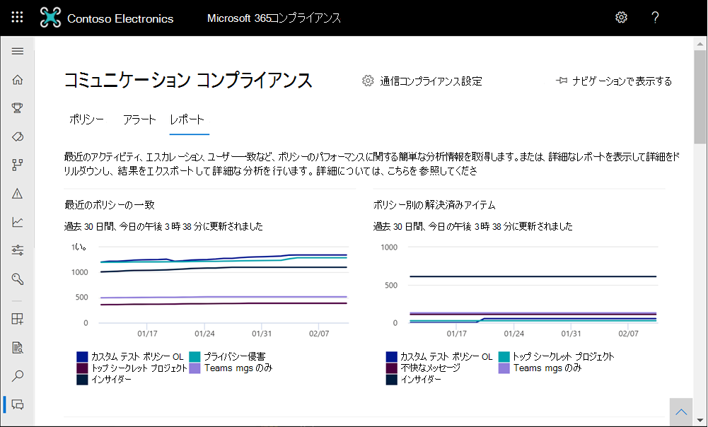
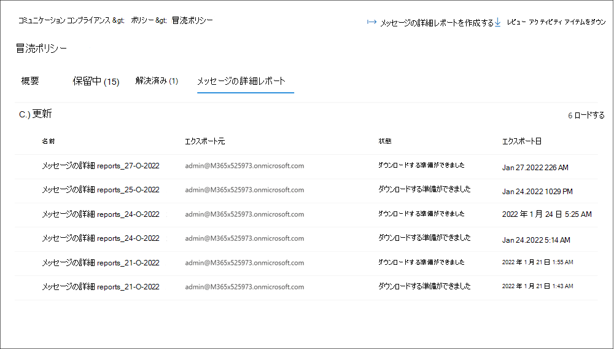

# <a name="use-communication-compliance-reports-and-audits"></a>コミュニケーション コンプライアンス レポートと監査の使用

## <a name="reports"></a>レポート

新しい **レポート ダッシュボード** は、すべての通信コンプライアンス レポートを表示する中心的な場所です。 レポート ウィジェットは、通信コンプライアンス活動の状態を全体的に評価するために最も一般的に必要な分析情報のクイック ビューを提供します。 レポート ウィジェットに含まれる情報はエクスポートできません。 詳細なレポートは、特定の通信コンプライアンス領域に関連する詳細な情報を提供し、レビュー中に情報をフィルター処理、グループ化、並べ替え、およびエクスポートする機能を提供します。 

日付範囲フィルターの場合、イベントの日付と時刻は協定世界時 (UTC) に一覧表示されます。 レポートのメッセージをフィルター処理する場合、要求するユーザーのローカル日付/時刻は、ユーザーのローカル日付/時刻から UTC への変換に基づいて結果を決定します。 たとえば、米国太平洋夏時間 (PDT) のユーザーが 2021 年 8 月 30 日から 2021 年 8 月 31 日の 00:00 にレポートをフィルター処理した場合、レポートには 8/30/2021 07:00 UTC から 8/31/2021 07:00 UTC のメッセージが含まれます。 同じユーザーが 00:00 のフィルター処理時に米国東部夏時間 (EDT) に含まれる場合、レポートには 2021 年 8 月 30 日 04:00 UTC から 8/31/2021 04:00 UTC へのメッセージが含まれます。



レポート **ダッシュボードには、** 次のレポート ウィジェットと詳細なレポート リンクが含まれています。

### <a name="report-widgets"></a>レポート ウィジェット

- **最近のポリシーの一致**: アクティブ なポリシーの一致回数を時間の間に表示します。
- **ポリシー別の解決済みアイテム**: ポリシーによって解決されたポリシー一致アラートの時間の数を表示します。
- **ポリシーの一致が最も** 多いユーザー: 特定の期間のユーザー (または匿名化されたユーザー名) とポリシーの一致数が表示されます。
- **最も一致する** ポリシー: ポリシーと特定の期間の一致数が表示され、一致のランクが最も高い順にランク付けされます。
- **ポリシーごとのエスカレーション**: ポリシーごとの一度のエスカレーション数を表示します。

### <a name="detailed-reports"></a>詳細レポート

[エクスポート *] オプション* を使用して、詳細.csvレポートの詳細を含むファイルを作成します。

- **ポリシーの設定と状態**: ポリシーの構成と設定、およびメッセージの各ポリシー (一致とアクション) の一般的な状態について詳しく説明します。 ポリシー情報と、ポリシーがユーザーとグループ、場所、レビュー率、レビュー担当者、状態、ポリシーが最後に変更された日時に関連付けられる方法が含まれます。 [エクスポート] *オプション* を使用して、レポート.csvを含むファイルを作成します。
- **ポリシーごとのアイテムとアクション**: ポリシーごとに一致するアイテムと修復アクションを確認およびエクスポートします。 ポリシー情報とポリシーの関連付け方法が含まれます。

    - 一致するアイテム
    - エスカレートされたアイテム
    - 解決済みアイテム
    - 準拠としてタグ付け
    - 非準拠としてタグ付け
    - 疑いがあるとしてタグ付け
    - レビュー保留中のアイテム
    - ユーザーに通知
    - 作成されたケース

- **場所ごとのアイテムとアクション**: 場所ごとに一致するアイテムと修復アクションを確認Microsoft 365します。 ワークロード プラットフォームの関連付け方法に関する情報が含まれます。

    - 一致するアイテム
    - エスカレートされたアイテム
    - 解決済みアイテム
    - 準拠としてタグ付け
    - 非準拠としてタグ付け
    - 疑いがあるとしてタグ付け
    - レビュー保留中のアイテム
    - ユーザーに通知
    - 作成されたケース

- **ユーザー別のアクティビティ**: 一致するアイテムと修復アクションをユーザーごとに確認およびエクスポートします。 ユーザーの関連付け方法に関する情報が含まれます。

    - 一致するアイテム
    - エスカレートされたアイテム
    - 解決済みアイテム
    - 準拠としてタグ付け
    - 非準拠としてタグ付け
    - 疑いがあるとしてタグ付け
    - レビュー保留中のアイテム
    - ユーザーに通知
    - 作成されたケース

- **場所ごとの機密情報の** 種類 (プレビュー): 通信コンプライアンス ポリシーで機密情報の種類と関連するソースの検出に関する情報を確認およびエクスポートします。 組織で構成されているソース内の機密情報の種類インスタンスの全体的な合計と特定の内訳が含まれます。 各サード パーティソースの値は、ファイル内の個別の列.csvされます。 例は次のとおりです。

    - **電子** メール: 電子メール メッセージで検出Exchange機密情報の種類。
    - **Teams**: チャネルとチャット メッセージで検出Microsoft Teams機密情報の種類。
    - **Skype for Business**: ビジネス通信用にSkype機密情報の種類。
    - **Yammer**: 受信トレイ、投稿、Yammer返信で検出された機密情報の種類。
    - **サード パーティのソース**: 組織内で構成されているサード パーティ 製コネクタに関連付けられたアクティビティで検出された機密情報の種類。 レポート内の特定の機密情報の種類に関するサード パーティソースの内訳を表示するには、[サード パーティのソース] 列の機密情報の種類の値の上にマウスポインターを移動します。
    - **その** 他: 内部システム処理に使用される機密情報の種類。 レポートでこのソースを選択または選択解除しても、値には影響を与えかねない。

### <a name="message-details-report-preview"></a>メッセージの詳細レポート (プレビュー)

カスタム レポートを作成し、[ポリシー] タブの特定のポリシーに含まれるメッセージの詳細 **を確認** します。これらのレポートは、メッセージのオールアップ レビューや、カスタマイズ可能な期間のメッセージの状態に関するレポート スナップショットの作成に使用できます。 レポートを作成した後、[メッセージの詳細レポート] タブで.csvファイルとして詳細レポートを **表示およびダウンロード** できます。



新しいメッセージ詳細レポートを作成するには、次の手順を実行します。

1. コミュニケーション コンプライアンス調査Microsoft 365 コンプライアンス センターグループのメンバーであるアカウントを使用して、アカウントにサインインします。
2. [ポリシー] タブ **に移動し** 、ポリシーを選択し、[メッセージの詳細レポートの作成 **] を選択します**。
3. [メッセージ **の詳細レポートの作成] ウィンドウ** で、[レポート名] フィールドにレポートの **名前を入力** します。
4. [ **日付範囲の選択] で**、レポートの *[* 開始日] と *[終了日]* を選択します。
5. **[作成]** を選択します。
6. レポートの作成確認が表示されます。

レポート内のアイテムの数に応じて、レポートをダウンロードする準備が整うまで数分から数時間かかる場合があります。 進行状況は、[メッセージの詳細レポート] タブで確認できます。レポートの状態は *[進行中] または* [ *ダウンロードの準備完了] です*。 最大 15 の個別のレポート処理を同時に実行できます。 レポートをダウンロードするには、[ダウンロードの準備完了] 状態で *レポート* を選択し、[レポートのダウンロード] **を選択します**。

> [!NOTE]
> 選択した期間でレポートにメッセージの結果が返されない場合は、選択した期間のメッセージが存在しません。 レポートは空白になります。

メッセージの詳細レポートには、ポリシー内の各メッセージ アイテムに関する次の情報が含まれます。

- **一致 ID**: ポリシー内のメッセージの一意の ID。
- **送信者**: メッセージの送信者。
- **受信者:** メッセージに含まれる受信者。
- **送信日**: メッセージが送信された日付。
- **[日付の** 一致]: メッセージがポリシー条件に一致した日付です。
- **件名**: メッセージの件名。
- **添付ファイル:** メッセージの添付ファイルの状態を含む。 値は Yes または No です。
- **ポリシー名**: メッセージに関連付けられているポリシーの名前。 この値は、レポート内のすべてのメッセージで同じになります。
- **アイテムの状態**: ポリシー内のメッセージ アイテムの状態。 値は保留中または解決済みです。
- **タグ**: メッセージに割り当てられたタグ。 値は、質問可能、準拠、または非準拠です。
- **キーワード一致**: メッセージのキーワード一致。
- **レビュー担当者**: メッセージに割り当てられたレビュー担当者。
- **保留中 (日)**: メッセージが保留中の状態にある日数。 解決されたメッセージの場合、値は 0 です。
- **解決済みコメント**: 解決時に入力されたメッセージのコメント。
- **解決日**: メッセージが解決された日付と時刻。
- **Last Updated By**: 最後のアップデータのユーザー名。
- **Last Updated On**: メッセージが最後に更新された日時。
- **コメントの履歴**: コメント作成者とコメントの日時を含む、メッセージ アラートのすべてのコメントの一覧。

## <a name="audit"></a>監査

場合によっては、ユーザーアクティビティとコミュニケーションの監督を証明するために、規制またはコンプライアンス監査人に情報を提供する必要があります。 この情報は、定義済みの組織ポリシーに関連付けられているすべてのアクティビティの概要、または通信コンプライアンス ポリシーが変更された場合にいつでも使用できます。 通信コンプライアンス ポリシーには、内部または外部の監査に対する完全な準備を行う組み込みの監査証跡があります。 作成、編集、および削除の各アクションの詳細な監査履歴は、監督手順の証明を提供するために、通信ポリシーによってキャプチャされます。

> [!IMPORTANT]
> 通信コンプライアンス イベントが記録される前に、組織で監査を有効にする必要があります。 監査を有効にするには、「監査ログを [有効にする」を参照してください](communication-compliance-configure.md#step-2-required-enable-the-audit-log)。 アクティビティが Microsoft 365 監査ログにキャプチャされたイベントをトリガーする場合、通信コンプライアンス ポリシーでこれらのイベントを表示するには、最大で 48 時間かかる場合があります。

通信コンプライアンス ポリシー更新アクティビティを表示するには、任意の **ポリシーのメイン** ページで [ポリシー更新プログラムのエクスポート] コントロールを選択します。 更新アクティビティをエクスポートするには、 *グローバル管理者* または *通信コンプライアンス管理者* の役割を割り当てる必要があります。 このアクションは、次の情報を含む.csv形式で監査ファイルを生成します。

|**Field**|**詳細**|
|:-----|:-----|
| **CreationDate** | ポリシーで更新アクティビティが実行された日付。 |
| **UserIds** | ポリシーで更新アクティビティを実行したユーザー。 |
| **操作** | ポリシーに対して実行される更新操作。 |
| **AuditData** | このフィールドは、すべてのポリシー更新アクティビティの主要なデータ ソースです。 すべての更新アクティビティは、コンマ区切り記号で記録および区切られます。 |

ポリシーの通信コンプライアンス レビュー アクティビティを表示するには、特定のポリシーの [概要] ページの [レビュー アクティビティの **エクスポート] コントロール** を選択します。 レビュー アクティビティをエクスポートするには、 *グローバル管理者* または *コミュニケーション コンプライアンス管理者* の役割を割り当てる必要があります。 このアクションは、次の情報を含む.csv形式で監査ファイルを生成します。

|**Field**|**詳細**|
|:-----|:-----|
| **CreationDate** | ポリシーでレビュー アクティビティが実行された日付。 |
| **UserIds** | ポリシーでレビュー アクティビティを実行したユーザー。 |
| **操作** | ポリシーに対して実行されるレビュー操作。 |
| **AuditData** | このフィールドは、すべてのポリシー レビュー アクティビティの主要なデータ ソースです。 すべてのレビュー アクティビティは、コンマ区切り記号で記録および区切られます。 |

統合監査ログまたは [Search-UnifiedAuditLog](/powershell/module/exchange/search-unifiedauditlog) PowerShell コマンドレットで監査アクティビティを表示することもできます。 監査ログ保持ポリシーの詳細については、「監査ログ保持ポリシーの管理 [」を参照してください](audit-log-retention-policies.md)。

たとえば、次の例では、すべての監督レビュー アクティビティ (ポリシーとルール) のアクティビティを返します。

```PowerShell
Search-UnifiedAuditLog -StartDate $startDate -EndDate $endDate -RecordType AeD -Operations SupervisoryReviewTag
```

次の使用例は、通信コンプライアンス ポリシーの更新アクティビティを返します。

```PowerShell
Search-UnifiedAuditLog -StartDate $startDate -EndDate $endDate -RecordType Discovery -Operations SupervisionPolicyCreated,SupervisionPolicyUpdated,SupervisionPolicyDeleted
```

次の使用例は、現在の通信コンプライアンス ポリシーに一致するアクティビティを返します。

```PowerShell
Search-UnifiedAuditLog -StartDate $startDate -EndDate $endDate -Operations SupervisionRuleMatch
```

通信コンプライアンス ポリシーの一致は、各ポリシーの監督メールボックスに格納されます。 場合によっては、監視メールボックスのサイズを確認して、現在の 100 GB のストレージ サイズまたは 100 万のメッセージ制限に近づいていなかっている必要がある場合があります。 メールボックスの制限に達した場合、ポリシーの一致はキャプチャされません。同じアクティビティの一致を引き続きキャプチャするには、新しいポリシー (同じ設定) を作成する必要があります。

ポリシーの監督メールボックスのサイズを確認するには、次の手順を実行します。

1. 最新の[認証Connect PowerShell V2 モジュールの Connect-ExchangeOn Exchange Online line](/powershell/module/exchange/connect-exchangeonline) コマンドレットを使用して、Exchange Online PowerShell に接続します。
2. PowerShell で次のコマンドを実行します。

    ```PowerShell
    ForEach ($p in Get-SupervisoryReviewPolicyV2 | Sort-Object Name)
    {
       "<Name of your communication compliance policy>: " + $p.Name
       Get-MailboxStatistics $p.ReviewMailbox | ft ItemCount,TotalItemSize
    }
    ```
