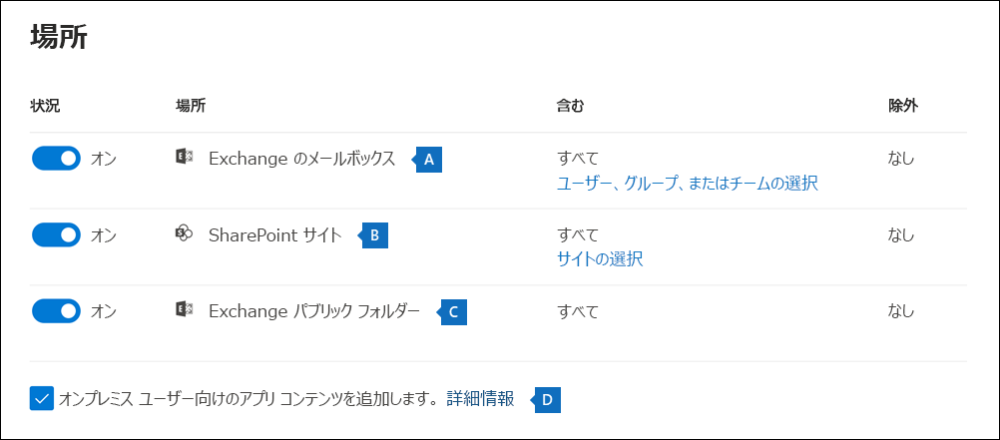
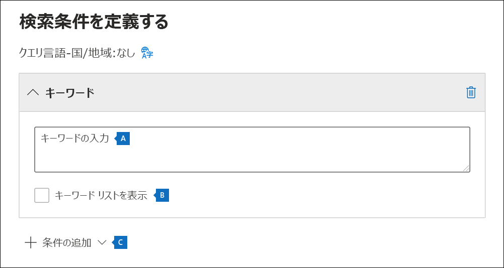

# コンテンツ検索の作成

Microsoft 365 コンプライアンス センターのコンテンツ検索電子情報開示ツールを使用して、組織の電子メール、文書、インスタント メッセージングの会話などのインプレースのコンテンツを検索できます。このツールを使用すると、以下のクラウドベースの Microsoft 365 データ ソース内のコンテンツを検索できます。
  
- Exchange Online メールボックス

- SharePoint Online サイトと OneDrive for Business アカウント

- Microsoft Teams

- Microsoft 365 グループ

- Yammer グループ

コンテンツ検索を実行すると、コンテンツの場所の数と予想される検索結果の数が検索のポップアップ情報に表示されます。検索クエリと一致するアイテムが最も多いコンテンツの場所など、統計情報をすばやく表示することもできます。検索を実行した後、結果をプレビューしたり、ローカル コンピューターにエクスポートしたりすることができます。

## 検索を実行する前に、以下の作業を行います。

- <a href="https://go.microsoft.com/fwlink/p/?linkid=2077149" target="_blank">Microsoft 365 コンプライアンス センター</a>の コンテンツ検索 ページに(検索を実行して結果をプレビューし、結果をエクスポートするために) アクセスするには、管理者、コンプライアンス責任者、または電子情報開示マネージャーが、Microsoft 365 コンプライアンス センターの電子情報開示マネージャーの役割グループのメンバーである必要があります。 詳細については、「[電子情報開示のアクセス許可を割り当てる](assign-ediscovery-permissions.md)」を参照してください。電子情報開示のアクセス許可を割り当てる」を参照してください。

- Exchange ハイブリッド展開では、コンテンツ検索ツールを使用してオンプレミスのメールボックスを検索することはできません。 このツールは、クラウドベースのメールボックスの検索にのみ使用できます。

## 検索の作成と実行
  
1. <https://compliance.microsoft.com> に移り、適切な許可が割り当てられているアカウントの証明書を使ってサインインします。

2. Microsoft 365 コンプライアンス センターの左側のナビゲーション ウィンドウで [**コンテンツ検索**] をクリックします。

3. [**コンテンツ検索**] ページで、[**新しい検索**] をクリックします。

   > [!NOTE]
   > [**ID のリストで検索**] オプションでは、Exchange ID のリストを使用して特定のメール メッセージやその他のメールボックス アイテムを検索できます。ID リスト検索を作成するには、検索する特定のメールボックス アイテムを識別するコンマ区切り値 (CSV) ファイルを送信します。手順については、「[ID リスト検索の CSV ファイルを準備する](csv-file-for-an-id-list-content-search.md)」を参照してください。

4. 検索の名前と、検索を識別するための説明 (省略可能) を入力します。検索の名前は、組織内で一意である必要があります。

5. 検索するコンテンツの [**場所**] ページで、検索するコンテンツの場所を選択します。メールボックス、サイト、パブリック フォルダーを検索できます。

    
  
   1. **Exchange メールボックス**: トグルを **On** に設定し、[**ユーザー、グループ、またはチーム** の選択] をクリックして、ホールドするメールボックスを指定します。 検索ボックスを使用して、ユーザーのメールボックスや配布グループを検索できます。 Microsoft チームに関連付けられているメールボックス (チャネル メッセージの場合)、Office 365 グループ、および Yammer グループを検索することもできます。 メールボックスに保存されているアプリケーション データの詳細については、[「eDiscovery のメールボックスに保存されているコンテンツ」](what-is-stored-in-exo-mailbox.md)を参照してください。

   2. **SharePoint サイト**: [**オン**] に切り替えて、[**サイトの選択**] をクリックして、ホールドする SharePoint サイトと OneDrive アカウントを指定します。ホールドを適用する各サイトの URL を入力します。また、Microsoft チーム、Office 365 グループ、または Yammer グループの SharePoint サイトの URL を追加することもできます。
  
   3. **Exchange パブリック フォルダー**: [**オン**] に切り替えて、Exchange Online 組織のすべてのパブリック フォルダーをホールドにします。ただし、ホールドにする特定のパブリック フォルダーを選ぶことはできません。パブリック フォルダーを保留にしない場合は、切り替えスイッチをオフのままにしておきます。
  
   4. オンプレミスのユーザーの Teams コンテンツを検索するには、このチェック ボックスをオンにした状態にします。 たとえば、組織内のすべての Exchange メールボックスを検索してからこのチェック ボックスも選択すると、オンプレミスのユーザーの Teams チャット データを格納するのに使用されるクラウドベースの記憶域が検索の範囲に含まれます。 詳細については、「[PowerShell を使用してオンプレミス ユーザーの Teams チャット データを検索する](search-cloud-based-mailboxes-for-on-premises-users.md)」を参照してください。

6. [**検索条件の定義**] ページで、キーワード クエリを入力して作成し、必要に応じて検索クエリに条件を追加します。

   

   1. キーワード、送信日や受信日などのメッセージ プロパティ、またはファイル名やドキュメントの最終更新日などのドキュメント プロパティを指定できます。**AND**、**OR**、**NOT**、**NEAR** などのブール演算子を使用するより複雑なクエリを使用できます。このキーワード ボックスを空のままにすると、指定したコンテンツの場所にあるすべてのコンテンツが検索結果に入ります。詳細については、「[電子情報開示のキーワード クエリと検索条件](keyword-queries-and-search-conditions.md)」を参照してください。

   2. または、[**キーワード リストの表示**] チェックボックスをオンにして、各行にキーワードを入力することもできます。このようにすると、各行のキーワードは、作成された検索クエリの **OR** 演算子の機能に似た論理演算子 (**c:s**) によって接続されます。

      キーワード リストを使用するのはなぜですか? 各キーワードと一致するアイテム数を示す統計情報を取得することができます。これは、最も有効な (および最も有効でない) キーワードをすばやく識別するのに役立ちます。行で (かっこで囲まれた) キーワード フレーズを使用することもできます。キーワード リストの詳細については、「[検索のキーワード統計](view-keyword-statistics-for-content-search.md#get-keyword-statistics-for-searches)」を参照してください。

      > [!NOTE]
      > 大規模なキーワード リストによって生じる問題を軽減するため、キーワード リストの行は最大 20 行に設定されています。

   3. 検索クエリに条件を追加して、検索を絞り込み、さらに絞り込まれた結果のセットを返すようにできます。各条件によって、作成された検索クエリに句が追加され、ユーザーが検索を開始するとそのクエリが実行されます。条件は、**AND** 演算子の機能に似た論理演算子 (**c:c**) によってキーワードのクエリ (キーワード ボックスで指定される) と論理的に接続されます。つまり、検索結果に含まれるためには、アイテムはキーワード クエリと 1 つまたは複数の条件の両方を満たす必要があります。このように、条件は結果を絞り込むのに役立ちます。検索クエリで使用できる条件のリストと説明については、「[検索条件](keyword-queries-and-search-conditions.md#search-conditions)」を参照してください。

7. 検索の設定を確認し (必要に応じて編集し)、検索を送信して開始します。
  
このコンテンツ検索に再度アクセスするか、**コンテンツ検索** ページにリストされている他のコンテンツ検索にアクセスするには、検索を選択し、**[開く]** をクリックします。

## 次の手順

コンテンツ検索を作成して実行した後に行う手順の一覧を示します。

- [検索結果をプレビューする](preview-ediscovery-search-results.md)

- [検索結果のキーワード統計を表示する](view-keyword-statistics-for-content-search.md)

- [検索結果をエクスポートする](export-search-results.md)

- [検索レポートをエクスポートする](export-a-content-search-report.md)

## 詳細情報

さまざまな Microsoft 365 サービスのコンテンツの検索といったコンテンツ検索に関する詳細情報については、「[コンテンツ検索機能のリファレンス](content-search-reference.md)」 をご覧ください。
