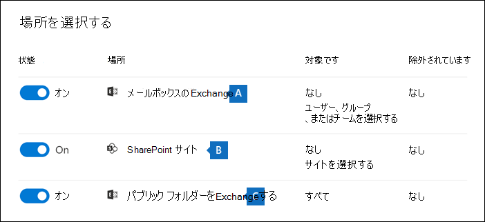
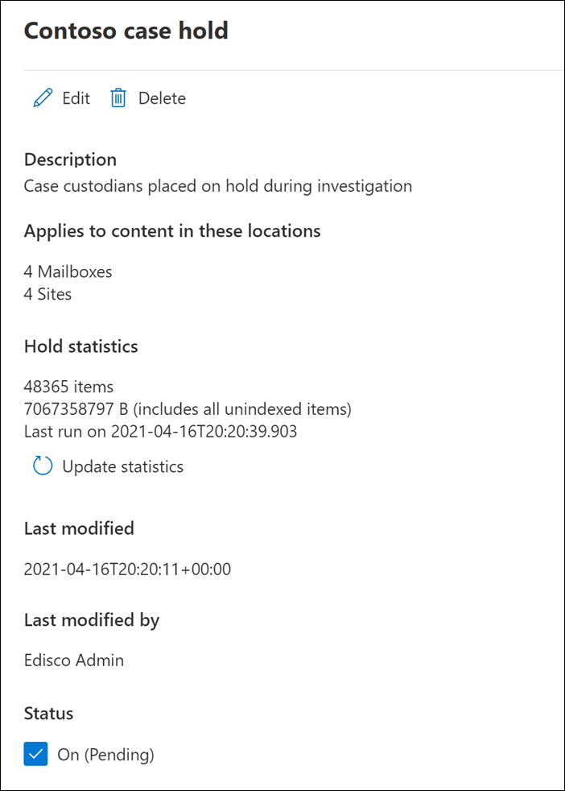

# <a name="create-an-ediscovery-hold"></a>電子情報開示保留リストを作成する

[!include[Purview banner](../includes/purview-rebrand-banner.md)]

Microsoft Purview 電子情報開示 (Standard) ケースを使用して、ケースに関連する可能性のあるコンテンツを保持する保留を作成できます。 ケースで調査しているユーザーのExchangeメールボックスとOneDrive for Business アカウントに保留を配置できます。 また、Microsoft Teams、Office 365 グループ、およびYammer グループに関連付けられているメールボックスとサイトに保留を配置することもできます。 コンテンツの場所を保留にすると、コンテンツの場所を保留から削除するまで、または保留を削除するまで、コンテンツは保持されます。

電子情報開示ホールドを作成した後、保留が有効になるまでに最大で 24 時間かかる場合があります。

ホールドを作成するときに、指定したコンテンツの場所に保持されているコンテンツの範囲を指定するには、次のオプションがあります。
  
- 指定した場所のすべてのコンテンツを保留にする無限保留を作成します。 または、検索クエリと一致する指定した場所のコンテンツのみが保留に配置されるクエリ ベースの保留を作成することもできます。

- その日付範囲内で送信、受信、または作成されたコンテンツのみを保持する日付範囲を指定します。 または、送信、受信、または作成された日時に関係なく、すべてのコンテンツを指定された場所に保持することもできます。
  
## <a name="how-to-create-an-ediscovery-hold"></a>電子情報開示ホールドを作成する方法

電子情報開示 (Standard) ケースに関連付けられている電子情報開示ホールドを作成するには、
  
1. <a href="https://go.microsoft.com/fwlink/p/?linkid=2077149" target="_blank">Microsoft Purview コンプライアンス ポータル</a>に移動し、適切な電子情報開示アクセス許可が割り当てられているユーザー アカウントの資格情報を使用してサインインします。

2. 左側のナビゲーション ウィンドウで [ **すべて表示**] をクリックし、[ **電子情報開示> Core**] をクリックします。

3. **[電子情報開示 (Standard)]** ページで、保留リストを作成するケースの名前をクリックします。

4. ケースの [**ホーム**] ページで、[**保留**] タブをクリックします。
  
5. **[保留]** ページで、[**作成**] をクリックします。

6. [ **保留リストの名前** ] ウィザード ページで、保留リストに名前を付けて、オプションの説明を追加して、[ **次へ**] をクリックします。 ホールドの名前は組織内で一意である必要があります。

7. [ **場所の選択** ] ウィザード ページで、保留にするコンテンツの場所を選択します。 メールボックス、サイト、およびパブリック フォルダーを保留にすることができます。

    
  
   1. **Exchange メールボックス**: トグルを **On** に設定し、[**ユーザー、グループ、またはチーム** の選択] をクリックして、ホールドするメールボックスを指定します。 検索ボックスを使用して、ユーザーのメールボックス、および配布グループ (グループ メンバーのメールボックスにホールドを適用するため) を検索し、ホールドを適用します。 Microsoft Team、Office 365 グループ、およびYammer グループの関連付けられたメールボックスにホールドを配置することもできます。 メールボックスを保留にするときに保持されるアプリケーション データの詳細については、「 [電子情報開示用のメールボックスに格納されているコンテンツ」を](what-is-stored-in-exo-mailbox.md)参照してください。

   2. **SharePoint サイト**: トグルを **On** に設定し、[**サイトの選択]** をクリックして、ホールドする SharePoint サイトと OneDrive アカウントを指定します。 ホールドを適用する各サイトの URL を入力します。 Microsoft Team、Office 365 グループ、またはYammer グループのSharePoint サイトの URL を追加することもできます。
  
   3. **Exchange パブリック フォルダー**: [**オン**] に切り替えて、Exchange Online 組織のすべてのパブリック フォルダーをホールドにします。ただし、ホールドにする特定のパブリック フォルダーを選ぶことはできません。パブリック フォルダーを保留にしない場合は、切り替えスイッチをオフのままにしておきます。

   > [!IMPORTANT]
   > ExchangeメールボックスまたはSharePoint サイトをホールドに追加する場合は、少なくとも 1 つのコンテンツの場所をホールドに明示的に追加する必要があります。 つまり、メールボックスまたはサイトのトグルを **[オン]** に設定した場合は、ホールドに追加する特定のメールボックスまたはサイトを選択する必要があります。 それ以外の場合、電子情報開示ホールドは作成されますが、メールボックスやサイトはホールドに追加されず、コンテンツの場所やアイテムが保持されていないことを統計情報に示します。

8. 保留リストへの場所の追加が完了したら、[ **次へ**] をクリックします。

9. キーワードまたは条件を使用してクエリ ベースの保持を作成するには、次の手順を実行します。 指定したコンテンツの場所のすべてのコンテンツを保持するには、[ **次へ**] をクリックします。

    
  
    1. [**キーワード**] の下にあるボックスに、検索条件を満たすコンテンツのみが保留にされるように、検索クエリを入力します。キーワード、メッセージ プロパティ、またはファイル名などのドキュメント プロパティを指定することができます。**AND**、**OR**、または **NOT** などのブール演算子を使用する、より複雑なクエリを使用することもできます。

    2. [ **条件の追加]** をクリックして 1 つ以上の条件を追加し、保留のクエリを絞り込む。 各条件は、保留リストの作成時に作成および実行されるKQL検索クエリに句を追加します。 たとえば、日付範囲内で作成された電子メールまたはサイトドキュメントが保持されるように、日付範囲を指定できます。 条件は、キーワード クエリ ([ **キーワード** ] ボックスで指定) に論理的に接続され、 **AND** 演算子によってその他の条件に接続されます。 つまり、アイテムは、キーワード クエリと保持する条件の両方を満たす必要があります。

    検索クエリの作成と条件の使用の詳細については、「 [電子情報開示のキーワード クエリと検索条件」を](keyword-queries-and-search-conditions.md)参照してください。

10. クエリ ベースの保留リストを構成した後、[**次へ**] をクリックします。

11. 設定を確認し (必要に応じて編集)、[送信] をクリック **します**。

> [!NOTE]
> クエリ ベースのホールドを作成すると、選択した場所のすべてのコンテンツが最初に保留になります。 その後、指定したクエリに一致しないコンテンツは、7 日から 14 日ごとに保留から消去されます。 ただし、任意の種類の 5 つ以上の保留がコンテンツの場所に適用されている場合、またはアイテムにインデックス作成の問題がある場合、クエリベースの保留はコンテンツをクリアしません。

## <a name="query-based-holds-placed-on-sites"></a>サイトに配置されたクエリベースの保留

SharePoint サイト内のドキュメントにクエリ ベースの電子情報開示ホールドを配置する場合は、次の点に注意してください。

- クエリ ベースの保留は、最初にサイト内のすべてのドキュメントを削除した後、短時間保持します。 つまり、ドキュメントが削除されると、クエリ ベースの保留の条件と一致しない場合でも、ドキュメントは保持保持ライブラリに移動されます。 ただし、クエリ ベースの保留に一致しない削除されたドキュメントは、保持保持ライブラリを処理するタイマー ジョブによって削除されます。 タイマー ジョブは定期的に実行され、保持保持ライブラリ内のすべてのドキュメントをクエリ ベースの電子情報開示保留 (およびその他の種類の保留ポリシーと保持ポリシー) と比較します。 タイマー ジョブは、クエリ ベースの保留と一致しないドキュメントを削除し、そのドキュメントを保持します。

- クエリ ベースの保持は、特定のフォルダーまたはサイト内のドキュメントの保持や、他の場所ベースの保持条件の使用など、対象となる保持を実行するために使用しないでください。 これを行うと、意図しない結果が得られます。 サイト ドキュメントを保持するために、キーワード、日付範囲、その他のドキュメント プロパティなどの場所に基づく保持条件以外の条件を使用することをお勧めします。

## <a name="ediscovery-hold-statistics"></a>電子情報開示ホールド統計

電子情報開示ホールドを作成すると、選択したホールドのポップアップ ページに新しい保留に関する情報が表示されます。 この情報には、保留中のメールボックスとサイトの数、保留状態に置かれたアイテムの合計数とサイズ、ホールド統計が最後に計算された時刻など、保留にされたコンテンツに関する統計情報が含まれます。 これらのホールド統計は、ケースが保持されているコンテンツの量を特定するのに役立ちます。
  

  
電子情報開示ホールド統計については、次の点に注意してください。
  
- 保留にされているアイテムの合計数は、すべてのコンテンツ ソースのうち、保留にされているアイテム数を示します。クエリベースの保留リストを作成した場合、この統計情報は、クエリに一致するアイテム数を示します。

- 保留中のアイテムの数には、コンテンツの場所で見つかったインデックスのないアイテムも含まれます。 クエリ ベースの保留を作成すると、コンテンツの場所内のすべてのインデックスのないアイテムが保留になります。 これには、クエリベースのホールドの検索条件と一致しないインデックスのないアイテムと、日付範囲条件の範囲外になる可能性があるインデックスのないアイテムが含まれます。 これは、検索クエリと一致しない、または日付範囲条件によって除外されたインデックスのないアイテムが検索結果に含まれない検索の実行時とは異なります。 インデックスが付いていない項目の詳細については、「 [部分的にインデックスが作成されたアイテム](partially-indexed-items-in-content-search.md)」を参照してください。

- [ **統計の更新** ] をクリックして、現在の保留アイテム数を計算する検索見積もりを再実行することで、最新の保留統計を取得できます。

- 通常、メールボックスまたはサイトを保持しているユーザーは、新しい電子メール メッセージを送受信し、SharePointおよびOneDriveで新しいドキュメントを作成しているため、保留中のアイテムの数は時間の経過と共に増加します。

- Exchange メールボックス、SharePoint サイト、またはOneDrive アカウントが複数地域の環境で別のリージョンに移動された場合、そのサイトの統計情報はホールド統計に含まれません。 ただし、これらの場所のコンテンツは引き続き保持されます。 また、メールボックスまたはサイトが別のリージョンに移動された場合、ホールドに表示される SMTP アドレスまたは URL は自動的に更新されません。 コンテンツの場所が保留統計に再び含まれるように、保留を編集し、URL または SMTP アドレスを更新する必要があります。

## <a name="search-locations-on-ediscovery-hold"></a>電子情報開示ホールドの場所を検索する

電子情報開示 (Standard) ケースで [コンテンツを検索](search-for-content-in-core-ediscovery.md) する場合、ケースに関連付けられたホールドに配置されたコンテンツの場所のみを検索するように検索をすばやく構成できます。

**保留になっているすべてのコンテンツの場所** を検索するには、[保留の場所] オプションを選択します。 ケースに複数の電子情報開示保留が含まれている場合、このオプションを選択すると、すべての保留のコンテンツの場所が検索されます。 また、コンテンツの場所がクエリ ベースの保留リストに配置された場合、検索を実行すると、保留クエリに一致するアイテムのみが検索されます。 つまり、ホールド条件と検索条件の両方に一致するコンテンツのみが検索結果と共に返されます。 たとえば、特定の日付より前に送信または作成されたアイテムを保持するクエリ ベースのケース ホールドにユーザーが配置された場合、それらのアイテムのみが検索されます。 これは、ケース ホールド クエリと検索クエリを **AND** 演算子で接続することによって実現されます。

電子情報開示ホールドで場所を検索する場合は、次の点に注意してください。

- コンテンツの場所が同じケース内の複数の保留の一部である場合、すべてのケース コンテンツ オプションを使用してそのコンテンツの場所を検索すると、 **OR 演算子によって** 保留クエリが結合されます。 同様に、コンテンツの場所が 2 つの異なる保留の一部であり、一方がクエリ ベースで、もう一方が無限保留である場合 (すべてのコンテンツが保留されている場合)、すべてのコンテンツは無限保留のために検索されます。

- 検索が保留中の場所を検索するように構成され、ケース内の電子情報開示ホールドを変更した場合 (場所の追加または削除、または保留クエリの変更によって)、検索構成はそれらの変更で更新されます。 ただし、ホールドが変更された後で検索を再実行して、検索結果を更新する必要があります。

- 電子情報開示ケース内の 1 つの場所に複数の電子情報開示保留が配置され、保留の場所を検索することを選択した場合、その検索クエリのキーワードの最大数は 500 です。 これは、 **検索が OR** 演算子を使用してクエリ ベースのすべての保留を結合するためです。 組み合わされた保留クエリと検索クエリに 500 を超えるキーワードがある場合、クエリベースのケースに一致するコンテンツだけでなく、メールボックス内のすべてのコンテンツが検索されます。

- 電子情報開示ホールドの状態が **[オン (保留中)]** の場合でも、保留が有効になっている間は保留中の場所を検索できます。

## <a name="preserve-content-in-microsoft-teams"></a>Microsoft Teams内のコンテンツを保持する

Microsoft Teams チャネルの一部である会話は、Microsoft Team に関連付けられているメールボックスに格納されます。 同様に、メンバーがチャネルで共有するファイルは、チームの SharePoint サイトに保存されます。 そのため、チャネル内の会話とファイルを保持するには、チーム メールボックスとSharePoint サイトを電子情報開示ホールドに配置する必要があります。

または、Teamsのチャット リストに含まれる会話 (*1:1 チャット* または *1:N グループ チャット* と呼ばれます) は、チャットに参加するユーザーのメールボックスに格納されます。 また、ユーザーがチャット会話で共有するファイルは、ファイルを共有するユーザーのOneDrive アカウントに格納されます。 そのため、個々のユーザー メールボックスとOneDrive アカウントを電子情報開示ホールドに追加して、会話とファイルをチャット リストに保持する必要があります。 Microsoft Team のメンバーのメールボックスにホールドを配置し、チームメールボックスとサイトを保留にすることをお勧めします。

> [!NOTE]
> 組織にExchangeハイブリッド展開がある場合 (または組織がオンプレミスのExchange組織をOffice 365と同期)、Microsoft Teamsが有効になっている場合、オンプレミスユーザーはTeamsチャット アプリケーションを使用し、1:1 チャットと 1:N グループ チャットに参加できます。 これらの会話は、オンプレミス ユーザーに関連付けられているクラウドベースのストレージに格納されます。 オンプレミスユーザーが電子情報開示ホールドに配置されている場合、クラウドベースのストレージ内のTeamsチャット コンテンツは保持されます。 詳細については、「[PowerShell を使用してオンプレミス ユーザーの Teams チャット データを検索する](search-cloud-based-mailboxes-for-on-premises-users.md)」を参照してください。

Teamsコンテンツの保持の詳細については、「[Microsoft Teams ユーザーまたはチームを訴訟ホールドに置く」を](/MicrosoftTeams/legal-hold)参照してください。

### <a name="preserve-card-content"></a>カード コンテンツを保持する

同様に、Teams チャネル、1:1 チャット、および 1:N グループ チャットでアプリによって生成されたカード コンテンツは、メールボックスに格納され、メールボックスが電子情報開示ホールドに配置されたときに保持されます。 *カード* とは、短いコンテンツを対象とした UI コンテナです。 カードには複数のプロパティと添付ファイルを含めることができます。また、カード アクションをトリガーするボタンを含めることができます。 詳細については、「 [カード](/microsoftteams/platform/task-modules-and-cards/what-are-cards)」を参照してください。 他の Teams のコンテンツと同様に、カードのコンテンツが保存されている場所は、カードが使用された場所に基づいています。 Teams チャネルで使用したカードのコンテンツは、Teams グループのメールボックスに保存されます。 1:1 チャットおよび 1xN チャットのカード コンテンツは、チャット参加者のメールボックスに保存されます。

### <a name="preserve-meeting-and-call-information"></a>会議と通話の情報を保持する

Teams チャネルの会議と通話の概要情報は、会議または通話にダイヤルしたユーザーのメールボックスにも格納されます。 このコンテンツは、電子情報開示ホールドがユーザー メールボックスに配置されている場合にも保持されます。

### <a name="preserve-content-in-private-channels"></a>プライベート チャネルでコンテンツを保持する

2020 年 2 月から、プライベート チャネルでコンテンツを保持する機能も有効になりました。 プライベート チャネル チャットはチャット参加者のメールボックスに格納されるため、電子情報開示ホールドにユーザー メールボックスを配置すると、プライベート チャネル チャットが保持されます。 また、2020 年 2 月より前にユーザー メールボックスが電子情報開示ホールドに配置された場合、そのメールボックスに格納されているプライベート チャネル メッセージに保留が自動的に適用されるようになりました。 プライベート チャネルで共有されているファイルの保持もサポートされています。

### <a name="preserve-wiki-content"></a>Wiki コンテンツを保持する

すべてのチームまたはチーム チャネルには、メモの作成とコラボレーションのための Wiki も含まれています。 Wiki コンテンツは、.mht 形式のファイルに自動的に保存されます。 このファイルは、チームの SharePoint サイトの Teams Wiki データ ドキュメント ライブラリに保存されます。 チームのSharePoint サイトを電子情報開示ホールドに追加することで、Wiki コンテンツを保持できます。

> [!NOTE]
> チームまたはチーム チャネルの Wiki コンテンツを保持する機能 (チームのSharePoint サイトを保留にする場合) は、2017 年 6 月 22 日にリリースされました。 チーム サイトが保留中の場合、Wiki コンテンツはその日から保持されます。 ただし、チーム サイトが保留中で、Wiki コンテンツが 2017 年 6 月 22 日より前に削除された場合、Wiki コンテンツは保持されませんでした。

### <a name="office-365-groups"></a>Office 365 グループ

Teamsは、Office 365 グループに基づいて構築されています。 したがって、Office 365 グループを電子情報開示ホールドに配置することは、Teamsコンテンツを保留に配置する場合と同様です。

電子情報開示ホールドにTeamsグループとOffice 365 グループの両方を配置する場合は、次の点に注意してください。

- 前に説明したように、Teams グループとOffice 365 グループにコンテンツを保留にするには、グループまたはチームに関連付けられているメールボックスとSharePoint サイトを指定する必要があります。

- [Exchange Online PowerShell](/powershell/exchange/connect-to-exchange-online-powershell) で **Get-UnifiedGroup** コマンドレットを実行して、Teams グループとOffice 365 グループのプロパティを表示します。 これは、チームまたはOffice 365 グループに関連付けられているサイトの URL を取得するのに適した方法です。 たとえば、次のコマンドは、上級管理職チームという名前の Office 365 グループの選択されたプロパティを表示します。

    ```text
    Get-UnifiedGroup "Senior Leadership Team" | FL DisplayName,Alias,PrimarySmtpAddress,SharePointSiteUrl

    DisplayName            : Senior Leadership Team
    Alias                  : seniorleadershipteam
    PrimarySmtpAddress     : seniorleadershipteam@contoso.onmicrosoft.com
    SharePointSiteUrl      : https://contoso.sharepoint.com/sites/seniorleadershipteam
    ```

    > [!NOTE]
    > **Get-UnifiedGroup** コマンドレットを実行するには、Exchange Online で View-Only Recipients という役割が割り当てられているか、View-Only Recipients という役割が割り当てられている役割グループに属している必要があります。 
  
- ユーザーのメールボックスが検索されると、ユーザーがメンバーであるチームまたはOffice 365 グループは検索されません。 同様に、電子情報開示ホールドにチームまたはOffice 365 グループを配置すると、グループ メールボックスとグループ サイトのみが保留になります。 グループ メンバーのメールボックスとOneDrive for Business サイトは、電子情報開示ホールドに明示的に追加しない限り、保留にされません。 そのため、正当な理由でチームまたはOffice 365 グループを保留にする必要がある場合は、同じホールドにチームまたはグループ メンバーのメールボックスとOneDrive アカウントを追加することを検討してください。

- チームまたはOffice 365 グループのメンバーの一覧を取得するには、Microsoft 365 管理センターの [<a href="https://go.microsoft.com/fwlink/p/?linkid=2052855" target="_blank">**グループ]**</a> ページでプロパティを表示できます。 または、Exchange Online PowerShell で次のコマンドを実行できます。

    ```powershell
    Get-UnifiedGroupLinks <group or team name> -LinkType Members | FL DisplayName,PrimarySmtpAddress
    ```

    > [!NOTE]
    > **Get-UnifiedGroupLinks** コマンドレットを実行するには、Exchange Online で View-Only Recipients という役割が割り当てられているか、View-Only Recipients という役割が割り当てられている役割グループに属している必要があります。

## <a name="preserve-content-in-onedrive-accounts"></a>OneDrive アカウントでコンテンツを保持する

組織内のOneDrive for Business サイトの URL の一覧を収集して、電子情報開示ケースに関連付けられた保留リストまたは検索に追加できるようにするには、「[組織内のすべてのOneDriveの場所の一覧を作成](/onedrive/list-onedrive-urls)する」を参照してください。 この記事のスクリプトでは、組織内のすべてのOneDrive サイトの一覧を含むテキスト ファイルを作成します。 このスクリプトを実行するには、SharePoint Online 管理シェルをインストールして使用する必要があります。 検索する各 OneDrive サイトに組織の個人用サイト ドメインの URL を必ず追加してください。 これは、すべての OneDrive を含むドメインです。例: `https://contoso-my.sharepoint.com` ユーザーの OneDrive サイトの URL の例は次のとおりです。`https://contoso-my.sharepoint.com/personal/sarad_contoso_onmicrosoft.com`

> [!IMPORTANT]
> ユーザーのOneDrive アカウントの URL には、ユーザー プリンシパル名 (UPN) が含まれています (たとえば、 `https://alpinehouse-my.sharepoint.com/personal/sarad_alpinehouse_onmicrosoft_com` まれにユーザーの UPN が変更された場合、新しい UPN を組み込むためにOneDrive URL も変更されます。 ユーザーのOneDrive アカウントが電子情報開示保留リストの一部であり、古いものと UPN が変更されている場合は、保留を更新する必要があります。保持を更新し、ユーザーの新しいOneDrive URL を追加して古いアカウントを削除する必要があります。 詳細については、「[UPN の変更による OneDrive URL への影響](/onedrive/upn-changes)」をご覧ください。

## <a name="removing-content-locations-from-an-ediscovery-hold"></a>電子情報開示ホールドからのコンテンツの場所の削除

メールボックス、SharePoint サイト、またはOneDriveアカウントが電子情報開示ホールドから削除されると、*遅延ホールド* が適用されます。 つまり、コンテンツの場所からデータが完全に削除 (削除) されないように、ホールドの実際の削除が 30 日間延期されます。 これにより、管理者は、電子情報開示ホールドが削除された後に削除されるコンテンツを検索または回復できます。 メールボックスとサイトの遅延ホールドのしくみの詳細は異なります。

- **メールボックス：** 次にマネージド フォルダー アシスタントがメールボックスを処理し、電子情報開示ホールドが削除されたことを検出すると、メールボックスに遅延ホールドが配置されます。 具体的には、マネージド フォルダー アシスタントが次のいずれかのメールボックス プロパティを True に設定すると、メールボックスに遅延ホールドが適用 **されます**。

   - **DelayHoldApplied:** このプロパティは、ユーザーのメールボックスに格納されている電子メール関連のコンテンツ (OutlookとOutlook on the webを使用しているユーザーによって生成されます) に適用されます。

   - **DelayReleaseHoldApplied:** このプロパティは、ユーザーのメールボックスに格納されているクラウドベースのコンテンツ (Microsoft Teams、Microsoft Forms、Microsoft Yammerなどの非Outlook アプリによって生成されます) に適用されます。 Microsoft アプリによって生成されたクラウド データは、通常、ユーザーのメールボックス内の非表示フォルダーに格納されます。

   メールボックスに遅延ホールドが配置されている場合 (前のプロパティのいずれかが **True** に設定されている場合)、メールボックスは訴訟ホールドにあるかのように、保持期間が無制限であると見なされます。 30 日後、遅延ホールドは期限切れになり、Microsoft 365 保留が削除されるように (DelayHoldApplied プロパティまたは DelayReleaseHoldApplied プロパティを **False** に設定することで) 遅延ホールドの削除が自動的に試行されます。 これらのプロパティのいずれかを **False** に設定した後、削除対象としてマークされた対応するアイテムは、次にメールボックスが管理フォルダー アシスタントによって処理されるときに削除されます。

   詳しくは、[メールボックスの管理についての詳細](identify-a-hold-on-an-exchange-online-mailbox.md#managing-mailboxes-on-delay-hold) をご覧ください。。

- **SharePointサイトとOneDrive サイト:** 保持保持ライブラリに保持されているSharePointまたはOneDriveコンテンツは、サイトが電子情報開示ホールドから削除された後の 30 日間の遅延保留期間中は削除されません。 これは、サイトがアイテム保持ポリシーからリリースされたときに発生する処理と似ています。 また、30 日間の遅延ホールド期間中は、保持保持ライブラリ内のこのコンテンツを手動で削除することはできません。 

   詳細については、「 [アイテム保持用のポリシーを解放する」を](retention.md#releasing-a-policy-for-retention)参照してください。

ケースが閉じられると保留がオフになるため、電子情報開示 (Standard) ケースを閉じると、保留中のコンテンツの場所にも遅延ホールドが適用されます。 ケースを閉じる方法の詳細については、「 [電子情報開示 (Standard) ケースを閉じる、もう一度開く、削除する」](close-reopen-delete-core-ediscovery-cases.md)を参照してください。

## <a name="ediscovery-hold-limits"></a>電子情報開示ホールドの制限

次の表に、電子情報開示ケースとケース ホールドの制限を示します。

  | 制限の説明 | 極限 |
  |:-----|:-----|
  |組織のケースの最大数。  <br/> |無制限  <br/> |
  |組織の電子情報開示ホールド ポリシーの最大数。 この制限には、電子情報開示 (Standard) ケースと電子情報開示 (プレミアム) ケースのホールド ポリシーの合計が含まれます。  <br/> |10,000<sup>1</sup>  <br/> |
  |1 つの電子情報開示ホールド内のメールボックスの最大数。 この制限には、ユーザー メールボックスの合計と、Microsoft 365 グループ、Microsoft Teams、Yammer グループに関連付けられているメールボックスの合計が含まれます。  <br/> |1,000  <br/> |
  |1 つの電子情報開示ホールド内のサイトの最大数。 この制限には、OneDrive for Business サイト、SharePoint サイト、Microsoft 365 グループ、Microsoft Teams、Yammer グループに関連付けられているサイトの合計が含まれます。  <br/> |100  <br/> |
  |電子情報開示ホーム ページに表示されるケースの最大数と、ケース内の [保留]、[検索]、[エクスポート] タブに表示されるアイテムの最大数。  |1,0001<sup></sup>|

   > [!NOTE]
   > <sup>1</sup> 1,000 件を超えるケース、保留、検索、またはエクスポートの一覧を表示するには、対応するセキュリティ & Compliance PowerShell コマンドレットを使用できます。
   >
   > - [Get-ComplianceCase](/powershell/module/exchange/get-compliancecase)
   > - [Get-CaseHoldPolicy](/powershell/module/exchange/get-caseholdpolicy)
   > - [Get-ComplianceSearch](/powershell/module/exchange/get-compliancesearch)
   > - [Get-ComplianceSearchAction](/powershell/module/exchange/get-compliancesearchaction)
