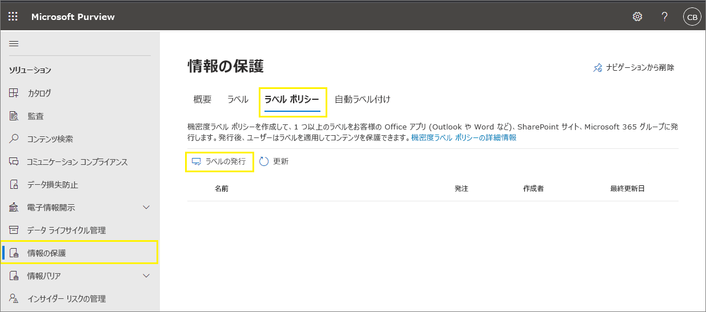
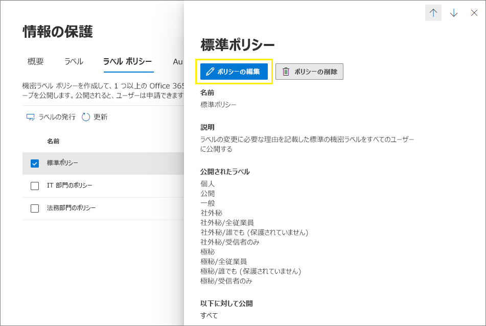

# <a name="create-and-configure-sensitivity-labels-and-their-policies"></a>秘密度ラベルとそのポリシーを作成して構成する

>*[セキュリティとコンプライアンスのための Microsoft 365 ライセンス ガイダンス](/office365/servicedescriptions/microsoft-365-service-descriptions/microsoft-365-tenantlevel-services-licensing-guidance/microsoft-365-security-compliance-licensing-guidance)。*

[!include[Purview banner](../includes/purview-rebrand-banner.md)]

すべての Microsoft Purview Information Protection ソリューションは、[秘密度ラベル](sensitivity-labels.md)を使って実装されます。 それらのラベルを作成して発行するには、<a href="https://go.microsoft.com/fwlink/p/?linkid=2077149" target="_blank">Microsoft Purview コンプライアンス ポータル</a>に移動します。

まず、アプリやその他のサービスで使用する秘密度ラベルを作成し、構成します。 たとえば、ユーザーに表示して Office アプリから適用するラベルです。

次に、構成するラベルとポリシー設定を含む 1 つ以上のラベル ポリシーを作成します。 このラベル ポリシーで、選択したユーザーと場所のラベルと設定を発行します。

## <a name="before-you-begin"></a>はじめに

組織のグローバル管理者には、秘密度ラベルのすべての側面を作成および管理するための完全な権限があります。 グローバル管理者としてサインインしていない場合は、「[機密ラベルの作成と管理に必要なアクセス許可](get-started-with-sensitivity-labels.md#permissions-required-to-create-and-manage-sensitivity-labels)」を参照してください。

## <a name="create-and-configure-sensitivity-labels"></a>秘密度ラベルを作成して構成する

1. [Microsoft Purview コンプライアンス ポータル](https://compliance.microsoft.com/)から **[ソリューション]** > **[Information protection]** > **[ラベル]** の順に選択します。

2. **[ラベル]** ページで、**[+ ラベルの作成]** を選択して、新しい秘密度ラベルの構成を開始します。 
    
    

    > [!NOTE]
    > 既定では、テナントにはラベルはありません。作成する必要があります。 こちらに例示した図のラベルには、[Azure Information Protection から移行](/azure/information-protection/configure-policy-migrate-labels) された既定のラベルが表示されます。

3. **[このラベルのスコープを定義する]** ページで、選択したオプションに応じて、構成可能な設定のラベルのスコープと、発行時に表示される場所が決まります。

    

    - **[ファイルとメール]** が選択されている場合、Office Word や Outlook などの機密度ラベルをサポートするアプリに適用される設定を構成できます。 このオプションが選択されていない場合、これらの設定の最初のページを表示しても、それらを構成することはできず、ユーザーがこれらのアプリでラベルを選択することはできません。

    - **[グループとサイト]** が選択されている場合、Microsoft 365 グループ、および Teams と SharePoint のサイトに適用される設定を構成できます。 このオプションが選択されていない場合、これらの設定の最初のページを表示しても、それらを構成することはできず、ユーザーがグループおよびサイト用にラベルを選択することはできません。

    **スキーマ化されたデータ アセット** スコープの詳細情報は、「[Microsoft Purview データ マップにラベルを付ける](/azure/purview/create-sensitivity-label)」を参照してください。

4. ラベルの設定には、構成の指示に従います。

    ラベル設定の詳細については、「概要」の「[秘密度ラベルでできること](sensitivity-labels.md#what-sensitivity-labels-can-do)」を参照してください。また、個々の設定については、UI のヘルプを参照してください。

5. これらの手順を繰り返して、さらにラベルを作成します。ただし、サブラベルを作成する場合は、まず親ラベルを選択してから、**[その他のアクション]** の [**...**] を選択し、**[サブラベルの追加]** を選択します。

6. 必要なすべてのラベルを作成したら、ラベルの順序を確認し、必要に応じて上下に移動します。 ラベルの順序を変更するには、[**その他のアクション**] の [**...**] を選択して、[**上へ移動**] または [**下へ移動**] を選択します。 詳細については、概要の「[ラベルの優先度 (順序の問題)](sensitivity-labels.md#label-priority-order-matters)」を参照してください。

既存のラベルを編集するには、目的のラベルを選択し、[**ラベルの編集**] ボタンを選択します。

![[ラベルの編集] ボタンを押して、秘密度ラベルを編集する。](../media/edit-sensitivity-label-full.png)

このボタンを選択すると、[**秘密度ラベルの編集**] 構成が起動し、手順 4 のすべてのラベル設定を変更できます。

ユーザーへの影響がどの程度かわからない場合は、ラベルを削除しないでください。 詳細については、「[ラベルの解除と削除](#removing-and-deleting-labels)」 のセクションを参照してください。 

> [!NOTE]
> ラベル ポリシーを使用して既に発行されているラベルを編集する場合、構成を終了するときに、追加の手順は必要ありません。 たとえば、同じユーザーに変更を反映させるために、ラベルを新しいラベル ポリシーに追加する必要はありません。 ただし、変更をすべてのアプリとサービスにレプリケートするには、最大で 24 時間かかります。

ラベルを発行するまで、アプリまたはサービスでラベルを選択することはできません。 ラベルを発行するには、ラベルを[ラベル ポリシーに追加](#publish-sensitivity-labels-by-creating-a-label-policy)する必要があります。

> [!IMPORTANT]
> この [**ラベル**] タブで、新しいラベル ポリシーを作成する必要がある場合を除き、[**ラベルの発行**] タブ (またはラベル編集時の [**ラベルの発行**] ボタン) を選択しないでください。 複数のラベル ポリシーが必要になるのは、ユーザーが異なるラベルまたは異なるポリシー設定を必要とする場合だけです。 ラベルポリシーをできるだけ少なくすることを目指してください。組織のラベルポリシーを1つだけにすることも珍しくありません。

### <a name="additional-label-settings-with-security--compliance-powershell"></a>セキュリティ/コンプライアンス センター PowerShell を含むその他のラベル設定

[セキュリティ/コンプライアンス センター PowerShell](/powershell/exchange/scc-powershell) の [Set-Label](/powershell/module/exchange/set-label) コマンドレットを使ってその他のラベル設定を使用できます。

例として以下のようなものがあります。

- ユーザーがローカル言語でラベル名とヒントを表示できるように、多国籍の展開では *LocaleSettings* パラメーターを使用します。 [次のセクション](#example-configuration-to-configure-a-sensitivity-label-for-different-languages)には、フランス語、イタリア語、ドイツ語のラベル名とヒントのテキストを指定する設定例があります。

- Azure Information Protection 統合ラベル付けクライアントは、ラベルの色の設定やラベルの適用時のカスタム プロパティの適用など、[高度な設定](/azure/information-protection/rms-client/clientv2-admin-guide-customizations)の広範な一覧をサポートします。 完全なリストについては、このクライアントの管理ガイドの「[利用できるラベルの詳細設定](/azure/information-protection/rms-client/clientv2-admin-guide-customizations#available-advanced-settings-for-labels)」を参照してください。

#### <a name="example-configuration-to-configure-a-sensitivity-label-for-different-languages"></a>異なる言語向けに機密ラベルを構成する構成例

次の例では、ヒント用のプレースホルダー テキストが含まれる "Public" という名前のラベルの PowerShell 構成を示します。 この例では、ラベル名とヒントのテキストがフランス語、イタリア語、ドイツ語用に構成されています。

この構成の結果、これらの表示言語を使用する Office アプリを所有するユーザーには、ラベル名とツールヒントが同じ言語で表示されるようになります。 同様に、ファイルへのラベル付けをエクスプローラーから行うために Azure Information Protection 統一ラベル付けクライアントがインストールされている場合、これらの言語バージョンの Windows を所有しているユーザーがラベル付けのために右クリック アクションを使用すると、ラベル名とツールヒントがローカル言語で表示されます。

サポートする必要がある言語については、Office の[言語識別子](/deployoffice/office2016/language-identifiers-and-optionstate-id-values-in-office-2016#language-identifiers) (言語タグとも呼ばれます) を使用して、ラベル名とツールヒントの独自の翻訳を指定します。

PowerShell でコマンドを実行する前に、最初に[セキュリティ/コンプライアンス センター PowerShell に接続](/powershell/exchange/connect-to-scc-powershell)する必要があります。

```powershell
$Languages = @("fr-fr","it-it","de-de")
$DisplayNames=@("Publique","Publico","Oeffentlich")
$Tooltips = @("Texte Français","Testo italiano","Deutscher text")
$label = "Public"
$DisplayNameLocaleSettings = [PSCustomObject]@{LocaleKey='DisplayName';
Settings=@(
@{key=$Languages[0];Value=$DisplayNames[0];}
@{key=$Languages[1];Value=$DisplayNames[1];}
@{key=$Languages[2];Value=$DisplayNames[2];})}
$TooltipLocaleSettings = [PSCustomObject]@{LocaleKey='Tooltip';
Settings=@(
@{key=$Languages[0];Value=$Tooltips[0];}
@{key=$Languages[1];Value=$Tooltips[1];}
@{key=$Languages[2];Value=$Tooltips[2];})}
Set-Label -Identity $Label -LocaleSettings (ConvertTo-Json $DisplayNameLocaleSettings -Depth 3 -Compress),(ConvertTo-Json $TooltipLocaleSettings -Depth 3 -Compress)
```

## <a name="publish-sensitivity-labels-by-creating-a-label-policy"></a>ラベル ポリシーを作成して秘密度ラベルを発行する

1. [Microsoft Purview コンプライアンス ポータル](https://compliance.microsoft.com/)から **[ソリューション]** > **[Information protection]** > **[ラベル ポリシー]** の順に選択します。

2. **[ラベル ポリシー]** ページで、**[ラベルの発行]** を選択して **[ポリシーの作成]** 構成を開始します。
    
    
    
    > [!NOTE]
    > 既定では、テナントにはラベル ポリシーはありません。作成する必要があります。 

3. **[発行する秘密度ラベルの選択]** ページで、**[発行する秘密度ラベルの選択]** リンクを選択します。 アプリとサービスで使用するラベルを選択し、[**追加**] を選択します。

    > [!IMPORTANT]
    > サブラベルを選択する場合は、必ず親ラベルも選択してください。

4. 選択したラベルを確認し、変更を加えるには、**[編集]** を選択します。それ以外の場合 **[次へ]** を選択します。

5. 指示に従ってポリシー設定を構成します。

    表示されるポリシー設定は、選択したラベルのスコープと一致します。たとえば、**[ファイルとメール]** のスコープのみを持つラベルを選択した場合、ポリシー設定 **[このラベルを既定でグループとサイトに適用する]** および **[ユーザーにグループやサイトにラベルを付けるように要求する]** は表示されません。

    これらの設定の詳細については、概要情報の「[ラベル ポリシーでできること](sensitivity-labels.md#what-label-policies-can-do)」を参照してください。また、個々の設定については、UI のヘルプを参照してください。

    **Microsoft Purview データ マップ アセット (プレビュー) に構成されているラベルの場合**: これらのラベルには関連付けられたポリシー設定はありません。

6. 異なるユーザーやスコープに対して、異なるポリシー設定が必要な場合は、次の手順を繰り返します。 たとえば、ユーザーのグループにラベルを追加したり、ユーザーのサブセットに別の既定のラベルを作成したりできます。 または、異なるスコープを持つようにラベルを構成した場合です。

7. 複数のラベル ポリシーを作成すると、ユーザーの競合が発生することがあります。ポリシーの順序を確認し、必要に応じてこれらを上下に移動します。 ラベル ポリシーの順序を変更するには、[**その他のアクション**] の [**...**] を選択して、[**上へ移動**] または [**下へ移動**] を選択します。 詳細については、概要の「[ラベル ポリシーの優先度 (順序の問題)](sensitivity-labels.md#label-policy-priority-order-matters)」を参照してください。

[**ポリシーの作成**] 構成を完了すると、ラベル ポリシーが自動的に発行されます。 発行したポリシーは、簡単に編集して変更することができます。 特定の発行や再発行のアクションの選択は不要です。

既存のラベル ポリシーを編集するには、目的のラベル ポリシーを選択し、[**ポリシーの編集**] ボタンを選択します。 



このボタンを選択すると、[**ポリシーの作成**] 構成が起動し、含めるラベルとラベルの設定を編集できます。 構成を完了すると、選択したユーザーとサービスに変更が自動的にレプリケートされます。

### <a name="additional-label-policy-settings-with-security--compliance-powershell"></a>セキュリティ/コンプライアンス センター PowerShell を含むその他のラベル ポリシー設定

[セキュリティ/コンプライアンス PowerShell](/powershell/exchange/scc-powershell) の [Set-LabelPolicy](/powershell/module/exchange/set-labelpolicy) コマンドレットを使用すると、追加のラベルポリシー設定を利用できます。

Azure Information Protection の統合ラベル付けクライアントは、他のラベリング ソリューションからの移行や、送信されるメールを警告、正当化、またはブロックする Outlook のポップアップ メッセージなど、多くの[詳細設定](/azure/information-protection/rms-client/clientv2-admin-guide-customizations)をサポートしています。 完全なリストについては、このクライアントの管理ガイドの [[利用できるラベルの詳細設定](/azure/information-protection/rms-client/clientv2-admin-guide-customizations#available-advanced-settings-for-label-policies)] を参照してください。

## <a name="when-to-expect-new-labels-and-changes-to-take-effect"></a>新しいラベルと変更が反映されるタイミング

ラベルとラベル ポリシー設定の場合は、変更がサービスに反映されるまで 24 時間かかります。 それぞれ独自のタイミング サイクルを持つ多くの外部依存関係があるため、最近の変更に対するラベルとラベル ポリシーのトラブルシューティングを実施する前に 24 時間待機することをおすすめします。

ただし、ラベルとラベル ポリシーの変更が反映されるまで 24 時間かからない場合もあれば、24 時間以上かかる場合もあります。 たとえば、Word、Excel、および PowerPoint on the web の新規および削除された秘密度ラベルの場合、1 時間以内に更新内容が複製される場合があります。 ただし、新しいグループとグループ メンバーシップの変更、またはネットワーク レプリケーションの待機時間と帯域幅の制限の設定に依存する構成の場合、これらの変更が反映されるまで 24 ～ 48 時間かかる場合があります。

## <a name="use-powershell-for-sensitivity-labels-and-their-policies"></a>機密ラベルとそのポリシーに PowerShell を使用する

[セキュリティ / コンプライアンス PowerShell](/powershell/exchange/scc-powershell) を使用して、ラベル管理センターに表示されるすべての設定を作成し、構成できるようになりました。 つまり、ラベル管理センターでは使用できない設定に PowerShell を使用することに加えて、機密ラベルと機密ラベルポリシーの作成とメンテナンスを完全にスクリプト化できるようになりました。 

サポートされるパラメーターと値については、次のドキュメントを参照してください。

- [New-Label](/powershell/module/exchange/new-label)
- [New-LabelPolicy](/powershell/module/exchange/new-labelpolicy)
- [Set-Label](/powershell/module/exchange/set-label)
- [Set-LabelPolicy](/powershell/module/exchange/set-labelpolicy)

機密ラベルまたは機密ラベルポリシーの削除をスクリプト化する必要がある場合は、 [Remove-Label](/powershell/module/exchange/remove-label) および [Remove-LabelPolicy](/powershell/module/exchange/remove-labelpolicy) を使用することもできます。 ただし、機密ラベルを削除する前に、次のセクションを必ずお読みください。

## <a name="removing-and-deleting-labels"></a>ラベルの解除と削除

運用環境では、通常、ラベル ポリシーから秘密度ラベルを解除したり、秘密度ラベルを削除したりする必要はありません。 テストの初期段階では、そのいずれかまたは両方の操作を行う必要が発生する可能性が高いかもしれません。 それらの操作を行った場合、何が起こるかをよく理解しておいてください。

ラベル ポリシーからのラベルの解除は、ラベルの削除に比べてリスクが少なく、いつでも必要に応じて再追加できます。 まだラベル ポリシーに含まれているラベルは削除できません。

ラベル ポリシーからラベルを解除して、当初に指定したユーザーにラベルが発行されないようになると、そのラベルはラベル ポリシーの次回更新時に Office アプリの選択対象としてユーザーに表示されなくなります。 そのラベルが既に適用されていると、そのラベルはコンテンツまたはコンテナーから解除されません。 たとえば、Word、Excel、PowerPoint のデスクトップ アプリで組み込みラベルを使用しているユーザーには、適用されたラベル名はステータス バーに引き続き表示されます。 適用されたコンテナー ラベルにより、Teams または SharePoint サイトは引き続き保護されます。

これに対して、ラベルを削除した場合は次のようになります:

- ラベルが暗号化を適用している場合、以前に保護したコンテンツを引き続き開けるようにするため、基になる保護テンプレートはアーカイブされます。 これはアーカイブされた保護テンプレートなので、新しいラベルを同じ名前で作成することはできません。 [PowerShell](/powershell/module/aipservice/remove-aipservicetemplate) を使って保護テンプレートを削除することはできますが、アーカイブしたテンプレートを使用して暗号化されたコンテンツを開く必要がないことが確実な場合を除いて、この操作は実行しないでください。

- SharePoint または OneDrive に保存されていて、[Office ファイルの秘密度ラベルを有効化](sensitivity-labels-sharepoint-onedrive-files.md)したドキュメントの場合: Office for the web でドキュメントを開くと、アプリに適用されたラベルは確認できなくなり、そのラベル名は SharePoint の **[秘密度**] 列に表示されなくなります。 削除したラベルが暗号化を適用していて、サービスが暗号化されたコンテンツを処理できる場合、暗号化は解除されます。 こうしたサービスからのエグレス アクションは、同じ結果になります。 たとえば、Office デスクトップ アプリまたはモバイル アプリを使用して、ダウンロード、コピー、移動、オープンする場合です。 ラベル情報はファイルのメタデータに残っていますが、アプリはラベル ID を表示名にマップできなくなっているため、ユーザーはファイルにラベルが付いていないと見なすようになります。

- SharePoint および OneDrive の外部に保存されているドキュメントや、Office ファイルおよびメールの秘密度ラベルを有効にしていない場合: コンテンツを開いたときにメタデータ内にラベル情報が残されていますが、ラベル ID から名前へのマッピングがないため、ユーザーには適用されたラベル名が表示されません (デスクトップ アプリのステータス バーなどに表示されなくなります)。削除されたラベルに暗号化が適用されている場合、暗号化は維持され、ユーザーにはアーカイブされた保護テンプレートの名前と説明が引き続き表示されます。

- SharePoint や Teams のサイトなどのコンテナーの場合: ラベルは解除され、そのラベルで構成された設定は適用されなくなります。 通常、このアクションは SharePoint サイトでは 48 時間から 72 時間かかります。Teams と Microsoft 365 グループでは時間を短縮できます。

すべてのラベルの変更と同様に、ラベル ポリシーからの秘密度ラベルの解除や機密ラベルの削除は、すべてのユーザーとサービスにレプリケートされるまでに時間がかかります。

## <a name="next-steps"></a>次の手順

特定のシナリオで秘密度ラベルを構成して使用するには、次の記事を参照してください。

- [機密ラベルでの暗号化を使用してコンテンツへのアクセスを制限する](encryption-sensitivity-labels.md)

- [機密ラベルをコンテンツに自動的に適用する](apply-sensitivity-label-automatically.md)

- [チーム、グループ、およびサイトで機密度ラベルを使用する](sensitivity-labels-teams-groups-sites.md)

- [SharePoint および OneDrive で Office ファイルの機密度ラベルを有効にする](sensitivity-labels-sharepoint-onedrive-files.md)

ラベルの使用状況を監視するには、「[データ分類の使用を開始する](data-classification-overview.md)」を参照してください。
