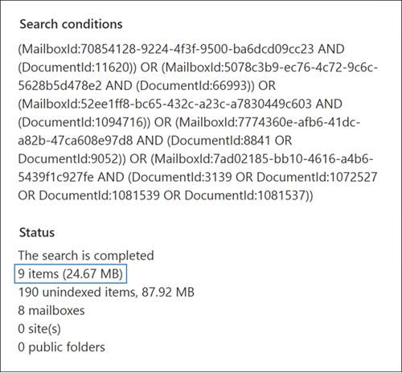

# ID リストコンテンツ検索用の CSV ファイルを準備する

特定のメールボックスの電子メール メッセージや他のメールボックス アイテムを検索するには、特定のメールボックスのExchange使用します。 ID リスト検索を作成するには、検索する特定のメールボックス アイテムを識別するコンマ区切り値 (CSV) ファイルを送信します。 この CSV ファイルでは、コンテンツ検索結果をエクスポートするか、既存のコンテンツ検索からコンテンツ検索レポートをエクスポートするときに含まれるResults.csvファイルまたはインデックスのない **Items.csv** ファイルを使用します。 次に、これらのファイルのいずれかを編集して、検索する特定のアイテムを示し、新しい ID リスト検索を作成し、CSV ファイルを送信します。

**ID リスト検索を作成する理由** アイテムが **Results.csv** ファイルまたはインデックス化されていない **Items.csv** ファイルのメタデータに基づいて電子情報開示要求に対応しているかどうかを判断できない場合は、ID リスト検索を使用して、そのアイテムを検索、プレビュー、エクスポートして、調査中のケースに対応しているかどうかを判断できます。 ID リスト検索は、通常、インデックスのないアイテムの特定のセットを検索して返す場合に使用されます。

ID リスト検索を作成するプロセスの簡単な概要を次に示します。

1. 新しい検索を作成して実行するには、Microsoft 365 コンプライアンス センター。

2. コンテンツ検索結果またはコンテンツ検索レポートをエクスポートします。 詳細については、以下を参照してください。

    - [コンテンツ検索の結果をエクスポートする](export-search-results.md)

    - [コンテンツ検索のレポートをエクスポートする](export-a-content-search-report.md)

3. ID リスト **Results.csv** に含める特定のメールボックス アイテムItems.csvファイルまたはインデックス解除されたファイルを編集し、特定のメールボックス アイテムを識別します。 ID リスト [検索の](#prepare-the-csv-file-for-an-id-list-search) CSV ファイルを準備する手順を参照してください。

4. 新しい ID リスト検索 (手順を参照) を [作成](#create-an-id-list-search)し、準備した CSV ファイルを送信します。 作成された検索クエリは、CSV ファイルで選択されたアイテムのみを検索します。

> [!NOTE]
> ID リストの検索は、メールボックス アイテムでのみサポートされます。 ID リスト検索では、SharePointドキュメントOneDriveを検索できません。

## ID リスト検索用の CSV ファイルを準備する

検索用の検索結果またはレポートをエクスポートした後、次の手順を実行して、ID リスト検索用の CSV ファイルを準備します。 この CSV ファイルは、ID リスト検索のすべてのアイテムを識別します。

CSV ファイルは、サイトおよび SharePoint アカウントOneDrive含まれる検索から使用できますが、ID リスト検索のメールボックス アイテムのみを選択できます。 ID リスト検索を作成するときに、SharePointまたはOneDriveでドキュメントを選択すると、CSV ファイルの検証が失敗します。

1. [データベース] **Results.csv** または **[インデックス** Items.csv] ファイルを開Excel。

2. [選択 **された] 列** に **、検索する** アイテムに対応するセルに「はい」と入力します。 検索するアイテムごとにこの手順を繰り返します。

    > [!IMPORTANT]
    > [ドキュメント ID] 列で CSV ファイルExcel開いた場合、ドキュメント **ID** 列のデータ形式が [全般] に変更されている可能性 **があります**。 これにより、アイテムのドキュメント ID が科学表記で表示されます。 たとえば、"481037338205" のドキュメント ID は"4.81037E+11" と表示されます。 この場合は、次の手順を実行して、[ドキュメント **ID]** 列のデータ形式を **[数値** ] に変更して、ドキュメント ID の正しい形式を復元する必要があります。 これを実行しない場合、CSV ファイルを使用する ID リスト検索は失敗します。

3. [ドキュメント ID] 列全体を **右クリックし** 、[セルの書式設定] **を選択します**。

4. [カテゴリ] **ボックスで** 、[数値] を **クリックします**。

5. 小数点以下の桁数を **0** に変更し **、[OK]** をクリックして変更を保存します。 [ドキュメント ID] 列の値が数値に変更されます。

    ID リスト コンテンツ検索用に送信する準備が整った CSV ファイルの例を次に示します。

    

6. CSV ファイルを保存するか、[ **名前を付けて保存** ] を使用して、別のファイル名でファイルを保存します。 どちらの場合も、必ず CSV 形式でファイルを保存してください。

## ID リスト検索の作成

次の手順では、新しい ID リスト検索を作成し、前の手順で準備した CSV ファイルを送信します。

> [!IMPORTANT]
> 検索結果またはレポートをエクスポートした後、2 日以内に ID リスト検索を作成する必要があります。 2 日以上前にエクスポートされた検索結果またはレポートの場合は、検索結果またはレポートを再エクスポートして、更新された CSV ファイルを生成する必要があります。 次に、更新された CSV ファイルのいずれかを準備し、それを使用して ID リスト検索を作成できます。

1. <https://compliance.microsoft.com> に移動し、サインインします。

2. Microsoft 365 コンプライアンス センターの左側のナビゲーション ウィンドウで [**すべてを表示**] をクリックし、[**コンテンツ検索**] をクリックします。

3. [コンテンツ検索 **] ページで** 、[ID リストで **検索] をクリックします**。

4. [ID リスト **による検索**] フライアウトで、検索に名前を付け (必要に応じて説明します) し、[参照] をクリックして、前の手順で準備した CSV ファイルを選択します。

    Microsoft 365 CSV ファイルの検証を試行します。 検証に失敗した場合は、検証エラーのトラブルシューティングに役立つ可能性があるエラー メッセージが表示されます。 ID リスト検索を作成するには、CSV ファイルを正常に検証する必要があります。

5. CSV ファイルが正常に検証された後、[検索] **をクリック** して ID リスト検索を作成します。

    生成されたクエリと推定検索結果数を示す ID リスト検索のフライアウト ページの例を次に示します。

    

    ID 検索の統計情報に表示される推定アイテムの数は、CSV ファイルで選択したアイテムの数と一致する必要があります。

6. ID リスト検索で返されるアイテムをプレビューまたはエクスポートします。

## 詳細

ID リスト検索の作成後にメールボックスを移動した場合、検索のクエリは指定されたアイテムを返します。 これは、メールボックスアイテムの **DocumentId** プロパティが、メールボックスを移動するときに変更されるためです。 まれに、ID リスト検索を作成した後にメールボックスを移動する場合は、新しいコンテンツ検索を作成し (または既存の検索の検索結果を更新する) し、検索結果またはレポートをエクスポートして、新しい ID リスト検索の作成に使用できる更新された CSV ファイルを生成する必要があります。
