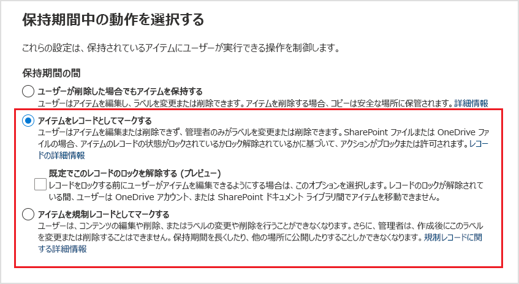

# <a name="declare-records-by-using-retention-labels"></a>保持ラベルを使用してレコードを宣言する

>*[セキュリティとコンプライアンスのための Microsoft 365 ライセンス ガイダンス](/office365/servicedescriptions/microsoft-365-service-descriptions/microsoft-365-tenantlevel-services-licensing-guidance/microsoft-365-security-compliance-licensing-guidance)。*

[!include[Purview banner](../includes/purview-rebrand-banner.md)]

ドキュメントとメールを [レコード](records-management.md#records)として宣言するには、コンテンツを **レコード** または **規制レコード** としてマークする [保持ラベル](retention.md#retention-labels)を使用します。

レコードと規制レコードのどちらを使用すればよいかわからない場合は、「[許可またはブロックされているアクションの制限を比較する](records-management.md#compare-restrictions-for-what-actions-are-allowed-or-blocked)」を参照してください。 規制レコードを使用する必要がある場合は、次のセクションで説明するように、まず PowerShell コマンドを実行する必要があります。

その後、ユーザーや管理者がラベルをコンテンツに適用できるように保持ラベル ポリシーでラベルを公開するか、アイテムをレコード (規制レコードではない) としてマークするラベルの場合は、レコードとして宣言するコンテンツにラベルを自動適用することができます。

## <a name="how-to-display-the-option-to-mark-content-as-a-regulatory-record"></a>規制レコードとしてコンテンツをマークするオプションを表示する方法

> [!NOTE]
> 次の手順は、監査ログの [[アイテム保持ポリシーと保持ラベルのアクティビティ](search-the-audit-log-in-security-and-compliance.md#retention-policy-and-retention-label-activities)] セクションの [**保持ラベルの規制レコード オプションを有効にする**] をログに記録する監査可能なアクションです。

既定では、コンテンツを規制レコードとしてマークするための保持ラベル オプションは、保持ラベル ウィザードには表示されません。 このオプションを表示するには、まず PowerShell コマンドを実行する必要があります。

1. [Office 365 セキュリティ センター/コンプライアンス センターの PowerShell への接続](/powershell/exchange/office-365-scc/connect-to-scc-powershell/connect-to-scc-powershell)。

2. 次のコマンドレットを実行します。

    ```powershell
    Set-RegulatoryComplianceUI -Enabled $true
    ````

    確認のためのメッセージが表示されることはなく、設定はすぐに有効になります。

保持ラベル ウィザードでのこのオプションの表示に関して気が変わった場合には、同じコマンドレットを **False** 値で実行することで、このオプションを再び非表示にすることができます: `Set-RegulatoryComplianceUI -Enabled $false` 

## <a name="configuring-retention-labels-to-declare-records"></a>保持ラベルを構成してレコードを宣言する

Microsoft Purview コンプライアンス ポータルの **レコード管理** ソリューションから保持ラベルを作成する場合、アイテムをレコードとしてマークするオプションがあります。 前のセクションで実行した PowerShell コマンドを実行した場合、代わりに規制レコードとしてアイテムをマークすることができます。

例:



この保持ラベルを使用することで、ラベルを必要に応じて SharePoint や OneDrive のドキュメントまたは Exchange のメールに適用できるようになりました。

詳細な手順については、以下を参照してください。

- [アイテム保持ラベルを発行してアプリに適用する](create-apply-retention-labels.md)

- [保持ラベルをコンテンツに自動的に適用する](apply-retention-labels-automatically.md) (規制レコードはサポート対象外です)

## <a name="tenant-setting-for-editing-record-properties"></a>レコードのプロパティを編集するテナント設定

保持ラベルを使用して SharePoint および OneDrive でアイテムをレコードとして (規制レコードではなく) 宣言する場合は、ファイルが 0 バイトを超える場合に[ロックされたレコード](record-versioning.md)のプロパティをユーザーが編集できる既定のテナント設定を変更する必要があるかどうかを検討してください。

この既定値を変更するには、[Microsoft Purview コンプライアンス ポータル](https://compliance.microsoft.com/) > **[レコード管理]** > **[レコード管理設定]** > **[保持ラベル]** > **[レコードのプロパティの編集を許可する]** の順に移動し、**[ユーザーにレコードのプロパティの編集を許可する]** の設定をオフにします。

## <a name="applying-the-configured-retention-label-to-content"></a>コンテンツに構成した保持ラベルを適用する

アイテムをレコードや規制レコードとしてマークする保持ラベルをユーザーがアプリ内で適用できるようにする場合:

- Exchange の場合、メールボックスへの書き込みアクセス権を持つすべてのユーザーは、これらのラベルを適用できます。
- SharePoint および OneDrive の場合、既定のメンバー グループ (投稿アクセス許可レベル) のすべてのユーザーがこれらのラベルを適用できます。

保持ラベルを使用してレコードとしてマークされたドキュメントの例は、以下のとおりです。


## <a name="searching-the-audit-log-for-labeled-items-that-were-declared-records"></a>レコードとして宣言されたラベル付きアイテムの監査ログを検索する

アイテムをレコードとして宣言するためのラベル付け操作は、監査ログに記録されます。

SharePoint アイテムについて:
- **ファイルアクティビティとページ アクティビティ** から、ファイルの [**変更された保持ラベル**] を選択します。 この監査イベントは、アイテムをレコード、規制レコード、または標準の保持ラベルとしてマークする保持ラベルに対するものです。

Exchange アイテムの場合:
- **Exchange メールボックス アクティビティ** で、 [**メッセージをレコードとしてラベル付け**] を選択します。 この監査イベントは、アイテムをレコード、規制レコード、としてマークする保持ラベルに対するものです。

これらのイベントの検索に関する詳細情報については、「[セキュリティ/コンプライアンス センターで監査ログを検索する](search-the-audit-log-in-security-and-compliance.md#file-and-page-activities)」を参照してください。

## <a name="next-steps"></a>次の手順

[SharePoint または OneDrive に保存されているレコードを更新するためにレコードのバージョン管理](record-versioning.md)を使用する方法を理解する。
