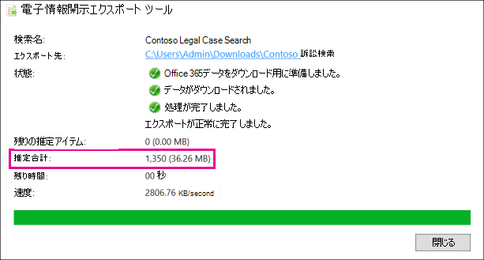

# 推定電子情報開示検索結果と実際の電子情報開示検索結果の違い

[!include[Purview banner](../includes/purview-rebrand-banner.md)]

この記事は、次のMicrosoft 365電子情報開示ツールのいずれかを使用して実行できる検索に適用されます。 

- コンテンツ検索
- 電子情報開示 (標準)

電子情報開示検索を実行すると、使用しているツールによって、検索条件に一致するアイテムの数 (およびその合計サイズ) の見積もりが返されます。 たとえば、Microsoft Purview コンプライアンス ポータルで検索を実行すると、選択した検索のポップアップ ページに推定検索結果が表示されます。
  

  
これは、結果をローカル コンピューターにエクスポートするときに電子情報開示エクスポート ツールに表示されるアイテムの合計サイズとアイテム数の見積もりと同じであり、検索結果と共にダウンロードされた [概要のエクスポート] レポートに表示されます。
  
**電子情報開示エクスポート ツールの推定結果**

  
**エクスポートの概要レポートの推定結果**

![推定検索結果は、[エクスポートの概要] レポートに含まれます。](../media/44b579da-86c2-4f33-81b5-84d604003eda.png)
  
ただし、エクスポートの概要レポートの前のスクリーンショットでわかるように、ダウンロードされる実際の検索結果のサイズと数は、推定検索結果のサイズと数と異なります。
  

  
これらの違いのいくつかの理由を次に示します。
  
- **結果の推定方法**。 検索結果の見積もりは、検索クエリ条件を満たすアイテムの見積もり (実際の数ではなく) です。 Exchangeアイテムの見積もりをコンパイルするために、検索条件を満たすメッセージ ID の一覧が、使用している電子情報開示ツールによってExchange データベースから要求されます。 ただし、検索結果をエクスポートすると、検索が再実行され、実際のメッセージがExchange データベースから取得されます。 したがって、これらの違いは、アイテムの推定数と実際のアイテム数の決定方法が原因で発生する可能性があります。

- **検索結果の見積もりとエクスポート時の間に発生する変更**。 検索結果をエクスポートすると、検索が再開され、検索条件を満たす検索インデックス内の最新のアイテムが収集されます。 推定検索結果が収集されてから検索結果がエクスポートされたまでの間に、検索条件を満たす追加のアイテムが作成、送信、または受信された可能性があります。 検索結果がエクスポートされる前にコンテンツの場所から削除されたため、検索結果が推定されたときに検索インデックスに含まれたアイテムが存在しなくなった可能性もあります。 この問題を軽減する 1 つの方法は、電子情報開示検索の日付範囲を指定することです。 もう 1 つの方法は、アイテムが保持され、削除できないように、コンテンツの場所にホールドを配置することです。

   推定検索結果とエクスポートされた検索結果の違いを示すその他の問題を次に示します。

  - 日付クエリを使用する場合のアイテムの増加。 これは通常、次の 2 つのことが原因で発生します。

  - SharePointでバージョン管理を保持します。 保持され、かつドキュメントのバージョン管理が有効にされたサイトからドキュメントが削除された場合、その削除されたドキュメントのすべてのバージョンが保持されます。

  - 予定表アイテム。 メッセージを受け入れて拒否すると、定期的な会議は、古い日付のバックグラウンドで新しいアイテムの作成を自動的に続行します。

  - 保留では、同じアイテムがユーザーのプライマリ メールボックスとアーカイブ メールボックスに保持される場合があります。 これは、ユーザーが手動でアイテムをアーカイブに移動したときに発生する可能性があります。

  - 保留が適用された場合でもまれですが、組み込みの予定表アイテムのメンテナンス (ユーザーは編集できませんが、多くの検索結果に含まれます) は、随時削除される可能性があります。 予定表アイテムを定期的に削除すると、エクスポートされるアイテムが少なくなります。

- **インデックスが設定されていないアイテム**。 検索のインデックスが設定されていないアイテムは、推定検索結果と実際の検索結果の間で違いを引き起こす可能性があります。 検索結果をエクスポートするときに、インデックスのないアイテムを含めることができます。 検索結果をエクスポートするときにインデックスのないアイテムを含めると、エクスポートされるアイテムが増える可能性があります。 これにより、推定検索結果とエクスポートされた検索結果の違いが発生します。

    コンテンツ検索ツールを使用する場合は、検索結果をエクスポートするときにインデックスのないアイテムを含めるオプションがあります。 検索によって返されるインデックスのないアイテムの数は、他の推定検索結果と共にポップアップ ページに一覧表示されます。 インデックスが設定されていないアイテムも、推定検索結果の合計サイズに含まれます。 検索結果をエクスポートする場合は、インデックスのないアイテムを含めるか含めないようにするかを選択できます。 これらのオプションを構成する方法により、ダウンロードされる推定検索結果と実際の検索結果の違いが生じる可能性があります。

- **すべてのコンテンツの場所を含むコンテンツ検索の結果をエクスポート** します。 結果をエクスポートする検索が組織内のすべてのコンテンツの場所を検索した場合、検索条件に一致するアイテムを含むコンテンツの場所からのインデックスのないアイテムのみがエクスポートされます。 In other words, if no search results are found in a mailbox or site, then any unindexed items in that mailbox or site won't be exported. ただし、すべてのコンテンツの場所のインデックスのないアイテム (検索クエリに一致するアイテムが含まれていないアイテムも) は、推定検索結果に含まれます。

    または、エクスポートする検索結果に特定のコンテンツの場所が含まれている場合は、検索で指定されたすべてのコンテンツの場所からインデックスが設定されていないアイテム (検索条件によって除外されていない) がエクスポートされます。 この場合、インデックスのないアイテムの推定数と、エクスポートされるインデックスのないアイテムの数は同じである必要があります。

    組織内のすべての場所からインデックスのないアイテムをエクスポートしない理由は、エクスポート エラーの可能性が高まり、検索結果のエクスポートとダウンロードにかかる時間が長くなる可能性があるためです。

- **SharePointおよびOneDriveのインデックスが設定されていないアイテムは、検索の見積もりには含まれません**。 SharePoint サイトとOneDrive for Business アカウントのインデックスが設定されていないアイテムは、推定検索結果には含まれません。 これは、インデックス付けされていないアイテムのデータがSharePoint インデックスに含まれていないためです。 メールボックスのインデックスのないアイテムのみが検索の見積もりに含まれます。 ただし、検索結果をエクスポートするときにインデックスのないアイテムを含めると、SharePointとOneDriveにインデックスが設定されていないアイテムが含まれ、実際にエクスポートされるアイテムの数が増えます。 これにより、推定結果 (SharePoint サイトとOneDrive サイトにインデックスのないアイテムは含まれません) と、ダウンロードされた実際のアイテムの間に違いが生じます。 検索条件に一致するアイテムを含むコンテンツの場所からのみインデックスのないアイテムをエクスポートするルールは、この状況でも適用されます。

- **SharePointおよびOneDriveのドキュメント バージョン**。 SharePoint サイトとOneDrive アカウントを検索する場合、ドキュメントの複数のバージョンは、推定検索結果の数に含まれません。 ただし、検索結果をエクスポートするときに、すべてのドキュメント バージョンを含めるオプションがあります。 検索結果をエクスポートするときにドキュメント バージョンを含めると、エクスポートされたアイテムの実際の数 (および合計サイズ) が増えます。

- **フォルダーをSharePointします**。 SharePoint内のフォルダーが検索クエリと一致する場合 (たとえば、日付による検索) では、検索の見積もりには、最後に変更された日付範囲を持つそれらのフォルダーの数が含まれます (ただし、それらのフォルダー内のアイテムは含まれません)。 検索結果をエクスポートすると、フォルダー内のアイテムはエクスポートされますが、実際のフォルダーはエクスポートされません。 その結果、エクスポートされたアイテムの数が推定検索結果の数を超えることになります。 フォルダーが空の場合、実際のフォルダーはエクスポートされないため、エクスポートされた実際の検索結果の数は 1 項目減ります。

   > [!NOTE]
   > クエリ ベースの検索を実行する場合は、次の条件をクエリ`NOT(ContentType:folder)`に追加することで、SharePoint フォルダーを除外できます。

- **リストをSharePointします**。 SharePoint リストの名前が検索クエリと一致する場合、検索の見積もりには、リスト内のすべてのアイテムの数が含まれます。 検索結果をエクスポートすると、リスト (およびリスト アイテム) が単一の CSV ファイルとしてエクスポートされます。 これにより、実際にエクスポートされたアイテムの数が減ります。 リストに添付ファイルが含まれている場合、添付ファイルは別のドキュメントとしてエクスポートされ、エクスポートされるアイテムの数も増えます。

   > [!NOTE]
   > クエリベースの検索を実行する場合は、次の条件をクエリ`NOT(ContentType:list)`に追加することで、SharePointリストを除外できます。

- **Raw ファイル形式とエクスポートされたファイル形式**。 Exchangeアイテムの場合、検索結果の推定サイズは、未加工のExchangeメッセージ サイズを使用して計算されます。 ただし、電子メール メッセージは PST ファイルまたは個々のメッセージ (EML ファイルとして書式設定) としてエクスポートされます。 これらのエクスポート オプションはどちらも未加工のExchange メッセージとは異なるファイル形式を使用するため、エクスポートされたファイル サイズの合計が推定ファイル サイズと異なります。

- **エクスポート中にExchange項目の重複を取り除く**。 Exchange項目の場合、重複除去によってエクスポートされる項目の数が減ります。 検索結果をエクスポートするときに、重複を取り除くオプションがあります。 Exchange メッセージの場合は、メッセージが複数のメールボックスに存在する場合でも、メッセージの 1 つのインスタンスのみがエクスポートされることを意味します。 推定検索結果には、メッセージのすべてのインスタンスが含まれます。 そのため、検索結果をエクスポートするときに重複除去オプションを選択した場合、エクスポートされるアイテムの実際の数は、推定アイテム数を大幅に下回る可能性があります。

検索結果レポート (Results.csv ファイル) には、重複する各メッセージのエントリが含まれており、重複するメッセージが存在するソース メールボックスを識別します。 これにより、重複するメッセージを含むすべてのメールボックスを識別できます。

> [!NOTE]
> 検索結果をエクスポートするとき、またはレポートをダウンロードするときに、[ **暗号化されたアイテムを含める] または [認識されない形式** ] オプションを選択しない場合、インデックス エラー レポートはダウンロードされますが、エントリはありません。 これは、インデックス作成エラーがないことを意味するものではありません。 これは、インデックスが設定されていない項目がエクスポートに含まれていなかったことを意味するだけです。
