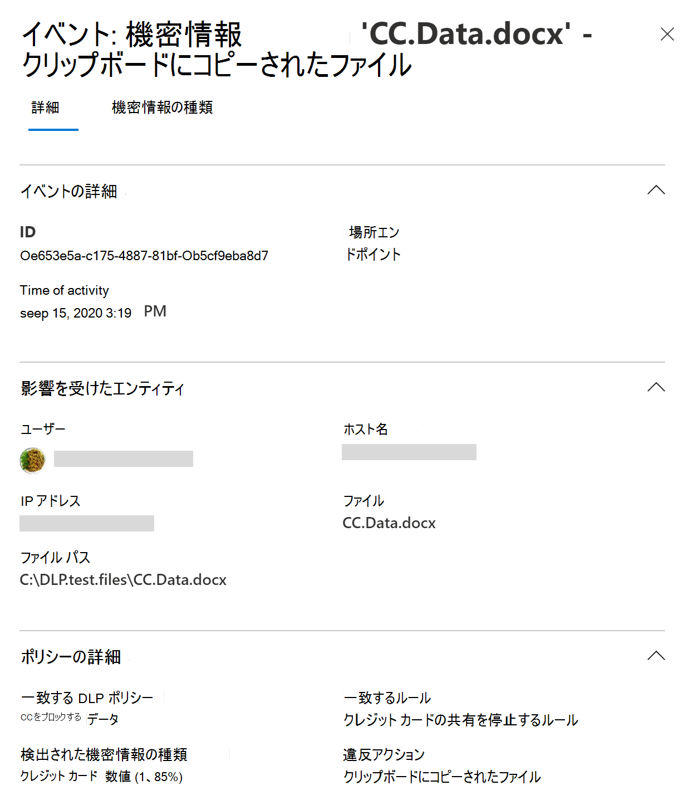
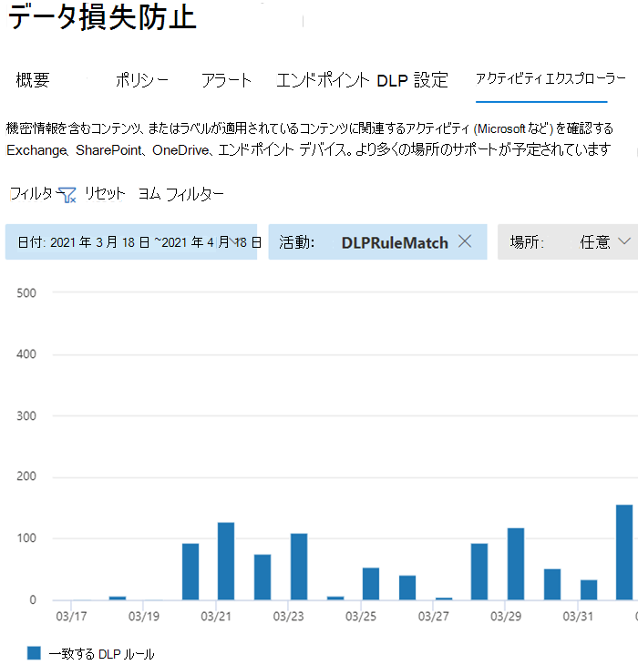

# データ損失防止について

組織には、財務データ、専有データ、クレジット カード番号、健康記録、社会保障番号などの機密情報が管理されています。 この機密データを保護し、リスクを軽減するために、ユーザーがそれを持つべきではないユーザーと不適切に共有するのを防ぐ方法が必要です。 この方法は、データ損失防止 (DLP) と呼ばれています。

このMicrosoft 365、DLP ポリシーを定義して適用することで、データ損失防止を実装します。 DLP ポリシーを使用すると、次に示す間で機密性の高いアイテムを特定、監視、および自動的に保護できます。

- Microsoft 365、Teams、Exchange、SharePointなどのOneDrive
- Office、Word、Excel、PowerPoint
- Windows 10エンドポイント
- Microsoft 以外のクラウド アプリ
- オンプレミスのファイル共有とオンプレミス のSharePoint。

Microsoft 365単純なテキスト スキャンではなく、ディープ コンテンツ分析を使用して機密性の高いアイテムを検出します。 コンテンツは、キーワードに一致するプライマリ データ、正規表現の評価、内部関数の検証、プライマリ データの一致に近いセカンダリ データの一致によって分析されます。 その他の DLP では、機械学習アルゴリズムや他の方法を使用して、DLP ポリシーに一致するコンテンツを検出します。

## DLP は、大規模なコンプライアンスMicrosoft 365の一部です

Microsoft 365DLP は、機密性の高いMicrosoft 365場所や旅行場所の保護に役立つコンプライアンス ツールの 1 つにすすめることができます。 コンプライアンス ツール セットの他のツールMicrosoft 365、そのツールがどのようにインテレートし、より良い作業を行うのかについて理解する必要があります。  情報保護[プロセスMicrosoft 365詳細については、「](protect-information.md)コンプライアンス ツール」を参照してください。

## DLP ポリシーの保護アクション

Microsoft 365DLP ポリシーは、ユーザーが安静時に機密性の高いアイテム、転送中の機密性の高いアイテム、または使用されている機密性の高いアイテムに対して行うアクティビティを監視し、保護アクションを実行する方法です。 たとえば、ユーザーが機密アイテムを未承認の場所にコピーしたり、ポリシーに記載されている電子メールや他の条件で医療情報を共有したりなど、禁止されたアクションを実行しようとすると、DLP は次の処理を実行できます。

- 機密性の高いアイテムを不適切に共有しようとしている可能性があるという警告を表示するポップアップ ポリシー ヒントをユーザーに表示する
- 共有をブロックし、ポリシー ヒントを使用して、ユーザーがブロックを上書きしてユーザーの正当性を取得できます。
- オーバーライド オプションなしで共有をブロックする
- 保存中のデータの場合、機密アイテムをロックして安全な検疫場所に移動できます
- チャットTeams、機密情報は表示されません

DLP 監視対象のすべてのアクティビティは、既定で監査Microsoft 365[に記録され](search-the-audit-log-in-security-and-compliance.md)、アクティビティ エクスプローラー[にルーティングされます](data-classification-activity-explorer.md)。 ユーザーが DLP ポリシーの条件を満たすアクションを実行し、アラートが構成されている場合、DLP は DLP アラート管理ダッシュボードにアラート [を提供します](dlp-configure-view-alerts-policies.md)。

## DLP ライフサイクル

DLP の実装は、通常、これらの主要なフェーズに従います。

- [DLP を計画する](#plan-for-dlp)
- [DLP の準備](#prepare-for-dlp)
- [実稼働環境でのポリシーの展開](#deploy-your-policies-in-production)

<!--ADD DIAGRAM OF THE DLP LIFECYCLE WORK ON WITH MAS-->

### DLP を計画する

Microsoft 365DLP の監視と保護は、ユーザーが毎日使用するアプリケーションにネイティブです。 これにより、ユーザーがデータ損失防止の考え方やプラクティスに慣れていなくても、組織の機密性の高いアイテムを危険なアクティビティから保護できます。 組織とユーザーがデータ損失防止の実践に新しい場合、DLP の導入にはビジネス プロセスの変更が必要になる場合があります。また、ユーザーにはカルチャの変化が生じます。 ただし、適切な計画、テスト、チューニングを行う場合、DLP ポリシーは機密アイテムを保護し、ビジネス プロセスの中断を最小限に抑えることができます。

**DLP のテクノロジ計画**

テクノロジとしての DLP は、Microsoft 365 サービス、Windows 10 デバイス、オンプレミスのファイル共有、およびオンプレミス SharePoint 全体で、保存中のデータ、使用中のデータ、および動作中のデータを監視および保護できます。 さまざまな場所、監視および保護するデータの種類、およびポリシーの一致が発生した場合に実行するアクションに対する計画上の影響があります。

**DLP のビジネス プロセス計画**

DLP ポリシーでは、電子メールによる機密情報の不適切な共有など、禁止されているアクティビティをブロックできます。 DLP ポリシーを計画する場合は、機密性の高いアイテムに触れるビジネス プロセスを特定する必要があります。 ビジネス プロセスの所有者は、許可する必要がある適切なユーザーの動作と、保護すべき不適切なユーザーの動作を特定するのに役立ちます。 ポリシーを計画し、テスト モードで展開し、より制限の厳しいモードで適用する前に、まずアクティビティ エクスプローラーを介して影響を評価する必要があります。

**DLP の組織のカルチャ計画**

DLP の実装の成功は、ユーザーが十分に計画され調整されたポリシーと同じ量のデータ損失防止プラクティスをトレーニングし、慣れ親しんだものに依存します。 ユーザーの関与が大きすぎるので、ユーザーのトレーニングも計画してください。 ポリシーの適用をテスト モードから制限の厳しいモードに変更する前に、ポリシー ヒントを戦略的に使用してユーザーに対する認識を高めます。

<!--For more information on planning for DLP, including suggestions for deployment based on your needs and resources, see [Planning for Microsoft 365 data loss prevention](dlp-plan-for-dlp.md).-->

### DLP の準備

DLP ポリシーは、保存中のデータ、使用されているデータ、次のような場所で動作中のデータに適用できます。

- Exchange Onlineメール
- SharePoint Online サイト
- OneDrive アカウント
- Teams チャットおよびチャネル メッセージ
- Microsoft Cloud App Security
- Windows 10 デバイス
- オンプレミス リポジトリ

それぞれの前提条件は異なります。 一部の場所 (Exchange オンラインなど) の機密性の高いアイテムは、該当するポリシーを構成するだけで DLP の傘下に持ち込む可能性があります。 オンプレミスのファイル リポジトリなど、他のユーザーには Azure Information Protection (AIP) スキャナーの展開が必要です。 ブロックアクションをアクティブ化する前に、環境を準備し、下書きポリシーをコード化し、それらを徹底的にテストする必要があります。

### 実稼働環境でのポリシーの展開

#### ポリシーを設計する

まず、コントロールの目標を定義し、それぞれのワークロードに適用する方法を定義します。 目標を具現化するポリシーを作成します。 一度に 1 つのワークロードから、またはすべてのワークロードで自由に開始できます。まだ影響はありません。

#### テスト モードでのポリシーの実装

コントロールをテスト モードで DLP ポリシーで実装して、コントロールの影響を評価します。 テスト モードですべてのワークロードにポリシーを適用して、結果を得ることができますが、必要に応じて 1 つのワークロードから開始できます。

#### 結果を監視し、ポリシーを微調整する

テスト モードでは、ポリシーの結果を監視し、コントロールの目標を満たして調整しながら、有効なユーザー ワークフローと生産性に悪影響を及ぼしたり、不注意に影響を与えなかったりします。 微調整する例を次に示します。

- スコープ内またはスコープ外の場所と人/場所を調整する
- アイテムがポリシーと一致するかどうかを判断するために使用される条件と例外を調整する
- 機密情報の定義/s
- アクション
- 制限のレベル
- 新しいコントロールを追加する
- 新しいユーザーを追加する
- 新しい制限付きアプリを追加する
- 新しい制限付きサイトを追加する

#### コントロールを有効にしてポリシーを調整する

ポリシーがすべての目標を満たしたら、有効にしてください。 引き続きポリシー アプリケーションの結果を監視し、必要に応じて調整します。 一般に、ポリシーは有効になってから約 1 時間後に有効になります。

<!--See, LINK TO topic for SLAs for location specific  details-->

## DLP ポリシー構成の概要

DLP ポリシーを作成および構成する方法に柔軟性があります。 定義済みのテンプレートから開始し、わずか数クリックでポリシーを作成するか、最初から独自のテンプレートを設計できます。 どちらを選んでも、すべての DLP ポリシーは、ユーザーから同じ情報を必要とします。

1. **監視対象を選択します**。 - Microsoft 365に役立つ多くの定義済みポリシー テンプレートが付属しているか、カスタム ポリシーを作成できます。
    - 定義済みのポリシー テンプレート: 財務データ、医療および健康データ、さまざまな国および地域のプライバシー データ。
    - 使用可能な機密情報の種類、保持ラベル、および機密ラベルを使用するカスタム ポリシー。
2. **監視する場所を選択する** - DLP で機密情報を監視する 1 つ以上の場所を選択します。 次の情報を監視できます。

場所 | 包含 / 除外|
|---------|---------|
|Exchange メール| 配布グループ|
|SharePoint サイト |sites |
|OneDrive アカウント |アカウントまたは配布グループ |
|Teams チャットおよびチャネル メッセージ |アカウント |
|Windows 10 デバイス |ユーザーまたはグループ |
|Microsoft Cloud App Security |インスタンス |
|オンプレミス リポジトリ| リポジトリ ファイルのパス|

3. **アイテムに適用する** ポリシーに一致する必要がある条件を選択します。事前に構成された条件を受け入れるか、カスタム条件を定義できます。 次に例を示します。

- アイテムには、特定のコンテキストで使用されている特定の種類の機密情報が含まれる。 たとえば、組織外の受信者に電子メールで送信される 95 の社会保障番号。
- アイテムの感度ラベルが指定されている
- 機密情報を含むアイテムは、内部または外部で共有されます。

4. **ポリシー条件が満たされた場合** に実行するアクションを選択します。アクションは、アクティビティが発生している場所によって異なります。  次に例を示します。

- SharePoint/Exchange/OneDrive: コンテンツにアクセスする組織フォーム外のユーザーをブロックします。 ヒントをユーザーに表示し、DLP ポリシーで禁止されているアクションを実行しているという電子メール通知を送信します。
- Teamsチャットとチャネル: 機密情報がチャットまたはチャネルで共有されるのをブロックする
- Windows 10デバイス: 機密性の高いアイテムの削除可能な USB デバイスへのコピーを監査または制限する
- Officeアプリ: 危険な動作を行っているユーザーに通知するポップアップを表示し、オーバーライドをブロックまたはブロックします。
- オンプレミスのファイル共有: ファイルを保存場所から検疫フォルダーに移動する

> [!NOTE]
> 条件と実行するアクションは、Rule と呼ばれるオブジェクトで定義されます。

<!--## Create a DLP policy

All DLP policies are created and maintained in the Microsoft 365 Compliance center. See, INSERT LINK TO ARTICLE THAT WILL START WALKING THEM THROUGH THE POLICY CREATION PROCEDURES for more information.-->

コンプライアンス センターで DLP ポリシーを作成すると、そのポリシーは中央ポリシー ストアに格納され、次に示すさまざまなコンテンツ ソースに同期されます。

- Exchange Online、そこから Outlook on the web、Outlook。
- OneDrive for Business サイト。
- SharePoint Online サイト。
- Office デスクトップ プログラム (Excel、PowerPoint、Word)。
- Microsoft Teams チャネルおよびチャット メッセージ。

ポリシーが適切な場所に同期されると、コンテンツの評価とアクションの適用が開始されます。

## ポリシー アプリケーションの結果の表示

DLP は、監視、ポリシーの一致Microsoft 365アクション、およびユーザー アクティビティから、膨大な量の情報をレポートします。 機密アイテムに対して行うポリシーとトリアージアクションを調整するには、その情報を使用して処理する必要があります。 テレメトリは、コンプライアンス センター監査ログMicrosoft 365最初に処理され、さまざまなレポート ツールに移動します。 各レポート ツールの目的は異なります。

### DLP アラート ダッシュボード

DLP が機密性の高いアイテムに対してアクションを実行すると、構成可能なアラートを介してそのアクションの通知を受け取る可能性があります。 コンプライアンス センターでは、これらのアラートをメールボックスに重ね合せするのではなく [、DLP アラート](dlp-configure-view-alerts-policies.md)管理ダッシュボードで利用できます。 DLP アラート ダッシュボードを使用して、アラートの構成、確認、トリアージ、DLP アラートの解決の追跡を行います。 ポリシーの一致と、デバイスからのアクティビティによって生成されるアラートのWindows 10します。

> [!div class="mx-imgBorder"]
> 

同じダッシュボードで、リッチ メタデータに関連付けられたイベントの詳細を表示することもできます

> [!div class="mx-imgBorder"]
> 

### レポート

[DLP レポートは、時間](view-the-dlp-reports.md#view-the-reports-for-data-loss-prevention)の流れによって広い傾向を示し、以下に関する具体的な分析情報を提供します。

- **DLP ポリシー 時間の間に** 一致し、日付範囲、場所、ポリシー、またはアクションでフィルター処理する
- **DLP インシデントの一致** では、時間の長い間一致が表示されますが、ポリシー ルールではなくアイテムのピボットが表示されます。
- **DLP の誤検知と上書** きは、誤検知の数と、構成されている場合は、ユーザーの正当性と共にユーザーオーバーライドを示します。

### DLP アクティビティ エクスプローラー

DLP ページの [アクティビティ エクスプローラー]タブには *、DLPRuleMatch に対するアクティビティ フィルターのプリセットがあります*。 このツールを使用して、機密情報を含むコンテンツやラベルが適用されているコンテンツに関連するアクティビティ (ラベルの変更、ファイルの変更、ルールの一致など) を確認します。

詳細については、「アクティビティ エクスプローラーの [使用を開始する」を参照してください。](data-classification-activity-explorer.md)

DLP の詳細についてはMicrosoft 365参照してください。

- [Microsoft 365 のエンドポイントのデータ損失防止についての詳細情報](endpoint-dlp-learn-about.md)
- [Microsoft Teams の既定のデータ損失防止ポリシーについての詳細情報 (プレビュー)](dlp-teams-default-policy.md)
- [Microsoft 365 のエンドポイントのデータ損失防止について学ぶ (プレビュー) ](dlp-on-premises-scanner-learn.md)
- [Microsoft Compliance Extension (プレビュー) の詳細情報](dlp-chrome-learn-about.md)
- [データ損失防止の警告ダッシュボードについて](dlp-alerts-dashboard-learn.md)

データ損失防止を使用してデータ プライバシー規制に準拠する方法については、「データプライバシー規制に関する情報保護を展開する (Microsoft 365 (aka.ms/m365dataprivacy)」を参照してください。
