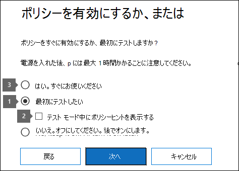

# データ損失防止 (DLP) の計画

[!include[Purview banner](../includes/purview-rebrand-banner.md)]

すべての組織のビジネス ニーズ、目標、リソース、状況は各組織固有のものなので、それぞれに異なる方法でデータ損失防止 (DLP) を計画し、実装します。 ただし、成功したすべての DLP 実装に共通する要素があります。 この記事では、DLP 計画で組織が使用するベスト プラクティスについて説明します。

## 複数の開始点

多くの組織では、さまざまな政府または業界の規制に準拠するために DLP を実装することを選択しています。 たとえば、欧州連合の一般データ保護規則 (GDPR)、または医療保険の可搬性と説明責任に関する法律 (HIPAA)、またはカリフォルニア州消費者プライバシー法 (CCPA) などです。 また、データ損失防止を実装して、知的財産を保護します。 ただし、DLP 体験の開始場所と最終的な宛先は異なります。 

組織は、DLP 体験を開始できます。

- Teamsチャットメッセージやチャネル メッセージ、またはWindows 10デバイス上の情報を保護したいなど、プラットフォームのフォーカスから
- 医療レコードなどの保護に優先順位を付け、保護するポリシーを直接定義する必要がある機密情報を把握する
- 機密情報が何であるか、どこにあるのか、誰がそれを使って何をしているのかを知らずに、検出と分類から始め、より方法論的なアプローチを取る
- 機密情報が何であるか、どこにあるのか、誰が何をしているのかを知らなくても、ポリシーの定義に直進し、その結果を出発点として使用し、そこからポリシーを絞り込みます。
- 完全な Microsoft Purview Information Protection スタックを実装する必要があることを知っているので、より長期的で方法論的なアプローチを採用する予定です

これらは、お客様が DLP にアプローチする方法の例に過ぎず、どこから始めるかは関係ありません。DLP は、最初から完全に実現されたデータ損失防止戦略まで、さまざまな種類の情報保護の体験に対応するのに十分な柔軟性を備えています。 

## 計画プロセスの概要

[Microsoft Purview データ損失防止に関する詳細情報](dlp-learn-about-dlp.md#learn-about-data-loss-prevention)では、[DLP 計画プロセス](dlp-learn-about-dlp.md#plan-for-dlp)の 3 つの異なる側面について説明します。 ここでは、すべての DLP プランに共通する要素について詳しく説明します。

### 関係者の特定

実装すると、組織の大部分に DLP ポリシーを適用できます。 IT は、悪影響を及ぼさずに、独自に広範な計画を立てることはできません。 次のことを行うことができる関係者を特定する必要があります。

- 組織が適用する規制、法律、および業界標準を説明する
- 保護する機密アイテムのカテゴリ
- で使用されるビジネス プロセス
- 制限する必要がある危険な動作
- 項目の機密性と関連するリスクに基づいて、最初に保護する必要があるデータを優先順位付けする
- DLP ポリシー一致イベントのレビューと修復プロセスの概要 
 
一般に、これらのニーズは 85% の規制とコンプライアンス保護、および 15% の知的財産保護である傾向があります。 計画プロセスに含めるロールに関する推奨事項を次に示します。

- 規制およびコンプライアンスの責任者
- 最高リスク責任者
- 法務担当者
- セキュリティとコンプライアンスの責任者
- データ 項目のビジネス所有者
- ビジネス ユーザー
- IT

### 保護する機密情報のカテゴリについて説明する

その後、利害関係者は、保護する機密情報のカテゴリと、それらが使用されているビジネス プロセスについて説明します。 たとえば、DLP では次のカテゴリが定義されます。

- 財務的 
- 医療と健康に関する情報
- プライバシー
- カスタム

利害関係者は、機密情報を"データ 処理者であるため、データ主体の情報と財務情報に対するプライバシー保護を実装する必要があります" と識別する場合があります。

 
  <!-- The business process is important as it informs the ‘data at rest’, ‘data in transit’, ‘data in use’ aspect of DLP planning and who should be sharing the items and who should not.-->

### 目標と戦略を設定する

利害関係者を特定し、どの機密情報が保護を必要とし、どこで使用されるかがわかれば、利害関係者は保護目標を設定でき、IT は実装計画を策定できます。 

 <!--
### Discovery
 for the locations (DLP workloads) of these types of items.  (mapping DLP locations and data at rest, data in transit, data in use)

### IT can start coding test policies
start small and always in test mode. Note that DLP policies can feed into insider risk.

### Business process owners help with tuning
 false positive/false negative results and fitting DLP into their business processes.

-->

### 実装計画を設定する

実装計画には次のものが含まれている必要があります。

- 開始状態と目的の終了状態と、一方から他方に取得する手順をマッピングする
- 機密アイテムの検出に対処する方法
- ポリシー計画とそれらが実装される順序
- 前提条件に対処する方法
- 適用に移行する前にポリシーを最初にテストする方法の計画
- エンド ユーザーをトレーニングする方法
- ポリシーをテストして調整する方法
- 規制、法的、業界標準、または知的財産の保護とビジネス ニーズの変化に基づいて、データ損失防止戦略を見直し、更新する方法

#### 最初から目的の終了状態にパスをマップする

組織が開始状態から目的の終了状態に移行する方法を文書化することは、関係者とのコミュニケーションとプロジェクト スコープの設定に不可欠です。 DLP の展開に一般的に使用される一連の手順を次に示します。 これ以上の詳細が必要になりますが、これを使用して DLP 導入パスをフレームに入れることもできます。

#### 機密アイテムの検出

個々の機密性の高いアイテムとその場所を検出するには、複数の方法があります。 機密ラベルが既に展開されているか、アイテムのみを検出して監査するすべての場所に広範な DLP ポリシーを展開することにした可能性があります。 詳細については、「 [データについて知る](information-protection.md#know-your-data)」を参照してください。

#### ポリシー計画

DLP の導入を開始するときに、これらの質問を使用して、ポリシーの設計と実装の取り組みに重点を置くことができます。

##### 組織が準拠する必要がある法律、規制、業界標準は何ですか?

多くの組織が規制コンプライアンスを目標に DLP に取り組んでいるため、この質問に答えることは、DLP の実装を計画するための自然な出発点です。 しかし、IT 実装者として、おそらくそれに答える立場にありません。 これは、法務チームとビジネスエグゼクティブから回答を受ける必要があります。 
 
**例** 組織は英国の対象となります。 財務規制に関する情報を提供します。

##### 漏えいから保護する必要がある組織の機密アイテムは何ですか?

組織が規制コンプライアンスのニーズの観点からどこに立っているかを把握したら、漏えいからどの機密項目を保護する必要があるか、およびそれらを保護するためにポリシーの実装に優先順位を付ける方法について理解できます。 これは、最も適切な DLP ポリシー テンプレートを選択するのに役立ちます。 Microsoft Purview には、財務、医療、健康、プライバシーに関する事前構成済みの DLP テンプレートが付属しており、カスタム テンプレートを使用して独自の DLP テンプレートを構築できます。 実際の DLP ポリシーを設計して作成する際に、この質問に対する答えを知っておくと、適切な [機密情報の種類](sensitive-information-type-learn-about.md#learn-about-sensitive-information-types)を選択するのにも役立ちます。

**例** 簡単に開始するには、ポリシー テンプレート (機密情報の`U.K. Financial Data`種類、機密情報の`Credit Card Number`種類など) を`EU Debit Card Number``SWIFT Code`選択します。 

##### 機密性の高い項目と、それらが関係するビジネス プロセスはどこにありますか?

組織の機密情報を含むアイテムは、ビジネスを行う過程で毎日使用されます。 その機密情報のインスタンスが発生する可能性がある場所と、それらが使用されているビジネス プロセスを知る必要があります。 これは、DLP ポリシーを適用する適切な場所を選択するのに役立ちます。 DLP ポリシーは、次の場所に適用されます。

- Exchange メール
- SharePoint サイト
- OneDrive アカウント
- Teams チャットおよびチャネル メッセージ
- Windows 10 デバイス
- Microsoft Defender for Cloud Apps
- オンプレミスのリポジトリ

**例** 組織の内部監査担当者は、クレジット カード番号のセットを追跡しています。 これらのスプレッドシートは、セキュリティで保護されたSharePoint サイトに保持されます。 従業員の何人かは、コピーを作成し、Windows 10 デバイスに同期される職場OneDrive for Businessサイトに保存します。 そのうちの 1 つで、そのうちの 14 個のリストをメールに貼り付け、外部監査人に送信してレビューを試みます。 セキュリティで保護されたSharePoint サイト、すべての内部監査担当者OneDrive for Businessアカウント、Windows 10 デバイス、Exchange電子メールにポリシーを適用する必要があります。

##### 漏えいに対する組織の許容範囲は何ですか?

組織内のグループによって、許容できるレベルの機密アイテム漏えいとそうでないものについて、異なるビューが表示される場合があります。 漏えいゼロの完成度を達成すると、ビジネスのコストが高すぎる可能性があります。

**例** 組織のセキュリティ グループと法務チームは、どちらも、組織外の誰ともクレジット カード番号を共有してはいけないと考え、漏えいゼロを主張します。 ただし、クレジット カード番号アクティビティの定期的なレビューの一環として、内部監査人は、一部のクレジット カード番号をサード パーティの監査人と共有する必要があります。 DLP ポリシーで組織外のクレジット カード番号の共有がすべて禁止されている場合、業務プロセスが大幅に中断され、内部監査人が追跡を完了するために中断を軽減するためのコストが追加されます。 この余分なコストは、エグゼクティブ リーダーシップには受け入れられません。 これを解決するには、許容できるレベルの漏えいを決定するための内部会話が必要です。 ポリシーが決定されると、特定の個人が情報を共有するための例外を提供したり、監査専用モードで適用したりできます。

#### 前提条件の計画

一部の DLP の場所を監視する前に、満たす必要がある前提条件があります。 「 **開始する前に」** セクションを参照してください。

- [データ損失防止のオンプレミス スキャナー (プレビュー) を開始する](dlp-on-premises-scanner-get-started.md#before-you-begin)
- [エンドポイント データ損失防止の使用を開始する](endpoint-dlp-getting-started.md#before-you-begin)
- [Microsoft コンプライアンス拡張機能を使用した概要](dlp-chrome-get-started.md#before-you-begin)
- [Microsoft 以外のクラウド アプリにデータ損失防止ポリシーを使用する (プレビュー)](dlp-use-policies-non-microsoft-cloud-apps.md#before-you-begin)

#### ポリシーの展開

DLP ポリシーを作成するときは、完全に適用する前に、影響を評価し、有効性をテストしながら、段階的に展開することを検討する必要があります。 たとえば、新しい DLP ポリシーで、何千ものドキュメントへのアクセスを意図せずにブロックしたり、既存のビジネス プロセスを中断したりすることは望まれません。
  
大きな影響を与える可能性が高い DLP ポリシーを作成している場合は、次の順序に従うことをお勧めします。
  
1. **ポリシー ヒントなしのテスト モードで開始** し、DLP レポートとインシデント レポートを使用して、影響を評価します。 DLP レポートを使用すると、ポリシー一致の回数、場所、種類、および重要度を把握できます。 結果に基づいて、必要に応じてポリシーを微調整できます。 テスト モードでは、DLP ポリシーは組織で業務に取り組んでいるユーザーの生産性に影響を与えることはありません。 また、このステージを使用して、DLP イベントのレビューと問題の修復のためにワークフローをテストします。
    
2. **通知とポリシー ヒントを使用してテスト モードに移行** し、コンプライアンス ポリシーについてユーザーに教え始め、適用されるポリシーの準備を開始できるようにします。 ポリシーヒントでポリシーの詳細を提供する組織のポリシー ページへのリンクを設定すると便利です。 この段階では、ポリシーをさらに絞り込むことができるように、ユーザーに誤検知の報告を求めることもできます。 ポリシー アプリケーションの結果が関係者が念頭に置いていた結果と一致することを確信できたら、このステージに進みます。 
    
3. **ポリシーの完全な適用を開始** し、ルールのアクションが適用され、コンテンツが保護されるようにします。 DLP レポートやインシデント レポート、通知を引き続き監視して、結果が計画どおりであることを確認します。 

    

    いつでも DLP ポリシーを無効にできます。ポリシーのすべてのルールに反映されます。 ただし、ルール エディターで状態を切り替えることで、各ルールを個別に無効にできます。

    

    ポリシー内の複数のルールの優先順位を変更することもできます。 変更するには、編集のためのポリシーを開きます。 ルールの行では、省略記号 (**...**) を選択し、[**下へ移動**] または [**最後へ移動**] などのオプションを選択します。

    

#### エンド ユーザー トレーニング

DLP ポリシーがトリガーされると、ポリシーを構成して [電子メール通知を送信し、DLP ポリシーのポリシーヒント](use-notifications-and-policy-tips.md#send-email-notifications-and-show-policy-tips-for-dlp-policies) を管理者とエンド ユーザーに表示できます。 ポリシーはまだテスト モードであり、ブロックアクションを適用するように設定される前に、ポリシーヒントは、機密アイテムに対する危険な動作に対する認識を高め、将来それらの動作を回避するようにユーザーをトレーニングする便利な方法です。  

#### DLP 要件と更新戦略を確認する

組織の対象となる規制、法律、業界標準は時間の経過と共に変化し、DLP のビジネス目標も変わります。 組織がコンプライアンスを維持し、DLP の実装が引き続きビジネス ニーズを満たすことができるように、これらのすべての領域の定期的なレビューを含める必要があります。

## デプロイの方法

|顧客のビジネスニーズの説明  | アプローチ  |
|---------|---------|
|**Contoso Bank** は厳しく規制された業界にあり、さまざまな場所にさまざまな種類の機密アイテムがあります。   - 最も優先度の高い機密情報の種類を認識します。   - ポリシーがロールアウトされるため、ビジネスの中断を最小限に抑える必要があります。   - IT リソースがあり、専門家を採用して計画、設計のデプロイを支援できます   - Microsoft とのプレミア サポート契約を持っている| - 時間をかけて、準拠する必要がある規制と、準拠する方法を理解します。   -時間をかけて、Microsoft Purview Information Protection スタックのより適切な結合値を理解する   - 優先順位付けされた項目の秘密度ラベル付けスキームを開発し、適用する   - ビジネス プロセスの所有者を含む  - デザイン/コード ポリシー、テスト モードでのデプロイ、ユーザーのトレーニング  - 繰り返し|
|**TailSpin Toys** は、それらが何を持っているか、どこにあるかわからないため、リソースの深さはほとんどありません。 Teams、OneDrive for Business、Exchangeを広範に使用します。     |- 優先順位の付いた場所に対する単純なポリシーから始めます。  - 識別される内容を監視する  - それに応じて秘密度ラベルを適用する  - ポリシーを絞り込み、ユーザーをトレーニングする       |
|**Fabrikam** は小規模なスタートアップであり、その知的財産を保護する必要があり、迅速に移行する必要があります。 一部のリソースを割り当てることもできますが、外部の専門家を採用する余裕はありません。  - 機密アイテムはすべてMicrosoft 365 OneDrive for Business/SharePoint  - OneDrive for BusinessとSharePointの導入が遅い、従業員/シャドウ IT が DropBox と Google ドライブを使用してアイテムを共有/保存する  - 従業員は、データ保護規範よりも仕事のスピードを高めます  - 顧客が急増し、18 人の従業員全員が新しいデバイスWindows 10購入しました     |- Teamsの既定の DLP ポリシーを利用する  - SharePointアイテムの既定の設定で制限を使用する  - 外部共有を防止するポリシーを展開する  - 優先度の高い場所にポリシーをデプロイする  - Windows 10 デバイスにポリシーを展開する  - OneDrive for Business以外のクラウド ストレージへのアップロードをブロックする      |

<!--

## Planning for workloads

### Exchange

### SharePoint

### OneDrive for Business

### Teams

### Windows 10 Devices

### Microsoft Cloud App Security (MCAS)

### On-premises Scanner
-->

## 関連項目
- [データ損失防止について](dlp-learn-about-dlp.md#learn-about-data-loss-prevention)
