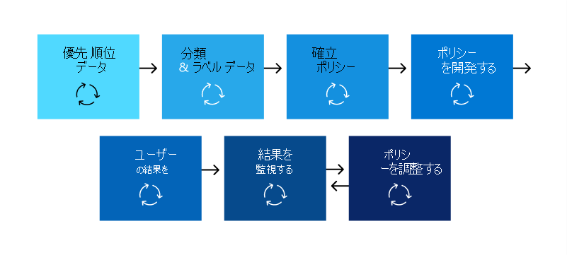

# データ損失防止 (DLP) の計画

すべての組織がデータ損失防止 (DLP) の計画と実装を異なる方法で行うのは、すべての組織のビジネス ニーズ、目標、リソース、および状況が固有のためです。 ただし、すべての成功した DLP 実装に共通する要素があります。 この記事では、DLP 計画で組織が使用するベスト プラクティスについて説明します。

## 複数の開始点

多くの組織は、さまざまな政府または業界の規制に準拠するために DLP を実装する選択をしています。 たとえば、欧州連合の一般データ保護規則 (GDPR)、健康保険の移植性と説明責任法 (HIPAA)、またはカリフォルニア州消費者プライバシー法 (CCPA) などです。 また、データ損失防止を実装して知的財産を保護します。 ただし、DLP ジャーニーの開始場所と最終的な宛先は異なります。 

組織は DLP ジャーニーを開始できます。

- チャットメッセージやチャネル メッセージ、またはデバイス上の情報Teams保護する場合など、プラットフォームWindows 10。
- 医療記録などの保護に優先順位を付ける機密情報を知り、それを保護するためのポリシーの定義に直行する
- 機密情報が何か、どこにいて、誰が何をしているのかを知らずに、発見と分類から始め、より方法的なアプローチを取る
- 機密情報が何か、どこにいるのか、誰が何をしているのかを知らずに、ポリシーの定義に直接移行し、その結果を開始場所として使用し、そこからポリシーを絞り込む
- 情報保護スタック全体を実装する必要Microsoft 365、より長期的で方法的なアプローチを取るつもり

これらは、お客様が DLP にアプローチする方法のほんの一部の例であり、どこから始めても問題ありません。Microsoft 365 DLP は、さまざまな種類の情報保護の手順を最初から完全に実現されたデータ損失防止戦略に対応するのに十分な柔軟性を備えています。 

## 計画プロセスの概要

「 [データ損失防止について」では、DLP](dlp-learn-about-dlp.md#learn-about-data-loss-prevention) 計画プロセスの 3 つの異なる側面 [について説明します](dlp-learn-about-dlp.md#plan-for-dlp)。 ここでは、すべての DLP プランに共通する要素について詳しく説明します。

### 関係者の特定

実装すると、組織の大部分で DLP ポリシーを適用できます。 IT では、否定的な結果が生じることなく、広範囲にわたる計画を独自に開発できない。 以下を実行できる関係者を特定する必要があります。

- 組織が対象となる規制、法律、および業界標準について説明する
- 保護する機密アイテムのカテゴリ
- で使用されるビジネス プロセス
- 制限する必要があるリスクの高い動作
- アイテムの感度と関連するリスクに基づいて、最初に保護するデータに優先順位を付ける
- DLP ポリシー一致イベントのレビューと修復プロセスの概要 
 
一般に、これらのニーズは 85% の規制とコンプライアンス保護、および 15% の知的財産保護である傾向があります。 計画プロセスに含める役割に関する提案を次に示します。

- 規制およびコンプライアンス担当者
- 最高リスク責任者
- 法務担当者
- セキュリティおよびコンプライアンス担当者
- データ アイテムのビジネス所有者
- ビジネス ユーザー
- IT

### 保護する機密情報のカテゴリを説明する

その後、関係者は、保護する機密情報のカテゴリと、その中で使用されるビジネス プロセスについて説明します。 たとえば、次のMicrosoft 365 DLP によって定義されます。

- 財務的 
- 医療と健康に関する情報
- プライバシー
- カスタム

関係者は機密情報を「データ 処理者なので、データ主体情報と財務情報に対するプライバシー保護を実装する必要がある」と識別する場合があります。

 
  <!-- The business process is important as it informs the ‘data at rest’, ‘data in transit’, ‘data in use’ aspect of DLP planning and who should be sharing the items and who should not.-->

### 目標と戦略を設定する

利害関係者を特定し、保護が必要な機密情報とその使用場所を知った後、関係者は保護目標を設定し、IT は実装計画を策定できます。 

 <!--
### Discovery
 for the locations (DLP workloads) of these types of items.  (mapping DLP locations and data at rest, data in transit, data in use)

### IT can start coding test policies
start small and always in test mode. Note that DLP policies can feed into insider risk.

### Business process owners help with tuning
 false positive/false negative results and fitting DLP into their business processes.

-->

### 実装計画の設定

実装計画には、次のものが含まれる必要があります。

- 開始状態と目的の終了状態、および 1 から別の状態に取得する手順をマッピングする
- 機密性の高いアイテムの検出に対処する方法
- ポリシーの計画と、ポリシーが実装される順序
- 前提条件に対処する方法
- 適用に移行する前にポリシーを最初にテストする方法を計画する
- エンド ユーザーのトレーニング方法
- ポリシーのテストと調整方法
- 変化する規制、法律、業界標準、または知的財産保護およびビジネス ニーズに基づいて、データ損失防止戦略を確認および更新する方法

#### 開始から目的の終了状態へのパスをマップする

組織の開始状態から目的の終了状態への取得方法を文書化することが、関係者とのコミュニケーションとプロジェクトスコープの設定に不可欠です。 DLP の展開に一般的に使用される一連の手順を次に示します。 これよりも詳細な情報が必要になりますが、これを使用して DLP 導入パスをフレーム化できます。

#### 機密性の高いアイテムの検出

個々の機密性の高いアイテムの場所と場所を検出するには、複数の方法があります。 感度ラベルが既に展開されている場合や、アイテムのみを検出して監査する場所に広範な DLP ポリシーを展開することを決定した可能性があります。 詳細については、「データを知 [る」を参照してください](information-protection.md#know-your-data)。

#### ポリシー計画

DLP の導入を開始すると、これらの質問を使用して、ポリシーの設計と実装の取り組みを集中できます。

##### 組織が遵守する必要がある法律、規制、業界標準は何ですか?

多くの組織が規制コンプライアンスを目標に DLP に参加しています。この質問に答えるのは、DLP の実装を計画する際の自然な開始点です。 ただし、IT 実装者として、回答する立場にはない可能性があります。 法務チームとビジネスエグゼクティブが回答する必要があります。 
 
**例** 組織は英国の対象です。 金融規制。

##### 漏えいから保護する必要がある機密性の高いアイテムは何ですか?

規制コンプライアンスニーズの観点から組織がどこに立つかが分かったら、機密アイテムを漏洩から保護する必要があるもの、およびそれらを保護するためにポリシーの実装を優先順位付けする方法について、いくつかのアイデアを得る必要があります。 これにより、最も適切な DLP ポリシー テンプレートを選択できます。 Microsoft 365、財務、医療、健康、プライバシー用に事前に構成された DLP テンプレートが付属し、カスタム テンプレートを使用して独自のテンプレートを作成できます。 実際の DLP ポリシーを設計して作成する場合、この質問に対する答えを知ることにより、適切な機密情報の種類を選 [ぶのにも役立ちます](sensitive-information-type-learn-about.md#learn-about-sensitive-information-types)。

**例** すぐに始めるには、ポリシー テンプレート (、機密情報の種類を含む `U.K. Financial Data` `Credit Card Number` ) `EU Debit Card Number` `SWIFT Code` を選択します。 

##### 機密性の高いアイテムと、どのビジネス プロセスに関わっているか。

組織の機密情報を含むアイテムは、ビジネスの過程で毎日使用されます。 その機密情報のインスタンスがどこで発生する可能性があるのか、どのビジネス プロセスで使用されるのかを知る必要があります。 これにより、DLP ポリシーを適用する適切な場所を選択できます。 Microsoft 365DLP ポリシーは場所に適用されます。

- Exchange メール
- SharePoint サイト
- OneDrive アカウント
- Teams チャットおよびチャネル メッセージ
- Windows 10デバイス
- Microsoft Cloud App Security
- オンプレミス リポジトリ

**例** 組織の内部監査人は、一連のクレジット カード番号を追跡しています。 これらのスプレッドシートは、セキュリティで保護されたサイトSharePointします。 従業員の中には、コピーを作成し、自分のサイトOneDrive for Businessに保存します。これは、ユーザーのデバイスWindows 10されます。 そのうちの 1 つは、そのうち 14 件のリストをメールに貼り付け、外部監査人に送信してレビューを行います。 セキュリティで保護された SharePoint サイト、すべての内部監査人 OneDrive for Business アカウント、Windows 10 デバイス、および電子メールExchangeします。

##### 漏えいに対する組織の許容度は何ですか?

組織内の異なるグループは、機密性の高いアイテム漏洩の許容レベルとそうではないものについて異なる見解を持つ場合があります。 漏えいゼロの完成度を達成すると、ビジネスに大きなコストがかかる可能性があります。

**例** 組織のセキュリティ グループは、法務チームと共に、組織外のユーザーとクレジット カード番号を共有し、漏洩ゼロを主張する必要はないと感じます。 ただし、クレジット カード番号アクティビティの定期的なレビューの一環として、内部監査人は、いくつかのクレジット カード番号をサードパーティの監査人と共有する必要があります。 DLP ポリシーで組織外でのクレジット カード番号の共有が禁止されている場合は、社内監査人が追跡を完了するために、業務プロセスが大幅に中断され、中断を軽減するためのコストが追加されます。 この余分なコストは、エグゼクティブ リーダーシップには受け入れられません。 これを解決するには、許容可能なレベルの漏洩を決定するための内部会話が必要です。 ポリシーが決定されると、特定の個人が情報を共有する例外を提供するか、監査のみモードで適用できます。

#### 前提条件の計画

DLP の場所を監視する前に、満たす必要がある前提条件があります。 「開始 **する前に」のセクション** を参照してください。

- [データ損失防止のオンプレミス スキャナー (プレビュー) を開始する](dlp-on-premises-scanner-get-started.md#before-you-begin)
- [エンドポイント データ損失防止の使用を開始する](endpoint-dlp-getting-started.md#before-you-begin)
- [Microsoft コンプライアンス拡張機能の使用を開始する (プレビュー)](dlp-chrome-get-started.md#before-you-begin)
- [Microsoft 以外のクラウド アプリでデータ損失防止ポリシーを使用する (プレビュー)](dlp-use-policies-non-microsoft-cloud-apps.md#before-you-begin)

#### ポリシーの展開

DLP ポリシーを作成するときは、完全に適用する前に、影響を評価し、有効性をテストしながら、段階的に展開することを検討する必要があります。 たとえば、新しい DLP ポリシーが何千ものドキュメントへのアクセスを意図せずにブロックしたり、既存のビジネス プロセスを壊したりしたくないとします。
  
大きな影響を与える可能性が高い DLP ポリシーを作成している場合は、次の順序に従うことをお勧めします。
  
1. **ポリシー ヒントなしのテスト モードで開始** し、DLP レポートとインシデント レポートを使用して、影響を評価します。 DLP レポートを使用すると、ポリシー一致の回数、場所、種類、および重要度を把握できます。 結果に基づいて、必要に応じてポリシーを微調整できます。 テスト モードでは、DLP ポリシーは組織で業務に取り組んでいるユーザーの生産性に影響を与えることはありません。 また、このステージを使用して、DLP イベントのレビューと問題の修復のためのワークフローをテストします。
    
2. **通知とポリシー ヒント** を使用してテスト モードに移行し、コンプライアンス ポリシーについてユーザーに教え始め、適用するポリシーの準備を開始できます。 ポリシー ヒントでポリシーの詳細を示す組織のポリシー ページへのリンクを作成すると便利です。 この段階では、ユーザーに誤検知の報告を求め、ポリシーをさらに絞り込む必要があります。 ポリシー アプリケーションの結果が、関係者が念頭に置いた結果と一致する自信が得られたら、この段階に進む。 
    
3. **ポリシーの完全な適用を開始** し、ルールのアクションが適用され、コンテンツが保護されるようにします。 DLP レポートやインシデント レポート、通知を引き続き監視して、結果が計画どおりであることを確認します。 

    

    いつでも DLP ポリシーを無効にできます。ポリシーのすべてのルールに反映されます。 ただし、ルール エディターで状態を切り替えることで、各ルールを個別に無効にできます。

    

    ポリシー内の複数のルールの優先順位を変更することもできます。 変更するには、編集のためのポリシーを開きます。 ルールの行では、省略記号 (**...**) を選択し、[**下へ移動**] または [**最後へ移動**] などのオプションを選択します。

    

#### エンド ユーザー トレーニング

DLP ポリシーがトリガーされると、ポリシーを構成して、電子メール通知を送信し [、DLP](use-notifications-and-policy-tips.md#send-email-notifications-and-show-policy-tips-for-dlp-policies) ポリシーのポリシー ヒントを管理者およびエンド ユーザーに表示できます。 ポリシーがまだテスト モードであり、ブロックアクションを適用する前にポリシーヒントを使用すると、機密性の高いアイテムに対するリスクの高い動作に対する認識を高め、ユーザーが将来これらの動作を回避するためのトレーニングを行うことができます。  

#### DLP 要件と更新戦略を確認する

組織が適用される規制、法律、業界標準は、時間の間に変化し、DLP のビジネス目標も変わります。 組織がコンプライアンスを遵守し、DLP の実装が引き続きビジネス ニーズを満たし続けるので、これらすべての分野の定期的なレビューを必ず含める必要があります。

## 展開へのアプローチ

|顧客のビジネス ニーズの説明  | アプローチ  |
|---------|---------|
|**Contoso Bank** は規制の厳しい業界にいて、さまざまな場所にさまざまな種類の機密性の高いアイテムがあります。   - どの種類の機密情報が最優先事項かを知っています。   - ポリシーが展開される場合、ビジネスの中断を最小限に抑える必要があります。   - IT リソースを持ち、専門家を雇って計画、設計の展開を支援できます   - Microsoft とプレミア サポート契約を結んだ| - 時間を取って、遵守する必要がある規制と準拠する方法を理解します。   -時間を取って、情報保護スタックのMicrosoft 365理解する   - 優先順位付けされたアイテムの感度ラベル付けスキームを開発し、適用する   - ビジネス プロセスの所有者を巻き込む  - デザイン/コード ポリシー、テスト モードでの展開、ユーザーのトレーニング  - 繰り返し|
|**TailSpin Toys** は、自分の持っているものや場所を知らないので、リソースの深さはほとんどない。 これらのユーザーは、Teams、OneDrive for Business、Exchangeを使用します。     |- 優先順位付けされた場所の簡単なポリシーから開始します。  - 識別される情報を監視する  - 必要に応じて感度ラベルを適用する  - ポリシーの絞り込み、ユーザーのトレーニング       |
|**Fabrikam は** 小規模なスタートアップであり、知的財産を保護したいと考え、迅速に移行する必要があります。 彼らは一部のリソースを提供する気があるが、外部の専門家を雇う余裕はない。  - 機密性の高いアイテムはすべてMicrosoft 365 OneDrive for Business/SharePoint  - アイテムのOneDrive for BusinessとSharePoint採用が遅い、従業員/シャドウ IT は DropBox と Google ドライブを使用してアイテムを共有/保存する  - 従業員は、データ保護の規律に対する作業の速度を高くする  - 顧客は、新しいデバイスで 18 人の従業員全員をWindows 10しました     |- 既定の DLP ポリシーを使用して、Teams  - アイテムの既定の設定で制限SharePointする  - 外部共有を防止するポリシーを展開する  - 優先度の高い場所にポリシーを展開する  - ポリシーをデバイスにWindows 10する  - 非クラウド ストレージへのアップロードOneDrive for Businessブロックする      |

<!--

## Planning for workloads

### Exchange

### SharePoint

### OneDrive for Business

### Teams

### Windows 10 Devices

### Microsoft Cloud App Security (MCAS)

### On-premises Scanner
-->

## 関連項目
- [データ損失防止について](dlp-learn-about-dlp.md#learn-about-data-loss-prevention)
