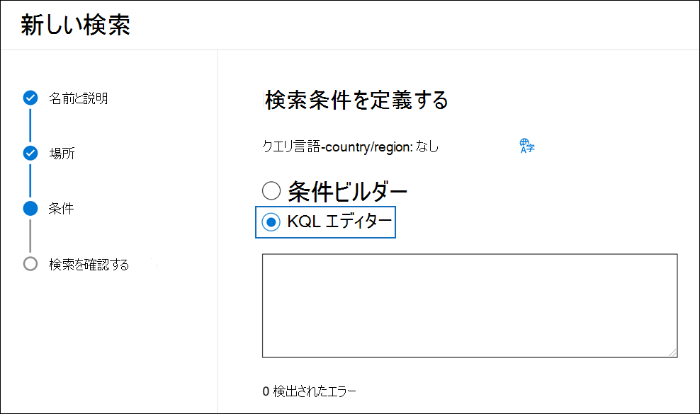
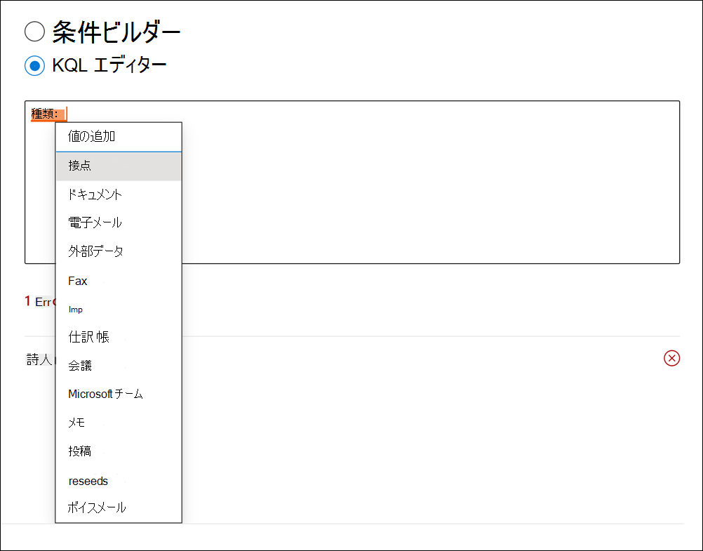

# KQL エディターを使用して検索クエリを作成する

Microsoft 365 電子情報開示ツール検索の新しい KQL クエリ エクスペリエンスでは、コンテンツ検索、Microsoft Purview eDiscovery (Standard)、および電子情報開示 (Premium) で検索クエリを作成するときのフィードバックとガイダンスが提供されます。 エディターでクエリを入力すると、サポートされている検索可能なプロパティと条件のオートコンプリートが提供され、標準のプロパティと条件でサポートされている値の一覧が提供されます。 たとえば、クエリで電子メール プロパティを `kind` 指定した場合、エディターには、選択できるサポートされている値の一覧が表示されます。 KQL エディターには、検索を実行する前に修正できる潜在的なクエリ エラーもリアルタイムで表示されます。 何より、標準条件ビルダーのキーワードと条件カードを使用してクエリを手動で作成しなくても、複雑なクエリをエディターに直接貼り付けることができます。
  
KQL エディターを使用する主な利点を次に示します。

- ガイダンスを提供し、検索クエリを最初から作成するのに役立ちます。

- 長く複雑なクエリをすばやくエディターに直接貼り付けることができます。 たとえば、反対の弁護士から複雑なクエリを受け取った場合は、条件ビルダーを使用する代わりに KQL エディターに貼り付けることができます。

- 潜在的なエラーをすばやく特定し、問題を解決する方法に関するヒントを表示します。

KQL エディターは、電子情報開示 (Standard) と電子情報開示 (Premium) でクエリ ベースの保留を作成するときにも使用できます。

## KQL エディターの表示

電子情報開示検索を作成または編集するときに、KQL エディターを表示して使用するオプションは、検索ウィザードまたはコレクション ウィザードの **[条件** ] ページにあります。

### コンテンツ検索と電子情報開示の KQL エディター (Standard)

### 電子情報開示の KQL エディター (Premium)

## KQL エディターの使用

次のセクションでは、KQL エディターが提案を提供し、潜在的なエラーを検出する方法の例を示します。

### 検索プロパティと演算子のオートコンプリート

KQL エディターで検索クエリの入力を開始すると、選択可能なサポートされている検索プロパティ ( *プロパティ制限* とも呼ばれます) の自動補完がエディターに表示されます。 これらの 2 文字で始まるサポートされているプロパティの一覧を表示するには、少なくとも 2 文字を入力する必要があります。 たとえば、次のスクリーンショットは、最初 `Se`に推奨される検索プロパティを示しています。

また、完全なプロパティ名を入力すると、エディターではサポートされている演算子 (たとえば `:`、 `=` `<>`演算子) の一覧も提供されます。 たとえば、次のスクリーンショットは、プロパティに推奨される演算子を `Date` 示しています。

サポートされている検索プロパティと演算子の詳細については、「 [電子情報開示のキーワード クエリと検索条件」を](keyword-queries-and-search-conditions.md)参照してください。

### プロパティ値の候補

KQL エディターでは、一部のプロパティの可能な値に関する推奨事項を提供します。 たとえば、次のスクリーンショットは、プロパティに推奨される値を `Kind` 示しています。

また、エディターでは、電子メール受信者のプロパティ (、 など`From``To``Recipients`) を入力すると、ユーザーの一覧 (UPN 形式) が提案されます。`Participants`

### 潜在的なエラーの検出

KQL エディターは、検索クエリの潜在的なエラーを検出し、エラーの解決に役立つエラーの原因のヒントを提供します。 また、エディターは、プロパティに対応する操作または値がない場合に発生する可能性のあるエラーも示します。 クエリの潜在的なエラーは赤いテキストで強調表示され、エラーの説明と修正の可能性は[ **潜在的なエラー** ] ドロップダウン セクションに表示されます。 たとえば、次のクエリを KQL エディターに貼り付けた場合、4 つの潜在的なエラーが検出されます。

この場合、潜在的なエラー ヒントを使用して、クエリのトラブルシューティングと修正を行うことができます。

## 詳細情報

- 条件ビルダーと KQL エディターを切り替えることができます。 たとえば、条件ビルダーを使用して [キーワード] ボックスと複数の条件カードを使用してクエリを構成する場合、結果のクエリを KQL エディターに表示できます。 ただし、KQL エディターで (キーワードと条件を含む) 複雑なクエリを作成する場合、結果のクエリは、条件ビルダーで表示する場合にのみ 、[キーワード] ボックスに表示されます。

- 複雑なクエリを KQL エディターに貼り付けると、潜在的なエラーが検出され、エラーを解決するための解決策が提案されます。
