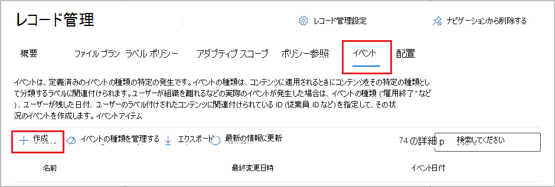
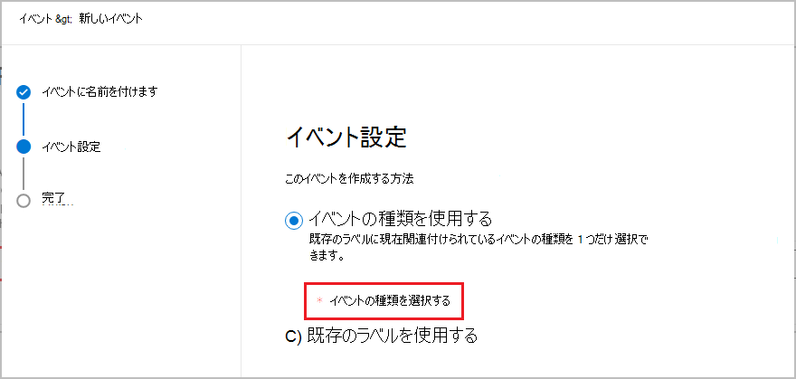

# <a name="start-retention-when-an-event-occurs"></a>イベントの発生時に保持を開始する

>*[セキュリティとコンプライアンスのための Microsoft 365 ライセンス ガイダンス](/office365/servicedescriptions/microsoft-365-service-descriptions/microsoft-365-tenantlevel-services-licensing-guidance/microsoft-365-security-compliance-licensing-guidance)。*

コンテンツを保持する際、保持期間は多くの場合、コンテンツの経過日数に基づいています。たとえば、ドキュメントを作成してから 7 年間保持をし、それから削除することができます。ただし、[保持ラベル](retention.md#retention-labels) を構成することで、特定の種類のイベントの発生を保持期間の基準として設定することもできます。イベントによって保持期間の開始がトリガーされ、その種類のイベントに保持ラベルが適用されているすべてのコンテンツに、ラベルの保持アクションが適用されます。
  
イベント ベースの保持を使用する場合の例:
  
- **従業員の離職**: 従業員が離職してから 10 年間は、その従業員のレコードを保持する必要があるとします。10 年が経過した後、その従業員の採用、業績、および退職に関するすべてのドキュメントを処理する必要があります。この場合、従業員の離職が、10 年の保持期間をトリガーするイベントとなります。 
    
- **契約満了**: 契約満了後 5 年間は、契約に関連するすべてのレコードを保持する必要があるとします。この場合、契約の満了が、5 年の保持期間をトリガーするイベントとなります。 
    
- **製品の有効期間**: たとえば、組織に、技術仕様などのコンテンツに関して、最終製品製造日に関する保持要件があるとします。この場合、最後に製造された日が、保存期間をトリガーするイベントとなります。 
    
イベント ベースの保持は、通常は、レコード管理プロセスの一環で使用されます。 これは、以下のことを意味します。

- イベントに基づく保持ラベルは、通常、レコード管理ソリューションの一環として、アイテムをレコードとしてマークします。詳細については、「[レコード管理の詳細](records-management.md)」を参照してください。

- レコードが宣言されているがイベント トリガーがまだ発生していないドキュメントは、無期限に保持されます。 イベントによってそのドキュメントの保持期間がトリガーされた後、期限が切れるまで、レコードを完全に削除することはできません。

- イベントに基づく保持ラベルは、通常、保持期間の最後に処理確認をトリガーするため、レコード管理者は手動でコンテンツを確認して処理できます。詳細については、「[コンテンツの処理](disposition.md)」を参照してください。

イベントに基づく保持ラベルには、Microsoft 365 の保持ラベルと同じ機能があります。詳細については、「[アイテム保持ポリシーと保持ラベルの詳細](retention.md)」を参照してください。

## <a name="understanding-the-relationship-between-event-types-labels-events-and-asset-ids"></a>イベントの種類、ラベル、イベント、アセット ID の関係を理解する

イベント ベースの保持を活用するには、図と以下の説明に示すように、イベントの種類、保持ラベル、イベント、アセット ID の関係を理解することが重要です。 
  

  

  
1. さまざまな種類のコンテンツの保持ラベルを作成し、イベントの種類に関連付けることができます。たとえば、さまざまな種類の製品ファイルとレコードの保持ラベルは、製品を使用しなくなった時点からレコードを 10 年間保持する必要があるため、Product Lifetime という名前のイベントの種類に関連付けられます。
    
2. ユーザー (通常はレコード管理者) はコンテンツにこれらの保持ラベルを適用し、(SharePoint 内と OneDrive 内のドキュメントの場合) アイテムごとに資産 ID を入力します。 この例では、資産 ID は組織で使用される製品名またはコードです。 したがって、各製品のレコードには保持ラベルが割り当てられ、各レコードには資産 ID を含むプロパティが含まれます。 この図は組織内のすべての製品レコードの **すべてのコンテンツ** を表しており、各アイテムにはそのレコードに該当する製品の資産 ID が含まれます。 
    
3. 製品の有効期限がイベントの種類であり、有効期限が切れた特定の製品がイベントになります。そのイベントの種類のイベントが発生したら (この場合、製品の有効期限が切れるとき)、以下を指定するイベントを作成します。
    
   - (SharePoint および OneDrive のドキュメントの) アセット ID。
    
   - (Exchange アイテムの) キーワード。上の例において組織は、製品レコードを含むメッセージで製品コードを使用するため、Exchange アイテムのキーワードは SharePoint および OneDrive ドキュメントのアセット ID と機能的に同じになります。
    
   - イベントが発生した日付。この日付は、保持期間の開始日として使用されます。この日付には、現在、過去、または将来の日付を使用できます。

4. イベントを作成すると、そのイベントの日付は次のようなすべてのコンテンツに同期されます。すなわち、そのイベントの種類の保持ラベルが割り当てられ、指定されたアセット ID またはキーワードを含むすべてのコンテンツです。他の保持ラベルと同様、この同期には最大 7 日間かかります。上の図で赤く囲まれたすべてのアイテムに関しては、このイベントによって保存期間がトリガーされます。つまり、この製品を使用しなくなると、そのイベントによって製品のレコードの保存期間がトリガーされます。

イベントの資産 ID またはキーワードを指定しない場合、そのイベントの種類の保持ラベルの付いた **すべてのコンテンツ** が、イベントによってトリガーされる保持期間を持つことを理解することが重要です。 つまり、前の図の場合であれば、すべてのコンテンツの保持が開始されます。 ほとんどの場合、これは意図した結果ではないでしょう。

また、各保持ラベルには独自の保持の設定があります。上の例では、すべて 10 年を指定していますが、保存期間が異なるそれぞれの保持ラベルをイベントがトリガーすることもできます。
  
## <a name="how-to-set-up-event-driven-retention"></a>イベント ドリブンの保持のセットアップ方法

イベント ドリブンの保持のワークフロー概要:
  

  
> [!TIP]
> SharePont の管理プロパティを使用して保持ラベルを自動適用し、イベント ドリブンの保持を実装する詳細なシナリオについては、[保持ラベルを使用して SharePoint ドキュメントのライフサイクルを管理する](auto-apply-retention-labels-scenario.md)を参照してください。

### <a name="step-1-create-a-label-whose-retention-period-is-based-on-an-event"></a>手順 1: 保持期間がイベントに基づくラベルを作成する

保持ラベルを作成して構成するには、レコード管理についての「[保持ラベルを作成する](file-plan-manager.md#create-retention-labels)」の手順を参照してください。 ただし、イベント ベースの保持に固有の次の手順があります。

- 保持ラベルを作成するときに、**[ラベル設定の定義]** ページで、必ず **[アイテムを無期限にまたは特定の期間保持する]** を選択してください。 その後で以下の手順に従います。
    
    **[期間の定義]** ページで、期間を設定した後、**[期間はいつ始める必要がありますか?]** ボックスの一覧から既定のイベントの種類を 1 つ選択します。 または、**[新しいイベントの種類の作成]** を選択して独自のイベントの種類を作成し、構成のプロンプトに従います。
    
    

イベントの種類とは、保持ラベルに関連付けるイベントの一般的な説明です。

既定のイベントの種類は、簡単に識別できるようにドロップダウン リストの名前の後に **(イベントの種類)** があり、**[レコード管理]**  >  **[イベント]** タブ、**[イベントの種類の管理]** からイベントの種類を確認して作成することもできます。

イベント ベースの保持には、次のような保持の設定が必要になります。
  
- コンテンツを保持する。
    
- 保存期間の終わりに、コンテンツの自動削除または廃棄レビューのトリガーを行う。
  
イベント ベースの保持は、通常は、レコードが宣言されているコンテンツに使用します。そのため、この時点で、コンテンツを[レコード](records-management.md#records)としてマークするオプションも選択する必要があるかどうか確認することをお勧めします。

新しいイベントの種類を作成するのではなく、既存のイベントの種類を使用している場合は、手順 3 に進みます。

> [!NOTE]
> イベントの種類を選択して保持ラベルを保存した後は、イベントの種類を変更できません。

### <a name="step-2-create-a-new-event-type-for-your-label"></a>手順 2: ラベルの新しいイベントの種類を作成する

保持設定で、[**新しいイベントの種類の作成**] を選択した場合は、イベントの種類の名前と説明を入力します。次に、[**次へ**]、[**送信**]、[**完了**] を選択します。

**[期間の定義]** ページに戻り、**[期間はいつ始める必要がありますか?]** ボックスの一覧から、作成したイベントの種類を選択します。

  
### <a name="step-3-publish-or-auto-apply-the-event-based-retention-labels"></a>手順 3: イベント ベースの保持ラベルを発行または自動適用する

他の保持ラベルと同じように、イベント ベースのラベルを発行するか自動適用して、コンテンツに手動または自動で適用されるようにする必要があります。
- [アイテム保持ラベルを発行してアプリに適用する](create-apply-retention-labels.md)
- [保持ラベルをコンテンツに自動的に適用する](apply-retention-labels-automatically.md)

### <a name="step-4-enter-an-asset-id"></a>手順 4: アセット ID を入力する

イベント ベースのラベルがコンテンツに適用されると、アイテムごとにアセット ID を入力できます。たとえば、組織が使用するのは以下のようなものになります:
  
- 特定の製品のみのコンテンツ保持に使用する製品コード。
    
- 特定の製品のみのコンテンツ保持に使用するプロジェクト コード。
    
- 特定の製品のみのコンテンツ保持に使用する従業員 ID。
    
資産 ID は、SharePoint と OneDrive で使用できる別のドキュメント プロパティです。組織では、既に他のドキュメント プロパティや ID を使用してコンテンツを分類している可能性があります。その場合、イベントの作成時にそれらのプロパティと値を使用することもできます (後述する手順 6 を参照してください)。重要な点は、ドキュメント プロパティで *property:value* の組み合わせを使用して、そのアイテムをイベントの種類に関連付ける必要があるということです。
  

  
### <a name="step-5-create-an-event"></a>手順 5: イベントを作成する

製品が寿命に到達するなど、イベントの種類に関する特定のインスタンスが発生するときは、Microsoft Purview コンプライアンス ポータルで **[レコード管理]** > **[イベント]** ページに移動して **[+ 作成]** を選択してイベントを作成します。ここで、イベントを作成することによって、そのイベントをトリガーします。



テナントごとに最大 1,000,000 件のイベントがサポートされます。

### <a name="step-6-choose-the-same-event-type-used-by-the-label-in-step-2"></a>手順 6: 手順 2 でのラベルを使用したイベントの種類と同じものを選択する

イベントを作成するときは、手順 2 の保持ラベル設定で指定したものと同じイベントの種類を選択します。 たとえば、ラベル設定のイベントの種類として [**製品の有効期間**] を選択した場合、イベントを作成するときに [**製品の有効期間**] を選択します。 そのイベントの種類が選択されたイベントに適用されている保持ラベルの付いたコンテンツのみが、トリガーされる保持期間を持ちます。



または、イベントの種類が異なる複数の保持ラベルのイベントを作成する必要がある場合は、[**既存のラベルの選択**] オプションを選択します。 次に、このイベントに関連付けるイベントの種類に構成されているラベルを選択します。

### <a name="step-7-enter-keywords-or-query-for-exchange-asset-id-for-sharepoint-and-onedrive"></a>手順 7: Exchange のキーワードまたはクエリ、SharePoint および OneDrive のアセット ID を入力する

ここで、コンテンツの範囲を狭めます。 Exchange コンテンツの場合、これを行うには、キーワードまたはクエリを指定します。 SharePoint および OneDrive コンテンツの場合、これを行うには、アセット ID を指定します。

Exchange アイテムの場合、キーワードまたはキーワード クエリ言語 (KQL) を使用するクエリを使用します。 クエリ構文の詳細については、「[キーワード クエリ言語 (KQL) 構文のリファレンス](/sharepoint/dev/general-development/keyword-query-language-kql-syntax-reference)」 を参照してください。 Exchange で使用できる検索可能なプロパティの詳細については、「[キーワード クエリとコンテンツ検索の検索条件](keyword-queries-and-search-conditions.md)」を参照してください。

アセット ID の場合、保持は指定された *property:value* ペアを持つコンテンツにのみ適用されます。 たとえば、アセット ID プロパティを使用する場合は、次の図に示すアセット ID のボックスに 「`ComplianceAssetID:<value>`」 と入力します。

資産 ID が入力されていない場合は、そのイベントの種類のラベルが付いたすべてのコンテンツに同じ保持期限が適用されます。

組織では、このイベントの種類に関連するドキュメントに他のプロパティと ID が適用されている可能性があります。たとえば、特定の製品のレコードを検出する必要がある場合、ID はカスタム プロパティ ProductID と値 "XYZ" の組み合わせであるとします。この場合は、次の図に示す資産 ID のボックスに「`ProductID:XYZ`」と入力します。

最後に、イベントが発生した日付を選択します。この日付は保持期間の開始として使用されます。イベントを作成すると、そのイベントの日付は、そのイベントの種類の保持ラベル、アセット ID、キーワードまたはクエリを使用してすべてのコンテンツに同期されます。他の保持ラベルと同様に、この同期には最大 7 日かかる場合があります。
  
![[イベントの設定] ページ。](../media/40d3c9db-f624-49a5-b38a-d16bcce20231.png)

イベントを作成すると、既にラベル付けされてインデックスが作成されているコンテンツの保持設定が有効になります。 イベントが作成された後に保持ラベルが新しいコンテンツに追加された場合は、同じ詳細を使用して新しいイベントを作成する必要があります。

イベントを削除しても、既にラベル付けされているコンテンツに対して現在有効になっている保持設定は取り消されません。現在、トリガーされたイベントをキャンセルすることはできません。

## <a name="use-content-search-to-find-all-content-with-a-specific-label-or-asset-id"></a>コンテンツ検索を使用して、特定のラベルまたはアセット ID が適用されたすべてのコンテンツを検索する

保持ラベルをコンテンツに割り当てた後は、コンテンツ検索を使用して、特定の保持ラベルが付いたすべてのコンテンツ、または特定の資産 ID を含むすべてのコンテンツを見つけることができます。
  
- 特定の保持ラベルを持つすべてのコンテンツを検索するには、 **保持ラベル** の条件を選択した後、完全なラベル名を入力するか、ラベル名の一部を入力してワイルドカードを使用します。 
    
- 特定のアセット ID を持つすべてのコンテンツを検索するには、**ComplianceAssetID** プロパティと `ComplianceAssetID:<value>` のフォーマットを使用した値を入力します。 
    
詳細については、「[コンテンツ検索のキーワード クエリと検索条件](keyword-queries-and-search-conditions.md)」を参照してください。

## <a name="automate-events-by-using-powershell"></a>PowerShell を使用してイベントを自動化する

PowerShell スクリプトを使用して、ビジネス アプリケーションからイベント ベースの保持を自動化することができます。 イベント ベースの保持で利用可能な PowerShell コマンドレットは、次のとおりです。
  
- [Get-ComplianceRetentionEventType](/powershell/module/exchange/get-complianceretentioneventtype)
    
- [New-ComplianceRetentionEventType](/powershell/module/exchange/new-complianceretentioneventtype)
    
- [Remove-ComplianceRetentionEventType](/powershell/module/exchange/remove-complianceretentioneventtype)
    
- [Set-ComplianceRetentionEventType](/powershell/module/exchange/set-complianceretentioneventtype)
    
- [Get-ComplianceRetentionEvent](/powershell/module/exchange/get-complianceretentionevent)
    
- [New-ComplianceRetentionEvent](/powershell/module/exchange/new-complianceretentionevent)
    

アイテム保持ラベルとそのポリシーを作成する他のコマンドレットを識別するには、「[アイテム保持ポリシーと保持ラベルの PowerShell コマンドレット](retention-cmdlets.md)」を参照してください。

## <a name="automate-events-by-using-a-rest-api"></a>REST API を使用してイベントを自動化する

REST API を使用して、保持期間の開始をトリガーするイベントを自動的に作成できます。

> [!NOTE]
> プレビュー段階でロールアウトしたら、[レコード管理に Microsoft Graph API](compliance-extensibility.md#microsoft-graph-api-for-records-management-preview) を使用してイベントを作成し、イベントの種類と保持ラベルを作成することもできます。
> 
> このセクションの REST API は間もなく非推奨になり、動作が停止されるため、これらの Graph API を試してみることをお勧めします。

REST APIは、HTTP 操作 (メソッド) のセットをサポートするサービス エンドポイントであり、サービスのリソースへの作成/取得/更新/削除アクセスを提供します。詳細については、「[REST API の要求/応答のコンポーネント](/rest/api/gettingstarted/#components-of-a-rest-api-requestresponse)」を参照してください。Microsoft 365 REST APIを使用すると、POST メソッドと GET メソッドを使用してイベントを作成および取得できます。

REST API を使用するには、2 つのオプションがあります。

- イベントの発生を自動的にトリガーする **Microsoft Power Automate または同様のアプリケーション**。 Microsoft Power Automate は、他のシステムに接続するためのオーケストレーターなので、カスタム ソリューションを作成する必要はありません。 詳細については、[Power Automate Web サイト](https://flow.microsoft.com/en-us/) を参照してください。

- **PowerShell または HTTP クライアントで REST API** を呼び出して、カスタム ソリューションの一部である PowerShell (バージョン 6 以降) を使用してイベントを作成します。

REST API を使用する前に、グローバル管理者として、保持イベント呼び出しに使用する URL を確認します。 これを行うには、REST API の URL を使用して、保持イベント呼び出しの取得を実行します。

```http
https://ps.compliance.protection.outlook.com/psws/service.svc/ComplianceRetentionEvent
```

応答コードを確認します。302 の場合は、応答ヘッダーの Location プロパティからリダイレクトされた URL を取得し、次の手順で `https://ps.compliance.protection.outlook.com/psws/service.svc/ComplianceRetentionEvent` の代わりにその URL を使用します。

自動作成されたイベントは、Microsoft Purview コンプライアンス ポータル > **[レコード管理]** >  **[イベント]** で表示することで確認できます。

### <a name="use-microsoft-power-automate-to-create-the-event"></a>Microsoft Power Automate を使用してイベントを作成する

Microsoft 365 REST API を使用してイベントを作成するフローを作成します


#### <a name="create-an-event"></a>イベントを作成する

REST API を呼び出すサンプル コード

- **方法**: 投稿
- **URL**: `https://ps.compliance.protection.outlook.com/psws/service.svc/ComplianceRetentionEvent`
- **ヘッダー**: キー = Content-Type、値 = application/atom+xml
- **本文**:

    ```xml
    <?xml version='1.0' encoding='utf-8' standalone='yes'?>
    
    <entry xmlns:d='http://schemas.microsoft.com/ado/2007/08/dataservices'
    
    xmlns:m='http://schemas.microsoft.com/ado/2007/08/dataservices/metadata'
    
    xmlns='http://www.w3.org/2005/Atom'>
    
    <category scheme='http://schemas.microsoft.com/ado/2007/08/dataservices/scheme' term='Exchange.ComplianceRetentionEvent' />
    
    <updated>9/9/2017 10:50:00 PM</updated>
    
    <content type='application/xml'>
    
    <m:properties>
    
    <d:Name>Employee Termination </d:Name>
    
    <d:EventType>99e0ae64-a4b8-40bb-82ed-645895610f56</d:EventType>
    
    <d:SharePointAssetIdQuery>1234</d:SharePointAssetIdQuery>
    
    <d:EventDateTime>2018-12-01T00:00:00Z </d:EventDateTime>
    
    </m:properties>
    
    </content>
    
    </entry>
    ```

- **認証**: 基本
- **ユーザー名**: 「Complianceuser」
- **パスワード**: 「Compliancepassword」


##### <a name="available-parameters"></a>利用可能なパラメーター


|パラメーター|説明|Notes|
|--- |--- |--- |
|<d:Name></d:Name>|イベントの一意の名前を入力します。|末尾のスペースや、特殊文字 % * \ & < \> \| # ? を使用することはできません。 , : ;|
|<d:EventType></d:EventType>|イベントの種類の名前 (または GUID) を入力します。|例: 「従業員の退職」というイベントの種類を保持ラベルに関連付ける必要があります。|
|<d:SharePointAssetIdQuery></d:SharePointAssetIdQuery>|「ComplianceAssetId:」 と従業員 ID を入力します|例: 「ComplianceAssetId: 12345」|
|<d:EventDateTime></d:EventDateTime>|イベントの日時|形式: yyyy-MM-ddTHH:mm:ssZ、例: 2018-12-01T00:00:00Z
|

###### <a name="response-codes"></a>応答コード

| 応答コード | 説明       |
| ----------------- | --------------------- |
| 302               | リダイレクト              |
| 201               | 作成済み               |
| 403               | 承認に失敗しました  |
| 401               | 認証に失敗しました |

##### <a name="get-events-based-on-a-time-range"></a>時間範囲に基づいてイベントを取得する

- **メソッド**: GET

- **URL**: `https://ps.compliance.protection.outlook.com/psws/service.svc/ComplianceRetentionEvent?BeginDateTime=2019-01-11&EndDateTime=2019-01-16`

- **ヘッダー**: キー = Content-Type、値 = application/atom+xml

- **認証**: 基本

- **ユーザー名**: 「Complianceuser」

- **パスワード**: 「Compliancepassword」

###### <a name="response-codes"></a>応答コード

| 応答コード | 説明                   |
| ----------------- | --------------------------------- |
| 200               | 問題ありません。イベントの一覧は atom+ xml 形式です |
| 404               | 見つかりません                         |
| 302               | リダイレクト                          |
| 401               | 承認に失敗しました              |
| 403               | 認証に失敗しました             |

##### <a name="get-an-event-by-id"></a>ID でイベントを取得する

- **メソッド**: GET

- **URL**: `https://ps.compliance.protection.outlook.com/psws/service.svc/ComplianceRetentionEvent('174e9a86-74ff-4450-8666-7c11f7730f66')`

- **ヘッダー**: キー = Content-Type、値 = application/atom+xml

- **認証**: 基本

- **ユーザー名**: 「Complianceuser」

- **パスワード**: 「Compliancepassword」

###### <a name="response-codes"></a>応答コード

| 応答コード | 説明                                      |
| ----------------- | ---------------------------------------------------- |
| 200               | 問題ありません。応答本体に atom+xml 形式のイベントが含まれています |
| 404               | 見つかりません                                            |
| 302               | リダイレクト                                             |
| 401               | 承認に失敗しました                                 |
| 403               | 認証に失敗しました                                |

##### <a name="get-an-event-by-name"></a>名前でイベントを取得する

- **メソッド**: GET

- **URL**: `https://ps.compliance.protection.outlook.com/psws/service.svc/ComplianceRetentionEvent`

- **ヘッダー**: キー = Content-Type、値 = application/atom+xml

- **認証**: 基本

- **ユーザー名**: 「Complianceuser」

- **パスワード**: 「Compliancepassword」

###### <a name="response-codes"></a>応答コード

| 応答コード | 説明                                      |
| ----------------- | ---------------------------------------------------- |
| 200               | 問題ありません。応答本体に atom+xml 形式のイベントが含まれています |
| 404               | 見つかりません                                            |
| 302               | リダイレクト                                             |
| 401               | 承認に失敗しました                                 |
| 403               | 認証に失敗しました                                |

### <a name="use-powershell-or-any-http-client-to-create-the-event"></a>PowerShell または HTTP クライアントを使用してイベントを作成する

PowerShell はバージョン 6 以降がインストールされている必要があります。

PowerShell セッションで、次のスクリプトを実行します。

```powershell
param([string]$baseUri)

$userName = "UserName"

$password = "Password"

$securePassword = ConvertTo-SecureString $password -AsPlainText -Force

$credentials = New-Object System.Management.Automation.PSCredential($userName, $securePassword)

$EventName="EventByRESTPost-$(([Guid]::NewGuid()).ToString('N'))"

Write-Host "Start to create an event with name: $EventName"

$body = "<?xml version='1.0' encoding='utf-8' standalone='yes'?>

<entry xmlns:d='http://schemas.microsoft.com/ado/2007/08/dataservices'

xmlns:m='http://schemas.microsoft.com/ado/2007/08/dataservices/metadata'

xmlns='http://www.w3.org/2005/Atom'>

<category scheme='http://schemas.microsoft.com/ado/2007/08/dataservices/scheme' term='Exchange.ComplianceRetentionEvent' />

<updated>7/14/2017 2:03:36 PM</updated>

<content type='application/xml'>

<m:properties>

<d:Name>$EventName</d:Name>

<d:EventType>e823b782-9a07-4e30-8091-034fc01f9347</d:EventType>

<d:SharePointAssetIdQuery>'ComplianceAssetId:123'</d:SharePointAssetIdQuery>

</m:properties>

</content>

</entry>"

$event = $null

try

{

$event = Invoke-RestMethod -Body $body -Method 'POST' -Uri "$baseUri/ComplianceRetentionEvent" -ContentType "application/atom+xml" -Authentication Basic -Credential $credentials -MaximumRedirection 0

}

catch

{

$response = $_.Exception.Response

if($response.StatusCode -eq "Redirect")

{

$url = $response.Headers.Location

Write-Host "redirected to $url"

$event = Invoke-RestMethod -Body $body -Method 'POST' -Uri $url -ContentType "application/atom+xml" -Authentication Basic -Credential $credentials -MaximumRedirection 0

}

}

$event | fl *
```
