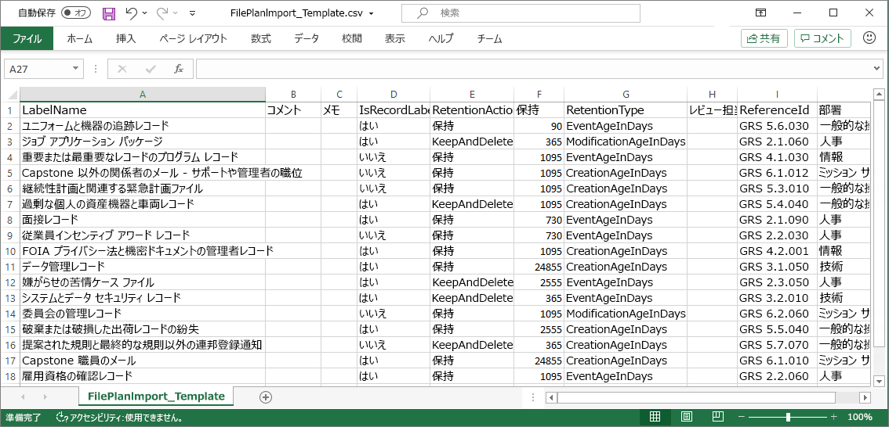

# ファイル計画を使用して保持ラベルを作成および管理する

>*[セキュリティとコンプライアンスのための Microsoft 365 ライセンス ガイダンス](/office365/servicedescriptions/microsoft-365-service-descriptions/microsoft-365-tenantlevel-services-licensing-guidance/microsoft-365-security-compliance-licensing-guidance)。*

[!include[Purview banner](../includes/purview-rebrand-banner.md)]

保持ラベルの作成と管理は、Microsoft Purview コンプライアンス ポータルの **[データ ライフサイクル管理]** から実行できますが、**[レコード管理]** のファイル計画には追加の管理機能があります。

- スプレッドシートから関連情報をインポートして、保持ラベルを一括作成できます。

- 分析およびオフラインでの共同作業には、既存の保持ラベルから情報をエクスポートできます。

- 保持ラベルの詳細については、情報を見やすいように１つのビューから全ての保持ラベルの設定全体を表示しています。

- ファイルプラン記述子は、各ラベルの追加およびオプションの情報をサポートします。

ファイルプランは、コンテンツをレコードとしてマークしない場合でも、すべての保持ラベルに使用できます。

保持ラベルについて、そして使用方法の情報については、[保持ポリシーおよび保持ラベルについて詳しく見る](retention.md) をご覧ください。

## ファイル計画にアクセスしています

ファイル計画にアクセスするには、次のいずれかの管理者役割が必要です。
    
- 保持マネージャー
- 閲覧限定保持マネージャー

[Microsoft Purview コンプライアンス ポータル](https://compliance.microsoft.com/)で、**[ソリューション]** > **[レコード管理]** > **[ファイル計画]** の順に移動します:

![[ファイル計画] ページ](../media/compliance-file-plan.png). 

**[レコード管理]** がナビゲーション ウィンドウに表示されない場合は、下にスクロールして **[すべて表示]** を選択します。

## ファイル計画を移動中

Microsoft Purview コンプライアンス ポータルの **[データ ライフサイクル管理]** で保持ラベルを作成していた場合、そうしたラベルはファイル計画に自動的に表示されます。 

同様に、ファイル計画で保持ラベルを作成している場合、そのラベルは [**データ ライフサイクル管理**] からも使用できます (コンテンツをレコードとしてマークするようにラベルが構成されていない場合)。

**ファイル計画** ページには、すべてのラベルの中に、状態や設定、オプションのファイル計画記述子、およびラベルのオフラインレビューを分析または有効にするエクスポートオプション、および保持ラベルを作成するインポートオプションが表示されます。 

### ラベル設定列

**名前** ラベルを除くすべての列を表示、または非表示にするには、 **列のカスタマイズ** オプションを選択します。 既定では、最初の幾つかの列にはラベルの状態とその設定に関する情報が表示されます。 

- **状態** は、ラベルポリシーにラベルが含まれているかどうか、或いは自動適用ポリシー (**アクティブ**) もしくはそうではない(**非アクティブ**).かを識別します。

- **基準** は、どのように、もしくはいつ保持期間が開始するのかを識別します。有効な値は以下の通りです。
    - イベント
    - 作成日時
    - 最終更新日時
    - ラベルが付けられた日時

- **レコード** は、ラベルが適用されたときに、アイテムがレコードとしてマークされているかどうかを識別します。有効な値は以下の通りです。
    - いいえ
    - はい
    - はい (法的)

- **既定でロック解除されています** — 現在ロールアウト中 — ラベルが適用されたときにレコードとしてマークされたアイテムがロック解除されているかどうかを示します。 有効な値:
    - 不要
    - はい

- **再ラベル付け先** — 現在ロールアウト中 — 保持期間の終了時に別のラベルを適用するようにラベルが構成されているかどうかを識別します。 有効な値:
    - 空白または選択したラベル名

- **保持期間** は、保持期間を識別します。有効な値は以下の通りです。
    - 日数
    - 月
    - 年数
    - 無期限
    - なし

- [**廃棄の種類**] は、保持期間終了時に何が起こるのかを識別します。有効な値は以下の通りです。
    - アクションなし
    - 自動削除
    - 確認が必要

### ファイル計画記述子列

ファイルプランでは、保持ラベルの一部として、より多くの情報を含めることができます。 これらのファイルプラン記述子には、ラベルを作成するのに必要なコンテンツの管理性と構成を改善するためのより多くのオプションが提供されています。

既定では、 **参照 ID** から始めると、次のいくつかの列には、保持ラベルを作成するとき、または既存のラベルを編集するときに指定できる、オプションのファイルプラン記述子が表示されます。 

この作業を開始するには、幾つかの既定値が次のファイルプラン記述子にあります。 
- ビジネス機能/部署
- カテゴリ
- 権限の種類
- プロビジョニング/引用 

保持ラベルを作成または編集する場合のファイルプラン記述子の例:

これらのオプションの記述子ごとに **[選択]** を選択すると、すぐに使用できる値の 1 つを選択するか、独自の値を作成して選択することができます。以下のような例があります: 

## 保持ラベルを作成する

1. **[ファイル計画]** ページから、[**+ ラベルを作成する]** > **[保持ラベル]** を選択します。

2. 指示に従って構成プロセスを実行します。ラベルを保存すると変更できなくなるため、ラベルに選択する名前に注意してください。
    
    保持設定の詳細については、「[コンテンツを保持および削除するための設定](retention-settings.md#settings-for-retaining-and-deleting-content)」を参照してください。
    
    保持ラベルを使用してレコードを宣言するには、**アイテムをレコードとしてマーク**、または **アイテムを規制レコードとしてマーク** を選択します。 詳細については、「 [レコードを宣言するために保持ラベルを構成する](declare-records.md#configuring-retention-labels-to-declare-records)」を参照してください。

3. ラベルを作成し、ラベルの公開、ラベルの自動適用、または単にラベルを保存するオプションが表示されたら、[**今すぐラベルを保存する**] を選択し、[**完了**] を選択します。

4. さらにラベルを作成するには、これらの手順を繰り返します。

## 保持ラベルを編集する

既存の保持ラベルを編集するには、**[ファイル計画]** ページからラベルを選択し、**[ラベルの編集]** オプションを選択して保持の編集プロセスを開始します。これにより、ラベルの説明と有効な設定を変更できます。

ラベルを作成して保存した後には変更できない設定があり、それらは以下のものを含みます。
- 保持ラベル名および保持期間を除く保持設定。 ただし、アイテムにラベルが付けられた時期に基づいて保持期間が設定されている場合、保持期間を変更することはできません。
- アイテムをレコードとしてマークするオプション。

## 保持ラベルを削除する

[[発行済み](create-apply-retention-labels.md)] または [[自動適用](apply-retention-labels-automatically.md)] の保持ラベル ポリシーに現在含まれていない保持ラベル、イベント ベースの保持用に構成されていない保持ラベル、またはアイテムを規制レコードとしてマークする保持ラベルを削除できます。

削除可能な保持ラベルについては、アイテムに適用されている場合、削除に失敗し、ラベル付きアイテムを識別するためのコンテンツ エクスプローラーへのリンクが表示されます。

ただし、コンテンツ エクスプローラーにラベルが付いているアイテムが表示されるまでに最大 2 日かかる場合があります。 このシナリオでは、コンテンツ エクスプローラーへのリンクを表示せずに保持ラベルが削除されることがあります。

## すべての保持ラベルをエクスポートして、オフラインレビューを分析または有効にする

組織内のデータ ガバナンス関係者との定期的なコンプライアンス レビューを促進するように、ファイル計画マネージャーではすべての保持ラベルの詳細を .csv ファイルにエクスポートできます。

すべての保持ラベルをエクスポートするには: **[ファイル計画]** ページで **[エクスポート]** を選択します:

A *.csv ファイルは既存の全ての保持ラベルを開く、を含みます。次に例を示します。

## ファイル計画に保持ラベルをインポートする

ファイル プランでは、特定のフォーマットの .csv ファイルを使用して、新しい保持ラベルを一括インポートすることができます。 

1. **ファイル計画** ページで、 **インポート**: を選択します

2. [ **ファイル計画の入力とインポート**] ウィンドウで、[**空白のテンプレートをダウンロード**]を選択します。

   

3. テンプレートのダウンロード後、ラベルごとに 1 行を追加し、ファイルを保存します。 プロパティと各プロパティへの有効な値を説明する情報については、[次のセクション](#information-about-the-label-properties-for-import)を参照してください。
    
    テンプレートに入力した例:
    
    

4. [**ファイルをアップロード**] を選択して、入力したテンプレートをアップロードします。
    
   ファイル計画では、ファイルをアップロードし、エントリを検証します。

5. 検証結果に応じて、以下の操作を行います。
    
    - 検証に失敗した場合: インポート ファイルで修正する行番号と列名をメモします。 ファイルのエラーを修正して保存し、手順 4 を繰り返します。
    
    - 検証に合格した場合: **ファイル計画が正常にインポートされ**、エントリが保持ラベルに正常に変換されたことがわかります。 [**完了**]を選択してウィンドウを閉じ、[**ファイル計画**] ページを自動的に更新して新しいラベルを表示します。

これで、新しい保持ラベルを発行するか、自動適用することができます。 [**ラベル ポリシー**]タブから両方を実行するには、[**ラベルの公開**]か、[**ラベルの自動適用**]を選択します。

### インポート用のラベル プロパティに関する情報

ダウンロードしたテンプレートに入力して新しい保持ラベルをインポートするには、次の情報を参考にしてください。 一部の値には、インポートのための最大文字数があります。

- **LabelName**: 最大文字数 64 文字
- **コメント** と **メモ**: 最大文字数 1024 文字
- 他のすべての値: 文字数無制限
 

|プロパティ|型|必須|有効な値|
|:-----|:-----|:-----|:-----|
|LabelName|文字列|はい|このプロパティは、保持ラベルの名前を指定します。このプロパティは、テナント内で一意である必要があります。 インポートでサポートされる文字: a-z、A から Z、0 から 9、ハイフン (-)、およびスペース文字。|
|コメント|文字列|いいえ|このプロパティを使用して、管理者の保持ラベルに関する説明を追加します。 この説明は、Microsoft Purview コンプライアンス ポータルで保持ラベルを管理する管理者にのみ表示されます。|
|メモ|文字列|いいえ|このプロパティを使用して、ユーザーの保持ラベルに関する説明を追加します。 この説明は、ユーザーが Outlook、SharePoint、OneDrive などのアプリでラベルにカーソルを置いたときに表示されます。 このプロパティを空白のままにすると、ラベルの保持設定を説明する既定の説明が表示されます。 |
|IsRecordLabel|文字列|いいえ、**Regulatory** が **TRUE** でない場合です|このプロパティでは、ラベルがコンテンツをレコードとしてマークするかどうかを指定します。有効な値は次のとおりです。 **TRUE**: ラベルはアイテムをレコードとしてマークし、その結果としてアイテムを削除できません。  **FALSE**: ラベルはコンテンツをレコードとしてマークしません。これは既定値です。    グループの依存関係: このプロパティが指定された場合、RetentionAction、 RetentionDuration、および RetentionType も指定される必要があります。|
|RetentionAction|文字列|いいえ、**RetentionDuration**、**RetentionType**、または **ReviewerEmail** が指定されていない場合です|このプロパティは、RetentionDuration プロパティ (指定された場合) で指定された値の有効期限が切れた後に実行するアクションを指定します。有効な値は次のとおりです。 **Delete**: RetentionDuration プロパティで指定された値よりも古いアイテムが削除されます。 **Keep**: RetentionDuration プロパティで指定された期間のアイテムを保持し、期間が終了しても何もしません。  **KeepAndDelete**: RetentionDuration プロパティで指定された期間のアイテムを保持し、期間が終了したらそれらを削除します。     グループの依存関係: このプロパティが指定された場合、RetentionDuration および RetentionType も指定される必要があります。 |
|RetentionDuration|文字列|いいえ、**RetentionAction** または **RetentionType** が指定されていない場合です|このプロパティは、コンテンツを保持する日数を指定します。有効な値は次のとおりです。 **Unlimited**: アイテムは無期限に保持されます。  **_n_*: 日付の正の整数です (例: _ **365**)。 サポート可能な最大数は 24,855 で、これは 68 年です。 この最大値よりも長い期間を必要とする場合は、代わりに Unlimited 版を使用します。    グループの依存関係: このプロパティが指定された場合、RetentionAction および RetentionType も指定される必要があります。
|RetentionType|String|いいえ、**RetentionAction** または **RetentionDuration** が指定されていない場合です|プロパティは、コンテンツ作成日、イベント日、ラベルが付けられた日、または最終変更日のいずれから保持期間 (指定された場合) を計算するかを指定します。有効な値は次のとおりです。 **CreationAgeInDays** **EventAgeInDays** **TaggedAgeInDays** **ModificationAgeInDays**     グループの依存関係: このプロパティが指定された場合、RetentionAction および RetentionDuraction も指定される必要があります。|
|ReviewerEmail|SmtpAddress|いいえ|このプロパティが指定された場合、保持期間が終了すると、廃棄のレビューがトリガーされます。 このプロパティは、**KeepAndDelete** の保持期間用アクションのテナント内レビュー担当者の電子メール アドレスを指定します。     テナント内の個々のユーザー、配布グループまたはセキュリティ グループのメール アドレスを含めることが出来ます。 複数のメール アドレスをセミコロンで区切って指定します。     グループの依存関係: このプロパティが指定された場合、**RetentionAction** (**KeepAndDelete** である必要があります)、**RetentionDuration**、および **RetentionType** も指定される必要があります。|
|ReferenceId|String|いいえ|このプロパティは、**参照 ID** ファイル計画記述子に表示される値を指定します。そしてこれは組織の固有の値として使うことが出来ます。| 
|DepartmentName|文字列|いいえ|このプロパティは、**業務/部署** ファイル計画記述子に表示される値を指定します。|
|カテゴリ|文字列|いいえ|このプロパティは、**カテゴリ** ファイル計画記述子に表示される値を指定します。|
|下位カテゴリ|文字列|いいえ|このプロパティは、**サブカテゴリ** ファイル計画記述子に表示される値を指定します。|
|AuthorityType|文字列|いいえ|このプロパティは、**管理組織の種類** ファイル計画記述子に表示される値を指定します。|
|CitationName|String|いいえ|このプロパティは、**規定/引用** ファイル計画記述子に表示される引用の名前を指定します。例: "Sarbanes-Oxley Act of 2002"。 |
|CitationUrl|文字列|いいえ|このプロパティは、**規定/引用** ファイル計画記述子に表示される URL を指定します。|
|CitationJurisdiction|String|いいえ|このプロパティは、**規定/引用** ファイル計画記述子に表示される管理規則または機関を指定します (例: 「米国証券取引委員会 (SEC)」)。|
|Regulatory|文字列|いいえ|このプロパティでは、ラベルがコンテンツをレコードより[制限された](records-management.md#compare-restrictions-for-what-actions-are-allowed-or-blocked) Regulatory レコードとしてマークするかどうかを指定します。 このラベル構成を使用するには、[コンテンツを Regulatory レコードとしてマークするオプションを表示する](declare-records.md#how-to-display-the-option-to-mark-content-as-a-regulatory-record)ようにテナントを構成する必要があり、そうでない場合はインポートの検証が失敗します。 有効な値は次のとおりです。  **TRUE**: ラベルは、Regulatory レコードとしてアイテムをマークします。 また、**IsRecordLabel** プロパティを TRUE に設定する必要があります。 **FALSE**: このラベルは、コンテンツを Regulatory レコードとしてマークしません。これは既定値です。|
|EventType|文字列|いいえ、**RetentionType** が **EventAgeInDays** ではない場合です|このプロパティは、[イベントベースの保持](event-driven-retention.md)に使用するイベントの種類を指定します。 **[レコード管理]**、 > **[イベント]**、 > **[イベントの種類の管理]** に表示されている既存のイベントの種類を指定します。 または、[Get-CompianceRetentionEventType](/powershell/module/exchange/get-complianceretentioneventtype) コマンドレットを使用して、利用可能なイベントの種類を表示します。 **従業員活動** や **製品ライフタイム** など、いくつかの組み込みのイベントの種類がありますが、独自のイベントの種類を作成することもできます。     独自のイベントの種類を指定する場合、インポート プロセスの一環として名前が検証されるため、そのイベントの種類がインポート前に存在している必要があります。|
|IsRecordUnlockedAsDefault|String|いいえ|このプロパティは、ラベルの適用時にレコードとしてマークされた項目の[ロック解除](record-versioning.md)をするかどうかを指定します。 有効な値は次のとおりです。  **TRUE**: ラベルが適用されると、レコードとしてマークされたアイテムがロック解除されます。 **IsRecordLabel** プロパティは TRUE に設定する必要があります。プロパティ **Regulatory** は TRUE に設定することはできません。 **FALSE**: アイテムはレコードとしてマークされていないか、レコードとしてマークされていてもラベルが適用されたときにロックされます。 これは既定の値です。|
|ComplianceTagForNextStage|String|いいえ|このプロパティは、保持期間の終了時に適用される [置換ラベル](retention-settings.md#relabeling-at-the-end-of-the-retention-period) の名前を指定します。     **規制** が **TRUE** の場合は、このプロパティを指定しないでください。|

ラベルの設定は、現在インポートでサポートされていません。

- 複数ステージの処理確認: テンプレートを使用して保持ラベルをインポートするときに、単一の処理確認ステージの設定を構成できますが、追加の確認ステージを指定することはできません。その代わりに、インポートが成功した後で、そうしたステージをコンプライアンス ポータルで構成します。

## 次の手順

保持ラベルを作成したので、ラベルを発行するか、自動的に適用することで、アイテムに追加する準備ができました。
- [アイテム保持ラベルを発行してアプリに適用する](create-apply-retention-labels.md)
- [保持ラベルをコンテンツに自動的に適用する](apply-retention-labels-automatically.md)
