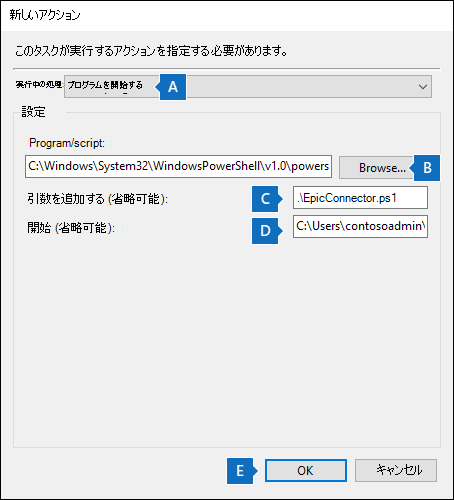
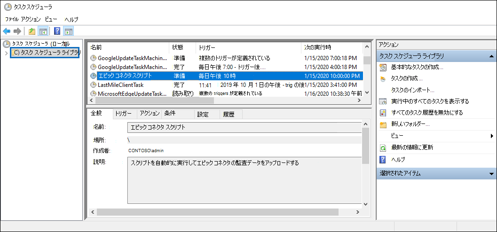

# <a name="set-up-a-connector-to-import-epic-ehr-audit-data-preview"></a>エピック EHR 監査データをインポートするコネクタを設定する (プレビュー)

Microsoft Purview コンプライアンス ポータルでデータ コネクタを設定し、組織のエピック 電子医療レコード (EHR) システムでユーザー アクティビティの監査レコードをインポートできます。 エピック EHR システムの監査レコードには、患者の健康記録へのアクセスに関連するイベントのレコードが含まれます。 エピック EHR 監査レコードは、Microsoft 365[インサイダー リスク管理ソリューション](insider-risk-management.md)によって使用され、患者情報への不正アクセスから組織を保護するのに役立ちます。

エピック コネクタの設定は、次のタスクで構成されます。

- Azure Active Directory (Azure AD) でアプリを作成し、エピック EHR 監査レコードを含むタブ区切りのテキスト ファイルを受け入れる API エンドポイントにアクセスします。

- コネクタ スキーマで定義されているすべての必須フィールドを含むテキスト ファイルを作成します。

- コンプライアンス ポータルでエピック コネクタ インスタンスを作成する。

- エピック EHR 監査レコードを API エンドポイントにプッシュするスクリプトを実行します。

- 必要に応じて、監査レコードをインポートするためにスクリプトを自動的に実行するようにスケジュールします。

## <a name="before-you-set-up-the-connector"></a>コネクタを設定する前に

- 手順 3 でエピック コネクタを作成するユーザーには、Data Connector 管理者ロールを割り当てる必要があります。 このロールは、コンプライアンス ポータルの **[データ コネクタ** ] ページでコネクタを追加するために必要です。 このロールは、既定で複数の役割グループに追加されます。 これらの役割グループの一覧については、「セキュリティ & コンプライアンス センターのアクセス許可」の「 [セキュリティとコンプライアンス センターの](../security/office-365-security/permissions-in-the-security-and-compliance-center.md#roles-in-the-security--compliance-center)ロール」セクションを参照してください。 または、組織内の管理者は、カスタム役割グループを作成し、Data Connector 管理者ロールを割り当て、適切なユーザーをメンバーとして追加することもできます。 手順については、 [Microsoft Purview コンプライアンス ポータル](microsoft-365-compliance-center-permissions.md#create-a-custom-role-group)のアクセス許可の「カスタム ロール グループの作成」セクションを参照してください。

- 組織のエピック EHR システムから (毎日) データを取得またはエクスポートし、手順 2 で説明したテキスト ファイルを作成する方法を決定する必要があります。 手順 4 で実行するスクリプトは、テキスト ファイル内のデータを API エンドポイントにプッシュします。

- 手順 4 で実行したサンプル スクリプトは、エピック EHR 監査レコードをテキスト ファイルからコネクタ API にプッシュして、インサイダー リスク管理ソリューションで使用できるようにします。 このサンプル スクリプトは、Microsoft 標準サポート プログラムまたはサービスではサポートされていません。 サンプル スクリプトは現状のまま提供され、いかなる保証も伴いません。 さらに、Microsoft は、商品性、特定目的への適合性の黙示の保証を含む、一切の黙示の保証をいたしかねます。 本サンプル スクリプトおよびドキュメントの使用または性能に起因するすべてのリスクは、お客様が負うものとします。 サンプル スクリプトおよびドキュメントを使用したこと、または使用できなかったことに伴って生じるいかなる損害 (業務利益の損失、業務の中断、業務情報の損失、金銭上の損失、その他一切の損害) についても、Microsoft、Microsoft に帰属する作者、スクリプトの作成、製造、または納入に関与したその他のすべての人員は、いかなる場合も責めを負わないものとします。

## <a name="step-1-create-an-app-in-azure-active-directory"></a>手順 1: Azure Active Directoryでアプリを作成する

最初の手順は、Azure Active Directory (Azure AD) に新しいアプリを作成して登録することです。 アプリは、手順 3. で作成したエピック コネクタに対応します。 このアプリを作成するとAzure AD、エピック EHR 監査レコードを含むテキスト ファイルのプッシュ要求を認証できます。 このAzure AD アプリの作成中に、次の情報を保存してください。 これらの値は、後の手順で使用されます。

- Azure AD アプリケーション ID (*アプリ ID* または *クライアント ID* とも呼ばれます)

- Azure AD アプリケーション シークレット (*クライアント シークレット* とも呼ばれます)

- テナント ID ( *ディレクトリ ID* とも呼ばれます)

Azure ADでアプリを作成する手順については、「Microsoft ID プラットフォーム[にアプリケーションを登録する](\azure\active-directory\develop\quickstart-register-app)」を参照してください。

## <a name="step-2-prepare-a-text-file-with-epic-ehr-audit-records"></a>手順 2: エピック EHR 監査レコードを使用してテキスト ファイルを準備する

次の手順では、組織のエピック EHR システム内の患者の健康記録への従業員のアクセスに関する情報を含むテキスト ファイルを作成します。 前述のように、エピック EHR システムからこのテキスト ファイルを生成する方法を決定する必要があります。 エピック コネクタ ワークフローでは、テキスト ファイル内のデータを必要なコネクタ スキーマにマップするために、タブ区切りの値を持つテキスト ファイルが必要です。 サポートされているファイル形式は、パイプまたはタブで区切られた.txtファイルです。

> [!NOTE]
> 監査データを含むテキスト ファイルの最大サイズは 3 GB です。 行の最大数は 500 万です。 また、必ず、医療 EHR システムからの関連する監査データのみを含めておきます。

次の表に、インサイダー リスク管理シナリオを有効にするために必要なフィールドを示します。 これらのフィールドのサブセットは必須です。 これらのフィールドはアスタリスク (*)で強調表示されます。 テキスト ファイルに必須フィールドがない場合、ファイルは検証されません。ファイル内のデータはインポートされません。

|Field|カテゴリ|
|:----|:----------|
| ACCESS_LOG。*<br/>ACCESS_TIME ACCESS_LOG_METRIC。METRIC_NAME*<br/>ACCESS_LOG。WORKSTATION_ID<br/>ZCMETRIC\_\_ GROUP.NAME<br/>ZCACCESS\_\_ ACTION.NAME |これらのフィールドは、エピック EHR システム内のアクセス アクティビティ イベントを識別するために使用されます。|
| 患者。PAT_MRN_ID<br/>患者。PAT_FIRST_NAME* <br/>患者。PAT_MIDDLE_NAME <br/>患者。PAT_LAST_NAME* <br/>患者。ADD_LINE_1* <br/>患者。ADD_LINE_2  <br/>患者。CITY* <br/>PATIENT.ZIP*  <br/>ZC_STATE.NAME <br/>ZC_COUNTRY.NAME <br/>CLARITY_DEP。DEPARTMENT_NAME              | これらのフィールドは、患者プロファイル情報を識別するために使用されます。|
| ZC_BTG_REASON.NAME*<br/> PAT_BTG_AUDIT。BTG_EXPLANATION | これらのフィールドは、制限付きレコードへのアクセスを識別するために使用されます。|
| EMP。SYSTEM_LOGIN*<br/>CLARITY_EMP。USER_ID <br/> employee_last_name <sup>1</sup> <br/> employee_first_name <sup>1</sup>                | これらのフィールドは、家族/近隣/従業員レコードへのアクセスを決定するために必要な住所と名前の一致に関する従業員プロファイル情報を識別するために使用されます。 |
|||

> [!NOTE]
> エピックから関連するログ メトリックのみをエクスポートしていることを確認します。 
> <sup>1</sup>このフィールドは、エピックでは既定では使用できません。 テキスト ファイルにこのフィールドが含まれるようにエクスポートを構成する必要があります。

## <a name="step-3-create-the-epic-connector"></a>手順 3: エピック コネクタを作成する

次の手順では、コンプライアンス ポータルでエピック コネクタを作成します。 手順 4 でスクリプトを実行すると、手順 2 で作成したテキスト ファイルが処理され、手順 1 で設定した API エンドポイントにプッシュされます。 この手順では、コネクタの作成時に生成される JobId を必ずコピーします。 スクリプトを実行するときに JobId を使用します。

1. 左側のナビゲーションにある <https://compliance.microsoft.com> **[データ コネクタ** ] に移動してクリックします。

2. **[エピック** コネクタ] の [**データ コネクタ**] ページで、[**表示**] をクリックします。

3. **エピック コネクタ ページで、[コネクタ** の **追加**] をクリックします。

4. [ **接続のセットアップ] ページで** 、次の操作を行い、[ **次へ**] をクリックします。

    1. 手順 2. で作成した Azure アプリのAzure ADアプリケーション ID を入力または貼り付けます。

    2. エピック コネクタの名前を入力します。

5. [ **校閲** ] ページで設定を確認し、[ **完了]** をクリックしてコネクタを作成します。

   コネクタが作成されたことを確認する状態ページが表示されます。 このページには、サンプル スクリプトを実行してエピック EHR 監査レコードデータをアップロードするために、次の手順を完了する必要がある 2 つの重要な点が含まれています。

    ジョブ ID を含むページを確認し、サンプル スクリプトの github にリンクする

    1. **ジョブ ID。** 次の手順でスクリプトを実行するには、このジョブ ID が必要です。 このページまたはコネクタ ポップアップ ページからコピーできます。

    2. **参照スキーマ。** スキーマを参照して、エピック システムのどのフィールドがコネクタで受け入れられるかを理解してください。 これにより、必要なすべてのエピック データベース フィールドを含むファイルを作成できます。

    3. **サンプル スクリプトへのリンク。** **この** リンクをクリックしてGitHub サイトに移動し、サンプル スクリプトにアクセスします (リンクによって新しいウィンドウが開きます)。 手順 4. でスクリプトをコピーできるように、このウィンドウを開いたままにします。 または、スクリプトを実行するときにもう一度アクセスできるように、コピー先をブックマークするか、URL をコピーすることもできます。 このリンクは、コネクタ ポップアップ ページでも利用できます。

6. **[完了]** をクリックします。

   新しいコネクタ **が [コネクタ** ] タブの一覧に表示されます。

7. 作成したエピック コネクタをクリックして、コネクタに関するプロパティとその他の情報を含むポップアップ ページを表示します。

まだ行っていない場合は、**Azure アプリ ID** と **コネクタ ジョブ ID** の値をコピーできます。 次の手順でスクリプトを実行するには、これらが必要です。 ポップアップ ページからスクリプトをダウンロードすることもできます (または、次の手順のリンクを使用してダウンロードすることもできます)。

[**編集]** をクリックして、[**ファイル マッピング**] ページで定義したAzure アプリ ID または列ヘッダー名を変更することもできます。

## <a name="step-4-run-the-sample-script-to-upload-your-epic-ehr-audit-records"></a>手順 4: サンプル スクリプトを実行してエピック EHR 監査レコードをアップロードする

エピック コネクタを設定する最後の手順は、テキスト ファイル (手順 1 で作成した) のエピック EHR 監査レコード データを Microsoft クラウドにアップロードするサンプル スクリプトを実行することです。 具体的には、スクリプトによってデータがエピック コネクタにアップロードされます。 スクリプトを実行すると、手順 3 で作成したエピック コネクタによって、エピック EHR 監査レコードデータがMicrosoft 365組織にインポートされます。このデータは、Insider リスク管理ソリューションなどの他のコンプライアンス ツールからアクセスできます。 スクリプトを実行した後は、最新の従業員退職データが Microsoft クラウドにアップロードされるように、タスクを毎日自動的に実行するようにスケジュールを設定することを検討してください。 [「(省略可能) 手順 6: スクリプトを自動的に実行するようにスケジュールする」を](#optional-step-6-schedule-the-script-to-run-automatically)参照してください。

> [!NOTE]
> 前述のように、監査データを含むテキスト ファイルの最大サイズは 3 GB です。 行の最大数は 500 万です。 この手順で実行するスクリプトは、大きなテキスト ファイルから監査データをインポートするのに約 30 ~ 40 分かかります。 さらに、スクリプトは、大きなテキスト ファイルを 100,000 行の小さなブロックに分割し、それらのブロックを順番にインポートします。

1. 前の手順で開いたままにしたウィンドウに移動して、サンプル スクリプトを使用してGitHub サイトにアクセスします。 または、ブックマークされたサイトを開くか、コピーした URL を使用します。 [ここで](https://github.com/microsoft/m365-compliance-connector-sample-scripts/blob/main/sample_script.ps1)スクリプトにアクセスすることもできます。

2. **[未加工**] ボタンをクリックして、テキスト ビューにスクリプトを表示します。

3. サンプル スクリプト内のすべての行をコピーし、テキスト ファイルに保存します。

4. 必要に応じて、組織のサンプル スクリプトを変更します。

5. などの`EpicConnector.ps1`ファイル名サフィックス`.ps1`を使用して、テキスト ファイルをWindows PowerShell スクリプト ファイルとして保存します。

6. ローカル コンピューターでコマンド プロンプトを開き、スクリプトを保存したディレクトリに移動します。

7. 次のコマンドを実行して、テキスト ファイル内のエピック監査データを Microsoft クラウドにアップロードします。例えば：

   ```powershell
   .\EpicConnector.ps1 -tenantId <tenantId> -appId <appId>  -appSecret <appSecret>  -jobId <jobId>  -filePath '<filePath>'
   ```

次の表では、このスクリプトで使用するパラメーターとその必要な値について説明します。 前の手順で取得した情報は、これらのパラメーターの値で使用されます。

|パラメーター  |説明|
|:----------|:----------|
|tenantId|これは、手順 1 で取得したMicrosoft 365組織の ID です。 Azure AD管理センターの **[概要**] ブレードで、組織のテナント ID を取得することもできます。 これは、組織を識別するために使用されます。|
|appId|これは、手順 1 のAzure ADで作成したアプリのAzure AD アプリケーション ID です。 これは、スクリプトがMicrosoft 365組織にアクセスしようとしたときに認証のためにAzure ADによって使用されます。|
|appSecret|これは、手順 1 のAzure ADで作成したアプリのAzure ADアプリケーション シークレットです。 これは認証にも使用されます。|
|jobId|これは、手順 3 で作成したエピック コネクタのジョブ ID です。 これは、Microsoft クラウドにアップロードされたエピック EHR 監査レコードをエピック コネクタに関連付けるために使用されます。|
|Filepath|これは、手順 2. で作成したテキスト ファイル (スクリプトと同じシステムに格納) のファイル パスです。 ファイル パス内のスペースを避けてみてください。それ以外の場合は、単一引用符を使用します。|
|||

各パラメーターの実際の値を使用したエピック コネクタ スクリプトの構文の例を次に示します。

```powershell
.\EpicConnector.ps1 -tenantId d5723623-11cf-4e2e-b5a5-01d1506273g9 -appId 29ee526e-f9a7-4e98-a682-67f41bfd643e -appSecret MNubVGbcQDkGCnn -jobId b8be4a7d-e338-43eb-a69e-c513cd458eba -filePath 'C:\Users\contosoadmin\Desktop\Data\epic_audit_records.txt'
```

アップロードが成功した場合、スクリプトには **成功したメッセージアップロード** 表示されます。

> [!NOTE]
> 実行ポリシーが原因で前のコマンドの実行に問題がある場合は、実行ポリシーの設定に関するガイダンスについては、「 [実行ポリシー](/powershell/module/microsoft.powershell.core/about/about_execution_policies) と [Set-ExecutionPolicy](/powershell/module/microsoft.powershell.security/set-executionpolicy) について」を参照してください。

## <a name="step-5-monitor-the-epic-connector"></a>手順 5: エピック コネクタを監視する

エピック コネクタを作成し、EHR 監査レコードをプッシュした後、コネクタを表示し、コンプライアンス ポータルで状態をアップロードできます。 スクリプトを定期的に自動的に実行するようにスケジュールする場合は、スクリプトが最後に実行された後の現在の状態を表示することもできます。

1. 左側の <https://compliance.microsoft.com> ナビゲーションにある **[データ コネクタ** ] に移動してクリックします。

2. [ **コネクタ** ] タブをクリックし、エピック コネクタを選択してポップアップ ページを表示します。 このページには、コネクタに関するプロパティと情報が含まれています。

3. [ **最後のインポート**] で、[ **ログのダウンロード** ] リンクをクリックして、コネクタの状態ログを開く (または保存) します。 このログには、スクリプトが実行され、テキスト ファイルから Microsoft クラウドにデータがアップロードされるたびに関する情報が含まれます。

    エピック コネクタ ログ ファイルには、アップロードされたテキスト ファイルの行数が表示されます

    このフィールドは `RecordsSaved` 、アップロードしたテキスト ファイル内の行数を示します。 たとえば、テキスト ファイルに 4 行が含まれている場合、スクリプトがテキスト ファイル内のすべての行を正常にアップロードした場合、フィールドの値 `RecordsSaved` は 4 になります。

手順 4 でスクリプトを実行していない場合は、[ **最後のインポート**] にスクリプトをダウンロードするためのリンクが表示されます。 スクリプトをダウンロードし、手順に従ってスクリプトを実行できます。

## <a name="optional-step-6-schedule-the-script-to-run-automatically"></a>(省略可能)手順 6: スクリプトを自動的に実行するようにスケジュールする

エピック EHR システムの最新の監査レコードをインサイダー リスク管理ソリューションなどのツールで使用できるようにするには、スクリプトを毎日自動的に実行するようにスケジュールすることをお勧めします。 また、従業員による患者レコードのアクセス アクティビティに関する最新情報が含まれるように、同じテキスト ファイル内のエピック監査レコード データを同様の (同じではない場合は) スケジュールで更新する必要があります。 目標は、エピック コネクタがインサイダー リスク管理ソリューションで使用できるように、最新の監査レコードをアップロードすることです。 

Windowsのタスク スケジューラ アプリを使用して、毎日スクリプトを自動的に実行できます。

1. ローカル コンピューターで、[Windows **スタート]** ボタンをクリックし、「**タスク スケジューラ」** と入力します。

2. **タスク スケジューラ** アプリをクリックして開きます。

3. [ **アクション]** セクションで、[ **タスクの作成**] をクリックします。

4. [ **全般** ] タブで、スケジュールされたタスクのわかりやすい名前を入力します。たとえば、 **エピック コネクタ スクリプト** です。 オプションの説明を追加することもできます。

5. [ **セキュリティ オプション]** で、次の操作を行います。

    1. コンピューターにログオンしている場合にのみスクリプトを実行するか、ログオンしているときに実行するかを決定します。

    2. **[最高の特権で実行]** チェック ボックスがオンになっていることを確認します。

6. [トリガー] タブ **を** 選択し、[ **新規**] をクリックして、次の操作を行います。

    1. **[設定**] で [**日単位**] オプションを選択し、スクリプトを初めて実行する日付と時刻を選択します。 スクリプトは、指定された時刻に毎日実行されます。

    2. [ **詳細設定]** で、[ **有効]** チェック ボックスがオンになっていることを確認します。

    3. [**OK**] をクリックします。

7. [ **アクション]** タブを選択し、[ **新規**] をクリックして、次の操作を行います。

   

    1. **[アクション**] ドロップダウン リストで、[**プログラムの開始]** が選択されていることを確認します。

    2. [ **プログラム/スクリプト** ] ボックスで [ **参照**] をクリックし、次の場所に移動し、パスがボックスに表示されるように選択します:C:.0.exe。

    3. [ **引数の追加 (省略可能)]** ボックスに、手順 4 で実行したのと同じスクリプト コマンドを貼り付けます。 たとえば、`.\EpicConnector.ps1 -tenantId "d5723623-11cf-4e2e-b5a5-01d1506273g9" -appId "c12823b7-b55a-4989-faba-02de41bb97c3" -appSecret "MNubVGbcQDkGCnn" -jobId "e081f4f4-3831-48d6-7bb3-fcfab1581458" -filePath "C:\Epic\audit\records.txt"` のように指定します。

    4. [ **Start in (省略可能)] ボックスに** 、手順 4. で実行したスクリプトのフォルダーの場所を貼り付けます。 たとえば、C:\Epic\audit です。

    5. [ **OK] を** クリックして、新しいアクションの設定を保存します。

8. [ **タスクの作成** ] ウィンドウで、[ **OK] を** クリックしてスケジュールされたタスクを保存します。 ユーザー アカウントの資格情報の入力を求めるメッセージが表示される場合があります。

   新しいタスクがタスク スケジューラ ライブラリに表示されます。

   

   スクリプトが最後に実行されたときと、次回実行がスケジュールされた時刻が表示されます。 タスクをダブルクリックして編集できます。

   また、コンプライアンス センターの対応するエピック コネクタのポップアップ ページでスクリプトが最後に実行された時刻を確認することもできます。
