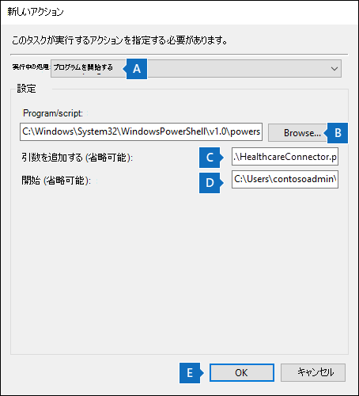

# <a name="set-up-a-connector-to-import-healthcare-ehr-audit-data-preview"></a>医療 EHR 監査データをインポートするコネクタを設定する (プレビュー)

Microsoft Purview コンプライアンス ポータルでデータ コネクタを設定して、組織の電子医療レコード (EHR) システムでユーザー アクティビティの監査データをインポートできます。 医療 EHR システムからの監査データには、患者の健康記録へのアクセスに関連するイベントのデータが含まれます。 医療 EHR 監査データは、Microsoft Purview [Insider Risk Management ソリューション](insider-risk-management.md) で使用して、患者情報への不正アクセスから組織を保護するのに役立ちます。

Healthcare コネクタの設定は、次のタスクで構成されます。

- Azure Active Directory (Azure AD) でアプリを作成し、医療 EHR 監査データを含むタブ区切りのテキスト ファイルを受け入れる API エンドポイントにアクセスします。

- コネクタ スキーマで定義されているすべての必須フィールドを含むテキスト ファイルを作成します。

- コンプライアンス ポータルで Healthcare コネクタ インスタンスを作成する。

- 医療 EHR 監査データを API エンドポイントにプッシュするスクリプトを実行します。

- 必要に応じて、監査データをインポートするために自動的に実行するスクリプトをスケジュールします。

プレビューに参加する場合は、dcfeedback@microsoft.com のチームにお問い合わせください。

## <a name="before-you-set-up-the-connector"></a>コネクタを設定する前に

- 手順 3 で Healthcare コネクタを作成するユーザーには、Data Connector 管理 ロールを割り当てる必要があります。 このロールは、コンプライアンス ポータルの **[データ コネクタ** ] ページでコネクタを追加するために必要です。 このロールは、既定で複数の役割グループに追加されます。 これらの役割グループの一覧については、「セキュリティ & コンプライアンス センターのアクセス許可」の「 [セキュリティとコンプライアンス センターの](../security/office-365-security/permissions-in-the-security-and-compliance-center.md#roles-in-the-security--compliance-center)ロール」セクションを参照してください。 または、組織内の管理者がカスタムロール グループを作成し、Data Connector 管理ロールを割り当ててから、適切なユーザーをメンバーとして追加することもできます。 手順については、[Microsoft Purview コンプライアンス ポータルのアクセス許可](microsoft-365-compliance-center-permissions.md#create-a-custom-role-group)の「カスタム ロール グループの作成」セクションを参照してください。

- 組織の医療 EHR システム (毎日) からデータを取得またはエクスポートし、手順 2 で説明したテキスト ファイルを作成する方法を決定する必要があります。 手順 4 で実行するスクリプトは、テキスト ファイル内のデータを API エンドポイントにプッシュします。

- 手順 4 で実行したサンプル スクリプトは、医療 EHR 監査データをテキスト ファイルからコネクタ API にプッシュして、インサイダー リスク管理ソリューションで使用できるようにします。 このサンプル スクリプトは、Microsoft 標準サポート プログラムまたはサービスではサポートされていません。 サンプル スクリプトは現状のまま提供され、いかなる保証も伴いません。 さらに、Microsoft は、商品性、特定目的への適合性の黙示の保証を含む、一切の黙示の保証をいたしかねます。 本サンプル スクリプトおよびドキュメントの使用または性能に起因するすべてのリスクは、お客様が負うものとします。 サンプル スクリプトおよびドキュメントを使用したこと、または使用できなかったことに伴って生じるいかなる損害 (業務利益の損失、業務の中断、業務情報の損失、金銭上の損失、その他一切の損害) についても、Microsoft、Microsoft に帰属する作者、スクリプトの作成、製造、または納入に関与したその他のすべての人員は、いかなる場合も責めを負わないものとします。

## <a name="step-1-create-an-app-in-azure-active-directory"></a>手順 1: Azure Active Directory でアプリを作成する

最初の手順では、Azure Active Directory (Azure AD) に新しいアプリを作成して登録します。 アプリは、手順 3 で作成した Healthcare コネクタに対応します。 このアプリを作成すると、Azure AD は、医療 EHR 監査データを含むテキスト ファイルのプッシュ要求を認証できます。 この Azure AD アプリの作成中に、次の情報を保存してください。 これらの値は、後の手順で使用されます。

- Azure AD アプリケーション ID ( *アプリ ID* または *クライアント ID* とも呼ばれます)

- Azure AD アプリケーション シークレット ( *クライアント シークレット* とも呼ばれます)

- テナント ID ( *ディレクトリ ID* とも呼ばれます)

Azure AD でアプリを作成する手順については、「[アプリケーションをMicrosoft ID プラットフォームに登録する](\azure\active-directory\develop\quickstart-register-app)」を参照してください。

## <a name="step-2-prepare-a-text-file-with-healthcare-ehr-auditing-data"></a>手順 2: 医療 EHR 監査データを含むテキスト ファイルを準備する

次の手順では、組織の医療 EHR システム内の患者の健康記録への従業員のアクセスに関する情報を含むテキスト ファイルを作成します。 前述のように、医療 EHR システムからこのテキスト ファイルを生成する方法を決定する必要があります。 Healthcare コネクタ ワークフローでは、テキスト ファイル内のデータを必要なコネクタ スキーマにマップするために、タブ区切りの値を持つテキスト ファイルが必要です。 サポートされているファイル形式は、コンマ (.csv)、パイプ (.psv)、またはタブ (.tsv) で区切られたテキスト ファイルです。

> [!NOTE]
> 監査データを含むテキスト ファイルの最大サイズは 3 GB です。 行の最大数は 500 万です。 また、必ず、医療 EHR システムからの関連する監査データのみを含めておきます。

次の表に、インサイダー リスク管理シナリオを有効にするために必要なフィールドを示します。 これらのフィールドのサブセットは必須です。 これらのフィールドはアスタリスク (*)で強調表示されます。 テキスト ファイルに必須フィールドがない場合、ファイルは検証されません。ファイル内のデータはインポートされません。

|フィールド|カテゴリ|
|:----|:----------|
| 作成時刻 *<br/>イベント名*<br/>ワークステーション ID<br/>[イベント] セクション<br/>分類 |これらのフィールドは、医療 EHR システム内のアクセス アクティビティ イベントを識別するために使用されます。|
| 患者 Reg ID<br/>患者名 *<br/>患者ミドル ネーム <br/>患者姓* <br/>患者アドレス行 1* <br/>患者アドレス行 2<br/>Patient City* <br/>患者郵便番号*  <br/>患者の状態 <br/>患者の国 <br/>患者部              | これらのフィールドは、患者プロファイル情報を識別するために使用されます。|
| 制限付きアクセスの理由*<br/> アクセス制限付きコメント | これらのフィールドは、制限付きレコードへのアクセスを識別するために使用されます。|
| Email アドレス (UPN) または SamAccountName*<br/>従業員のユーザー名 <br/> 従業員 ID <br/> 従業員の姓 <sup>1</sup> <br/> 従業員名 <sup>1</sup> | これらのフィールドは、家族/近隣/従業員レコードへのアクセスを決定するために必要な住所と名前の一致に関する従業員プロファイル情報を識別するために使用されます。 |
|||

> [!NOTE] 
> <sup>1</sup>このフィールドは、医療 EHR システムでは既定では使用できない場合があります。 テキスト ファイルにこのフィールドが含まれるようにエクスポートを構成する必要があります。

## <a name="step-3-create-the-healthcare-connector"></a>手順 3: Healthcare コネクタを作成する

次の手順では、コンプライアンス ポータルで Healthcare コネクタを作成します。 手順 4 でスクリプトを実行すると、手順 2 で作成したテキスト ファイルが処理され、手順 1 で設定した API エンドポイントにプッシュされます。 この手順では、コネクタの作成時に生成される JobId を必ずコピーします。 スクリプトを実行するときに JobId を使用します。

1. 左側のナビゲーションにある <https://compliance.microsoft.com> **[データ コネクタ** ] に移動してクリックします。

2. [ **概要** ] タブで、[ **Healthcare (プレビュー)]** をクリックします。

3. [ **Healthcare (プレビュー)]** ページで、[ **コネクタの追加**] をクリックします。

4. 利用規約に同意します。

5. [ **認証資格情報** ] ページで、次の操作を行い、[ **次へ**] をクリックします。

    1. 手順 1. で作成した Azure アプリの Azure AD アプリケーション ID を入力または貼り付けます。

    2. 医療コネクタの名前を入力します。

6. [ **ファイル マッピング方法** ] ページで、次のいずれかのオプションを選択し、[ **次へ**] をクリックします。

   - **サンプル ファイルをアップロードします**。 このオプションを選択した場合は、[ **サンプル ファイルのアップロード** ] をクリックして、手順 2. で準備したファイルをアップロードします。 このオプションを使用すると、ドロップダウン リストからテキスト ファイル内の列名をすばやく選択して、列を医療コネクタに必要なスキーマにマップできます。 

    または

   - **マッピングの詳細を手動で指定します**。 このオプションを選択する場合は、テキスト ファイル内の列の名前を入力して、列を医療コネクタに必要なスキーマにマップする必要があります。

7. [ **ファイル マッピングの詳細** ] ページで、前の手順でサンプル ファイルをアップロードしたかどうかに応じて、次のいずれかの操作を行います。

   - ドロップダウン リストを使用して、サンプル ファイルの列を医療コネクタに必要な各フィールドにマップします。

    または

   - 各フィールドについて、手順 2 で準備したファイルから、医療コネクタのフィールドに対応する列名を入力します。

8. [ **校閲** ] ページで設定を確認し、[ **完了]** をクリックしてコネクタを作成します。

   コネクタが作成されたことを確認する状態ページが表示されます。 このページには、サンプル スクリプトを実行して医療 EHR 監査データをアップロードする次の手順を完了するために必要な 2 つの重要な事項が含まれています。

    - **ジョブ ID。** 次の手順でスクリプトを実行するには、このジョブ ID が必要です。 このページまたはコネクタ ポップアップ ページからコピーできます。

    - **サンプル スクリプトへのリンク。** **こちらの** リンクをクリックして GitHub サイトに移動し、サンプル スクリプトにアクセスします (リンクによって新しいウィンドウが開きます)。 手順 4. でスクリプトをコピーできるように、このウィンドウを開いたままにします。 または、スクリプトを実行するときにもう一度アクセスできるように、コピー先をブックマークするか、URL をコピーすることもできます。 このリンクは、コネクタ ポップアップ ページでも利用できます。

9. **[完了]** をクリックします。

   新しいコネクタ **が [コネクタ** ] タブの一覧に表示されます。

10. 先ほど作成した Healthcare コネクタをクリックして、コネクタに関するプロパティとその他の情報を含むポップアップ ページを表示します。

まだ行っていない場合は、**Azure アプリ ID** と **コネクタ ジョブ ID** の値をコピーできます。 次の手順でスクリプトを実行するには、これらが必要です。 ポップアップ ページからスクリプトをダウンロードすることもできます (または、次の手順のリンクを使用してダウンロードすることもできます)。

[**編集]** をクリックして、[**ファイル マッピング**] ページで定義したAzure アプリ ID または列ヘッダー名を変更することもできます。

## <a name="step-4-run-the-sample-script-to-upload-your-healthcare-ehr-auditing-data"></a>手順 4: サンプル スクリプトを実行して、医療 EHR 監査データをアップロードする

Healthcare コネクタを設定する最後の手順は、(手順 1 で作成した) テキスト ファイル内の医療 EHR 監査データを Microsoft クラウドにアップロードするサンプル スクリプトを実行することです。 具体的には、スクリプトはデータを Healthcare コネクタにアップロードします。 スクリプトを実行すると、手順 3 で作成した Healthcare コネクタによって、医療 EHR 監査データが Microsoft 365 組織にインポートされ、Insider リスク管理ソリューションなどの他のコンプライアンス ツールからアクセスできるようになります。 スクリプトを実行した後は、最新の従業員退職データが Microsoft クラウドにアップロードされるように、タスクを毎日自動的に実行するようにスケジュールを設定することを検討してください。 [「(省略可能) 手順 6: スクリプトを自動的に実行するようにスケジュールする」を](#optional-step-6-schedule-the-script-to-run-automatically)参照してください。

> [!NOTE]
> 前述のように、監査データを含むテキスト ファイルの最大サイズは 3 GB です。 行の最大数は 500 万です。 この手順で実行するスクリプトは、大きなテキスト ファイルから監査データをインポートするのに約 30 ~ 40 分かかります。 さらに、スクリプトは、大きなテキスト ファイルを 100,000 行の小さなブロックに分割し、それらのブロックを順番にインポートします。

1. 前の手順で開いたままにしたウィンドウに移動して、サンプル スクリプトを使用して GitHub サイトにアクセスします。 または、ブックマークされたサイトを開くか、コピーした URL を使用します。 [ここで](https://github.com/microsoft/m365-compliance-connector-sample-scripts/blob/main/sample_script.ps1)スクリプトにアクセスすることもできます。

2. **[未加工**] ボタンをクリックして、テキスト ビューにスクリプトを表示します。

3. サンプル スクリプト内のすべての行をコピーし、テキスト ファイルに保存します。

4. 必要に応じて、組織のサンプル スクリプトを変更します。

5. などの`HealthcareConnector.ps1`ファイル名サフィックス`.ps1`を使用して、テキスト ファイルをWindows PowerShell スクリプト ファイルとして保存します。

6. ローカル コンピューターでコマンド プロンプトを開き、スクリプトを保存したディレクトリに移動します。

7. 次のコマンドを実行して、テキスト ファイル内の医療監査データを Microsoft クラウドにアップロードします。例えば：

   ```powershell
   .\HealthcareConnector.ps1 -tenantId <tenantId> -appId <appId>  -appSecret <appSecret>  -jobId <jobId>  -filePath '<filePath>'
   ```

次の表では、このスクリプトで使用するパラメーターとその必要な値について説明します。 前の手順で取得した情報は、これらのパラメーターの値で使用されます。

|パラメーター  |説明|
|:----------|:----------|
|tenantId|これは、手順 1 で取得した Microsoft 365 組織の ID です。 Azure AD 管理センターの [ **概要** ] ブレードで、組織のテナント ID を取得することもできます。 これは、組織を識別するために使用されます。|
|appId|これは、手順 1. で Azure AD で作成したアプリの Azure AD アプリケーション ID です。 これは、スクリプトが Microsoft 365 組織にアクセスしようとしたときに、認証に Azure AD によって使用されます。|
|appSecret|これは、手順 1. で Azure AD で作成したアプリの Azure AD アプリケーション シークレットです。 これは認証にも使用されます。|
|jobId|これは、手順 3 で作成した Healthcare コネクタのジョブ ID です。 これは、Microsoft クラウドにアップロードされた医療 EHR 監査データを Healthcare コネクタに関連付けるために使用されます。|
|Filepath|これは、手順 2. で作成したテキスト ファイル (スクリプトと同じシステムに格納) のファイル パスです。 ファイル パス内のスペースを避けてみてください。それ以外の場合は、単一引用符を使用します。|
|||

各パラメーターの実際の値を使用した Healthcare コネクタ スクリプトの構文の例を次に示します。

```powershell
.\HealthcareConnector.ps1 -tenantId d5723623-11cf-4e2e-b5a5-01d1506273g9 -appId 29ee526e-f9a7-4e98-a682-67f41bfd643e -appSecret MNubVGbcQDkGCnn -jobId b8be4a7d-e338-43eb-a69e-c513cd458eba -filePath 'C:\Users\contosoadmin\Desktop\Data\healthcare_audit_records.csv'
```

アップロードが成功した場合は、アップロードが **成功した** メッセージがスクリプトに表示されます。

> [!NOTE]
> 実行ポリシーが原因で前のコマンドの実行に問題がある場合は、実行ポリシーの設定に関するガイダンスについては、「 [実行ポリシー](/powershell/module/microsoft.powershell.core/about/about_execution_policies) と [Set-ExecutionPolicy](/powershell/module/microsoft.powershell.security/set-executionpolicy) について」を参照してください。

## <a name="step-5-monitor-the-healthcare-connector"></a>手順 5: Healthcare コネクタを監視する

Healthcare コネクタを作成し、EHR 監査データをプッシュした後、コネクタを表示し、コンプライアンス ポータルで状態をアップロードできます。 スクリプトを定期的に自動的に実行するようにスケジュールする場合は、スクリプトが最後に実行された後の現在の状態を表示することもできます。

1. 左側の <https://compliance.microsoft.com> ナビゲーションにある **[データ コネクタ** ] に移動してクリックします。

2. [ **コネクタ** ] タブをクリックし、Healthcare コネクタを選択してポップアップ ページを表示します。 このページには、コネクタに関するプロパティと情報が含まれています。

3. [ **最後のインポート**] で、[ **ログのダウンロード** ] リンクをクリックして、コネクタの状態ログを開く (または保存) します。 このログには、スクリプトが実行され、テキスト ファイルから Microsoft クラウドにデータがアップロードされるたびに関する情報が含まれます。

    このフィールドは `RecordsSaved` 、アップロードしたテキスト ファイル内の行数を示します。 たとえば、テキスト ファイルに 4 行が含まれている場合、スクリプトがテキスト ファイル内のすべての行を正常にアップロードした場合、フィールドの値 `RecordsSaved` は 4 になります。

手順 4 でスクリプトを実行していない場合は、[ **最後のインポート**] にスクリプトをダウンロードするためのリンクが表示されます。 スクリプトをダウンロードし、手順に従ってスクリプトを実行できます。

## <a name="optional-step-6-schedule-the-script-to-run-automatically"></a>(省略可能)手順 6: スクリプトを自動的に実行するようにスケジュールする

医療 EHR システムの最新の監査データをインサイダー リスク管理ソリューションなどのツールで使用できるようにするには、スクリプトを毎日自動的に実行するようにスケジュールすることをお勧めします。 また、同じテキスト ファイル内の EHR 監査データを同様の (同じではない場合は) スケジュールに更新して、従業員による患者レコードのアクセス アクティビティに関する最新情報を含める必要もあります。 目標は、最新の監査データをアップロードして、医療コネクタがインサイダー リスク管理ソリューションで使用できるようにすることです。

Windows でタスク スケジューラ アプリを使用すると、毎日スクリプトを自動的に実行できます。

1. ローカル コンピューターで Windows **スタート** ボタンをクリックし、「 **タスク スケジューラ」** と入力します。

2. **タスク スケジューラ** アプリをクリックして開きます。

3. [ **アクション]** セクションで、[ **タスクの作成**] をクリックします。

4. [ **全般** ] タブで、スケジュールされたタスクのわかりやすい名前を入力します。たとえば、 **Healthcare コネクタ スクリプト** です。 オプションの説明を追加することもできます。

5. [ **セキュリティ オプション]** で、次の操作を行います。

    1. コンピューターにログオンしている場合にのみスクリプトを実行するか、ログオンしているときに実行するかを決定します。

    2. **[最高の特権で実行]** チェック ボックスがオンになっていることを確認します。

6. [トリガー] タブ **を** 選択し、[ **新規**] をクリックして、次の操作を行います。

    1. [ **設定]** で [ **日単位** ] オプションを選択し、スクリプトを初めて実行する日付と時刻を選択します。 スクリプトは、指定された時刻に毎日実行されます。

    2. [ **詳細設定]** で、[ **有効]** チェック ボックスがオンになっていることを確認します。

    3. [**OK**] をクリックします。

7. [ **アクション]** タブを選択し、[ **新規**] をクリックして、次の操作を行います。

   

    1. **[アクション**] ドロップダウン リストで、[**プログラムの開始]** が選択されていることを確認します。

    2. [ **プログラム/スクリプト** ] ボックスで [ **参照**] をクリックし、次の場所に移動し、パスがボックスに表示されるように選択します:C:.0.exe。

    3. [ **引数の追加 (省略可能)]** ボックスに、手順 4 で実行したのと同じスクリプト コマンドを貼り付けます。 たとえば、`.\HealthcareConnector.ps1 -tenantId "d5723623-11cf-4e2e-b5a5-01d1506273g9" -appId "c12823b7-b55a-4989-faba-02de41bb97c3" -appSecret "MNubVGbcQDkGCnn" -jobId "e081f4f4-3831-48d6-7bb3-fcfab1581458" -filePath "C:\Healthcare\audit\records.txt"` のように指定します。

    4. [ **Start in (省略可能)] ボックスに** 、手順 4. で実行したスクリプトのフォルダーの場所を貼り付けます。 たとえば、C:\Healthcare\audit です。

    5. [ **OK] を** クリックして、新しいアクションの設定を保存します。

8. [ **タスクの作成** ] ウィンドウで、[ **OK] を** クリックしてスケジュールされたタスクを保存します。 ユーザー アカウントの資格情報の入力を求めるメッセージが表示される場合があります。

   新しいタスクがタスク スケジューラ ライブラリに表示されます。

   

   スクリプトが最後に実行されたときと、次回実行がスケジュールされた時刻が表示されます。 タスクをダブルクリックして編集できます。

   また、コンプライアンス センターの対応する Healthcare コネクタのポップアップ ページでスクリプトが最後に実行されたことを確認することもできます。
