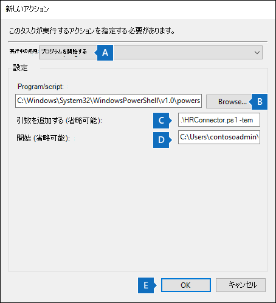

# <a name="set-up-a-connector-to-import-hr-data-in-us-government"></a>米国政府で人事データをインポートするコネクタを設定する

[!include[Purview banner](../includes/purview-rebrand-banner.md)]

Microsoft Purview コンプライアンス ポータルでデータ コネクタを設定して、人事 (HR) データを米国政府機関にインポートできます。 人事関連のデータには、従業員が退職を提出した日付と従業員の最終日の日付が含まれます。 この人事データは、 [インサイダー リスク管理](insider-risk-management.md)ソリューションなどの Microsoft 情報保護ソリューションによって使用され、組織内の悪意のあるアクティビティやデータ盗難から組織を保護するのに役立ちます。 HR コネクタの設定は、コネクタによる認証に使用されるAzure Active Directoryでアプリを作成し、人事データを含む CSV マッピング ファイルを作成し、コンプライアンス センターでデータ コネクタを作成し、CSV ファイルの人事データを Microsoft クラウドに取り込むスクリプト (スケジュールベース) を実行することで構成されます。 その後、データ コネクタはインサイダー リスク管理ツールによって使用され、Microsoft 365米国政府機関にインポートされた人事データにアクセスします。

## <a name="before-you-begin"></a>開始する前に

- 手順 3 で HR コネクタを作成するユーザーには、データ コネクタ管理者ロールを割り当てる必要があります。 このロールは、コンプライアンス ポータルの **[データ コネクタ** ] ページでコネクタを追加するために必要です。 このロールは、既定で複数の役割グループに追加されます。 これらの役割グループの一覧については、「セキュリティ & コンプライアンス センターのアクセス許可」の「 [セキュリティとコンプライアンス センターの](../security/office-365-security/permissions-in-the-security-and-compliance-center.md#roles-in-the-security--compliance-center)ロール」セクションを参照してください。 または、組織内の管理者は、カスタム役割グループを作成し、Data Connector 管理者ロールを割り当て、適切なユーザーをメンバーとして追加することもできます。 手順については、 [Microsoft Purview コンプライアンス ポータル](microsoft-365-compliance-center-permissions.md#create-a-custom-role-group)のアクセス許可の「カスタム ロール グループの作成」セクションを参照してください。

   > [!NOTE]
   > Data Connector 管理者ロールは、現在、米国政府機関GCC High および DoD 環境ではサポートされていません。 したがって、GCC High 環境と DoD 環境で HR コネクタを作成するユーザーには、Exchange Onlineのメールボックスインポートエクスポートロールを割り当てる必要があります。 既定では、この役割は Exchange Online のどの役割グループにも割り当てられていません。 Exchange Onlineの組織管理役割グループにメールボックスインポートエクスポートロールを追加できます。 または、新しい役割グループを作成し、メールボックスインポートエクスポートロールを割り当て、適切なユーザーをメンバーとして追加することもできます。 詳細については、「Exchange Onlineでの[役割グループ](/Exchange/permissions-exo/role-groups#create-role-groups)の管理」の記事の「[役割グループ](/Exchange/permissions-exo/role-groups#modify-role-groups)の作成または役割グループの変更」セクションを参照してください。

- 組織の人事システムから (定期的に) データを取得またはエクスポートし、手順 2 で説明されている CSV ファイルに追加する方法を決定する必要があります。 手順 4 で実行したスクリプトは、CSV ファイル内の人事データを Microsoft クラウドにアップロードします。

- 手順 4 で実行したサンプル スクリプトでは、人事データを Microsoft クラウドにアップロードして、インサイダー リスク管理ソリューションなどの他の Microsoft ツールで使用できるようにします。 このサンプル スクリプトは、Microsoft 標準サポート プログラムまたはサービスではサポートされていません。 サンプル スクリプトは現状のまま提供され、いかなる保証も伴いません。 さらに、Microsoft は、商品性、特定目的への適合性の黙示の保証を含む、一切の黙示の保証をいたしかねます。 本サンプル スクリプトおよびドキュメントの使用または性能に起因するすべてのリスクは、お客様が負うものとします。 サンプル スクリプトおよびドキュメントを使用したこと、または使用できなかったことに伴って生じるいかなる損害 (業務利益の損失、業務の中断、業務情報の損失、金銭上の損失、その他一切の損害) についても、Microsoft、Microsoft に帰属する作者、スクリプトの作成、製造、または納入に関与したその他のすべての人員は、いかなる場合も責めを負わないものとします。

## <a name="step-1-create-an-app-in-azure-active-directory"></a>手順 1: Azure Active Directoryでアプリを作成する

最初の手順は、Azure Active Directory (Azure AD) に新しいアプリを作成して登録することです。 アプリは、手順 3 で作成した HR コネクタに対応します。 このアプリを作成すると、Azure ADが実行され、組織にアクセスしようとしたときに HR コネクタを認証できるようになります。 このアプリは、手順 4 で実行したスクリプトを認証して、人事データを Microsoft クラウドにアップロードするためにも使用されます。 このAzure AD アプリの作成中に、次の情報を保存してください。 これらの値は、後の手順で使用されます。

- Azure AD アプリケーション ID (*アプリ ID* または *クライアント ID* とも呼ばれます)

- Azure AD アプリケーション シークレット (*クライアント シークレット* とも呼ばれます)

- テナント ID ( *ディレクトリ ID* とも呼ばれます)

Azure ADでアプリを作成する手順については、「Microsoft ID プラットフォーム[にアプリケーションを登録する](/azure/active-directory/develop/quickstart-register-app)」を参照してください。

## <a name="step-2-prepare-a-csv-file-with-your-hr-data"></a>手順 2: 人事データを含む CSV ファイルを準備する

次の手順では、組織を離れた従業員に関する情報を含む CSV ファイルを作成します。 「開始する前に」セクションで説明されているように、組織の人事システムからこの CSV ファイルを生成する方法を決定する必要があります。 次の例は、3 つの必須パラメーター (列) を含む完成した CSV ファイル (Note Pad で開く) を示しています。 Microsoft Excelで CSV ファイルを編集する方がずっと簡単です。

```text
EmailAddress,TerminationDate,LastWorkingDate
sarad@contoso.com,2019-04-23T15:18:02.4675041+05:30,2019-04-29T15:18:02.4675041+05:30
pilarp@contoso.com,2019-04-24T09:15:49Z,2019-04-29T15:18:02.7117540
```

CSV ファイルの最初の行 (ヘッダー行) には、必要な列名が一覧表示されます。 各列ヘッダーで使用される名前はユーザーが指定します (前の例の候補です)。 ただし、手順 3 で HR コネクタを作成するときは、CSV ファイルで使用するのと同じ列名を指定 *する必要があります* 。 列名にスペースを含めないでください。

次の表では、CSV ファイル内の各列について説明します。

| 列名 | 説明 |
|:-----|:-----|
| **EmailAddress** <br/> |終了した従業員のメール アドレスを指定します。|
| **TerminationDate** <br/> |組織で個人の雇用が正式に終了した日付を指定します。 たとえば、この日付は、従業員が組織を離れることに関する通知を行った日付です。 この日付は、その人の仕事の最後の日の日付と異なる場合があります。 次の日付形式を使用します `yyyy-mm-ddThh:mm:ss.nnnnnn+|-hh:mm`。これは [ISO 8601 の日付と時刻の形式です](https://www.iso.org/iso-8601-date-and-time-format.html)。|
|**LastWorkingDate**|退職した従業員の仕事の最後の日を指定します。 次の日付形式を使用します `yyyy-mm-ddThh:mm:ss.nnnnnn+|-hh:mm`。これは [ISO 8601 の日付と時刻の形式です](https://www.iso.org/iso-8601-date-and-time-format.html)。|
|||

必要な人事データを含む CSV ファイルを作成したら、手順 4. で実行したスクリプトと同じシステムに保存します。 CSV ファイルに常に最新の情報が含まれるように、必ず更新戦略を実装してください。 これにより、スクリプトを実行する場合でも、最新の従業員終了データが Microsoft クラウドにアップロードされます。

## <a name="step-3-create-the-hr-connector"></a>手順 3: HR コネクタを作成する

次の手順では、コンプライアンス ポータルで人事コネクタを作成します。 手順 4 でスクリプトを実行すると、作成する HR コネクタによって、CSV ファイルから組織に人事データが取り込Microsoft 365。 この手順では、コネクタの作成時に生成されるジョブ ID を必ずコピーします。 スクリプトを実行するときに、ジョブ ID を使用します。

1. コンプライアンス ポータルに移動し、[ <a href="https://go.microsoft.com/fwlink/p/?linkid=2173865" target="_blank">**データ コネクタ** ] ページを</a>選択します。

2. **HR** の [**データ コネクタ**] ページで、[**表示**] をクリックします。

3. **HR** ページで、[コネクタの **追加**] をクリックします。

4. [ **認証資格情報** ] ページで、次の操作を行い、[ **次へ**] をクリックします。

   1. 手順 1. で作成した Azure アプリのAzure ADアプリケーション ID を入力または貼り付けます。

   1. HR コネクタの名前を入力します。

5. [ **ファイル マッピング** ] ページで、手順 2 で作成した CSV ファイルの 3 つの列ヘッダー ( *パラメーター* とも呼ばれます) の名前を適切な各ボックスに入力します。 名前の大文字と小文字は区別されません。 前述のように、これらのボックスに入力する名前は、CSV ファイル内のパラメーター名と一致している必要があります。 たとえば、次のスクリーンショットは、手順 2 で示したサンプル CSV ファイルの例のパラメーター名を示しています。

   

6. [ **校閲** ] ページで設定を確認し、[ **完了]** をクリックしてコネクタを作成します。

   コネクタが作成されたことを確認する状態ページが表示されます。 このページには、HR データをアップロードするサンプル スクリプトを実行するために次の手順を完了するために必要な 2 つの重要な点が含まれています。

   

   1. **ジョブ ID。** 次の手順でスクリプトを実行するには、このジョブ ID が必要です。 このページまたはコネクタ ポップアップ ページからコピーできます。
   
   1. **サンプル スクリプトへのリンク。** **この** リンクをクリックしてGitHub サイトに移動し、サンプル スクリプトにアクセスします (リンクによって新しいウィンドウが開きます)。 手順 4. でスクリプトをコピーできるように、このウィンドウを開いたままにします。 または、手順 4. でもう一度アクセスできるように、宛先をブックマークするか、URL をコピーします。 このリンクは、コネクタ ポップアップ ページでも利用できます。

7. **[完了]** をクリックします。

   新しいコネクタ **が [コネクタ** ] タブの一覧に表示されます。 

8. 先ほど作成した HR コネクタをクリックして、コネクタに関するプロパティとその他の情報を含むポップアップ ページを表示します。

   

   まだ行っていない場合は、**Azure アプリ ID** と **コネクタ ジョブ ID** の値をコピーできます。 次の手順でスクリプトを実行するには、これらが必要です。 ポップアップ ページからスクリプトをダウンロードすることもできます (または、次の手順のリンクを使用してダウンロードすることもできます)。

   [**編集]** をクリックして、[**ファイル マッピング**] ページで定義したAzure アプリ ID または列ヘッダー名を変更することもできます。

## <a name="step-4-run-the-sample-script-to-upload-your-hr-data"></a>手順 4: サンプル スクリプトを実行して人事データをアップロードする

HR コネクタを設定する最後の手順は、CSV ファイル (手順 2 で作成した) の人事データを Microsoft クラウドにアップロードするサンプル スクリプトを実行することです。 具体的には、スクリプトによって HR コネクタにデータがアップロードされます。 スクリプトを実行すると、手順 3 で作成した HR コネクタによって人事データがMicrosoft 365組織にインポートされます。このデータには、Insider リスク管理ソリューションなどの他のコンプライアンス ツールからアクセスできます。 スクリプトを実行した後は、最新の従業員退職データが Microsoft クラウドにアップロードされるように、タスクを毎日自動的に実行するようにスケジュールを設定することを検討してください。 [「スクリプトを自動的に実行するようにスケジュールする」を](#optional-step-6-schedule-the-script-to-run-automatically)参照してください。

1. 前の手順で開いたままにしたウィンドウに移動して、サンプル スクリプトを使用してGitHub サイトにアクセスします。 または、ブックマークされたサイトを開くか、コピーした URL を使用します。

2. **[未加工**] ボタンをクリックして、テキスト ビューにスクリプトを表示します。

3. サンプル スクリプト内のすべての行をコピーし、テキスト ファイルに保存します。

4. 必要に応じて、組織のサンプル スクリプトを変更します。

5. などの`HRConnector.ps1`ファイル名サフィックス`.ps1`を使用して、テキスト ファイルをWindows PowerShell スクリプト ファイルとして保存します。

6. ローカル コンピューターでコマンド プロンプトを開き、スクリプトを保存したディレクトリに移動します。

7. 次のコマンドを実行して、CSV ファイル内の人事データを Microsoft クラウドにアップロードします。例えば：

    ```powershell
    .\HRConnector.ps1 -tenantId <tenantId> -appId <appId>  -appSecret <appSecret>  -jobId <jobId>  -csvFilePath '<csvFilePath>'
    ```

   次の表では、このスクリプトで使用するパラメーターとその必要な値について説明します。 前の手順で取得した情報は、これらのパラメーターの値で使用されます。

   | パラメーター | 説明 |
   |:-----|:-----|:-----|
   |`tenantId`|手順 1 で取得したMicrosoft 365組織の ID。 Azure AD管理センターの **[概要**] ブレードで、組織のテナント ID を取得することもできます。 これは、組織を識別するために使用されます。|
   |`appId` |手順 1 のAzure ADで作成したアプリのAzure AD アプリケーション ID。 これは、スクリプトがMicrosoft 365組織にアクセスしようとしたときに認証のためにAzure ADによって使用されます。 |
   |`appSecret`|手順 1 のAzure ADで作成したアプリのAzure ADアプリケーション シークレット。 これは認証にも使用されます。|
   |`jobId`|手順 3 で作成した HR コネクタのジョブ ID。 これは、Microsoft クラウドにアップロードされた人事データを人事コネクタに関連付けるために使用されます。|
   |`csvFilePath`|手順 2. で作成した CSV ファイルのファイル パス (スクリプトと同じシステムに格納されます)。 ファイル パス内のスペースを避けてみてください。それ以外の場合は、単一引用符を使用します。|
   |||
   
   各パラメーターの実際の値を使用する HR コネクタ スクリプトの構文の例を次に示します。

   ```powershell
    .\HRConnector.ps1 -tenantId d5723623-11cf-4e2e-b5a5-01d1506273g9 -appId 29ee526e-f9a7-4e98-a682-67f41bfd643e -appSecret MNubVGbcQDkGCnn -jobId b8be4a7d-e338-43eb-a69e-c513cd458eba -csvFilePath 'C:\Users\contosoadmin\Desktop\Data\employee_termination_data.csv'
    ```

   アップロードが成功した場合、スクリプトには **成功したメッセージアップロード** 表示されます。

   > [!NOTE]
   > 実行ポリシーが原因で前のコマンドの実行に問題がある場合は、実行ポリシーの設定に関するガイダンスについては、「 [実行ポリシー](/powershell/module/microsoft.powershell.core/about/about_execution_policies) と [Set-ExecutionPolicy](/powershell/module/microsoft.powershell.security/set-executionpolicy) について」を参照してください。

## <a name="step-5-monitor-the-hr-connector"></a>手順 5: HR コネクタを監視する

HR コネクタを作成し、スクリプトを実行して人事データをアップロードしたら、コンプライアンス ポータルでコネクタとアップロード状態を表示できます。 スクリプトを定期的に自動的に実行するようにスケジュールする場合は、スクリプトが最後に実行された後の現在の状態を表示することもできます。

1. コンプライアンス ポータルに移動し、 <a href="https://go.microsoft.com/fwlink/p/?linkid=2173865" target="_blank">**データ コネクタ**</a>を選択します。

2. [ **コネクタ** ] タブをクリックし、HR コネクタを選択してポップアップ ページを表示します。 このページには、コネクタに関するプロパティと情報が含まれています。

   

3. [ **進行状況**] で、[ **ログのダウンロード** ] リンクをクリックして、コネクタの状態ログを開く (または保存) します。 このログには、スクリプトが実行され、CSV ファイルから Microsoft クラウドにデータがアップロードされるたびに関する情報が含まれます。 

   

   このフィールドは `RecordsSaved` 、アップロードした CSV ファイル内の行数を示します。 たとえば、CSV ファイルに 4 つの行が含まれている場合、スクリプトが CSV ファイル内のすべての行を正常にアップロードした場合、フィールドの値 `RecordsSaved` は 4 になります。

手順 4 でスクリプトを実行していない場合は、[ **最後のインポート**] にスクリプトをダウンロードするためのリンクが表示されます。 スクリプトをダウンロードし、手順 4 の手順に従って実行できます。

## <a name="optional-step-6-schedule-the-script-to-run-automatically"></a>(省略可能)手順 6: スクリプトを自動的に実行するようにスケジュールする

組織の最新の人事データをインサイダー リスク管理ソリューションなどのツールで使用できるようにするには、1 日に 1 回など、定期的にスクリプトを自動的に実行するようにスケジュールすることをお勧めします。 また、CSV ファイル内の人事データを同様のスケジュール (同じではない場合) に更新して、組織を離れる従業員に関する最新情報を含める必要もあります。 目標は、人事コネクタが内部リスク管理ソリューションで利用できるように、最新の人事データをアップロードすることです。

Windowsのタスク スケジューラ アプリを使用して、毎日スクリプトを自動的に実行できます。

1. ローカル コンピューターで、[Windows **スタート]** ボタンをクリックし、「**タスク スケジューラ」** と入力します。

2. **タスク スケジューラ** アプリをクリックして開きます。

3. [ **アクション]** セクションで、[ **タスクの作成**] をクリックします。

4. [ **全般** ] タブで、スケジュールされたタスクのわかりやすい名前を入力します。たとえば、 **HR コネクタ スクリプト** です。 オプションの説明を追加することもできます。

5. [ **セキュリティ オプション**] で、次の操作を行います。

   1. コンピューターにログオンしている場合にのみスクリプトを実行するか、ログオンしているときに実行するかを決定します。
   
   1. **[最高の特権で実行]** チェック ボックスがオンになっていることを確認します。

6. [トリガー] タブ **を** 選択し、[ **新規**] をクリックして、次の操作を行います。

   1. **[設定**] で [**日単位**] オプションを選択し、スクリプトを初めて実行する日付と時刻を選択します。 スクリプトは、指定された時刻に毎日実行されます。
   
   1. [ **詳細設定]** で、[ **有効]** チェック ボックスがオンになっていることを確認します。
   
   1. [**OK**] をクリックします。

7. [ **アクション]** タブを選択し、[ **新規**] をクリックして、次の操作を行います。

   

   1. **[アクション**] ドロップダウン リストで、[**プログラムの開始]** が選択されていることを確認します。

   1. [ **プログラム/スクリプト** ] ボックスで [ **参照**] をクリックし、次の場所に移動して選択し、パスがボックスに表示されるようにします `C:\Windows\System32\WindowsPowerShell\v1.0\powershell.exe`。

   1. [ **引数の追加 (省略可能)]** ボックスに、手順 4 で実行したのと同じスクリプト コマンドを貼り付けます。 たとえば、`.\HRConnector.ps1 -tenantId "d5723623-11cf-4e2e-b5a5-01d1506273g9" -appId "c12823b7-b55a-4989-faba-02de41bb97c3" -appSecret "MNubVGbcQDkGCnn"  -jobId "e081f4f4-3831-48d6-7bb3-fcfab1581458" -csvFilePath "C:\Users\contosoadmin\Desktop\Data\employee_termination_data.csv"` のように指定します。

   1. [ **Start in (省略可能)] ボックスに** 、手順 4. で実行したスクリプトのフォルダーの場所を貼り付けます。 たとえば、「 `C:\Users\contosoadmin\Desktop\Scripts` 」のように入力します。

   1. [ **OK] を** クリックして、新しいアクションの設定を保存します。

8. [ **タスクの作成** ] ウィンドウで、[ **OK] を** クリックしてスケジュールされたタスクを保存します。 ユーザー アカウントの資格情報の入力を求めるメッセージが表示される場合があります。

   新しいタスクがタスク スケジューラ ライブラリに表示されます。

   

   スクリプトが最後に実行されたときと、次回実行がスケジュールされた時刻が表示されます。 タスクをダブルクリックして編集できます。

   また、コンプライアンス センターの対応する人事コネクタのポップアップ ページでスクリプトが最後に実行されたことを確認することもできます。