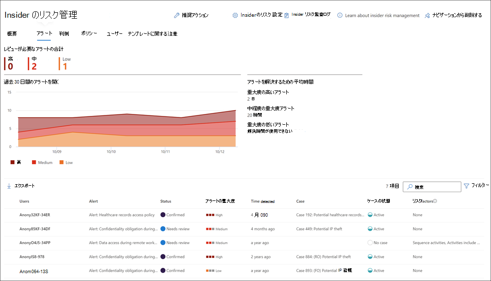
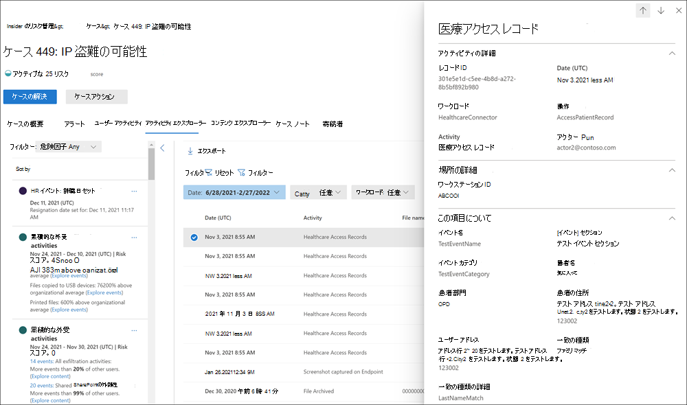

# インサイダーリスク管理活動の調査

リスクの高いユーザー アクティビティの調査は、組織のインサイダー リスクを最小限に抑える重要な第一歩です。 これらのリスクは、インサイダー リスク管理ポリシーからアラートを生成するアクティビティ、またはポリシーによって検出されたが、ユーザーに対するインサイダー リスク管理アラートを直ちに作成しないアクティビティからのリスクです。 ユーザー アクティビティ レポート (プレビュー **)** またはアラート ダッシュボードを使用して、これらの種類のアクティビティ **を調査できます**。

## ユーザー アクティビティ レポート (プレビュー)

ユーザー アクティビティ レポートを使用すると、一時的または明示的にインサイダー リスク管理ポリシーに割り当てなくても、定義された期間の特定のユーザーのアクティビティを確認できます。 ほとんどのインサイダー リスク管理シナリオでは、ユーザーはポリシーで明示的に定義され、ポリシーアラート (トリガー イベントに応じて) とアクティビティに関連付けられたリスク スコアを持つ場合があります。 ただし、一部のシナリオでは、ポリシーで明示的に定義されていないユーザーのアクティビティを調べる必要があります。 これらは、ユーザーと潜在的に危険なアクティビティに関するヒントを受け取ったユーザー、または通常はインサイダー リスク管理ポリシーに割り当てる必要はないユーザーです。

[インサイダー リスク管理] ページでインジケーターを構成 **設定、選択** したインジケーターに関連付けられた危険なアクティビティに対するユーザー アクティビティが検出されます。 組織内のユーザーによる危険なアクティビティを検出して報告するために、ユーザー アクティビティ レポートのポリシーを構成する必要はない。 ユーザー アクティビティ レポートに含まれるアクティビティは、表示するアクティビティのトリガー イベントを必要としません。 この構成は、トリガー イベントが発生した場合、またはアラートが作成された場合に関係なく、ユーザーの検出されたアクティビティすべてが確認可能な状態を意味します。 レポートはユーザー単位で作成され、カスタム 90 日間のすべてのアクティビティを含めできます。 同じユーザーの複数のレポートはサポートされていません。

ユーザーのアクティビティを調べた後、調査担当者は個々のアクティビティを良性として却下したり、レポートへのリンクを他の調査員と共有または電子メールで送信したり、ユーザーを一時的または明示的にインサイダーリスク管理ポリシーに割り当てるか選択できます。 ユーザーアクティビティレポートページを表示するには *、Insider Risk Management Investigators 役割* グループにユーザーを割 **り当てる必要** があります。  

インサイダー リスク管理の概要ページの **[** ユーザー アクティビティの調査] セクションで [レポートの管理] を選択して **開始** できます。 ユーザーのアクティビティを表示するには、まず[ユーザー アクティビティ レポートの作成] を選択し、[新しいユーザー アクティビティ レポート] ウィンドウで次の **フィールドに入力** します。

- **ユーザー**: 名前または電子メール アドレスでユーザーを検索する
- **開始日:** カレンダー コントロールを使用して、ユーザー アクティビティの開始日を選択します。
- **終了日:** カレンダー コントロールを使用して、ユーザー アクティビティの終了日を選択します。 選択した終了日は、選択した開始日から 2 日を超え、選択した開始日から 90 日を超えなければならない。
新しいレポートは、通常、レビューの準備が整うまで最大 10 時間かかります。 レポートの準備ができたら、[ユーザー アクティビティ レポート] ページの[状態] 列に [レポートの準備完了] が表示されます。 詳細レポートを表示するユーザーを選択します。

選択 **したユーザーのユーザー** アクティビティ レポートには、[ユーザー アクティビティ] タブと **[** アクティビティ エクスプローラー **] タブが含** まれています。

- **ユーザー アクティビティ**: このグラフ ビューを使用して、アクティビティを調査し、シーケンスで発生する可能性のあるアクティビティを表示します。 このタブは、すべてのアクティビティの履歴タイムライン、アクティビティの詳細、ケース内のユーザーの現在のリスク スコア、一連のリスク イベント、調査に役立つフィルターコントロールなど、ケースの迅速なレビューを可能にするための構造です。
- **アクティビティ エクスプローラー**: [ **アクティビティ エクスプローラー] タブ** には、アクティビティに関する詳細情報を提供する包括的な分析ツールがリスク調査担当者に提供されます。 アクティビティ エクスプローラーを使用すると、レビュー担当者は、検出された危険なアクティビティのタイムラインをすばやく確認し、アラートに関連付けられているすべてのリスク アクティビティを特定してフィルター処理できます。 アクティビティ エクスプローラーの使用の詳細については、この記事の後半の *「アクティビティ* エクスプローラー」セクションを参照してください。

## アラート ダッシュボード

インサイダーリスク管理警告は、インサイダーリスク管理ポリシーで定義されたリスク インジケーターによって自動的に生成されます。 これらの通知で、コンプライアンスアナリストと捜査官が、現在のリスクの状態をすべて把握できるようになり、組織がトリアージでき見つかったリスクに対処できるようになります。 既定では、ポリシーは低、中、および重大度の高いアラートを一定の量生成しますが、ニーズに合わせてアラートボリュームを増減できます。 さらに、ポリシー ウィザードを使用して新しいポリシー [を](insider-risk-management-settings.md#indicator-level-settings-preview) 作成するときに、ポリシー インジケーターのアラートしきい値を構成できます。

危険なアクティビティに関する詳細、コンテキスト、および関連するコンテンツをアラートが提供する方法と、調査プロセスをより効果的にする方法の概要については [、「Insider Risk Management Alerts Triage Experience」](https://www.youtube.com/watch?v=KgmpxBLJLPI) ビデオをご覧ください。

インサイダー リスク **アラート ダッシュボード** を使用すると、インサイダー リスク ポリシーによって生成されたアラートを表示および実行できます。 各レポート ウィジェットには、過去 30 日間の情報が表示されます。

- **確認が必要なアラート** の総数 : レビューとトリアージが必要なアラートの総数が一覧表示されます。アラートの重大度別の内訳を含む。
- **過去 30** 日間のアラートを開く : ポリシーによって作成された過去 30 日間のアラートの総数を、高、中、低のアラート重大度レベルで並べ替えました。
- **アラートを解決するための平均時間**: 有用なアラート統計の概要:
  - 重大度の高いアラートを解決するための平均時間。時間、日、または月単位で表示されます。
  - 中程度の重大度のアラートを解決するための平均時間。時間、日、または月単位で表示されます。
  - 重大度の低いアラートを解決するための平均時間。時間、日、または月単位で表示されます。

> [!NOTE]
> インサイダー リスク管理は、組み込みのアラート調整を使用して、リスク調査を保護および最適化し、エクスペリエンスを確認します。 この調整により、誤って構成されたデータ コネクタや DLP ポリシーなど、ポリシー アラートが過負荷になる可能性がある問題から保護されます。 その結果、ユーザーに対する新しいアラートの表示に遅延が生じる可能性があります。

## アラートの状態と重大度

アラートを次のいずれかの状態にトリアージできます。

- **確認** 済み: アラートが確認され、新しいケースまたは既存のケースに割り当てられます。
- **[却下**] : トリアージ プロセスで良性として却下されたアラート。
- **レビューが必要** です: トリアージアクションがまだ実行されていない新しいアラート。
- **解決済** み: 閉じた解決済みケースの一部であるアラート。

アラート リスク スコアは、複数のリスク アクティビティ インジケーターから自動的に計算されます。 これらのインジケーターには、リスク アクティビティの種類、アクティビティの発生回数と頻度、ユーザー リスク アクティビティの履歴、アクティビティの深刻さを高める可能性があるアクティビティ リスクの追加が含まれます。 アラート リスク スコアは、各アラートのリスク重大度レベルをプログラムで割り当て、カスタマイズすることはできません。 アラートが未参加のままで、リスク アクティビティがアラートに対して引き続き発生する場合、リスクの重大度レベルが高くなる可能性があります。 リスク アナリストと調査担当者は、アラート リスクの重大度を使用して、組織のリスク ポリシーと基準に従ってアラートをトリアージできます。

アラート リスクの重大度レベルは次のとおりです。

- **重大度が高** い: アラートのアクティビティとインジケーターは重大なリスクを引き起します。 関連するリスク アクティビティは深刻で反復的であり、他の重要なリスク要因に強く対応します。
- **中程度の重大度**: アラートのアクティビティとインジケーターは、中程度のリスクを引き起します。 関連するリスク アクティビティは、中程度で頻繁であり、他のリスク要因とある程度の相関関係があります。
- **重大度が低** い : アラートのアクティビティとインジケーターは、軽微なリスクを引き起します。 関連するリスク アクティビティは軽微で、まれであり、他の重要なリスク要因にコアレートしない。

## アラート ダッシュボードでアラートをフィルター処理する

組織内のアクティブなインサイダー リスク管理ポリシーの数と種類によっては、大量のアラートを確認することが困難な場合があります。 アラート フィルターを使用すると、アナリストや調査担当者がアラートを複数の属性で並べ替えるのに役立ちます。 アラート ダッシュボードでアラートをフィルター **処理するには、[** フィルター] コントロール **を選択** します。 1 つ以上の属性でアラートをフィルター処理できます。

- **Status**: 1 つ以上のステータス値を選択して、アラート リストをフィルター処理します。 オプションは、*確認済み*、*非表示*、*レビューが必要*、*解決済み* です。
- **重大度 :** 1 つ以上のアラート リスク重大度レベルを選択して、アラート リストをフィルター処理します。 オプションは、*高*、*中*、*低* です。
- **検出された時間**: アラートが作成された日時の開始日と終了日を選択します。
- **ポリシー**: 1 つ以上のポリシーを選択して、選択したポリシーによって生成されたアラートをフィルター処理します。

## アラート ダッシュボードでアラートを検索する

特定の単語でアラート名を検索するには、**検索** コントロールを選び、検索する単語を入力します。 検索結果には、検索で定義された単語を含むポリシー アラートが表示されます。

## 複数の通知を閉じ (プレビュー)

アナリストや調査担当者が複数のアラートを一度に即座に却下する時間を節約するのに役立つ場合があります。 [**アラートの** 却下] コマンド バー オプションを使用すると、ダッシュボードで [レビューの必要] 状態の 1 つ以上のアラートを選択し、トリアージ プロセスでこれらのアラートを適切な状態にすばやく閉じることができます。 一度に却下するアラートは最大 400 件まで選択できます。

インサイダー リスク アラートを却下するには、次の手順を実行します。

1. [警告] [Microsoft 365 コンプライアンス センター](https://compliance.microsoft.com)[Insider リスク管理] に **移動し、[** アラート] タブ **を選択** します。
2. [アラート **] ダッシュボードで**、却下する [レビューの必要] 状態のアラート (またはアラート) を選択します。
3. [アラート] コマンド バーで、[アラートの却下] **を選択します**。
4. [アラートの **詳細を閉** じます] ウィンドウで、選択したアラートに関連付けられているユーザーとポリシーの詳細を確認できます。
5. [**アラートを閉じる**] を選択してアラートを良性として解決するか、[キャンセル] を選択して、アラートを閉じることなく詳細ウィンドウを閉じます。

## トリアージアラート

インサイダー リスク アラートをトリアージするには、次の手順を実行します。

1. [警告] [Microsoft 365 コンプライアンス センター](https://compliance.microsoft.com)[Insider リスク管理] に **移動し、[** アラート] タブ **を選択** します。
2. [アラート **] ダッシュボードで**、トリアージするアラートを選択します。
3. [アラート **] 詳細ウィンドウで**、次のタブを確認し、アラートをトリアージできます。
    - **概要**: このタブには、アラートに関する一般的な情報が含まれているので、アラートを確認して新しいケースを作成したり、アラートを閉じ込めすることができます。 これには、アラートの現在の状態とアラート リスクの重大度レベルが含まれます。"高"、"中"、または "低" と表示 *されます*。  アラートがトリアージされていない場合、重大度レベルは時間の間に増加または減少する可能性があります。
        - **何が発生した (プレビュー)**: アクティビティ評価期間中の上位 3 つのリスク アクティビティとポリシーの一致 (アクティビティに関連付けられている違反の種類や発生回数など) を表示します。
        - **ユーザーの詳細**: アラートに割り当てられたユーザーに関する一般的な情報を表示します。 匿名化が有効になっている場合、ユーザー名、電子メール アドレス、エイリアス、および組織フィールドは匿名化されます。
        - **アラートの** 詳細 : アラートが生成された時間、アラートを生成したポリシーが一覧表示され、アラートから生成されたケースが一覧表示されます。 新しいアラートでは、[ケース] **フィールドに [** なし] と表示されます。
        - **検出されたコンテンツ (プレビュー)**: アラートのリスク アクティビティに関連付けられたコンテンツを含み、主要な領域別にアクティビティ イベントを要約します。 アクティビティ リンクを選択すると、アクティビティ エクスプローラーが開き、アクティビティに関するその他の詳細が表示されます。
    - **ユーザー アクティビティ**: このタブには、アラートに関連付けられたユーザーのアクティビティ履歴が表示されます。 この履歴には、このアラートのポリシーに割り当てられたテンプレートで定義されているリスク インジケーターに関連するその他のアラートとアクティビティが含まれます。 この履歴を使用すると、リスク アナリストと調査担当者は、トリアージ プロセスの一環として、従業員の過去のリスクの高い動作を考慮できます。
    - **アクション**: アラートごとに次のアクションを使用できます。
        - **展開されたビューを開く**: アクティビティ **エクスプローラー ダッシュボードを開** きます。
        - **ケースの確認と作成**: このアクションを使用して、ユーザーに関連付けられているすべてのアラートの新しいケースを確認して作成します。 このアクションは、アラートの状態を [確認済み] に自動的に *変更します*。
        - **[アラートの却下**] : このアクションを使用して、アラートを閉じします。 このアクションは、アラートの状態を [解決済み] *に変更します*。

## アクティビティ エクスプローラー (プレビュー)

> [!NOTE]
> アクティビティ エクスプローラーは、組織でこの機能を利用した後にイベントをトリガーするユーザーのアラート管理領域で使用できます。

アクティビティ エクスプローラーは、リスク調査者とアナリストに、アラートに関する詳細情報を提供する包括的な分析ツールを提供します。 アクティビティ エクスプローラーを使用すると、レビュー担当者は、検出された危険なアクティビティのタイムラインをすばやく確認し、アラートに関連付けられているすべてのリスク アクティビティを特定してフィルター処理できます。 アクティビティ エクスプローラーでアラートをフィルター処理するには、[フィルター] コントロールを選択します。 アラートの詳細ウィンドウに表示される 1 つ以上の属性でアラートをフィルター処理できます。 また、アクティビティ エクスプローラーはカスタマイズ可能な列をサポートし、調査担当者やアナリストがダッシュボードを最も重要な情報に集中するのに役立ちます。

アクティビティ エクスプローラーを **使用するには、** 次の手順を実行します。

1. [警告] Microsoft 365 コンプライアンス センター[Insider リスク管理]**に移動し**、[アラート] タブ **を選択** します。
2. [アラート **] ダッシュボードで**、トリアージするアラートを選択します。
3. [アラートの **詳細] ウィンドウで、[** 展開ビュー **を開く] を選択します**。
4. 選択したアラートのページで、[アクティビティ エクスプローラー] **タブを選択** します。

アクティビティ エクスプローラーでアクティビティを確認する場合、調査担当者とアナリストは特定のアクティビティを選択し、アクティビティの詳細ウィンドウを開きます。 このウィンドウには、調査担当者とアナリストがアラート トリアージ プロセス中に使用できるアクティビティに関する詳細情報が表示されます。 詳細な情報は、アラートのコンテキストを提供し、アラートをトリガーしたリスク アクティビティの全範囲を特定するのに便利です。

## アラートのケースを作成する

アラートがレビューされ、トリアージされる際に、新しいケースを作成してリスク アクティビティをさらに調査できます。 アラートのケースを作成するには、次の手順を実行します。

1. [警告] [Microsoft 365 コンプライアンス センター](https://compliance.microsoft.com)[Insider リスク管理] に **移動し、[** アラート] タブ **を選択** します。
2. [アラート **] ダッシュボードで**、確認するアラートを選択し、新しいケースを作成します。
3. [アラートの **詳細] ウィンドウで、[** アクション] を  >  **選択して&を作成します**。
4. [アラートの **確認とインサイ** ダー リスク ケースの作成] ダイアログで、ケースの名前を入力し、投稿者として追加するユーザーを選択し、該当するコメントを追加します。 コメントはケースノートとしてケースに自動的に追加されます。
5. [ **ケースの作成]** を選択して新しいケースを作成するか、[ **キャンセル** ] を選択してケースを作成せずにダイアログを閉じます。

ケースの作成後、調査担当者とアナリストはケースを管理および実行できます。 詳細については、「Insider リスク管理ケース [」の記事を参照](insider-risk-management-cases.md) してください。
