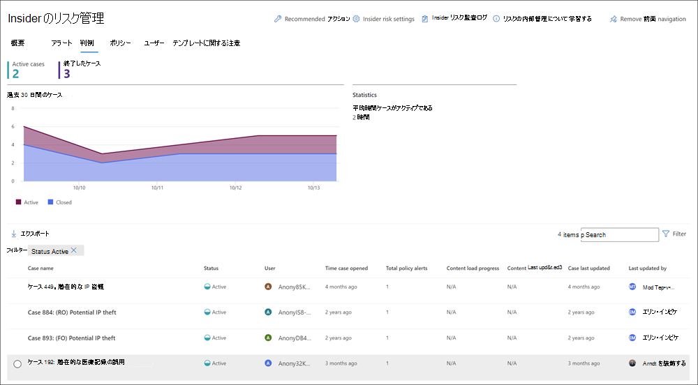

# インサイダー リスク管理のケース

[!include[Purview banner](../includes/purview-rebrand-banner.md)]

ケースはインサイダー リスク管理の中核であり、ポリシーで定義されたリスク インジケーターによって発生する問題を深く調査し、対処することができます。 ケースは、ユーザーのコンプライアンス関連の問題に対処するためにさらにアクションが必要な状況で、アラートから手動で作成されます。 各ケースのスコープは 1 人のユーザーに対して行われ、ユーザーに対する複数のアラートを既存のケースまたは新しいケースに追加できます。

ケースの詳細を調査した後、次の操作を実行できます。

- ユーザーに通知を送信する
- ケースを問題のないものとして解決する
- ServiceNow インスタンスまたは電子メール受信者とケースを共有する
- 電子情報開示 (プレミアム) 調査のケースをエスカレートする

インサイダー リスク管理でケースを調査および管理する方法の概要については、 [Insider Risk Management の調査とエスカレーション](https://www.youtube.com/watch?v=UONUSmkRC8s) に関するビデオを参照してください。

## ケース ダッシュボード

インサイダー リスク管理 **ケース ダッシュボード** を使用すると、ケースを表示および操作できます。 ダッシュボードの各レポート ウィジェットには、過去 30 日間の情報が表示されます。

- **アクティブなケース**: 調査中のアクティブなケースの合計数。
- **過去 30 日間のケース**: 作成されたケースの合計数。 *アクティブ* 状態と *終了* 状態で並べ替えられます。
- **統計**: アクティブなケースの平均時間(時間、日数、または月単位)。

ケース キューには、次のケース属性の現在の状態に加えて、組織のすべてのアクティブケースとクローズケースが一覧表示されます。

- **ケース名**: アラートが確認され、ケースが作成されたときに定義されるケースの名前。  
- **状態**: ケースの状態 ( *アクティブ* または *クローズ*)。
- **ユーザー**: ケースのユーザー。 ユーザー名の匿名化が有効になっている場合は、匿名化された情報が表示されます。
- **Time case opened**: ケースが開かれた後に経過した時間。
- **ポリシー アラートの合計数**: ケースに含まれるポリシー一致の数。 新しいアラートがケースに追加されると、この数は増える可能性があります。
- **ケースが最後に更新** されました。ケースの状態が追加または変更されてから経過した時間。
- **最終更新日:** ケースを最後に更新したインサイダー リスク管理アナリストまたは調査担当者の名前。

**検索** コントロールを使用して、特定のテキストのケース名を検索し、ケース フィルターを使用して、次の属性でケースを並べ替えます。

- 状態
- ケースが起きてからの時間、開始日、終了日
- 最終更新、開始日、終了日

## ケースをフィルター処理する

組織内のアクティブなインサイダー リスク管理ポリシーの数と種類によっては、ケースの大きなキューを確認するのは困難な場合があります。 ケース フィルターを使用すると、アナリストや調査担当者が複数の属性でケースを並べ替えることができます。 **ケース ダッシュボード** でアラートをフィルター処理するには、**フィルター** コントロールを選択します。 ケースは、1 つ以上の属性でフィルター処理できます。

- **状態**: 1 つ以上の状態値を選択して、ケース の一覧をフィルター処理します。 オプションは *[アクティブ]* と *[終了] です*。
- **ケースを開いた時刻**: ケースが開かれた日時の開始日と終了日を選択します。
- **最終更新日**: ケースが更新された日時の開始日と終了日を選択します。

## ケースを調査する

インサイダー リスク管理アラートの詳細な調査は、適切な是正措置を講じる上で重要です。 インサイダー リスク管理ケースは、ユーザー リスク アクティビティの履歴、アラートの詳細、一連のリスク イベントを詳しく調べる一元的な管理ツールであり、リスクにさらされるコンテンツとメッセージを調査します。 リスク アナリストや調査担当者は、ケースを使用して、レビューのフィードバックとメモを一元化し、ケース解決を処理することもできます。

ケースを選択すると、ケース管理ツールが開き、分析担当者と調査担当者がケースの詳細を調査します。

### ケースの概要

[ **ケースの概要** ] タブには、リスク アナリストと調査担当者のケースの詳細がまとめされています。 [ **このケース** について] 領域には、次の情報が含まれています。

- **状態**: ケースの現在の状態 (アクティブまたはクローズ)。
- **作成されたケース**: ケースが作成された日時。
- **ユーザーのリスク スコア**: ケースのユーザーの現在の計算されたリスク レベル。 このスコアは 24 時間ごとに計算され、ユーザーに関連付けられているすべてのアクティブなアラートのアラート リスク スコアを使用します。
- **電子メール**: ケースのユーザーの電子メール エイリアス。
- **組織または部署**: ユーザーが割り当てられている組織または部署。
- **マネージャー名**: ユーザーのマネージャーの名前。
- **マネージャー電子メール**: ユーザーのマネージャーの電子メール エイリアス。

[ **ケースの概要** ] タブには、ケースに関連付けられているポリシー一致 **アラート** に関する次の情報を含む [アラート] セクションも含まれています。

- **ポリシーの一致**: ユーザー アクティビティの一致アラートに関連付けられているインサイダー リスク管理ポリシーの名前。
- **状態**: アラートの状態。
- **重大度**: アラートの重大度。
- **検出された時間**: アラートが生成されてから経過した時間。

### アラート

[ **アラート]** タブには、ケースに含まれる現在のアラートの概要が表示されます。 新しいアラートは既存のケースに追加される可能性があり、割り当て時に **アラート** キューに追加されます。 キューには、次のアラート属性が表示されます。

- 状態
- 重要度
- 検出された時間

キューからアラートを選択して、[アラートの **詳細]** ページを表示します。

検索コントロールを使用して特定のテキストのアラート名を検索し、アラート フィルターを使用してケースを次の属性で並べ替えます。

- 状態
- 重要度
- 検出された時間、開始日、終了日

フィルター コントロールを使用して、次のようないくつかの属性でアラートをフィルター処理します。

- **状態**: 1 つ以上の状態値を選択して、アラート リストをフィルター処理します。 オプションは、*確認済み*、*非表示*、*レビューが必要*、*解決済み* です。
- **重大度**: 1 つ以上のアラート リスク重大度レベルを選択して、アラート リストをフィルター処理します。 オプションは、*高*、*中*、*低* です。
- **検出された時刻**: アラートが作成された日時の開始日と終了日を選択します。
- **ポリシー**: 1 つ以上のポリシーを選択して、選択したポリシーによって生成されたアラートをフィルター処理します。

### ユーザー アクティビティ

[ **ユーザー アクティビティ** ] タブを使用すると、リスク アナリストと調査担当者は、アクティビティの詳細を確認し、リスク アラートとケースに関連付けられているすべてのアクティビティを視覚的に表現できます。 たとえば、アラートトリアージ プロセスの一環として、アナリストはケースに関連付けられているすべてのリスク アクティビティの詳細を確認する必要がある場合があります。 場合によっては、リスク調査担当者は、ユーザー アクティビティの詳細とバブル チャートを確認して、ケースに関連付けられているアクティビティの全体的な範囲を理解するのに役立ちます。 ユーザー アクティビティ チャートの詳細については、 [Insider リスク管理アクティビティ](insider-risk-management-activities.md#user-activity) に関する記事を参照してください。

### アクティビティ エクスプローラー (プレビュー)

**[アクティビティ エクスプローラー**] タブを使用すると、リスク アナリストと調査担当者は、リスク アラートに関連付けられているアクティビティの詳細を確認できます。 たとえば、ケース管理アクションの一環として、調査担当者とアナリストは、ケースに関連付けられているすべてのリスク アクティビティを確認して詳細を確認する必要がある場合があります。 **アクティビティ エクスプローラー** を使用すると、レビュー担当者は、検出された危険なアクティビティのタイムラインをすばやく確認し、アラートに関連付けられているすべてのリスク アクティビティを特定してフィルター処理できます。

アクティビティ エクスプローラーの詳細については、 [Insider リスク管理アクティビティ](insider-risk-management-activities.md#activity-explorer) に関する記事を参照してください。

### コンテンツ エクスプローラー

**[コンテンツ エクスプローラー**] タブを使用すると、リスク調査担当者は、リスク アラートに関連付けられているすべての個々のファイルと電子メール メッセージのコピーを確認できます。 たとえば、ユーザーが SharePoint Online から何百ものファイルをダウンロードし、アクティビティがポリシー アラートをトリガーしたときにアラートが作成された場合、そのアラート用にダウンロードされたすべてのファイルがキャプチャされ、元のストレージ ソースからインサイダー リスク管理ケースにコピーされます。

コンテンツ エクスプローラーは、基本的な検索機能と高度な検索機能とフィルター処理機能を備えた強力なツールです。 コンテンツ エクスプローラーの使用の詳細については、「 [Insider リスク管理コンテンツ エクスプローラー](insider-risk-management-content-explorer.md)」を参照してください。

### ケースメモ

ケースの [ **ケース ノート** ] タブでは、リスク アナリストと調査担当者がケースの作業に関するコメント、フィードバック、分析情報を共有します。 ノートはケースに永続的に追加され、メモを保存した後で編集または削除することはできません。 アラートからケースが作成されると、「**アラートの確認とインサイダーリスクケースの作成**」ダイアログに入力されたコメントが、ケースメモとして自動的に追加されます。

ケース ノート ダッシュボードには、メモを作成したユーザーのメモと、メモが保存されてから経過した時間が表示されます。 特定のキーワードのケース ノート テキスト フィールドを検索するには、ケース ダッシュボードの **[検索** ] ボタンを使用して、特定のキーワードを入力します。

ケースにメモを追加するには:

1. [Microsoft Purview コンプライアンス ポータル](https://compliance.microsoft.com)で、**Insider リスク管理** に移動し、[ケース] タブ **を** 選択します。
2. ケースを選択し、[ **ケース ノート** ] タブを選択します。
3. [ **ケース ノートの追加]** を選択します。
4. [ **ケース ノートの追加** ] ダイアログで、ケースのメモを入力します。 **[保存] を** 選択してケースにメモを追加するか、ケースにメモを保存せずに **[閉じるキャンセル]** を選択します。

### 共同作成者

ケースの [**共同作成者**] タブでは、リスク分析担当者や調査担当者が、ケースに別のレビュー担当者を追加することができます。 既定では、**Insider Risk Management アナリストと Insider Risk Management Investigators** ロールが割り当てられているすべてのユーザーが、アクティブケースとクローズ ケースごとに共同作成者として一覧表示されます。 **Insider Risk Management Investigators** ロールが割り当てられたユーザーのみが、コンテンツ エクスプローラーでファイルとメッセージを表示する権限を持ちます。

ユーザーを共同作成者として追加することで、ケースへの一時的なアクセスを許可できます。 共同作成者は、次を除く特定のケースに対するすべてのケース管理制御を持っています。

- アラートの確認または消去する権限
- ケースの共同作成者を編集する権限
- コンテンツ エクスプローラーでファイルとメッセージを表示するアクセス許可

ケースに共同作成者を追加するには:

1. [Microsoft Purview コンプライアンス ポータル](https://compliance.microsoft.com)で、**Insider リスク管理** に移動し、[ケース] タブ **を** 選択します。
2. ケースを選択し、[ **共同作成者** ] タブを選択します。
3. [ **共同作成者の追加]** を選択します。
4. [ **共同作成者の追加]** ダイアログで、追加するユーザーの名前の入力を開始し、推奨されるユーザーの一覧からユーザーを選択します。 この一覧は、テナント サブスクリプションのAzure Active Directoryから生成されます。
5. [ **追加]** を選択してユーザーを共同作成者として追加するか、[ **キャンセル]** を選択して、ユーザーを共同作成者として追加せずにダイアログを閉じます。

## ケースへの対処

リスク調査担当者は、ケースの重大度、ユーザーのリスク履歴、組織のリスク ガイドラインに応じて、いくつかの方法のいずれかでケースに対してアクションを実行できます。 状況によっては、ケースをユーザーまたはデータ調査にエスカレートして、組織の他の領域と共同作業し、リスク アクティビティの詳細を調べる必要がある場合があります。 インサイダー リスク管理は、他の Microsoft Purview ソリューションと緊密に統合されており、エンドツーエンドの解決管理に役立ちます。

### 電子メール通知を送信する

ほとんどの場合、インサイダー リスク アラートを作成するユーザー アクションは、不注意または偶発的です。 ユーザーにメールでリマインダー通知を送信することは、ケースレビューとアクションを文書化するための効果的な方法であり、企業ポリシーをユーザーに通知したり、トレーニングを更新したりするための方法です。 通知は、インサイダー リスク管理インフラストラクチャ用 [に作成した通知テンプレート](insider-risk-management-notices.md) から生成されます。

ユーザーに電子メール通知を送信しても、このケースは _Closed* として解決 **されないこと** を覚えておく必要があります。 場合によっては、新しいケースを開かずに、より多くのリスク アクティビティを検索する通知をユーザーに送信した後、ケースを開いたままにしておく必要があります。 通知が送信された後にケースを解決する場合は、通知を送信した後の手順として、「**ケース解決済**」を選択しなければなりません。

ケースに割り当てられたユーザーに通知を送信するには:

1. [Microsoft Purview コンプライアンス ポータル](https://compliance.microsoft.com)で、**Insider リスク管理** に移動し、[ケース] タブ **を** 選択します。
2. ケースを選択し、ケース アクション ツール バーの [ **電子メール通知の送信** ] ボタンを選択します。
3. [ **電子メール通知の送信** ] ダイアログで、[ **通知テンプレートの選択** ] ドロップダウン コントロールを選択して、通知の通知テンプレートを選択します。 この選択は、通知の他のフィールドに事前入力されます。
4. 通知フィールドを確認し、必要に応じて更新します。 ここで入力した値は、テンプレートの値をオーバーライドします。
5. **[送信]** を選択して通知をユーザーに送信するか、[**キャンセル]** を選択して、通知をユーザーに送信せずにダイアログを閉じます。 送信されたすべての通知は、ケース ノート ダッシュボードの **ケース ノート** キューに追加されます。

### 調査を拡大する

ユーザーのリスク アクティビティに追加の法的レビューが必要な状況で、ユーザー調査のケースをエスカレートします。 このエスカレーションにより、Microsoft 365組織で新しい Microsoft Purview 電子情報開示 (プレミアム) ケースが開きます。 電子情報開示 (プレミアム) は、組織の内部および外部の法的調査と関連性のあるコンテンツを保管、収集、確認、分析、エクスポートするための、エンドツーエンドのワークフローを提供します。 また、訴訟チームが法的情報保留通知ワークフロー全体を管理して、ケースに関係するカストディアンとコミュニケーションを取ることができます。 インサイダーリスク管理ケースから作成された電子情報開示 (プレミアム) ケースのカストディアンとしてレビュー担当者を割り当てると、訴訟チームは適切な措置を講じ、コンテンツの保持を管理することができます。 電子情報開示 (プレミアム) ケースの詳細については、「[Microsoft Purview 電子情報開示の概要 (プレミアム)](overview-ediscovery-20.md)」を参照してください。

ケースをユーザー調査にエスカレートするには:

1. [Microsoft Purview コンプライアンス ポータル](https://compliance.microsoft.com)で、**Insider リスク管理** に移動し、[ケース] タブ **を** 選択します。
2. ケースを選択し、ケース アクション ツール バーの [ **調査用にエスカレート** ] ボタンを選択します。
3. [ **調査のエスカレート** ] ダイアログで、新しいユーザー調査の名前を入力します。 必要に応じて、ケースに関するメモを入力し、[ **エスカレーション**] を選択します。
4. 通知フィールドを確認し、必要に応じて更新します。 ここで入力した値は、テンプレートの値をオーバーライドします。
5. [ **確認]** を選択してユーザー調査ケースを作成するか、[ **キャンセル]** を選択して、新しいユーザー調査ケースを作成せずにダイアログを閉じます。

インサイダー リスク管理ケースが新しいユーザー調査ケースにエスカレートされた後は、Microsoft Purview コンプライアンス ポータルの **電子****DiscoveryAdvanced** >  領域で新しいケースを確認できます。

### ケースのPower Automate フローを使用して自動化されたタスクを実行する

推奨されるPower Automate フローを使用すると、リスク調査担当者とアナリストは、次のアクションを迅速に実行できます。

- インサイダー リスク ケースのユーザーに関する人事または企業からの情報の要求
- ユーザーがインサイダー リスク アラートを受け取ったときにマネージャーに通知する
- ServiceNow でインサイダー リスク管理ケースのレコードを作成する
- インサイダー リスク ポリシーに追加されたときにユーザーに通知する

インサイダー リスク管理ケースのPower Automate フローを実行、管理、または作成するには:

1. ケース アクション ツール バーで [ **自動化** ] を選択します。 
2. 実行するPower Automate フローを選択し、[**フローの実行**] を選択します。 
3. フローが完了したら、[完了] を選択 **します**。

インサイダー リスク管理のPower Automate フローの詳細については、「インサイダー リスク管理設定の[概要](insider-risk-management-settings.md#power-automate-flows-preview)」を参照してください。

### ケースのMicrosoft Teams チームを表示または作成する

インサイダー リスク管理のMicrosoft Teams統合が設定で有効になっている場合、アラートが確認され、ケースが作成されるたびに、Microsoft Teams チームが自動的に作成されます。 リスク調査担当者とアナリストは、Microsoft Teamsをすばやく開き、ケース アクション ツール バーで [チームの **表示] Microsoft Teams** 選択することで、ケースのチームに直接移動できます。

Microsoft Team 統合を有効にする前に開かれたケースの場合、リスク調査担当者とアナリストは、ケース アクション ツール バーで [Microsoft Teams チームの作成] を選択することで、ケースの新しい **Microsoft Teams チーム** を作成できます。

ケースが解決されると、関連付けられている Microsoft チームが自動的にアーカイブされます (非表示になり、読み取り専用になります)。

インサイダー リスク管理のMicrosoft Teamsの詳細については、「インサイダー リスク管理設定の[概要](insider-risk-management-settings.md#microsoft-teams-preview)」を参照してください。

### ケースを解決する

リスク アナリストと調査担当者がレビューと調査を完了した後、ケースは、ケースに現在含まれているすべてのアラートに対して対処するように解決できます。 ケースを解決すると、解決分類が追加され、ケースの状態が *[クローズ]* に変更され、解決アクションの理由が **ケース ノート** ダッシュボードのケース ノート キューに自動的に追加されます。 ケースは次のいずれかの方法で解決されます。

- **良性**: ポリシー一致アラートが低リスク、重大でない、または偽陽性として評価される場合の分類。
- **確認済みのポリシー違反**: ポリシー一致アラートが危険、重大、または悪意のある意図の結果として評価されるケースの分類。

ケースを解決するには:

1. [Microsoft Purview コンプライアンス ポータル](https://compliance.microsoft.com)で、**Insider リスク管理** に移動し、[ケース] タブ **を** 選択します。
2. ケースを選択し、ケース アクション ツール バーの [ **ケースの解決** ] ボタンを選択します。
3. [ **ケースの解決** ] ダイアログで、ドロップダウン コントロール **として解決** を選択し、ケースの解決分類を選択します。 オプションは **、問題のない** ポリシー **違反または確認済みポリシー違反です**。
4. [ **ケースの解決** ] ダイアログで、[ **アクションが実行された** テキスト] フィールドに解決分類の理由を入力します。
5. [ **解決]** を選択してケースを閉じるか、[ **キャンセル]** を選択してケースを解決せずにダイアログを閉じます。
