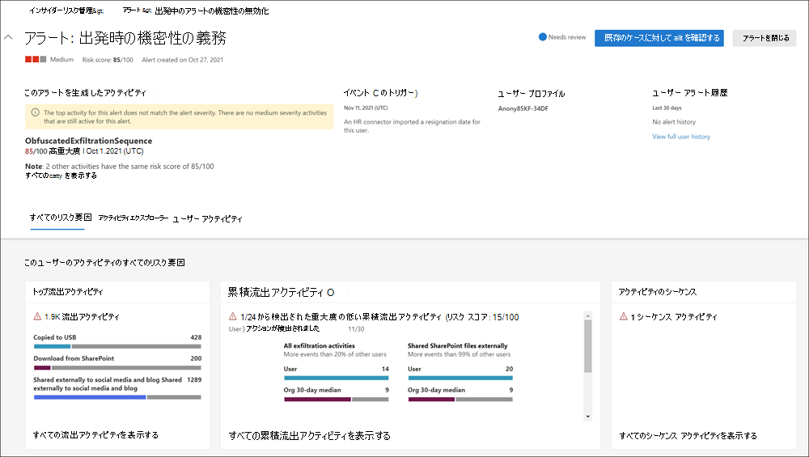
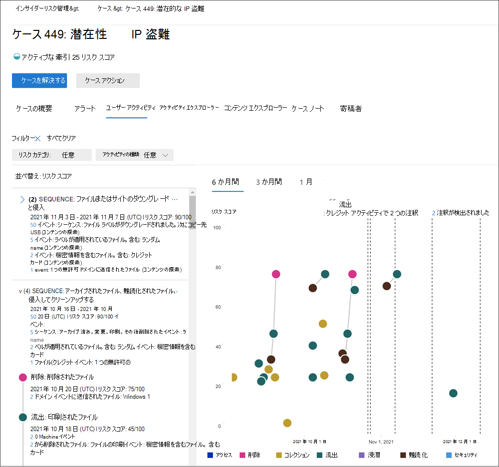

# インサイダー リスク管理の詳細

> [!TIP]
> *9 つの Microsoft Purview ソリューションすべてのプレミアム バージョンを無料で試すことができることをご存知ですか?* 90 日間の Purview ソリューション試用版を使用して、堅牢な Purview 機能が組織のコンプライアンス ニーズを満たすのにどのように役立つかを調べてください。 Microsoft 365 E3 および Office 365 E3 のお客様は、[Microsoft Purview コンプライアンス ポータルの試用版ハブ](https://compliance.microsoft.com/trialHorizontalHub?sku=ComplianceE5&ref=DocsRef)から今すぐ開始できます。 [サインアップできるユーザーと試用版の使用条件](compliance-easy-trials.md)の詳細について説明します。

[!include[Purview banner](../includes/purview-rebrand-banner.md)]

Microsoft Purview インサイダー リスク管理は、組織内の悪意のある不注意なアクティビティを検出、調査、および操作できるようにすることで、内部リスクを最小限に抑えるのに役立つコンプライアンス ソリューションです。 インサイダー リスク ポリシーを使用すると、ケースに対応したり、必要に応じて Microsoft 電子情報開示 (プレミアム) にケースをエスカレートしたりするなど、組織内で識別および検出するリスクの種類を定義できます。 組織内のリスク アナリストは、ユーザーが組織のコンプライアンス基準に準拠していることを確認するために、適切なアクションをすばやく実行できます。

組織内の危険なアクティビティに対処するための計画プロセスの詳細と概要については、「 [インサイダー リスク管理プログラムの開始](https://download.microsoft.com/download/b/2/0/b208282a-2482-4986-ba07-15a9b9286df0/pwc-starting-an-insider-risk-management-program-with-pwc-and-microsoft.pdf)」を参照してください。

組織の価値、カルチャ、およびユーザー エクスペリエンスの優先順位を付けながら、組織がリスクを防止、検出、および含めるのに役立つインサイダー リスク管理を支援する方法については、以下のビデオをご覧ください。
 
 

**開発&インサイダー リスク管理ソリューション**:
>[!VIDEO https://www.microsoft.com/videoplayer/embed/RE4j9CN]
 

**Insider リスク管理ワークフロー**:
>[!VIDEO https://www.microsoft.com/videoplayer/embed/RE4OUXB]

> [!IMPORTANT]
> インサイダー リスク管理は、現在、Azure サービスの依存関係でサポートされている地理的リージョンと国でホストされているテナントで利用できます。 組織でインサイダー リスク管理がサポートされていることを確認するには、 [国/地域ごとの Azure 依存関係の可用性](/troubleshoot/azure/general/dependency-availability-by-country)に関するページを参照してください。

## 現代のリスクの問題点

組織内のリスクを管理して最小化するには、まずモダンワークプレースで見つかったリスクの種類を理解します。 一部のリスクは、外部イベントと直接制御の範囲外の要因によって発生します。 その他のリスクは、最小限に抑え、回避できる内部イベントとユーザー アクティビティによって発生します。 たとえば、組織内のユーザーによる、違法、不適切、承認されていない、または非倫理的な行動によるリスクがあります。 これらの動作には、ユーザーからの広範な内部リスクが含まれます。

- 機密データとデータ流出のリーク
- 機密保持違反
- 知的財産権 (IP) 侵害
- 詐欺
- インサイダー取引
- 規制遵守違反

最新の職場のユーザーは、さまざまなプラットフォームやサービスでデータを作成、管理、共有できます。 ほとんどの場合、組織には、組織全体のリスクを特定して軽減する一方で、ユーザーのプライバシー基準を満たすリソースとツールが限られています。

インサイダー リスク管理では、サービスとサード パーティのインジケーターの全幅を使用して、リスク アクティビティを迅速に特定、トリアージ、および行動するのに役立ちます。 Microsoft 365と Microsoft Graphのログを使用すると、インサイダー リスク管理を使用して、リスク インジケーターを識別するための特定のポリシーを定義できます。 これらのポリシーを使用すると、危険なアクティビティを特定し、これらのリスクを軽減するために行動することができます。

インサイダー リスク管理は、次の原則を中心にしています。

- **透明性**: 設計ごとのプライバシー アーキテクチャを使用して、ユーザーのプライバシーと組織のリスクのバランスを取ります。
- **構成可能:** 業界、地理的、およびビジネス グループに基づいて構成可能なポリシー。
- **統合**: Microsoft Purview ソリューション間の統合ワークフロー。
- **実用的:** レビュー担当者の通知、データ調査、およびユーザー調査を有効にする分析情報を提供します。

## 分析を使用して潜在的なリスクを特定する

Insider リスク分析では、インサイダー リスク ポリシーを構成することなく、組織内の潜在的なインサイダー リスクの評価を行うことができます。 この評価は、組織が高いユーザー リスクの潜在的領域を特定し、構成することを考えるべきインサイダー リスク マネジメント ポリシーの種類と範囲を特定するのに役立ちます。 この評価は、既存のインサイダー リスク ポリシーの追加ライセンスまたは将来の最適化のニーズを判断するのにも役立つ場合があります。

インサイダー リスク分析の詳細については、「 [Insider リスク管理設定: Analytics](insider-risk-management-settings.md#analytics)」を参照してください。

## 推奨されるアクションを使用した概要 (プレビュー)

インサイダー リスク管理を初めて設定する場合でも、新しいポリシーの作成を開始する場合でも、推奨される新しい [アクション](insider-risk-management-configure.md#recommended-actions-preview) エクスペリエンスは、インサイダー リスク管理機能を最大限に活用するのに役立ちます。 推奨されるアクションには、アクセス許可の設定、ポリシー インジケーターの選択、ポリシーの作成などがあります。

## ワークフロー

インサイダー リスク管理ワークフローは、組織内の内部リスクを特定し、調査し、対処するのに役立ちます。 重点を置いたポリシー テンプレート、Microsoft 365 サービス全体での包括的なアクティビティ シグナリング、アラートとケース管理ツールを使用すると、実用的な分析情報を使用して、危険な動作をすばやく特定し、行動することができます。

内部リスク アクティビティとインサイダー リスク管理に関するコンプライアンスの問題を特定して解決するには、次のワークフローを使用します。

### ポリシー

[Insider リスク管理ポリシー](insider-risk-management-policies.md) は、事前に定義されたテンプレートとポリシー条件を使用して作成され、組織でどのようなトリガー イベントとリスク インジケーターが調べられます。 これらの条件には、アラートにリスク インジケーターを使用する方法、ポリシーに含まれるユーザー、どのサービスの優先順位付け、監視期間が含まれます。

次のポリシー テンプレートから選択して、インサイダー リスク管理をすばやく開始できます。

- [離職するユーザーによるデータ盗難](insider-risk-management-policies.md#data-theft-by-departing-users)
- [一般的なデータ漏洩](insider-risk-management-policies.md#general-data-leaks)
- [優先度の高いユーザーによるデータ漏洩 (プレビュー)](insider-risk-management-policies.md#data-leaks-by-priority-users-preview)
- [不満を持つユーザーによるデータ漏洩 (プレビュー)](insider-risk-management-policies.md#data-leaks-by-disgruntled-users-preview)
- [一般的なセキュリティ ポリシー違反 (プレビュー)](insider-risk-management-policies.md#general-security-policy-violations-preview)
- [一般的な患者データの誤用 (プレビュー)](insider-risk-management-policies.md#general-patient-data-misuse-preview)
- [離職するユーザーによるセキュリティ ポリシー違反 (プレビュー)](insider-risk-management-policies.md#security-policy-violations-by-departing-users-preview)
- [優先ユーザーによるセキュリティ ポリシー違反 (プレビュー)](insider-risk-management-policies.md#security-policy-violations-by-priority-users-preview)
- [不満を持つユーザーによるセキュリティ ポリシー違反 (プレビュー)](insider-risk-management-policies.md#security-policy-violations-by-disgruntled-users-preview)

### アラート

アラートは、ポリシー条件に一致するリスク インジケーターによって自動的に生成され、 [アラート ダッシュボード](insider-risk-management-activities.md#alert-dashboard)に表示されます。 このダッシュボードを使用すると、レビューが必要なすべてのアラートのクイック ビュー、時間の経過に伴うアラートのオープン、および組織のアラートの統計情報が表示されます。 すべてのポリシー アラートが次の情報と共に表示され、アクションが必要な既存のアラートと新しいアラートの状態をすばやく識別するのに役立ちます。

- 状態
- 重要度
- 検出された時間
- ケース
- ケースの状態

### トリアージ

調査が必要な新しいユーザー アクティビティは、 *ニーズレビュー* 状態が割り当てられたアラートを自動的に生成します。 レビュー担当者は、これらのアラートを迅速に特定し、確認、評価、トリアージできます。

新しいケースを開いて、既存のケースに警告を割り当てるか、警告を無視すれば警告を解決できます。 アラート フィルターを使用すると、検出された状態、重大度、または時間によってアラートをすばやく識別できます。 トリアージ プロセスの一環として、レビュー担当者は、ポリシーによって識別されたアクティビティのアラートの詳細を表示したり、ポリシー一致に関連付けられたユーザー アクティビティを表示したり、アラートの重大度を確認したり、ユーザー プロファイル情報を確認したりできます。

### 調査

ユーザー アクティビティ [レポート (プレビュー)](insider-risk-management-activities.md#user-activity-reports-preview) を使用して、選択したユーザーのすべてのアクティビティをすばやく調査します。 これらのレポートを使用すると、組織内の調査担当者は、一時的または明示的にインサイダー リスク管理ポリシーに割り当てる必要なく、定義された期間の特定のユーザーのアクティビティを調べることができます。 調査担当者は、ユーザーのアクティビティを調査した後、個々のアクティビティを無害として却下したり、レポートへのリンクを他の調査者と共有または電子メールで送信したり、インサイダー リスク管理ポリシーに一時的または明示的にユーザーを割り当てたりすることができます。

[ケースは、](insider-risk-management-cases.md) ポリシー一致に関するアクティビティの詳細と状況の詳細なレビューと調査を必要とするアラート用に作成されます。 **ケース ダッシュボード** には、組織のすべてのアクティブなケース、時間の経過に伴うオープン ケース、およびケースの統計情報がすべて表示されます。 校閲者は、状態、ケースが開かれた日付、ケースが最後に更新された日付でケースをすばやくフィルター処理できます。

ケース ダッシュボードでケースを選択すると、ケースが開き、調査とレビューが行えます。 この手順は、インサイダー リスク管理ワークフローの中心です。 この領域では、リスク アクティビティ、ポリシー条件、アラートの詳細、およびユーザーの詳細がレビュー担当者の統合ビューに合成されます。 この領域の主な調査ツールは次のとおりです。

- **ユーザー アクティビティ**: ユーザー アクティビティは、時間の経過と現在または過去のリスク アクティビティのリスク レベル別にアクティビティをプロットする対話型グラフに自動的に表示されます。 レビュー担当者は、ユーザーのリスク履歴全体をすばやくフィルター処理して表示し、詳細については特定のアクティビティにドリルダウンできます。
- **コンテンツ エクスプローラー**: アラート アクティビティに関連付けられているすべてのデータ ファイルと電子メール メッセージが自動的にキャプチャされ、コンテンツ エクスプローラーに表示されます。 校閲者は、データ ソース、ファイルの種類、タグ、会話、その他多くの属性によって、ファイルとメッセージをフィルター処理して表示できます。
- **ケース ノート**: 校閲者は、[ケース ノート] セクションでケースのメモを提供できます。 この一覧では、すべてのノートを中央ビューに統合し、校閲者と提出日の情報を含めます。

さらに、新しい [監査ログ (プレビュー)](insider-risk-management-audit-log.md) を使用すると、インサイダー リスク管理機能で実行されたアクションについて常に情報を得られます。 このリソースを使用すると、1 つ以上のインサイダー リスク管理ロール グループに割り当てられたユーザーが実行したアクションを独立して確認できます。

### アクション

ケースを調査した後、レビュー担当者は、ケースを解決したり、組織内の他のリスク関係者と共同作業したりするために迅速に行動できます。 ユーザーが誤って、または誤ってポリシー条件に違反した場合は、組織用にカスタマイズできる通知テンプレートから簡単なリマインダー通知をユーザーに送信できます。 これらの通知は、簡単なリマインダーとして機能する場合や、将来の危険な動作を防ぐためにトレーニングやガイダンスを更新するようユーザーに指示する場合があります。 詳細については、「[インサイダー リスク管理通知テンプレート](insider-risk-management-notices.md)」をご覧ください。

より深刻な状況では、インサイダー リスク管理ケース情報を組織内の他の校閲者またはサービスと共有することが必要になる場合があります。 インサイダー リスク管理は、エンド ツー エンドのリスク解決に役立つ他のMicrosoft Purview ソリューションと緊密に統合されています。

- **電子情報開示 (プレミアム)**: 調査のためにケースをエスカレートすると、ケースのデータと管理をMicrosoft Purview電子情報開示 (プレミアム) に転送できます。 電子情報開示 (プレミアム) は、組織の内部および外部の調査と関連性のあるコンテンツを保管、収集、確認、分析、エクスポートするための、エンドツーエンドのワークフローを提供します。 これにより、法務チームは訴訟ホールド通知ワークフロー全体を管理できます。 電子情報開示 (プレミアム) ケースの詳細については、「[Microsoft Purview電子情報開示 (プレミアム)の概要](overview-ediscovery-20.md)」を参照してください。
- **Office 365管理 API 統合 (プレビュー)**: Insider リスク管理では、Office 365 Management API を使用して、アラート情報をセキュリティ情報およびイベント管理 (SIEM) サービスにエクスポートできます。 プラットフォーム内のアラート情報にアクセスして、組織のリスク プロセスに最適な方法を使用すると、リスク アクティビティに対してより柔軟に対処できます。 Office 365管理 API を使用したアラート情報のエクスポートの詳細については、「[アラートのエクスポート](insider-risk-management-settings.md#export-alerts)」を参照してください。

> [!NOTE]
> ServiceNow コネクタのプレビュー期間中のフィードバックとサポートに感謝します。 ServiceNow コネクタのプレビューを終了し、2020 年 11 月 30 日にインサイダー リスク管理のサポートを中止することにしました。 Microsoft では、お客様にインサイダー リスク管理の ServiceNow 統合を提供するための代替方法を積極的に評価しています。

## シナリオ

インサイダー リスク管理は、組織の内部リスクを検出、調査、および軽減するためのアクションを、いくつかの一般的なシナリオで支援します。

### 離職するユーザーによるデータ盗難

ユーザーが自発的に、または終了の結果として組織を離れると、多くの場合、会社、顧客、およびユーザー データが危険にさらされている正当な懸念があります。 ユーザーは、プロジェクト データが独自のデータではない、または個人的な利益のために会社のデータを取得し、会社のポリシーと法的基準に違反する可能性があると無実に思い込む場合があります。 ユーザー ポリシー テンプレートを [逸脱してデータ盗難を使用する](insider-risk-management-policies.md#policy-templates) インサイダー リスク管理ポリシーは、通常、この種類の盗難に関連するアクティビティを自動的に検出します。 このポリシーを使用すると、ユーザーを離れて適切な調査アクションを実行できるように、データ盗難に関連する不審なアクティビティのアラートが自動的に受信されます。 このポリシー テンプレートには、組織の[Microsoft 365人事コネクタ](import-hr-data.md)を構成する必要があります。

### 機密情報または機密情報の意図的または意図しない漏えい

ほとんどの場合、ユーザーは機密情報または機密情報を適切に処理するよう最善を尽くします。 ただし、ユーザーが間違いを犯したり、情報が組織外で誤って共有されたり、情報保護ポリシーに違反したりすることがあります。 その他の状況では、悪意を持ち、潜在的な個人的利益を得るために、ユーザーが意図的に機密情報や機密情報を漏洩または共有する可能性があります。 次のデータ リーク ポリシー テンプレートを使用して作成されたインサイダー リスク管理ポリシーは、機密情報または機密情報の共有に通常関連付けられているアクティビティを自動的に検出します。

- [一般的なデータ漏洩](insider-risk-management-policies.md#general-data-leaks)
- [優先度の高いユーザーによるデータ漏洩 (プレビュー)](insider-risk-management-policies.md#data-leaks-by-priority-users-preview)
- [不満を持つユーザーによるデータ漏洩 (プレビュー)](insider-risk-management-policies.md#data-leaks-by-disgruntled-users-preview)

## 意図的または意図しないセキュリティ ポリシー違反 (プレビュー)

ユーザーは、通常、最新の職場でデバイスを管理するときに、大きな制御を行います。 このコントロールには、職務のパフォーマンスに必要なアプリケーションをインストールまたはアンインストールするためのアクセス許可、またはデバイス セキュリティ機能を一時的に無効にする機能が含まれる場合があります。 このアクティビティが不注意であるか、偶発的であるか、悪意があるかに関係なく、この行為は組織にリスクをもたらす可能性があり、最小限に抑えるために識別して行動することが重要です。 これらの危険なセキュリティ アクティビティを識別するために、次のインサイダー リスク管理セキュリティ ポリシー違反テンプレートは、セキュリティ リスク インジケーターをスコア付けし、Microsoft Defender for Endpoint アラートを使用してセキュリティ関連のアクティビティの分析情報を提供します。

- [一般的なセキュリティ ポリシー違反 (プレビュー)](insider-risk-management-policies.md#general-security-policy-violations-preview)
- [離職するユーザーによるセキュリティ ポリシー違反 (プレビュー)](insider-risk-management-policies.md#security-policy-violations-by-departing-users-preview)
- [優先ユーザーによるセキュリティ ポリシー違反 (プレビュー)](insider-risk-management-policies.md#security-policy-violations-by-priority-users-preview)
- [不満を持つユーザーによるセキュリティ ポリシー違反 (プレビュー)](insider-risk-management-policies.md#security-policy-violations-by-disgruntled-users-preview)

## 位置、アクセス レベル、またはリスク履歴に基づくユーザーのポリシー (プレビュー)

組織内のユーザーは、自分の位置、機密情報へのアクセスレベル、リスク履歴に応じて、さまざまなレベルのリスクを持つ場合があります。 この構造には、組織のエグゼクティブ リーダーシップ チームのメンバー、広範なデータとネットワーク アクセス特権を持つ IT 管理者、または危険なアクティビティの過去の履歴を持つユーザーが含まれる場合があります。 このような状況では、調査と迅速なアクションのためにアラートを表示するために、より詳細な検査とより積極的なリスク スコアリングが重要です。 このような種類のユーザーの危険なアクティビティを特定するために、優先度の高いユーザー グループを作成し、次のポリシー テンプレートからポリシーを作成できます。

- [優先ユーザーによるセキュリティ ポリシー違反 (プレビュー)](insider-risk-management-policies.md#security-policy-violations-by-priority-users-preview)
- [優先度の高いユーザーによるデータ漏洩 (プレビュー)](insider-risk-management-policies.md#data-leaks-by-priority-users-preview)

## Healthcare (プレビュー)

医療業界の組織にとって、最近の調査では、インサイダー関連のデータ侵害の割合が非常に高いことがわかりました。 患者データと健康記録情報の誤用を検出することは、患者のプライバシーを保護し、医療保険の可搬性と説明責任に関する法律 (HIPAA) や医療情報技術 (HITECH) 法などのコンプライアンス規制を遵守する重要な要素です。患者データの誤用は、特権を持つ患者レコードへのアクセスから、悪意を持つ家族や近隣の患者のレコードへのアクセスに及ぶ可能性があります。 このような危険なアクティビティを識別するために、次のインサイダー リスク管理ポリシー テンプレートでは、Microsoft 365 HR コネクタと医療固有のデータ コネクタを使用して、電子ヒース レコード (EHR) システム内で発生する可能性のある動作に関連するリスク インジケーターのスコア付けを開始します。

- [一般的な患者データの誤用 (プレビュー)](insider-risk-management-policies.md#general-patient-data-misuse-preview)

## 不満を持つユーザーによるアクションと動作 (プレビュー)

雇用ストレスイベントは、インサイダー リスクに関連するいくつかの方法でユーザーの行動に影響を与える可能性があります。 これらのストレス要因は、パフォーマンス レビューの低下、位置の降格、またはユーザーがパフォーマンス レビュー 計画に配置されている可能性があります。 ほとんどのユーザーはこれらのイベントに悪意を持って応答しませんが、これらのアクションのストレスにより、一部のユーザーが通常の状況では考慮しない可能性のあるアクションを実行する可能性があります。 このような危険なアクティビティを識別するために、次のインサイダー リスク管理ポリシー テンプレートでは、Microsoft 365人事コネクタを使用し、雇用ストレス要因イベントの近くで発生する可能性のある行動に関連するリスク インジケーターのスコアリングを開始します。

- [不満を持つユーザーによるデータ漏洩 (プレビュー)](insider-risk-management-policies.md#data-leaks-by-disgruntled-users-preview)
- [不満を持つユーザーによるセキュリティ ポリシー違反 (プレビュー)](insider-risk-management-policies.md#security-policy-violations-by-disgruntled-users-preview)

## 始める準備はいいですか。

- 組織 [でインサイダー リスク管理](insider-risk-management-plan.md) ポリシーを有効にする準備方法については、「インサイダー リスク管理の計画」を参照してください。
- インサイダー リスク ポリシーのグローバル設定を構成するには、[インサイダー リスク管理設定](insider-risk-management-settings.md)の概要を参照してください。
- [インサイダー リスク管理の概要](insider-risk-management-configure.md)を参照して、前提条件を構成し、ポリシーを作成し、アラートの受信を開始します。
