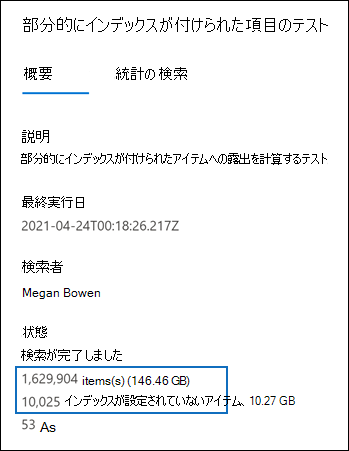

# <a name="investigating-partially-indexed-items-in-ediscovery"></a>電子情報開示で部分的にインデックスが付けられたアイテムの調査

Microsoft Purview コンプライアンス ポータルから実行する電子情報開示検索では、検索を実行すると、推定検索結果に部分的にインデックスが付けられたアイテムが自動的に含まれます。 部分的にインデックスが付けられたアイテムは、SharePoint およびOneDrive for Business サイト上の Exchange メールボックス アイテムとドキュメントであり、何らかの理由で検索用に完全にインデックスが作成されませんでした。 ほとんどの電子メール メッセージとサイト ドキュメントは、 [電子メール メッセージのインデックス作成の制限](limits-for-content-search.md#indexing-limits-for-email-messages)内にあるため、正常にインデックスが作成されます。 ただし、一部の項目はこれらのインデックス作成制限を超える可能性があり、部分的にインデックスが作成されます。 電子情報開示検索を実行すると、アイテムにインデックスを作成できず、部分的にインデックスが作成されたアイテムとして返されるその他の理由を次に示します。
  
- 電子メール メッセージには、開けない添付ファイルがあります。これは、部分的にインデックスが付けられた電子メール アイテムの最も一般的な原因です。

- 電子メール メッセージに添付されているファイルが多すぎます。

- 電子メール メッセージに添付されているファイルが大きすぎます。

- この種のファイルのインデックス付けはサポートされているが、特定のファイルでインデックス付けエラーが発生した。

これは異なりますが、ほとんどの組織のお客様は、コンテンツの量が 1% 未満で、部分的にインデックスが作成されたサイズでコンテンツの 12% 未満です。 ボリュームとサイズの違いは、サイズが大きいファイルの方が、完全にインデックスを作成できないコンテンツを含む確率が高いからです。
  
## <a name="why-does-the-partially-indexed-item-count-change-for-a-search"></a>検索で部分的にインデックスが付けられたアイテム数が変更されるのはなぜですか?

電子情報開示検索を実行すると、検索された場所の部分的にインデックスが付けられたアイテムの合計数とサイズが、検索の詳細な統計情報に表示される検索結果の統計情報に一覧表示されます。 これらは、検索統計で  *インデックスのない項目*  と呼ばれることに注意してください。 検索結果で返される部分的にインデックスが付けられたアイテムの数に影響を与えるいくつかの点を次に示します。
  
- アイテムが部分的にインデックス付けされ、検索クエリと一致する場合は、検索結果アイテムの数 (およびサイズ) と部分的にインデックスが付けられたアイテムの両方に含まれます。 ただし、同じ検索の結果がエクスポートされると、アイテムは検索結果のセットにのみ含まれます。部分的にインデックスが付けられたアイテムとして含まれていません。

- SharePoint サイトと OneDrive サイトにある部分的にインデックスが付けられたアイテム *は、* 検索の詳細な統計情報に表示される部分的にインデックスが付けられたアイテムの見積もりには含まれません。 ただし、電子情報開示検索の結果をエクスポートするときに、部分的にインデックスが付けられたアイテムをエクスポートできます。 たとえば、サイトのみを検索する場合、部分的にインデックスが付けられたアイテムの推定数は 0 になります。
  
## <a name="calculating-the-ratio-of-partially-indexed-items-in-your-organization"></a>組織内の部分的にインデックスが付けられたアイテムの比率を計算する

部分的にインデックスが作成されたアイテムに対する組織の公開を理解するために、(空白のキーワード クエリを使用して) すべてのメールボックス内のすべてのコンテンツの検索を実行できます。 次の例では、1,629,904 (146.46 GB) の完全インデックス項目と、10,025 (10.27 GB) の部分インデックス項目があります。
  

  
次の計算を使用して、部分的にインデックスが作成されたアイテムの割合を決定できます。
  
 **組織内の部分的にインデックスが付けられたアイテムの比率を計算するには:**

`(Total number of partially indexed items/Total number of items) x 100`

`(10025/1629904) x 100 = 0.62%`

前の例の検索結果を使用すると、すべてのメールボックス アイテムの 0.62% が部分的にインデックス付けされます。
  
 **組織内の部分的にインデックスが付けられたアイテムのサイズの割合を計算するには、**

`(Size of all partially indexed items/Size of all items) x 100`

`(10.27 GB/146.46 GB) x 100 = 7.0%`

そのため、前の例では、メールボックス アイテムの合計サイズの 7% が、部分的にインデックスが作成されたアイテムから取得されます。 既に説明したように、ほとんどの組織のお客様は、コンテンツの量が 1% 未満で、部分的にインデックスが作成されたサイズでコンテンツの 12% 未満です。

## <a name="working-with-partially-indexed-items"></a>部分的にインデックスが付けられたアイテムの操作

部分的にインデックスが付けられたアイテムを調べて関連情報が含まれていないことを検証する必要がある場合は、部分的にインデックスが付けられたアイテムに関する情報を含む [コンテンツ検索レポートをエクスポート](export-a-content-search-report.md) できます。 コンテンツ検索レポートをエクスポートする場合は、部分的にインデックスが付けられたアイテムを含むエクスポート オプションのいずれかを選択してください。
  

  
これらのオプションのいずれかを使用して電子情報開示検索結果または検索レポートをエクスポートすると、エクスポートにはインデックスのないItems.csvという名前のレポートが含まれます。 このレポートには、ResultsLog.csv ファイルとほとんど同じ情報が含まれています。ただし、インデックスが設定されていないItems.csv ファイルには、部分的にインデックスが付けられた項目に関連する 2 つのフィールド ( **エラー タグ** と **エラープロパティ**) も含まれています。 これらのフィールドには、部分的にインデックスが付けられた各アイテムのインデックス作成エラーに関する情報が含まれています。 これら 2 つのフィールドの情報を使用すると、特定のインデックス作成エラーが調査に影響を与えるかどうかを判断するのに役立ちます。 

> [!NOTE]
> インデックスのないItems.csv ファイルには、 **エラーの種類** と **エラー メッセージ** という名前のフィールドも含まれています。 これらは、 **エラー タグ** と **エラーのプロパティ** フィールドの情報に似た情報を含む従来のフィールドですが、詳細は少なくなります。 これらのレガシ フィールドは無視しても問題ありません。
  
## <a name="errors-related-to-partially-indexed-items"></a>部分的にインデックスが付けられたアイテムに関連するエラー

エラー タグは、エラーとファイルの種類という 2 つの情報で構成されます。 たとえば、次のエラーとファイルの種類のペアです。

```text
 parseroutputsize_xls
```

 `parseroutputsize` はエラーであり、 `xls` エラーが発生したファイルのファイルの種類です。 ファイルの種類が認識されなかった場合、またはファイルの種類がエラーに適用されなかった場合は、ファイルの種類の代わりに値 `noformat` が表示されます。
  
インデックス作成エラーの一覧と、エラーの考えられる原因の説明を次に示します。
  
| エラー タグ | 説明 |
|:-----|:-----|
| `attachmentcount` <br/> |電子メール メッセージの添付ファイルが多すぎて、これらの添付ファイルの一部が処理されませんでした。  <br/> |
| `attachmentdepth` <br/> |コンテンツ リトリバーとドキュメント パーサーで、他の添付ファイル内に入れ子になっている添付ファイルのレベルが多すぎます。 これらの添付ファイルの一部は処理されませんでした。  <br/> |
| `attachmentrms` <br/> |添付ファイルは RMS で保護されているため、デコードに失敗しました。  <br/> |
| `attachmentsize` <br/> |電子メール メッセージに添付されたファイルが大きすぎて処理できませんでした。  <br/> |
| `indexingtruncated` <br/> |処理された電子メール メッセージをインデックスに書き込むと、インデックス作成可能なプロパティの 1 つが大きすぎて、切り捨てられました。 切り捨てられたプロパティは、[エラーのプロパティ] フィールドに一覧表示されます。  <br/> |
| `invalidunicode` <br/> |電子メール メッセージには、有効な Unicode として処理できなかったテキストが含まれていました。 このアイテムのインデックス作成が不完全な場合があります。  <br/> |
| `parserencrypted` <br/> |添付ファイルまたは電子メール メッセージのコンテンツは暗号化され、Microsoft 365 ではコンテンツをデコードできませんでした。  <br/> |
| `parsererror` <br/> |解析中に不明なエラーが発生しました。 これは通常、ソフトウェアのバグやサービスのクラッシュの結果です。  <br/> |
| `parserinputsize` <br/> |添付ファイルが大きすぎてパーサーが処理できず、その添付ファイルの解析が行われなかったか、完了しませんでした。  <br/> |
| `parsermalformed` <br/> |添付ファイルの形式が正しくなかったため、パーサーで処理できませんでした。 この結果は、古いファイル形式、互換性のないソフトウェアによって作成されたファイル、または要求以外のファイルを偽装するウイルスが原因である可能性があります。  <br/> |
| `parseroutputsize` <br/> |添付ファイルの解析からの出力が大きすぎて、切り捨てる必要がありました。  <br/> |
| `parserunknowntype` <br/> |添付ファイルには、Microsoft 365 で検出できないファイルの種類がありました。  <br/> |
| `parserunsupportedtype` <br/> |添付ファイルにはOffice 365検出できるファイルの種類がありましたが、そのファイルの種類の解析はサポートされていません。  <br/> |
| `propertytoobig` <br/> |Exchange Store の電子メール プロパティの値が大きすぎて取得できず、メッセージを処理できませんでした。 これは通常、電子メール メッセージの body プロパティにのみ発生します。  <br/> |
| `retrieverrms` <br/> |コンテンツリトリバーが RMS で保護されたメッセージをデコードできませんでした。  <br/> |
| `wordbreakertruncated` <br/> |インデックス作成中にドキュメント内で識別された単語が多すぎます。 制限に達するとプロパティの処理が停止し、プロパティが切り捨てられます。  <br/> |

エラー フィールドは、[エラー タグ] フィールドに一覧表示されている処理エラーの影響を受けるフィールドを示します。 または、メッセージの本文のエラーなどの`subject``participants`プロパティを検索している場合、検索結果には影響しません。 これは、さらに調査する必要がある部分インデックス項目を正確に決定する場合に役立ちます。

<!--
## Using a PowerShell script to determine your organization's exposure to partially indexed email items

The following steps show you how to run a PowerShell script that searches for all items in all Exchange mailboxes, and then generates a report about your organization's ratio of partially indexed email items (by count and by size) and displays the number of items (and their file type) for each indexing error that occurs. Use the error tag descriptions in the previous section to identify the indexing error.
  
1. Save the following text to a Windows PowerShell script file by using a filename suffix of .ps1; for example, `PartiallyIndexedItems.ps1`.

   ```powershell
     write-host "**************************************************"
     write-host "     Security & Compliance PowerShell      " -foregroundColor yellow -backgroundcolor darkgreen
     write-host "   eDiscovery Partially Indexed Item Statistics   " -foregroundColor yellow -backgroundcolor darkgreen
     write-host "**************************************************"
     " " 
     # Create a search with Error Tags Refinders enabled
     Remove-ComplianceSearch "RefinerTest" -Confirm:$false -ErrorAction 'SilentlyContinue'
     New-ComplianceSearch -Name "RefinerTest" -ContentMatchQuery "size>0" -RefinerNames ErrorTags -ExchangeLocation ALL
     Start-ComplianceSearch "RefinerTest"
     # Loop while search is in progress
     do{
         Write-host "Waiting for search to complete..."
         Start-Sleep -s 5
         $complianceSearch = Get-ComplianceSearch "RefinerTest"
     }while ($complianceSearch.Status -ne 'Completed')
     $refiners = $complianceSearch.Refiners | ConvertFrom-Json
     $errorTagProperties = $refiners.Entries | Get-Member -MemberType NoteProperty
     $partiallyIndexedRatio = $complianceSearch.UnindexedItems / $complianceSearch.Items
     $partiallyIndexedSizeRatio = $complianceSearch.UnindexedSize / $complianceSearch.Size
     " "
     "===== Partially indexed items ====="
     "         Total          Ratio"
     "Count    {0:N0}{1:P2}" -f $complianceSearch.Items.ToString("N0").PadRight(15, " "), $partiallyIndexedRatio
     "Size(GB) {0:N2}{1:P2}" -f ($complianceSearch.Size / 1GB).ToString("N2").PadRight(15, " "), $partiallyIndexedSizeRatio
     " "
     Write-Host ===== Reasons for partially indexed items =====
     foreach($errorTagProperty in $errorTagProperties)
     {
         $name = $refiners.Entries.($errorTagProperty.Name).Name
         $count = $refiners.Entries.($errorTagProperty.Name).TotalCount
         $frag = $name.Split("{_}")
         $errorTag = $frag[0]
         $fileType = $frag[1]
         if ($errorTag -ne $lastErrorTag)
         {
             $errorTag
         }
         "    " + $fileType + " => " + $count
         $lastErrorTag = $errorTag
     }
   ```

2. [Connect to Security & Compliance PowerShell](/powershell/exchange/exchange-online-powershell).

3. In Security & Compliance PowerShell, go to the folder where you saved the script in step 1, and then run the script; for example:

   ```powershell
   .\PartiallyIndexedItems.ps1
   ```

Here's an example fo the output returned by the script.
  


> [!NOTE]
> Note the following:
>  
> - The total number and size of email items, and your organization's ratio of partially indexed email items (by count and by size).
> 
> - A list error tags and the corresponding file types for which the error occurred.
-->

## <a name="see-also"></a>関連項目

[電子情報開示で部分的にインデックスが作成されたアイテム](partially-indexed-items-in-content-search.md)
