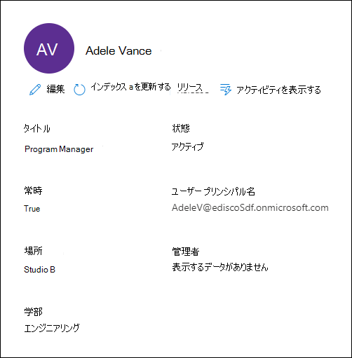

# 管理ケースで保管担当者をAdvanced eDiscoveryする

[**データ ソース**] タブの [保管担当者] ページには、Advanced eDiscoveryケースに追加されたすべての保管担当者の一覧が表示されます。 カストディアンをケースに追加すると、各保管担当者に関する詳細が Azure Active Directory から自動的に収集され、Advanced eDiscovery。

## 保管担当者の詳細を表示する

保管担当者に関する詳細を表示するには、[保管担当者] タブの一覧からカストディアン **をクリック** します。フライアウト ページが表示され、保管担当者に関する次の情報が含まれます。

- 連絡先情報

  - **タイトル**。 保管担当者の役職。
  
  - **ユーザー プリンシパル名**。 保管担当者のユーザー プリンシパル名 (UPN) (たとえば、AdeleV@contoso.onmicrosoft.com。
  
  - **Location**。 保管担当者の業務の場所にあるオフィスの場所。
  
  - **Manager**. 保管担当者のマネージャー。 指定された管理者は、この保管担当者のエスカレーション通信を受け取る。
  
  - **Department**. 保管担当者が働く部署の名前。

- ケース情報

  - **状態**。 ケース内の保管担当者の状態。 Active の状態 **は** 、保管担当者がケースの一部である場合を示します。 カストディアンがケースから解放された場合、ステータスは [リリース済み] に **変更されます**。
  
  - **保持します**。 保管担当者が保留にされたかどうかを示します。

- データの場所と保持情報

  

  - **保管場所**. 保管担当者に関連付けられたデータ ソース (メールボックス、サイト、および Teams) の数と種類を表示し、ケースの一部です。

    - 各データの場所には、保持状態が表示されます。 保留統計に使用できる値:**保留 、****保留ではない**、および **進行中です**。

    - データ ソースの保留状態が表示されていない場合は、ケースの [保留] タブに表示されている保管担当者の保留状態を確認してください。 保管担当者の保留は、保持されている特定のデータ ソースを識別します。

## カストディアンの編集

ケースの進行に応じて、特定の保管担当者とケースに関連する追加のデータ ソースがある可能性があります。 その他のシナリオでは、確認され、関連性が高いとみなされた特定のデータ ソースを削除できます。

保管担当者に関連付けられているデータ ソースを更新するには、次の方法を実行します。

1. [電子情報開示 **] に> Advanced eDiscovery** ケースを開きます。
  
2. [データ **ソース] タブをクリック** します。
  
3. リストからカストディアンを選択し、フライアウト ページで **[編集** ] をクリックします。

    
  
4. 保管担当者のプライマリ メールボックスとユーザー アカウントOneDrive追加または削除するには、次の方法を実行します。

    - 保管担当者を展開して、以前に保管担当者に関連付けられた主なデータの場所を表示します。

    - [**メールボックス]** または [メールボックス **]** の横にある **[OneDrive]** をクリックして、保管担当者のメールボックスまたはメールボックスの場所OneDriveします。

    - [**メールボックスまたはメールボックス**]**の** 横にある **[OneDrive]** を選択して、保管担当者のメールボックスまたは OneDrive アカウントをこの保管担当者のデータの場所として関連付けから削除します。

5. 特定の保管担当者に他のメールボックス、サイト、Teams、または Yammer グループを追加または削除するには、サービスの横にある[編集] をクリックしてデータの場所を追加します。

   - **Exchange**: 他のメールボックスを保管担当者に関連付ける場合に使用します。 ユーザー メールボックスまたは配布グループの名前またはエイリアス (最低 3 文字) を検索ボックスに入力します。 保管担当者に割り当てるメールボックスを選択し、[追加] を **クリックします**。

   - **SharePoint**: サイトを保管担当者SharePoint関連付ける場合に使用します。 リスト内のサイトを選択するか、検索ボックスに URL を入力してサイトを検索します。 保管担当者に割り当てるサイトを選択し、[追加] を **クリックします**。

   - **Teams**: 保管担当者が現在のメンバー Microsoft Teamsを割り当てる場合に使用します。 カストディアンに割り当てるチームを選択し、[追加] を **クリックします**。 チームを追加すると、システムは自動的に、そのチームに関連付SharePointサイトメールボックスとグループ メールボックスを識別し、そのメールボックスを保管担当者に割り当てる。

   - **Yammer**: 保管担当者が現在メンバー Yammerグループを割り当てる場合に使用します。 保管担当者に割り当てるグループを選択し、[追加] を **クリックします**。 チームを追加すると、そのグループに関連付けられた SharePoint およびグループ メールボックスが自動的に識別され、見つけ出され、そのメールボックスが保管担当者に割り当てされます。

   > [!NOTE]
   > Exchange および **SharePoint** 場所ピッカーを使用して、保管担当者がメンバーではないチームまたは Yammer グループを含む組織内のメールボックスまたはサイトを保管担当者に関連付けられます。 これを行うには、各チームまたはグループに関連付けられているメールボックスとサイトの両方を追加Yammerがあります。

6. 保管担当者のデータの場所を編集した後、[ **次** へ] をクリックして [保留設定] **ページに移動** します。  

7. [保留 **設定] ページ** で、保管担当者の保留設定を更新します。

## 保管担当者データのインデックスを再作成する

法的調査のためのほとんどの電子情報開示ワークフローでは、保管担当者が法的ケースに追加された後、保管担当者のデータのサブセットが検索されます。 ファイル サイズが非常に大きいか、データが破損する可能性があるため、保管担当者に関連付けられたデータ ソース内の一部のアイテムに部分的にインデックスが作成される場合があります。 Advanced eDiscoveryの高度なインデックス作成機能を使用すると、ほとんどの部分的にインデックス付きアイテムをオンデマンドで再インデックス化することで自動的に修復できます。

カストディアンがケースに追加された場合、保管担当者に関連付けられたデータ ソースにあるデータは、(高度なインデックス作成プロセスによって) 自動的にインデックスが再作成されます。 つまり、データをダウンロードして修復してからオフラインで検索する代わりに、データを一所に残しておくことができます)。 ただし、法的ケースのライフサイクル中に、新しいデータ ソースが保管担当者に関連付けられている可能性があります。 この場合、高度なインデックス作成プロセスを再実行して部分的にインデックス付けされたアイテムを修復し、保管担当者のデータのインデックスを更新することで、カストディアンのデータのインデックスを再作成できます。

インデックスの再作成プロセスをトリガーして、部分的にインデックスが作成されたアイテムに対処するには、次の手順を実行します。

1. [電子情報開示 **] に> Advanced eDiscovery** ケースを開きます。

2. [ソース] **タブをクリック** します。

3. [保管 **担当者] ページで** 、データのインデックスを再作成する必要がある保管担当者を選択します。

4. [フライアウト] ページで、[インデックスの更新] **をクリックします**。

   インデックス ジョブが作成されたというダイアログが表示されます。

保管担当者データのインデックスの再作成は、長時間実行されるプロセスです。作成された対応するジョブの名前は、保管 **担当者データの再インデックス化です**。 [ジョブ] タブまたは[カストディアン]タブで進行状況を追跡するには、[インデックスジョブの状態] 列の状態 **を監視** します。

詳細については、以下を参照してください。

- [処理中のエラーの操作](processing-data-for-case.md)

- [ジョブを管理する](managing-jobs-ediscovery20.md)

## ケースから保管担当者を解放する

カストディアンは、ケースが閉じている場合、保管担当者がケースのコンテンツを保持する義務がなくなった場合、または保管担当者がケースに関連しなくなったと判断された場合に解放されます。 

保留通知が公開された後に保管担当者を解放すると、リリース通知が保管担当者に送信されます。 さらに、保管担当者に関連付けられたデータ ソースに配置された保留は削除されます。 保管担当者がサイレント ホールドに置かれた場合 、法的保留通知は発行されませんが、その保管担当者に関連付けられたデータ ソースに対する保留は削除されます。

保管担当者を解放するには、次の方法を使用します。

1. [電子情報開示 **] に> Advanced eDiscovery** ケースを開きます。

2. [ソース] **タブをクリック** します。

3. [保管 **担当者] ページ** で、ケースから解放される保管担当者を選択します。

4. [フライアウト] ページで、[カストディアン **の解放] をクリックします**。

   保管担当者に関連付けられたデータ ソースに保留が設定されている場合、保留は削除され、別の Advanced eDiscovery ケースに関連付けられているその他の保留は引き続き適用されるという警告ページが表示されます。 これには、その他の種類の保持機能 (アイテム保持ポリシー Microsoft 365含まれます。

5. [ **はい]** をクリックして、保管担当者を解放する必要があります。 

    [保管担当者] タブのこのユーザーの状態が [リリース済み] に設定され、フライアウト ページの保留状態が False に **変更されます**。 

> [!NOTE]
> 保管担当者が複数の法的ケースに同時に関与している可能性があります。 保管担当者が特定のケースから解放されると、他のケースの保留と通知は影響を受け取らない。
