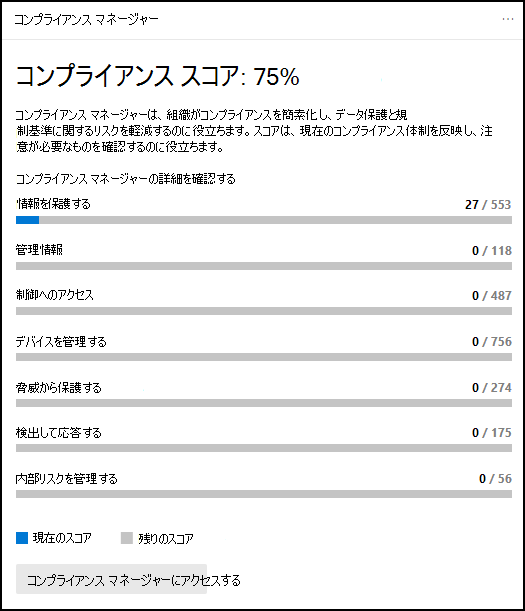

# Microsoft 365 コンプライアンス センター

組織のコンプライアンスの姿勢に興味がある場合は、組織のコンプライアンスを[Microsoft 365 コンプライアンス センター。](https://compliance.microsoft.com) Microsoft 365 コンプライアンス センターを使用すると、組織のコンプライアンス ニーズを管理するために必要なデータとツールに簡単にアクセスできます。

この記事を読んで、Microsoft 365 コンプライアンス センター、取得方法、よく寄せられる質問、次の手順について[説明します](#next-steps)。

## コンプライアンスのMicrosoft 365へようこそ

初めてMicrosoft 365 コンプライアンス センターに移動すると、次のウェルカム メッセージが表示されます。

ウェルカム バナーには、開始方法、次の手順、フィードバックを提供するための招待状に関するポインターが表示されます。

## カード セクション

Microsoft 365 コンプライアンス センター に初めてアクセスすると、ホーム ページのカード セクションに、データコンプライアンスに関する組織の状況、組織で使用可能なソリューション、アクティブなアラートの概要が一目でわかります。

ここから、以下の操作を行うことができます。

- Microsoft コンプライアンス **マネージャー カードを確認** すると、コンプライアンス マネージャー [ソリューションが表示](compliance-manager.md) されます。 コンプライアンス マネージャーは、コンプライアンスの管理方法を簡略化するのに役立ちます。 データ保護と規制基準に関するリスクを減らすのに役立つ推奨アクションの完了に向けた進捗状況を測定するリスクベースのスコアを計算します。 また、ワークフロー機能と組み込みのコントロール マッピングを提供し、改善アクションを効率的に実行するのに役立ちます。

    

- 新しい **ソリューション カタログ** カードを確認します。このカード は、エンドツーエンドのコンプライアンス シナリオの管理に役立つ統合ソリューションのコレクションにリンクします。 ソリューションの機能とツールには、ポリシー、アラート、レポートなどの組み合わせが含まれる場合があります。

    

- アクティブな **アラート カード** を確認します。このカードには、最 もアクティブなアラートの概要と、重大度、状態、カテゴリなどの詳細情報を表示できるリンクが含まれています。

    

カードの追加機能を使用して、組織のクラウド アプリのコンプライアンスを示すカードや、共有ファイルを持つユーザーに関するデータを表示するカード[、Cloud App Security](/cloud-app-security/)へのリンク、またはデータを探索できる他のツールを追加することもできます。

## より多くのコンプライアンス機能への簡単なナビゲーション

ホーム ページのカード内のリンクに加えて、画面の左側にナビゲーション ウィンドウが表示され、アラート、レポート、ポリシー、コンプライアンス ソリューションなどへのアクセスが容易になります。  カスタマイズしたナビゲーション ウィンドウのオプションを追加または削除するには、ナビゲーション ウィンドウの **[ナビゲーション の** カスタマイズ] コントロールを使用します。 これにより、[ナビゲーション **ウィンドウの設定をカスタマイズ** する] が開き、ナビゲーション ウィンドウに表示されるアイテムを構成できます。

 

****

|ナビゲーション|コメント|
|---|---|
||[**ホーム]** を選択して、メイン ページMicrosoft 365 コンプライアンス センター戻ります。 
 コンプライアンス **マネージャーにアクセスして** コンプライアンス スコアを確認し、組織 [のコンプライアンスの管理](compliance-manager.md) を開始します。 
 [データ **分類] セクション** を選択して、トレーニング可能な分類 [子、機密情報](classifier-learn-about.md)の種類 [エンティティ](sensitive-information-type-entity-definitions.md)定義、コンテンツおよびアクティビティ エクスプローラー [に](data-classification-activity-explorer.md) アクセスします。 
 [**データ コネクタ] を** 選択 [して、](archiving-third-party-data.md)サブスクリプション内のデータをインポートおよびアーカイブするコネクタMicrosoft 365します。 
 [アラート] **に移動** してアラートを表示および [解決する](alert-policies.md) 
[**レポート]** にアクセス して、ラベルの使用状況と保持 [、DLP ポリシー](view-the-dlp-reports.md)の一 致と上書 き、共有ファイル、使用されているサードパーティ アプリなどについてのデータを表示します。 
 [ポリシー] **に移動** して、データの管理、デバイスの管理、アラートの受信を行うポリシーを設定 [します](../security/office-365-security/alerts.md)。 DLP ポリシーとアイテム保持ポリシー[にアクセス](retention.md)することもできます。 
 [**アクセス許可] を** 選択して、組織内のユーザーがコンテンツにアクセスできるユーザーをMicrosoft 365 コンプライアンス センタータスクを完了します。 
 [ソリューション] セクションの **リンクを使用** して、組織のコンプライアンス ソリューションにアクセスします。 たとえば、次の環境です。: 
 [カタログ](microsoft-365-solution-catalog.md)   組織で利用できるインテリジェントなコンプライアンスおよびリスク管理ソリューションの検出、学習、使用を開始します。 
 [監査](search-the-audit-log-in-security-and-compliance.md)   監査ログを使用して、一般的なサポートとコンプライアンスの問題を調査します。 
 [コンテンツ検索](search-for-content.md)   コンテンツ検索を使用して、Exchange メールボックス内の電子メール、SharePoint サイトと OneDrive の場所のドキュメント、Microsoft Teams と Skype for Business でのインスタント メッセージングの会話をすばやく検索します。 
 [通信コンプライアンス](communication-compliance.md)   不適切なメッセージを自動的にキャプチャし、ポリシー違反の可能性を調査し、修復するための手順を実行することで、通信リスクを最小限に抑える。 
 [データ損失防止について](dlp-learn-about-dlp.md)   組織全体、クラウド、デバイスで使用および共有される機密コンテンツを検出し、偶発的なデータ損失を防ぐのに役立ちます。 
 [データ サブジェクト要求](/compliance/regulatory/gdpr-manage-gdpr-data-subject-requests-with-the-dsr-case-tool)   一般データ保護規則 (GDPR) のデータ主体要求に対応するために、ユーザーの個人データを検索してエクスポートします。 
 [電子情報開示](overview-ediscovery-20.md)   このセクションを展開して、コアと Advanced eDiscovery を使用して、組織の内部および外部調査に対応するコンテンツの保存、収集、レビュー、分析、エクスポートを行います。 
 [情報ガバナンス](manage-information-governance.md)   ビジネスクリティカルなデータをインポート、保存、分類する機能を使用してコンテンツライフサイクルを管理し、必要なデータを保持し、不要なデータを削除できます。 
 [情報保護](information-protection.md)   組織全体のライフサイクル全体を通じて、機密性の高いビジネスクリティカルなコンテンツを検出、分類、保護します。 
 [インサイダー リスクの管理](insider-risk-management.md)   組織全体の危険なアクティビティを検出し、インサイダーのリスクと脅威を迅速に特定、調査、および実行するのに役立ちます。 
 [レコード管理](records-management.md)   組織内の規制、法務、およびビジネスクリティカルなレコードの保持スケジュールを自動化し、簡素化します。|
|

## コンプライアンス センターを取得する方法

- 新しいファイルが既にMicrosoft 365 コンプライアンス センター場合は、すぐに使用できます。 このMicrosoft 365 コンプライアンス センター SKU のお客様に一般Microsoft 365提供されています。
- 管理者にアクセスMicrosoft 365 コンプライアンス センター、グローバル管理者、コンプライアンス管理者、コンプライアンス データ管理者がアクセスして [https://compliance.microsoft.com](https://compliance.microsoft.com) サインインします。

## よく寄せられる質問

**新しいファイルがまだ表示Microsoft 365 コンプライアンス センター?**

最初に、適切なライセンスとアクセス許可を持っている必要があります。 次に、でサインインします [https://compliance.microsoft.com](https://compliance.microsoft.com) 。 新しいコンプライアンス センターがまだ表示されていない場合は、すぐに確認できます。

## 次の手順

- **Microsoft Compliance Manager にアクセスして** コンプライアンス スコアを確認し、組織のコンプライアンスの管理を開始します。 詳細については、「コンプライアンス マネージャー」 [を参照してください](compliance-manager.md)。

- **内部リスクを最小限** に抑え、組織内の危険な活動を検出、調査、および実行するためのインサイダー リスク管理ポリシーを構成します。 「Insider [リスク管理」を参照してください](insider-risk-management.md)。

- **組織のデータ損失防止ポリシーを確認し、** 必要に応じて必要な変更を行います。 詳細については、「データ損失防止 [について」を参照してください](dlp-learn-about-dlp.md)。

- **知り合い、設定をMicrosoft Cloud App Security。** 「[クイック スタート: クイック スタート」を参照Microsoft Cloud App Security。](/cloud-app-security/getting-started-with-cloud-app-security)

- **企業の行動規範ポリシー違反を** 迅速に特定して修復するためのコミュニケーション コンプライアンス ポリシーについて説明し、作成します。 「コミュニケーション[コンプライアンス」を参照Microsoft 365。](communication-compliance.md)

- **頻繁にMicrosoft 365 コンプライアンス センター、** 発生するアラートや潜在的なリスクを確認してください。 [https://compliance.microsoft.com](https://compliance.microsoft.com) に移動し、サインインします。