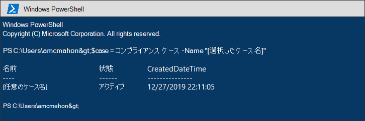

# <a name="migrate-legacy-ediscovery-searches-and-holds-to-the-microsoft-365-compliance-center"></a>従来の電子情報開示検索と保持を Microsoft 365 コンプライアンス センターに移行する

Microsoft 365 コンプライアンス センター では、電子情報開示の使用に関するエクスペリエンスが向上します。信頼性の向上、パフォーマンスの向上、および電子情報開示ワークフローに合わせた多くの機能 (問題別にコンテンツを整理するケースを含む)、コンテンツと分析を確認するためのセットをレビューして、ほぼ重複グループ化、電子メール スレッド、テーマ分析、予測コーディングなどのデータを確認するのに役立ちます。

この記事では、お客様が新機能と強化された機能を利用するために、Exchange 管理センターから Microsoft 365 コンプライアンス センター に In-Place 電子情報開示検索とホールドを移行する方法に関する基本的なガイダンスを提供します。

> [!NOTE]
> さまざまなシナリオが考えられますので、この記事では、検索を移行し、電子情報開示の主要なケースに移行する一般的なガイダンスを提供Microsoft 365 コンプライアンス センター。 電子情報開示ケースの使用は必ずしも必要とは限らないが、組織内の電子情報開示ケースにアクセスできるユーザーを制御するためのアクセス許可を割り当て、セキュリティの層を追加します。

## <a name="before-you-begin"></a>始める前に

- この記事で説明する PowerShell コマンドを実行するには、Microsoft 365 コンプライアンス センターの電子情報開示マネージャー役割グループのメンバーである必要があります。 また、管理センターの検出管理役割グループのメンバー Exchange必要があります。

- この記事では、電子情報開示ホールドを作成する方法に関するガイダンスを提供します。 保持ポリシーは、非同期プロセスを通じてメールボックスに適用されます。 電子情報開示ホールドを作成する場合は、CaseHoldPolicy と CaseHoldRule の両方を作成する必要があります。それ以外の場合、保留は作成されません。コンテンツの場所は保留にされません。

## <a name="step-1-connect-to-exchange-online-powershell-and-security--compliance-center-powershell"></a>手順 1: コンプライアンス Connect PowerShell Exchange Onlineセキュリティ &にアクセスする

最初の手順は、コンプライアンス センター PowerShell Exchange Online PowerShell とセキュリティ &接続します。 次のスクリプトをコピーし、PowerShell ウィンドウに貼り付け、実行できます。 接続する組織の資格情報を求めるメッセージが表示されます。 

```powershell
$UserCredential = Get-Credential
$sccSession = New-PSSession -ConfigurationName Microsoft.Exchange -ConnectionUri https://ps.compliance.protection.outlook.com/powershell-liveid -Credential $UserCredential -Authentication Basic -AllowRedirection
Import-PSSession $sccSession -DisableNameChecking
$exoSession = New-PSSession -ConfigurationName Microsoft.Exchange -ConnectionUri https://ps.outlook.com/powershell-liveid/ -Credential $UserCredential -Authentication Basic -AllowRedirection
Import-PSSession $exoSession -AllowClobber -DisableNameChecking
```

この PowerShell セッションでは、次の手順でコマンドを実行する必要があります。

## <a name="step-2-get-a-list-of-in-place-ediscovery-searches-by-using-get-mailboxsearch"></a>手順 2: 電子情報開示検索の一In-Placeを使用して取得Get-MailboxSearch

認証後 **、Get-MailboxSearch** コマンドレットを実行In-Place電子情報開示検索の一覧を取得できます。 次のコマンドをコピーして PowerShell に貼り付け、実行します。 検索の一覧には、その名前と保留リストの状態In-Placeされます。

```powershell
Get-MailboxSearch
```

コマンドレットの出力は、次のようになります。


## <a name="step-3-get-information-about-the-in-place-ediscovery-searches-and-in-place-holds-you-want-to-migrate"></a>手順 3: 移行する電子情報開示In-Placeと保持In-Place情報を取得する

ここでも **Get-MailboxSearch** コマンドレットを使用しますが、今回は検索のプロパティを取得します。 これらのプロパティは、後で使用するために変数に格納できます。 次の使用例は **、Get-MailboxSearch** コマンドレットの結果を変数に格納し、検索のプロパティを表示します。

```powershell
$search = Get-MailboxSearch -Identity "Search 1"
```

```powershell
$search | FL
```

これら 2 つのコマンドの出力は、次のようになります。


> [!NOTE]
> この例の保留In-Place期間は無期限です *(ItemHoldPeriod: Unlimited)。* これは、電子情報開示と法的調査のシナリオで一般的です。 保留期間の値が無期限とは異なる場合、保持が保持シナリオでコンテンツを保持するために使用されている可能性が高い理由です。 保持シナリオでセキュリティ & コンプライアンス センター PowerShell の電子情報開示コマンドレットを使用する代わりに [、New-RetentionCompliancePolicy](/powershell/module/exchange/new-retentioncompliancepolicy) と [New-RetentionComplianceRule](/powershell/module/exchange/new-retentioncompliancerule) を使用してコンテンツを保持することをお勧めします。 これらのコマンドレットを使用した結果は **、New-CaseHoldPolicy** と **New-CaseHoldRule** の使用と似ていますが、保持期間の有効期限が切れた後にコンテンツを削除するなどの保持期間と保持アクションを指定できます。 また、保持コマンドレットを使用しても、保持保持を電子情報開示ケースに関連付ける必要は一切ない。

## <a name="step-4-create-a-case-in-the-microsoft-365-compliance-center"></a>手順 4: コンプライアンス センターでケースMicrosoft 365する

電子情報開示ホールドを作成するには、保留リストを関連付ける電子情報開示ケースを作成する必要があります。 次の使用例は、選択した名前を使用して電子情報開示ケースを作成します。 後で使用するために、新しいケースのプロパティを変数に格納します。 これらのプロパティは、ケースの作成後に `$case | FL` コマンドを実行して表示できます。

```powershell
$case = New-ComplianceCase -Name "[Case name of your choice]"
```


## <a name="step-5-create-the-ediscovery-hold"></a>手順 5: 電子情報開示ホールドを作成する

ケースを作成したら、保持を作成し、前の手順で作成したケースに関連付けできます。 ケースホールド ポリシーとケースホールドルールの両方を作成する必要があります。 ケースホールド ポリシーの作成後にケースホールド ルールが作成されない場合、電子情報開示ホールドは作成されません。コンテンツは保留にされません。

次のコマンドを実行して、移行する電子情報開示ホールドを再作成します。 これらの例では、移行する手順 3 In-Placeのプロパティを使用します。 最初のコマンドは、新しいケース保持ポリシーを作成し、プロパティを変数に保存します。 2 番目のコマンドは、対応するケース保持ルールを作成します。

```powershell
$policy = New-CaseHoldPolicy -Name $search.Name -Case $case.Identity -ExchangeLocation $search.SourceMailboxes
```

```powershell
New-CaseHoldRule -Name $search.Name -Policy $policy.Identity
```


## <a name="step-6-verify-the-ediscovery-hold"></a>手順 6: 電子情報開示の保持を確認する

保留リストの作成に問題が発生しなかった場合は、保留配布の状態が正常に終了した状態を確認してください。 配布とは、前の手順で *ExchangeLocation* パラメーターで指定されたコンテンツの場所すべてに保留が適用されたという意味です。 これを行うには **、Get-CaseHoldPolicy コマンドレットを実行** できます。 前の手順で作成した *$policy* 変数に保存されたプロパティは変数内で自動的に更新されないので、配布が成功したと確認するには、コマンドレットを再実行する必要があります。 ケース保持ポリシーが正常に配布されるには、5 分から 24 時間かかる場合があります。

次のコマンドを実行して、電子情報開示ホールドが正常に配布されたことを確認します。

```powershell
Get-CaseHoldPolicy -Identity $policy.Identity | Select name, DistributionStatus
```

*DistributionStatus* プロパティ **の** Success の値は、保留がコンテンツの場所に正常に配置されたことを示します。 配布がまだ完了していない場合は、値 **Pending が** 表示されます。


## <a name="step-7-create-the-search"></a>手順 7: 検索を作成する

最後の手順は、手順 3 で識別した検索を再作成し、ケースに関連付けることです。 検索を作成した後 **、Start-ComplianceSearch** コマンドレットを使用して実行するか、後で実行できます。

```powershell
New-ComplianceSearch -Name $search.Name -ExchangeLocation $search.SourceMailboxes -ContentMatchQuery $search.SearchQuery -Case $case.name
```


## <a name="step-8-verify-the-case-hold-and-search-in-the-microsoft-365-compliance-center"></a>手順 8: ケースを確認し、保持し、検索を行Microsoft 365 コンプライアンス センター

すべてが正しく設定されていることを確認するには、[電子情報開示] の [Microsoft 365 コンプライアンス センター] に移動し、[電子情報開示] > [https://compliance.microsoft.com](https://compliance.microsoft.com) **クリックします**。


手順 3 で作成したケースは、[コア電子情報開示] ページ **に一覧表示** されます。 ケースを開き、[保持] タブの一覧にある手順 4 で作成した保留リストに **気付** きます。保留リストを選択すると、保持が適用されたメールボックスの数や配布状態など、フライアウト ページで詳細を表示できます。


手順 7 で作成した検索は、ケースの **[検索** ] タブに表示されます。


電子情報開示検索In-Place移行するが、電子情報開示ケースに関連付けなかった場合は、電子情報開示の [コンテンツ検索] ページに表示Microsoft 365 コンプライアンス センター。

## <a name="more-information"></a>詳細

- 管理センターの電子情報開示In-Place保持&詳細Exchangeを参照してください。
  
  - [インプレース電子情報開示 (eDiscovery)](/exchange/security-and-compliance/in-place-ediscovery/in-place-ediscovery)

  - [インプレース保持と訴訟ホールド](/exchange/security-and-compliance/in-place-and-litigation-holds)

- この記事で使用される PowerShell コマンドレットの詳細については、以下を参照してください。

  - [Get-MailboxSearch](/powershell/module/exchange/get-mailboxsearch)
  
  - [New-ComplianceCase](/powershell/module/exchange/new-compliancecase)

  - [New-CaseHoldPolicy](/powershell/module/exchange/new-caseholdpolicy)
  
  - [New-CaseHoldRule](/powershell/module/exchange/new-caseholdrule)

  - [Get-CaseHoldPolicy](/powershell/module/exchange/get-caseholdpolicy)
  
  - [New-ComplianceSearch](/powershell/module/exchange/new-compliancesearch)

  - [Start-ComplianceSearch](/powershell/module/exchange/start-compliancesearch)

- アプリケーションの詳細については、「Microsoft 365 コンプライアンス センター[の概要」を参照Microsoft 365 コンプライアンス センター。](microsoft-365-compliance-center.md)