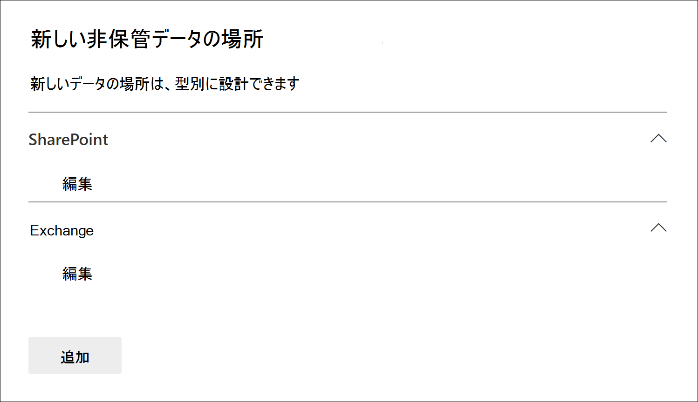

# 非保管データ ソースをサポートケースにAdvanced eDiscoveryする

このようなAdvanced eDiscovery場合、ケース内のデータ ソースにデータ ソースを関連付けるMicrosoft 365満たすとは限らない場合があります。 ただし、そのデータをケースに関連付け、検索し、レビュー セットに追加し、分析して確認する必要がある場合があります。 この機能Advanced eDiscovery非保管データ ソースと呼ばれるので、データを保管担当者に関連付けなくてもケースにデータを追加できます。 また、保管担当者に関連Advanced eDiscoveryデータで使用できる非保管データにも、同じ機能を適用します。 保管されていないデータに適用できる最も便利な点の 2 つが、それを保留にし [、Advanced indexing](indexing-custodian-data.md)を使用して処理することです。

## 保管されていないデータ ソースを追加する

次の手順に従って、非保管データ ソースを追加および管理します。Advanced eDiscoveryします。

1. [ホーム **Advanced eDiscovery]** で、データを追加するケースをクリックします。

2. [データ ソース **] タブをクリック** し、[データ ソースの追加]  >  **をクリックします。**

3. [保管 **されていないデータの場所の新** しい場所] フライアウト ページで、ケースに追加するデータ ソースを選択します。 複数のメールボックスとサイトを追加するには、[フォルダー] セクションまたは [SharePoint] セクションExchange [編集] をクリック **します**。  

   

   - **SharePoint** - [編集]**をクリックして** サイトを追加します。 リストでサイトを選択するか、検索バーにサイトの URL を入力してサイトを検索できます。 非保管データ ソースとして追加するサイトを選択し、[追加] を **クリックします**。

   - **Exchange** - [編集 **] をクリック** してメールボックスを追加します。 メールボックスまたは配布グループの検索ボックスに、名前またはエイリアス (最低 3 文字) を入力します。 保管担当者以外のデータ ソースとして追加するメールボックスを選択し、[追加] を **クリックします**。

   > [!NOTE]
   > [管理] **SharePoint** セクションと[Exchange] セクションを使用して、チームまたはグループに関連付けられたサイトとメールボックスを非保管データ ソースYammer追加できます。 チームまたはグループに関連付けられているメールボックスとサイトを個別に追加Yammerがあります。   また、ルート サイト URL (または ) をデータ ソースとして追加SharePoint `https://contoso-my.sharepoint.com/personal/` `https://contoso-my.sharepoint.com/` はサポートされていません。 特定のサイトを追加する必要があります。

4. 保管されていないデータ ソースを追加した後、それらの場所を保留にするかしないかのオプションがあります。 データ ソースの横にある **[保持** ] チェック ボックスをオンまたはオフにして、データ ソースを保留にします。

5. [ **新しい** 保管以外のデータ **の場所** ] フライアウト ページの下部にある [追加] をクリックして、データ ソースをケースに追加します。

   追加した保管されていない各データ ソースは、[データ ソース] **ページに一覧表示** されます。 保管されていないデータ ソースは、[ソースの種類] 列の **[データの** 場所] の値 **によって識別** されます。

   ![[データ ソース] タブの非保管データ ソース](../media/NonCustodialDataSources2.png)

ケースに非保管データ ソースを追加すると、保管されていないデータのインデックスを再作成するという名前のジョブが作成され、ケースの [**ジョブ**] タブに表示されます。 ジョブが作成されると、開始された高度なインデックス処理とデータ ソースのインデックスが再作成されます。

## 保管されていないデータ ソースの保留を管理する

保管されていないデータ ソースに保留を設定すると、ケースの非保管データ ソースを含む保留ポリシーが自動的に作成されます。 他の非保管データ ソースを保留にした場合、そのデータ ソースは、この保留ポリシーに追加されます。

1. ケースを開Advanced eDiscoveryし、[保持] タブ **を選択** します。

2. **[NCDSHold-] \<GUID\>** をクリックします。GUID 値はケースに固有です。

   フライアウト ページには、保留の非保管データ ソースに関する情報と統計情報が表示されます。

   

3. [ **保持の編集]** をクリックして保留にされている非保管データ ソースを表示し、次の管理タスクを実行します。

   - [場所 **] ページ** で、保留リストからデータ ソースを削除することで、保管されていないデータ ソースを解放できます。 データ ソースを解放しても、ケースから非保管データ ソースは削除されます。 データ ソースに配置された保留リストのみを削除します。

   - [クエリ **] ページ** で、ホールドを編集して、ケース内のすべての非保管データ ソースに適用されるクエリ ベースのホールドを作成できます。
