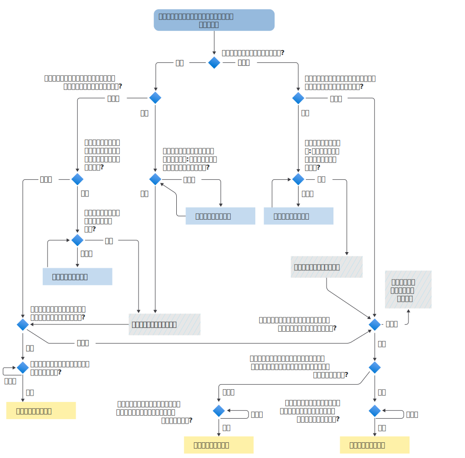

# アイテムが保持または完全に削除されるタイミングを決定するフローチャート

>*[セキュリティとコンプライアンスのための Microsoft 365 ライセンス ガイダンス](/office365/servicedescriptions/microsoft-365-service-descriptions/microsoft-365-tenantlevel-services-licensing-guidance/microsoft-365-security-compliance-licensing-guidance)。*

次のフローチャートを使用して、アイテムに[保持の原則](retention.md#the-principles-of-retention-or-what-takes-precedence)を適用し、システムがアイテムを保持するか、保持ラベルまたはアイテム保持ポリシーの結果として完全に削除するかを判断します。

このロジック フローは、次のいずれかの条件が適用される場合にアイテムに使用されます。

- 複数のアイテム保持ポリシーが適用されている
- 1 つの保持ラベルと 1 つ以上のアイテム保持ポリシーがある

アイテムが電子情報開示ホールド (または訴訟ホールドまたはインプレース ホールドの古いテクノロジ) の対象になると、アイテム保持ポリシーと保持ラベルの決定フローの前に常に保持されます。

このフローチャートで使用される用語の一部が不明な場合は、「[アイテム保持ポリシーと保持ラベルの詳細](retention.md)」を参照してください。

   

> [!NOTE]
> アイテムの最長保持期間と、アイテム保持ポリシーまたは保持ラベルで指定された最長の期間を区別することが重要です。 アイテムの最短の有効期限とアイテム保持ポリシーで指定した最短の期間についても同様です。
> 
> 詳細については、「[保持の原則](retention.md#the-principles-of-retention-or-what-takes-precedence)」セクションの図の後にある説明を参照してください。
