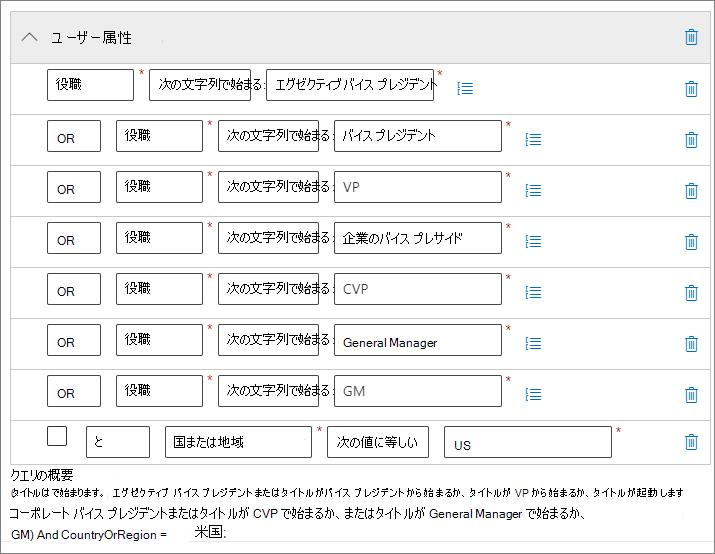
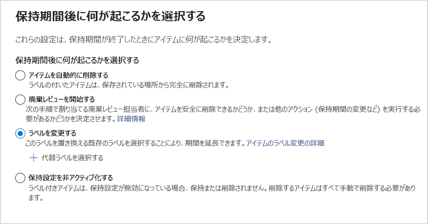

# <a name="common-settings-for-retention-policies-and-retention-label-policies"></a>保持ポリシーと保持ラベルの制限

>*[セキュリティとコンプライアンスのための Microsoft 365 ライセンス ガイダンス](https://aka.ms/ComplianceSD)。*

保持の設定の多くは、保持ポリシーと保持ラベル ポリシーの両方に共通です。 これらの設定を構成して、コンテンツを事前に保持したり、コンテンツを削除したり、コンテンツを保持して削除したりするには、次の情報を使用します。

保持のためにこれらのポリシーをサポートするシナリオについては、以下を参照してください。

- [保持ポリシーと作成と構成](create-retention-policies.md)。
- [アイテム保持ラベルを発行してアプリに適用する](create-apply-retention-labels.md)
- [保持ラベルをコンテンツに自動的に適用する](apply-retention-labels-automatically.md)

各シナリオに固有の設定については、それぞれのドキュメントで説明します。

保持ポリシーと Microsoft 365 内のデータ保持の仕組みに関する概要情報については、「アイテム[保持ポリシーおよび保持ラベルの詳細](retention.md)」をご覧ください。

## <a name="scopes---adaptive-and-static"></a>スコープ - アダプティブおよび静的

アダプティブ スコープと静的スコープをよくご存じではない場合や、保持用のポリシーを構成するときに使用するスコープを選択する場合は、「[保持のアダプティブ ポリシーまたは静的ポリシーのスコープ](retention.md#adaptive-or-static-policy-scopes-for-retention)」を参照してください。 

アダプティブ スコープと静的スコープのどちらを使用するかを決定したら、次の情報を使用して構成します:
- [アダプティブ スコープの構成情報](#configuration-information-for-adaptive-scopes)
- [静的スコープの構成情報](#configuration-information-for-static-scopes)

> [!TIP]
> 静的スコープを使用するポリシーがあり、それらをアダプティブ スコープに変換する場合は、既存のポリシーをそのままにして、同じ保持設定でアダプティブ スコープを使用する新しいポリシーを作成します。 静的スコープを使用して古いポリシーを無効または削除する前に、これらの新しいポリシーが正しいユーザー、サイト、およびグループを対象としていることを確認します。

### <a name="configuration-information-for-adaptive-scopes"></a>アダプティブ スコープの構成情報

アダプティブ スコープの使用を選択すると、必要なアダプティブ スコープの種類を選択するように求められます。 アダプティブ スコープには 3 つの異なる種類があり、それぞれが異なる属性またはプロパティをサポートしています。

| アダプティブ スコープの種類 | サポートされている属性またはプロパティは次の通りです |
|:-----|:-----|
|**Users** - 適用対象:  <br/> Exchange メール <br/> OneDrive: アカウント <br/> Teams のチャット <br/> Teams の非公開チャネル メッセージ <br/> Yammer ユーザーのメッセージ| 名 <br/> 姓 <br/>表示名 <br/> 役職 <br/> 部署 <br/> 事業所 <br/>番地 <br/> 都市 <br/>都道府県 <br/>郵便番号 <br/> 国または地域 <br/> 電子メール アドレス <br/> Alias <br/> Exchange カスタム属性: CustomAttribute1 - CustomAttribute15|
|**SharePoint sites** - 適用対象:  <br/> - SharePoint サイト <br/> - OneDrive アカウント |サイトの URL <br/>サイト名 <br/> SharePoint カスタム プロパティ: RefinableString00 - RefinableString99 |
|**Microsoft 365 Groups** - 適用対象:  <br/> - Microsoft 365 グループ <br/> - Teams チャネル メッセージ (標準および共有) <br/> - Yammer コミュニティのメッセージ |名前 <br/> 表示名 <br/> 説明 <br/> 電子メール アドレス <br/> Alias <br/> Exchange カスタム属性: CustomAttribute1 - CustomAttribute15 |

サイトのプロパティ名は、SharePoint サイトで管理されているプロパティに基づいています。 カスタム属性の詳細については、「[カスタム SharePoint サイトプロパティを使用した Adaptive Policy Scope sでの Microsoft 365保持の適用](https://techcommunity.microsoft.com/t5/security-compliance-and-identity/using-custom-sharepoint-site-properties-to-apply-microsoft-365/ba-p/3133970)」を参照してください。

ユーザーとグループの属性名は、Azure AD 属性にマップされる[フィルター可能な受信者プロパティ](/powershell/exchange/recipientfilter-properties#filterable-recipient-properties)に基づいています。次に例を示します。

- **Alias** は LDAP 名 **mailNickname** にマップされ、Azure AD 管理センターで **Email** と表示されます。
- **Email アドレス** は LDAP 名 **proxyAddresses** にマップされ、Azure AD 管理センターで **Proxy アドレス** として表示されます。

表にリストされている属性とプロパティは、単純なクエリ ビルダーを使用してアダプティブ スコープを構成するときに簡単に指定できます。 次のセクションで説明するように、追加の属性とプロパティは高度なクエリ ビルダーでサポートされています。

> [!TIP]
> 高度なクエリ ビルダーの使用の詳細については、次のウェビナーを参照してください。 
> - [アダプティブ ポリシー スコープを使用したユーザーとグループの高度なクエリの構築](https://mipc.eventbuilder.com/event/52683/occurrence/49452/recording?rauth=853.3181650.1f2b6e8b4a05b4441f19b890dfeadcec24c4325e90ac492b7a58eb3045c546ea)
> - [アダプティブ ポリシー スコープを使用した SharePoint サイトの高度なクエリの構築](https://aka.ms/AdaptivePolicyScopes-AdvancedSharePoint)

保持のための単一のポリシーには、1 つまたは複数のアダプティブ スコープを含めることができます。

#### <a name="to-configure-an-adaptive-scope"></a>アダプティブ スコープを構成するには

アダプティブ スコープを構成する前に、前のセクションを使用して、作成するスコープの種類と使用する属性と値を特定します。 この情報を確認するには、他の管理者と協力する必要がある場合があります。 

特に SharePoint サイトの場合、[カスタム サイト プロパティ](https://techcommunity.microsoft.com/t5/security-compliance-and-identity/using-custom-sharepoint-site-properties-to-apply-microsoft-365/ba-p/3133970)を使用する場合は、追加の SharePoint 構成が必要になることがあります。

1. [Microsoft Purview コンプライアンス ポータル](https://compliance.microsoft.com/)で、次のいずれかの場所に移動します。
    
    - レコード管理ソリューションを使用している場合:
        - **[ソリューション]** > **「レコード管理]** > **[アダプティブ スコープ]** タブ > + **「スコープの作成]**
        
    - データ ライフサイクル管理ソリューションを使用している場合:
       - [**ソリューション**]  >  [**データ ライフサイクル管理**]  >  [**アダプティブ スコープ**] タブ > + [**スコープの作成**]
    
    ナビゲーション ウィンドウにすぐに解決方法が表示されない場合は、まず、**[すべて表示]** を選択します。 

2. 構成のプロンプトに従って、最初にスコープの種類を選択し、動的メンバーシップの構築に使用する属性またはプロパティを選択し、属性またはプロパティの値を入力します。
    
    たとえば、ヨーロッパのユーザーを識別するために使用するアダプティブ スコープを構成するには、まずスコープの種類として **Users** を選択します。 次に、**Country または region** 属性を選択し、**Europe** を入力します:
    
    
    
    1 日に 1 回、このクエリはAzure AD に対して実行され、アカウントで **Country または region** 属性が **Europe** に指定されたすべてのユーザーを識別します。
    
    > [!IMPORTANT]
    > クエリはすぐには実行されないため、値を正しく入力したかどうかの検証はできません。
    
    **[属性の追加]** (ユーザーとグループの場合) または **[プロパティの追加]** (サイトの場合) を選択して、スコープの種類でサポートされている属性またはプロパティの任意の組み合わせを使用し、論理演算子と共にクエリを構築します。 サポートされている演算子は、**EQUAL**、**NOT EQUAL****START WITH** および **NOT STRT WITH** で、選択した属性またはプロパティをグループ化できます。 例:
    
    
    
    または、**[高度なクエリ ビルダー]** を選択して、独自のクエリを指定することもできます。
    
    - **User** および **Microsoft 365 Group** スコープの場合は、[OPATH フィルタリング構文](/powershell/exchange/recipient-filters)を使用します。 たとえば、部署、国、州ごとにメンバーシップを定義するユーザー スコープを作成するには、次のようにします:
    
        
        
        これらの範囲に高度なクエリ ビルダーを使用する利点の 1 つは、クエリ演算子の選択肢が広いということです。
        - **and**
        - **or**
        - **not**
        - **eq** (等しい)
        - **ne** (等しくない)
        - **lt** (より小さい)
        - **gt** (より大きい)
        - **like** (文字列比較)
        - **notlike** (文字列比較)
    
    - **SharePoint sites** スコープの場合は、キーワード クエリ言語 (KQL) を使用します。 KQL を使用してインデックス付きサイト プロパティを使用して SharePoint を検索する方法はすでにご存じかも知れません。 これらの KQL クエリを指定するには「[Keyword Query Language (KQL) 構文リファレンス](/sharepoint/dev/general-development/keyword-query-language-kql-syntax-reference)」を参照してください。
        
        たとえば、SharePoint サイト範囲には、Microsoft 365 グループ接続サイトと OneDrive サイトを含むすべての SharePoint サイトの種類が自動的に含まれるため、インデックス付きサイト プロパティ **Site Template** を使用して、特定のサイトの種類を含めたり除外したりできます。指定できるテンプレートは次のとおりです:
        - 最新のコミュニケーション サイトの `SITEPAGEPUBLISHING`
        - Microsoft 365 グループ接続サイトの `GROUP`
        - Microsoft Teams プライベート チャネル サイトの `TEAMCHANNEL`
        - 従来の SharePoint チーム サイトの `STS`
        - OneDrive サイトの `SPSPERS`
        
        したがって、最新の通信サイトのみを含み、Microsoft 365 の goup 接続サイトと OneDrive サイトを除外するアダプティブ スコープを作成するには、次の KQL クエリを指定します。
        ````console
        SiteTemplate=SITEPAGEPUBLISHING
        ````
    
    スコープ構成とは別に、[これらの高度なクエリを検証](#validating-advanced-queries)できます。
    
    > [!TIP]
    > 非アクティブなメールボックスを除外する場合は、高度なクエリ ビルダーを使用する必要があります。 または逆に、非アクティブなメールボックスのみをターゲットにします。 この構成では、OPATH プロパティ *IsInactiveMailbox* を使用します。
    > 
    > - 非アクティブなメールボックスを除外するには、クエリに次のものが含まれていることを確認してください: `(IsInactiveMailbox -eq "False")`
    > - 非アクティブなメールボックスのみをターゲットにするには、次のように指定します: `(IsInactiveMailbox -eq "True")`

3. 必要な数だけアダプティブ スコープを作成します。 保持用のポリシーを作成するときに、1 つ以上のアダプティブ スコープを選択できます。

> [!NOTE]
> クエリが完全に設定されるまでに最大 5 日かかる場合があり、変更はすぐには行われません。 新たに作成されたスコープを保持ポリシーに追加する前に数日待機することで、この延期期間を考慮します。

アダプティブ スコープの現在のメンバーシップとメンバーシップの変更を確認するには:

1. **アダプティブ スコープ** ページでスコープをダブルクリックします (または選択して Enter キーを押します)。

2. ポップアップ **[詳細]** ウィンドウで、**[スコープの詳細]** を選択します。 
    
    現在スコープ内にあるすべてのユーザー、サイト、またはグループが自動的に追加または削除された場合、そのメンバーシップの日付と時刻を識別する情報を確認します。

> [!TIP]
> [ポリシー検索](retention.md#policy-lookup) オプションを使用すると、特定のユーザー、サイト、および Microsoft 365 グループに現在割り当てられているポリシーを識別できます。

#### <a name="validating-advanced-queries"></a>高度なクエリの検証

PowerShell と SharePoint 検索を使用して、高度なクエリを手動で検証できます:
- スコープの種類 **Users** と **Microsoft 365 Groups** には PowerShell を使います
- スコープの種類 **SharePoint sites** には SharePoint 検索を使います

PowerShell を使用してクエリを実行するには:

1. [適切な Exchange Online 管理者権限](/powershell/exchange/find-exchange-cmdlet-permissions#use-powershell-to-find-the-permissions-required-to-run-a-cmdlet)を持つアカウントを使用して [Exchange Online PowerShell に接続します](/powershell/exchange/connect-to-exchange-online-powershell)。

2. [Get-Recipient](/powershell/module/exchange/get-recipient)、[Get-Mailbox](/powershell/module/exchange/get-mailbox)、または [Get-User](/powershell/module/exchange/get-user) のいずれかを *-Filter* パラメーターと一緒に使用し、中括弧 (`{`、`}`) で囲まれたアダプティブ スコープの [OPATH クエリ](/powershell/exchange/filter-properties) を使用します。 属性値が文字列の場合は、属性値を二重引用符または単一引用符で囲みます。

    クエリに選択した [OPATH プロパティ](/powershell/exchange/filter-properties) でサポートされているコマンドレットを特定すると、検証用に Get-Mailbox、Get-Recipient、または Get-User のどれかの使用を決定できるようになります。

    > [!IMPORTANT]
    > Get-Mailbox は *MailUser* 受信者タイプをサポートしていないため、ハイブリッド環境でオンプレミスのメールボックスを含むクエリを検証するには、Get-Recipient または Get-User を使用する必要があります。

    **User** スコープを検証するには、適切なコマンドを使用します。
    - *-RecipientTypeDetails UserMailbox,SharedMailbox,RoomMailbox,EquipmentMailbox* を使用する `Get-Mailbox`
    - *-RecipientTypeDetails UserMailbox,MailUser,SharedMailbox,RoomMailbox,EquipmentMailbox* を使用する `Get-Recipient`
    
    **Microsoft 365 グループ** スコープを検証するには、次を使用します。
    - *-GroupMailbox* を使用する `Get-Mailbox`、または *-RecipientTypeDetails GroupMailbox* を使用する `Get-Recipient`

    たとえば、**ユーザー** スコープを検証するには、次を使用できます。
    
    ````PowerShell
    Get-Recipient -RecipientTypeDetails UserMailbox,MailUser -Filter {Department -eq "Marketing"} -ResultSize Unlimited
    ````
    
    **Microsoft 365 グループ** スコープを検証するには、次を使用できます。
    
    ```PowerShell
    Get-Mailbox -RecipientTypeDetails GroupMailbox -Filter {CustomAttribute15 -eq "Marketing"} -ResultSize Unlimited
    ```
    
    > [!TIP]
    > これらのコマンドを使用してユーザー スコープを検証する場合、返される受信者の数が予想より多いのは、アダプティブ スコープの有効なライセンスを持たないユーザーが含まれている可能性があるからです。これらのユーザーには、保持設定が適用されることはありません。
    > 
    > たとえば、ハイブリッド環境では、オンプレミスまたは Exchange Online に Exchange メールボックスがなく、ライセンスのない同期ユーザー アカウントがあることがあります。これらのユーザーを識別するには、次のコマンドを実行します: `Get-User -RecipientTypeDetails User`

3. 出力が、アダプティブ スコープの予想されるユーザーまたはグループと一致することを確認します。 そうでない場合は、Azure AD または Exchange の関連する管理者にクエリと値を確認します。
 
SharePoint 検索を使用してクエリを実行するには:

1. グローバル管理者アカウントまたは SharePoint 管理者ロールを持つアカウントを使用して、`https://<your_tenant>.sharepoint.com/search` に移動します。

2. 検索バーを使用して KQL クエリを指定します。

3. 検索結果が、アダプティブ スコープの想定されるサイト URL と一致することを確認します。 一致しない場合は、SharePoint の管理者にクエリと URL を確認します。

### <a name="configuration-information-for-static-scopes"></a>静的スコープの構成情報

静的スコープを使用する場合は、選択した場所 (場所全体) のすべてのインスタンスにポリシーを適用するか、特定のインスタンスを含めるか除外するか (特定の包含または除外) を決定する必要があります。

#### <a name="a-policy-that-applies-to-entire-locations"></a>場所全体に適用されるポリシー

Skype for Business を除き、既定では、選択した場所のすべてのインスタンスがポリシーに自動的に含まれます。インスタンスの包含を指定する必要はありません。

たとえば、**Exchange email** の場所の **すべての受信者** です。この既定の設定では、既存のすべてのユーザー メールボックスがポリシーに含まれ、ポリシーの適用後に作成された新しいメールボックスは自動的にポリシーを継承します。

#### <a name="a-policy-with-specific-inclusions-or-exclusions"></a>特定の追加または除外を含むポリシー

省略可能な構成を使用して、特定のユーザー、特定の Microsoft 365 グループ、特定のサイトに保持設定を適用する場合にのみ、ポリシーごとに注意すべき制限事項があることに注意してください。詳細については、「[アイテム保持ポリシーと保持ラベルポリシーの制限](retention-limits.md)」を参照してください。 

省略可能な構成を使用して保持設定を適用するには、目的の場所の [**状態**] が [**オン**] であることを確認した上で、リンクを使用して特定のユーザー、Microsoft 365 グループ、またはサイトを含めたり除外したりします。

> [!WARNING]
> 含まれるインスタンスを構成してから最後のものを削除すると、その場所の構成は **All** に戻ります。  ポリシーを保存する前に、これが意図した構成であることをご確認ください。
>
> たとえば、データを削除するように設定されているアイテム保持ポリシーに含める SharePoint サイトを 1 つ指定していて、そのサイトを削除した場合、既定では、すべての SharePoint サイトがデータを完全に削除するアイテム保持ポリシーの対象となります。Exchange 受信者、OneDrive アカウント、Teams チャット ユーザーなどに含まれる内容にも同様に適用されます。
>
> このシナリオでは、その場所の **All** 設定をアイテム保持ポリシーの対象にしたくない場合、場所をオフに切り替えます。あるいは、ポリシーの適用からインスタンスを除外されるように指定することもできます。

## <a name="locations"></a>場所

保持ポリシー内の場所は、Exchange 電子メールや SharePoint サイトなどの保持設定をサポートする特定の Microsoft 365 サービスを識別します。 ポリシーにそれらを選択するときに知っておくべき構成の詳細と考えられる例外がある場所については、次のセクションを使用してください。

### <a name="configuration-information-for-exchange-email-and-exchange-public-folders"></a>Exchange メールと Exchange パブリック フォルダーの構成情報

**[Exchange メール]** の場所と **[Exchange パブリック フォルダー]** の場所の両方で、保持設定が適用される前にメールボックスに少なくとも 10 MB のデータが必要です。 

**Exchange メール** の場所は、メールボックスのレベルで保持設定を適用することにより、ユーザーのメール、予定表、およびその他のメールボックス アイテムの保持をサポートします。共有メールボックス、会議室と備品用リソース メールボックスもサポートされています。

メール連絡先、および Microsoft 365 グループ メールボックスは、Exchange メールではサポートされていません。 Microsoft 365 グループ メールボックスの場合は、代わりに **Microsoft 365 グループ** の場所を選択します。 Exchange の場所では、最初は静的スコープに対してグループ メールボックスを選択できますが、アイテム保持ポリシーを保存しようとすると、"RemoteGroupMailbox" はこの場所の有効な選択ではないというエラーが表示されます。

ポリシーの構成によっては、[非アクティブなメールボックス](inactive-mailboxes-in-office-365.md)が含まれる場合と含まれない場合があります。

- 既定の **すべての受信者** 構成を使用する場合、静的ポリシー スコープには非アクティブなメールボックスが含まれますが、[特定の包含または除外](#a-policy-with-specific-inclusions-or-exclusions)ではサポートされていません。 ただし、ポリシーの適用時にアクティブなメールボックスを持つ受信者を含めたり除外したりして、後でメールボックスが非アクティブになった場合、保持設定は引き続き適用または除外されます。

- アダプティブ ポリシー スコープには、既定で、スコープのクエリを満たすときに非アクティブなメールボックスが含まれます。 高度なクエリ ビルダーと OPATH プロパティ *IsInactiveMailbox* を使用して、それらを除外できます。
    
    ```console
    (IsInactiveMailbox -eq "False")
    ```

静的ポリシー スコープを使用し、含めるまたは除外する受信者を選択する場合、複数の受信者を 1 人ずつ選択するのではなく、効率的に選択する方法として、配布グループとメール対応のセキュリティ グループを選択できます。 このオプションを使用すると、バックグラウンドでは、これらのグループは構成時に自動的に展開され、グループ内のユーザーのメールボックスを選択します。 これらのグループのメンバーシップが後で変更されても、アダプティブ ポリシー スコープとは異なり、既存の保持ポリシーは自動的に更新されません。

Exchange の保持設定を構成するときに含めるメールボックスのアイテムと除外するアイテムの詳細については、「[保持と削除に含めるもの](retention-policies-exchange.md#whats-included-for-retention-and-deletion)」を参照してください。

**Exchange パブリック フォルダー** の場所は保持設定をすべてのパブリック フォルダーに適用し、フォルダーまたはメールボックス レベルでは適用できません。

#### <a name="exceptions-for-auto-apply-policies-configured-for-sensitive-information-types"></a>機密情報の種類に対して構成された自動適用ポリシーの例外

機密情報の種類を使用する自動適用ポリシーを構成し、**Exchange email** の場所を選択する場合:

- Microsoft 365 グループ メールボックスが含まれます。

- 特定のメールボックスを識別するようにアダプティブ スコープを構成した場合でも、すべてのメールボックスが自動的に含まれます。 静的ポリシー スコープを選択した場合、含める受信者または除外する受信者を指定することはできません。

### <a name="configuration-information-for-sharepoint-sites-and-onedrive-accounts"></a>SharePoint サイトと OneDrive アカウントの構成情報

**SharePoint sites** の場所を選択すると、保持ポリシーでは、SharePoint​​ コミュニケーション サイト、Microsoft 365 グループによって接続されていないチーム サイト、クラシック サイトのドキュメントを保持および削除することができます。 **アダプティブ ポリシー スコープ** を使用していない限り、Microsoft 365 グループによって接続されているチーム サイトは、このオプションでサポートされていないため、代わりにグループのメールボックス、サイト、ファイル内のコンテンツに適用されている [[Microsoft 365 グループ]](#exceptions-for-adaptive-policy-scopes) の場所を使用します。

> [!TIP]
> [[SharePoint 管理センターのフィルター]](/sharepoint/customize-admin-center-site-list)または [[SharePoint PowerShell コマンド]](/powershell/module/sharepoint-online/get-sposite#example-10) を使用して、サイトがグループ接続されているかどうかを確認できます。 静的スコープの場合、これらのサイトは **[Microsoft 365 グループ]** の場所でサポートされます。

SharePoint と OneDrive の保持設定を構成するときに含めるものと除外するものの詳細については、「[保持と削除に含めるもの](retention-policies-sharepoint.md#whats-included-for-retention-and-deletion)」を参照してください。

SharePoint サイトまたは OneDrive アカウントの場所を指定する場合、サイトにアクセスするためのアクセス許可は必要ありません。 静的スコープの場合、**[場所の編集]** ページで URL を指定した時点では、検証は行われません。 ただし、指定した SharePoint サイトは、構成の最後に存在していることが確認されます。 この確認が失敗した場合は、入力した URL の検証が失敗したことを示すメッセージが表示され、検証が成功するまで、保持ポリシーは作成できません。 このメッセージが表示されたら、構成手順に戻って URL を変更するか、保持ポリシーからサイトを削除します。

個々の OneDrive アカウントを指定するには、「[組織内のすべてのユーザーの OneDrive の URL 一覧を取得する](/onedrive/list-onedrive-urls)」を参照してください。

> [!NOTE]
> 個々の OneDrive アカウントを指定する場合、OneDrive アカウントが[事前にプロビジョ二ング](/onedrive/pre-provision-accounts)されていない限り、ユーザーが初めて OneDrive にアクセスするまで URL は作成されないことに注意してください。
>
> また、ユーザーのUPNが変更されると、OneDrive の URL が[自動的に変更](/onedrive/upn-changes)されます。  たとえば、結婚などの名前を変更するイベントや、組織の名前変更やビジネスの再構築をサポートするためのドメイン名の変更などです。 UPN が変更された場合は、保持設定に指定した OneDrive URL を更新する必要があります。
>
> 静的スコープに含める、または除外する個々のユーザーの URL を確実に指定する必要があるため、[アダプティブ スコープ](retention.md#adaptive-or-static-policy-scopes-for-retention) で **User** スコープの種類を指定するほうがこの目的には適しています。

#### <a name="exceptions-for-adaptive-policy-scopes"></a>アダプティブ ポリシー スコープの例外

アダプティブ ポリシー スコープを使用する保持用のポリシーを構成し、**SharePoint サイト** の場所を選択する場合:

- SharePoint 通信サイト、Microsoft 365 グループによって接続されていないチーム サイト、およびクラシック サイトに加えて、OneDrive サイトとMicrosoft 365 グループに接続されているサイトが含まれています。

### <a name="configuration-information-for-microsoft-365-groups"></a>Microsoft 365 グループの構成情報

Microsoft 365 グループ (以前の Office 365 グループ) のコンテンツを保持または削除するには、**Microsoft 365 グループ** の場所を使用する必要があります。 アイテム保持ポリシーの場合、この場所にはグループ メールボックスと SharePoint チーム サイトが含まれます。 保持ラベルの場合、この場所には SharePoint チーム サイトのみが含まれます。

このポリシーの場所を対象とするメールボックスには、保持設定が適用される前に少なくとも 10 MB のデータが必要です。

> [!NOTE]
> Microsoft 365 グループには Exchange メールボックスがありますが、**Exchange メール** の場所が含まれるアイテム保持ポリシーには、Microsoft 365 グループのメールボックスのコンテンツは含まれません。

静的スコープを使う場合: 最初は **Exchange メール** の場所でグループ メールボックスを含めるか除外するかを指定できますが、保持ポリシーを保存しようとすると、Exchange の場所では "RemoteGroupMailbox" を選択できないというエラーが表示されます。

既定では、Microsoft 365 グループに適用される保持ポリシーには、グループのメールボックスと SharePoint チーム サイトが含まれます。 SharePoint の Teams サイトに保存されたファイルは、場所でカバーされていますが、独自の保持ポリシーの場所を持つ Teams のチャットや Teams のチャネルはカバーされません。

保持ポリシーを Microsoft 365 メールボックスのみ、または接続された SharePoint チーム サイトのみに適用するために既定を変更するには、次のいずれかの値を指定した *Applications* パラメーターを指定して [Set-RetentionCompliancePolicy](/powershell/module/exchange/set-retentioncompliancepolicy) PowerShell コマンドレットを使用します。

- グループに接続されている Microsoft 365 メールボックスのみの場合は `Group:Exchange`。
- グループに接続されている SharePoint サイトのみの場合は `Group:SharePoint`。

選択した Microsoft 365 グループのメールボックスと SharePoint サイトの両方の既定値に戻すには、`Group:Exchange,SharePoint`を指定します。

#### <a name="exceptions-for-auto-apply-policies-configured-for-sensitive-information-types"></a>機密情報の種類に対して構成された自動適用ポリシーの例外

機密情報の種類を使用する自動適用ポリシーを構成し、**Microsoft 365 グループ** の場所を選択する場合:

- Microsoft 365 グループのメールボックスは含まれていません。これらのメールボックスをポリシーに含めるには、代わりに **Exchange メール** の場所を選択します。

#### <a name="what-happens-if-a-microsoft-365-group-is-deleted-after-a-policy-is-applied"></a>ポリシーの適用後に Microsoft 365 グループが削除された場合の動作

保持のポリシー (静的ポリシー スコープまたはアダプティブ) がMicrosoft 365 グループに適用され、そのグループがAzure Active Directoryから削除された場合:

- グループに接続された SharePoint サイトは保持され、**Microsoft 365 グループ** の場所のアイテム保持ポリシーによって引き続き管理されます。 グループが削除される前にサイトにアクセスしていたユーザーは引き続きサイトにアクセスでき、新しいアクセス許可は SharePoint を介して管理する必要があります。
    
    この時点では、削除されたグループを指定できないため、Microsoft 365 グループの場所からサイトを除外することはできません。 このサイトからアイテム保持ポリシーを解除する必要がある場合は、Microsoft サポートに連絡してください。 たとえば、[Microsoft 365管理センターでサポート リクエストを開きます](/microsoft-365/admin/get-help-support#online-support)。

- 削除されたグループのメールボックスは非アクティブになり、SharePoint サイトと同様に、保持設定の対象となります。 詳細については、「[Exchange Online の非アクティブなメールボックス](inactive-mailboxes-in-office-365.md)」を参照してください。

### <a name="configuration-information-for-skype-for-business"></a>Skype for Business の構成情報

> [!NOTE]
> Skype for Business は [2021 年 7 月 31 日に廃止](https://techcommunity.microsoft.com/t5/microsoft-teams-blog/skype-for-business-online-to-be-retired-in-2021/ba-p/777833)されました。Microsoft Teams への移行をお勧めします。 ただし、既存の顧客Skype for Business保持ポリシーは引き続きサポートされます。

Exchange メールとは異なり Skype の場所の状態をオンに切り替えて自動的にすべてのユーザーを含めることはできませんが、そのロケーションをオンにしてから、会話を保持するユーザーを手動で選択する必要があります。


この **[編集]** オプションを選択した後、**[Skype for Business]** ウィンドウで、**[名前]** 列の前にある非表示のボックスを選択することで、すべてのユーザーをすばやく含めることができます。 ただし、各ユーザーはポリシーの特定のインクルージョンとしてカウントされることを理解することが重要です。 したがって、このボックスを選択して 1,000 人のユーザーを含める場合、含める 1,000 人のユーザーを手動で選択した場合と同じです。これは、Skype for Business でサポートされる最大数です。

**[会話履歴]** (Outlook のフォルダー) は、Skype のアーカイブとは関係のない機能です。**[会話履歴]** はエンド ユーザーが無効にできますが、Skype のアーカイブの場合はユーザーにはアクセスできない (電子情報開示には使用できる) 非表示フォルダーに Skype の会話のコピーが保存されます。

## <a name="settings-for-retaining-and-deleting-content"></a>コンテンツを保持および削除するための設定

保持ポリシーでコンテンツを保持および削除するための設定を選択すると、保持ポリシーは、指定された期間、次のいずれかの構成になります。

- 保持のみ
    
    この構成では、次のオプションを選択します。
    
    - アイテム保持ポリシーの場合: **［決定］ で、コンテンツを保持するか、削除するか、またはその両方の** ページで、 **［特定の期間のアイテムを保持する］** を選択し、**［保持期間の終わりに］** を指定し、保存期間終了時に **［何もしない］** を選択すると、保存設定が削除されます。または、終了日なしで保持するには、このページで **[アイテムを無期限に保持する]** を選択します。
    
    - 保持ラベルの場合: **［ラベル設定ページを定義する］** で、**［アイテムを無期限または特定の期間保持］** を選択し、次の操作を行います。
        - 特定の時間後にラベル付けされたコンテンツに保持設定が有効ではなくなった場合: **［保持期間の定義］** ページの **［アイテム保持期間］** で、期間を指定します。 次に、**［保持期間の後の動作を選択］** ページで、**［保持設定のアクティブ化の解除］** を選択します。 ラベルはコンテンツに残りますが、[分類するだけのラベル](retention.md#classifying-content-without-applying-any-actions) であるかのように制限はありません。
        - 終了日なしで保持するには: **［保持期間の定義］** ページで、 **［アイテム保持期間］** の場合は、**［無期限］** を選択します。 ラベルは、[既存の制限](records-management.md#compare-restrictions-for-what-actions-are-allowed-or-blocked ) のコンテンツに残ります。

- 保持してから削除

    この構成では、次のオプションを選択します。
    
    - 保持ポリシーの場合: **コンテンツを保持するか、削除するかを決定し、またはその両方の** ページで、 **［特定の期間のアイテムを保持する］** を選択し、保存期間を指定し、**保存期間終了時** に **［アイテムを自動的に削除する］** を選択します。
    
    - 保持ラベルの場合: **Define ラベル設定** ページで、 **［アイテムを無期限または特定の期間保持する］** を選択し、**［保持期間の後の動作を選択］** し、**［アイテムを自動的に削除する］** または **［処理レビューを開始］** を選択します。処分レビューについては、「[処分レビュー](disposition.md#disposition-reviews)」を参照してください。

- 削除のみ

    この構成では、次のオプションを選択します。
    
    - 保持ポリシーの場合: **コンテンツを保持するか、削除するか、またはその両方を行う** かを決定し、**［アイテムが一定の年数に達したときのみ削除する］** を選択し、期間を指定します。
    
    - 保持ラベルの場合: **［ラベル設定の定義］** ページで、**［特定の期間の後にアクションを適用する］** を選択し、保持期間と呼ばれる期間を指定します。 オプション **［期間の後の動作を選択］** は自動的に **［アイテムを自動的に削除する］** に設定されます。

### <a name="retaining-content-for-a-specific-period-of-time"></a>コンテンツを特定の期間保持する

コンテンツを保持する保持ラベルまたはポリシーを構成する場合は、アイテムを特定の日数、月数 (1 か月は 30 日と想定)、年数の間保持することを選択します。 または、アイテムを永久に保持します。 保持期間は、ポリシーが割り当てられた時点からではなく、指定した保持期間の開始に従って計算されます。

保持期間の開始については、コンテンツがいつ作成されたか、またはコンテンツが最後に変更されたときの SharePoint、OneDrive、Microsoft 365 グループのファイルのみサポートされるかを選択できます。 保持ラベルについては、コンテンツにラベルが付けられたときとイベントが発生したときから保持期間を開始できます。

例:

- SharePoint: サイト コレクションのコンテンツを最後に変更してから 7 年間このアイテムを保持する場合に、そのサイト コレクションのドキュメントが 6 年変更されていないと、そのドキュメントが変更されなければあと 1 年間しか保持されません。そのドキュメントがもう一度編集された場合、ドキュメントの古さは最後に変更された日付から計算され、その後 7 年間保留にされます。

- Exchange: メールボックスのアイテムを 7 年間保持する場合、あるメッセージが 6 年前に送信されているときは、あと 1 年間のみ保持されます。Exchange アイテムの場合、経過時間は受信メールの受信日または送信メールの送信日に基づいています。最終更新日に基づいてアイテムを保持するポリシーは、OneDrive および SharePoint のコンテンツ サイトにのみ適用されます。

保持期間の終了時に、コンテンツを完全に削除するかどうかを選択します。たとえば、保持ポリシーの場合:

![[アイテム保持設定] ページ。](../media/b05f84e5-fc71-4717-8f7b-d06a29dc4f29.png)

次のセクションで説明するように、保持ラベルには独自の保持期間を持ち、別の保持ラベルを適用する別のオプションがあります。

リテンション期間を構成する前に、まず、それぞれのワークロードの容量とストレージの制限について理解してください。

- SharePoint と OneDrive の場合、保持されたアイテムはサイトのアイテム保管ライブラリに格納されます。このライブラリは、サイトのストレージ クォータに含まれます。 詳細については、SharePoint ドキュメントの「[管理サイトの記憶域の制限](/sharepoint/manage-site-collection-storage-limits)」を参照してください。

- 保持されたメッセージがメールボックスに保存される Exchange、Teams、Yammer については「[Exchange Online の制限](/office365/servicedescriptions/exchange-online-service-description/exchange-online-limits)」を参照し [auto-expanding archiving](autoexpanding-archiving.md) を有効にしてください。。
    
    ユーザーによって、またはポリシー設定から自動的に大量の電子メールが短時間で削除される極端なケースでは、ユーザーのプライマリ メールボックスの [回復可能なアイテム] フォルダーからアーカイブ メールボックスの [回復可能なアイテム] フォルダーにアイテムをより頻繁に移動するように Exchange を構成する必要がある場合もあります。詳細な手順については、「[保留中のメールボックスの回復可能なアイテムのクォータを拡大する](increase-the-recoverable-quota-for-mailboxes-on-hold.md)」を参照してください。

#### <a name="relabeling-at-the-end-of-the-retention-period"></a>保持期間の満了時点での再ラベル付け

> [!NOTE]
> このオプションは現在プレビュー段階であり、変更される可能性があります。

保存期間の終了時に自動的に別の保存ラベルを適用するように設定した場合、そのアイテムは、新しく選択した保持ラベルの保持設定の対象となります。 このオプションを使用すると、アイテムの保持設定を自動的に変更できます。

プライマリ保持期間ラベルを作成して保存した後で、置換ラベルを変更できます。 プライマリ保持ラベルが既に適用されているアイテムで、構成された保存期間内であれば、置換ラベルの変更はこれらのアイテムに同期されます。 他のラベルの変更と同様に、この同期期間には最大 7 日間要します。

置換ラベルの場合は、通常、プライマリ保持期間ラベルよりも保持期間が長いラベルを選択します。 ただし、ラベルには保存期間を開始する時期が設定されているため、必ずしもそうとは限りません。 たとえば、プライマリ保持期間ラベルは、アイテムの作成時に保持期間を開始するように構成され、置換ラベルはラベル付けされたとき、またはイベントが発生したときに保持期間を開始します。

また、ラベル [ がアイテムをレコードまたは定期的なレコード ](declare-records.md) としてマークするかどうかに変更がある場合、保持ラベルの交換により、そのアイテムに対して[許可またはブロックされるアクションの制限](records-management.md#records)も変更できます。

##### <a name="relabeling-example-configuration"></a>再ラベル付けの構成例

コンテンツの作成後 3 年間保持し、アイテムをレコードとしてマークするように、業界コンプライアンス要件の保持ラベルを作成して構成します。 このラベルを適用すると、レコードの制限事項の 1 つであるため、ユーザーはアプリからアイテムを削除できなくなります。

3 年が経過した時点で、社内のコンプライアンス ポリシーにより、さらに 2 年間コンテンツを自動的に保持したいものの、この構成が適用される制限でレコードとしてマークする必要はありません。

構成完了後、保持期間終了時にラベルを変更する設定を選択し、コンテンツ作成後 5 年間コンテンツを保存し、そのアイテムをレコードとしてマークしないラベルを選択します。 

これらの設定を併用することで、ユーザーは 3 年後にアプリからアイテムを削除することができますが、電子情報開示検索には 5 年間アクセス可能な状態が維持されます。

##### <a name="considerations-for-the-relabeling-option"></a>再ラベル付けオプションに関する考慮事項

- 規制レコードに再ラベル付けすることはできませんが、置換ラベルはコンテンツを規制レコードとしてマークするように構成できます。

- 置換ラベルとして選択されている保持ラベルを削除することはできません。

- 別の置換ラベルを適用するように構成されている置換ラベルを選択できます。 アイテムに含めることができる置換ラベルの数に制限はありません。

- 置換ラベルがアイテムをレコードまたは規制レコードとしてマークしているものの、ファイルが現在チェックアウトされているために適用できない場合、ファイルが再度チェックインされたとき、またはチェックアウトが破棄されたときに再ラベル付け処理が再試行されます。

- このプレビューの既知の問題として、置換ラベルは、そのラベルが同じ場所の発行済みラベル ポリシーに含まれているか、または削除専用に構成されている場合にのみ、Outlook のユーザーに表示されます。

##### <a name="configuration-paths-for-relabeling"></a>再ラベル付けのための構成パス

保持期間の終了時にラベルを変更するオプションには、保持ラベルの作成時に 2 つの構成パスがあります。

- プライマリ ラベルを使用してコンテンツを最初に保持する必要がある場合 (最も一般的): **[ラベル設定の定義]** ページで、**[アイテムを無期限または特定の期間保持する]** を選択し、保持期間を指定します。 次に、**［保持期間の後の動作を選択する］** ページで、**［ラベルの変更］** > **[置換ラベルの選択]** を選択します。

- プライマリ ラベルを使用してコンテンツを最初に保持する必要がない場合は、**[ラベル設定の定義]** ページで、**[特定の期間後にアクションを適用する]** を選択し、保持期間を指定して、**[ラベルの変更]** > **[置換ラベルの選択]** を選択します。

どちらの場合も、置換ラベルは既に作成されている必要がありますが、既存のラベル ポリシーに含める必要はありません。



代わりに、この **[保持期間後の動作を選択する]** ページでラベル設定 **[処理確認を開始する]** を選択すると、[処理確認プロセス](disposition.md#disposition-reviews)の一環として処理確認者が置換ラベルを手動で選択できます。

### <a name="deleting-content-thats-older-than-a-specific-age"></a>特定の経過時間を超えた古いコンテンツを削除する

保持設定では、アイテムを保持してから削除することも、古いアイテムを保持せずに削除することもできます。

どちらの場合も、保持設定でアイテムを削除する場合、指定した期間は、ポリシーが割り当てられた時点から計算されるのではなく、指定した保持期間の開始時点に従って計算されることを理解しておくことが重要です。たとえば、アイテムが作成、変更、ラベル付けされた時点からです。

このため、まず、既存のコンテンツの年数と、設定がそのコンテンツに与える影響を考慮してください。 コンテンツに設定を適用する前に、選択した設定をユーザーやヘルプデスクに伝えることで、起こりうる影響を評価する時間を確保することを検討してください。

### <a name="a-policy-that-applies-to-entire-locations"></a>場所全体に適用されるポリシー

場所を選択すると、Skype for Business を除き、場所の状態が **[オン]** の場合、既定の設定は **[すべて]** になります。

アイテム保持ポリシーが場所全体の任意の組み合わせに適用される場合、ポリシーに含めることができる受信者、サイト、アカウント、グループなどの数に制限はありません。

たとえば、ポリシーにすべての Exchange メールとすべての SharePoint サイトが含まれている場合、数に関係なくすべてのサイトと受信者が含められます。また、Exchange の場合、ポリシーの適用後に作成された新しいメールボックスには、そのポリシーが自動的に継承されます。

### <a name="a-policy-with-specific-inclusions-or-exclusions"></a>特定の追加または除外を含むポリシー

省略可能な構成を使用して、特定のユーザー、特定の Microsoft 365 グループ、特定のサイトに保持設定を適用する場合にのみ、ポリシーごとに注意すべき制限事項があることに注意してください。詳細については、「[アイテム保持ポリシーと保持ラベルポリシーの制限](retention-limits.md)」を参照してください。 

省略可能な構成を使用して保持設定を適用するには、目的の場所の [**状態**] が [**オン**] であることを確認した上で、リンクを使用して特定のユーザー、Microsoft 365 グループ、またはサイトを含めたり除外したりします。

> [!WARNING]
> 含まれる内容を構成してから最後のものを削除すると、その場所の構成は **All** に戻ります。  ポリシーを保存する前に、これが意図した構成であることをご確認ください。
>
> たとえば、データを削除するように設定されているアイテム保持ポリシーに含める SharePoint サイトを 1 つ指定していて、そのサイトを削除した場合、既定では、すべての SharePoint サイトがデータを完全に削除するアイテム保持ポリシーの対象となります。Exchange 受信者、OneDrive アカウント、Teams チャット ユーザーなどに含まれる内容にも同様に適用されます。
>
> このシナリオでは、その場所の **All** 設定をアイテム保持ポリシーの対象にしたくない場合、場所をオフに切り替えます。あるいは、ポリシーの適用から除外されるように指定することもできます。

## <a name="updating-policies-for-retention"></a>保持ポリシーの更新

保持ポリシーを作成して保存した後には変更できない設定があり、それらは以下のものを含みます:
- 保持ポリシー名と保持期間を除く保持設定、および保持期間を開始するタイミング。

アイテム保持ポリシーを編集し、アイテムが既にアイテム保持ポリシーの元の設定の対象となっている場合、更新された設定は、新しく特定されたアイテムに加えて、このアイテムに自動的に適用されます。

通常、この更新はかなり迅速ですが、数日かかる場合もあります。Microsoft 365 の場所間でのポリシーの複製が完了すると、Microsoft Purview コンプライアンス ポータルのアイテム保持ポリシーの状態が [**オン (保留中)**] から [**オン (成功)**] に変わります。

## <a name="locking-the-policy-to-prevent-changes"></a>変更を防止するためにポリシーをロックする

ポリシーをオフにしたり、ポリシーを削除したり、制限を緩和したりすることができないようにする必要がある場合は、「[保管ロックを使用して、アイテム保持ポリシーと保持ラベル ポリシーへの変更を制限する](retention-preservation-lock.md)」を参照してください。
