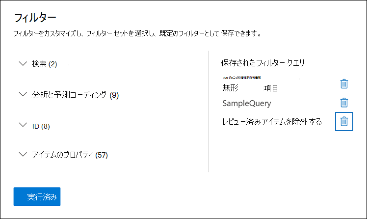

# レビュー セット内のコンテンツのクエリとフィルター

[!include[Purview banner](../includes/purview-rebrand-banner.md)]

ほとんどの場合、レビュー セット内のコンテンツを詳しく調べ、より効率的なレビューを容易にするために整理すると便利です。 レビュー セットでフィルターとクエリを使用すると、レビューの条件を満たすドキュメントのサブセットに焦点を当てるのに役立ちます。

## 既定のフィルター

レビュー セットには、レビュー セットに事前に読み込まれる既定のフィルターが 5 つあります。

- キーワード
- 日付
- 送信者/作成者
- 件名/タイトル
- タグ

各フィルターをクリックして展開し、値を割り当てます。 フィルターの外側をクリックして、フィルターをレビュー セットに自動的に適用します。 次のスクリーンショットは、日付範囲内のドキュメントを表示するように構成された日付フィルターを示しています。

## フィルターを追加または削除する

レビュー セットに表示されるフィルターを追加または削除するには、[ **フィルター** ] を選択して、ポップアップ ページに表示されるフィルター パネルを開きます。 

使用可能なフィルターは、次の 4 つのセクションで構成されています。

- **検索**: さまざまな検索機能を提供するフィルター。

- **分析&予測コーディング**: **ドキュメント &電子メール分析** ジョブを実行したり、予測コーディング モデルを使用したりするときに、ドキュメントに生成および追加されるプロパティをフィルター処理します。

- **ID**: ドキュメントのすべての ID プロパティをフィルター処理します。

- **アイテム プロパティ**: ドキュメント プロパティのフィルター。 

各セクションを展開し、フィルターセットでフィルターを追加または削除するフィルターを選択または選択解除します。 フィルターを追加すると、フィルター セットに表示されます。 

> [!NOTE]
> フィルター パネルでセクションを展開すると、既定のフィルターの種類が選択されていることがわかります。 これらを選択したままにするか、選択解除し、フィルター セットから削除することができます。 

## フィルターの種類

レビュー セット内のすべての検索可能なフィールドには、特定のフィールドに基づいてフィルター アイテムに使用できる対応するフィルターがあります。

フィルターには複数の種類があります。

- **Freetext**: フリーテキスト フィルターは、"Subject" などのテキスト フィールドに適用されます。 複数の検索語句をコンマで区切って一覧表示できます。

- **日付**: 日付フィルターは、"最終更新日" などの日付フィールドに使用されます。

- **検索オプション**: 検索オプション フィルターは、レビュー内の特定のフィールドに対して使用可能な値の一覧 (各値は選択できるチェック ボックスと共に表示されます) を提供します。 このフィルターは、レビュー セットに使用できる値の数が限られている "Sender" などのフィールドに使用されます。

- **キーワード**: キーワード条件は、用語の検索に使用できるフリーテキスト条件の特定のインスタンスです。 この種類のフィルターでは、KQLに似たクエリ言語を使用することもできます。 詳細については、この記事のクエリ言語と高度なクエリ ビルダーのセクションを参照してください。

## フィルターリレーションシップを含める/除外する

特定のフィルターの包含リレーションシップと除外リレーションシップを変更できます。 たとえば、タグ フィルターで、ドロップダウン フィルターで **[等しい** なし] を選択することで、特定のタグでタグ付けされたアイテムを除外できます。 

## フィルターをクエリとして保存する

フィルターに問題がなければ、フィルターの組み合わせをフィルター クエリとして保存できます。 これにより、今後のレビュー セッションでフィルターを適用できます。

フィルターを保存するには、[ **クエリの保存]** を選択し、名前を付けます。 自分または他のレビュー担当者は、[保存されたフィルター クエリ] ドロップダウンを選択し、適用するフィルター クエリを選択して、設定したドキュメントを確認することで、以前 **に保存したフィルター クエリ** を実行できます。 

フィルター クエリを削除するには、フィルター パネルを開き、クエリの横にあるごみ箱アイコンを選択します。

## クエリ言語

フィルターを使用するだけでなく、キーワード フィルターでKQLに似たクエリ言語を使用して、レビュー セットの検索クエリを作成することもできます。 レビュー セット クエリのクエリ言語では、**AND**、**OR**、NOT、**NEAR** などの標準のブール演算子 **が** サポートされます。 また、単一文字のワイルドカード (?) と複数文字のワイルドカード (*)もサポートされています。

## 高度なクエリ ビルダー

さらに高度なクエリを作成して、レビュー セット内のドキュメントを検索することもできます。

1. フィルター パネルを開き、[ **フィルター**] を選択し、[ **検索** ] セクションを展開します。

  

2. **KQL** フィルターを選択し、[**クエリ ビルダーを開く**] をクリックします。

   このパネルでは、クエリ ビルダーを使用して複雑なKQLクエリを作成できます。 AND または **OR** リレーションシップによって論理的に接続されている複数の条件で構成される条件グループを追加したり、条件グループ **を** 追加したりできます。

   

## 部分的にインデックスが付けられたアイテムをフィルター処理する

下書きコレクションをレビュー セットにコミットしたときに、部分的にインデックスが付けられたアイテムを追加するオプションを選択した場合。 これらのアイテムを特定して表示し、アイテムが調査に関連しているかどうかを判断し、アイテムの部分的なインデックスが作成されたエラーを修復する必要があるかどうかを判断する必要があります。

現時点では、部分的にインデックスが付けられたアイテムを表示するフィルター オプションはレビュー セットにありません。 しかし、私たちはそれに取り組んでいます。 それまでは、レビュー セットに追加した部分的にインデックスが付けられたアイテムをフィルター処理して表示する方法を次に示します。

1. コレクションを作成し、追加のデータ ソースから部分的にインデックス付けされた項目を追加 *せずに* 、新しいレビュー セットにコミットします。

2. 手順 1. からコレクションをコピーして、新しいコレクションを作成します。

3. 新しいコレクションを同じレビュー セットにコミットします。 ただし、今回は、部分的にインデックスが付けられた項目を追加データ ソースから追加します。 手順 1 で作成したコレクションのアイテムは既にレビュー セットに追加されているため、2 番目のコレクションの部分的にインデックスが付けられたアイテムのみがレビュー セットに追加されます。

4. 両方のコレクションがレビュー セットに追加されたら、レビュー セットに移動し、**ManageLoad** >  セットを選択 **します**。

5. 2 番目のコレクション (手順 2 で作成したもの) の **読み込み ID を** コピーまたはメモします。 コレクション名は、[ **ソース情報]** 列で識別されます。

6. レビュー セットに戻り、[ **フィルター**] をクリックして [ **ID** ] セクションを展開し、[ **読み込み ID** ] チェック ボックスをオンにします。

7. **[読み込み ID**] フィルターを展開し、2 番目のコレクションに対応する読み込み ID のチェック ボックスをオンにして、部分的にインデックスが作成された項目を表示します。
