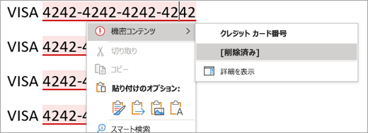

# Office アプリの AIP アドインに対して MIP 組み込みラベル付けを選択する理由

>*[セキュリティとコンプライアンスのための Microsoft 365 ライセンス ガイダンス](/office365/servicedescriptions/microsoft-365-service-descriptions/microsoft-365-tenantlevel-services-licensing-guidance/microsoft-365-security-compliance-licensing-guidance)。*

Windows コンピューターの Microsoft 365 Apps で[秘密度ラベル](sensitivity-labels.md)を使用する場合、Office アプリに組み込まれているラベル付けを使用するか、[Azure Information Protection (AIP) 統合のラベル付クライアント](/azure/information-protection/rms-client/aip-clientv2)からのアドインを使用するかを選択できます。 

組み込みラベル付けは、[Microsoft Information Protection (MIP)](information-protection-solution.md) 展開の基礎となります。このラベル付けテクノロジは、プラットフォーム (Windows、macOS、iOS、Android、および Web) だけでなく、Microsoft のアプリやサービスを超えて拡張されます。 組み込みラベル付けは、データ分類やデータ損失防止 (DLP) などの他の MIP 機能と動作するようにも設計されています。

組み込みラベルは Office アドインを使用しないため、安定性とパフォーマンスの向上という利点があります。 また、高度な分類子などの最新の MIP 機能もサポートしています。

既定では、AIP クライアントがインストールされている場合、組み込みラベル付け機能は Windows 版 Office アプリでオフになっています。 この既定の動作を変更するには、次のセクションの「[AIP アドインを無効にして Office アプリに組み込みラベル付けを使用する方法](#how-to-disable-the-aip-add-in-to-use-built-in-labeling-for-office-apps)」の手順に従います。

Office アプリで AIP クライアントをインストールしたまま無効にしておくと、AIP クライアントの他の機能は引き続きサポートされます。

- ユーザーがすべてのファイルの種類にラベルを適用するためのファイル エクスプローラーの右クリック オプション。

- テキスト、画像、または PDF ドキュメントの暗号化されたファイルを表示するビューアー。

- オンプレミスのファイル内の機密情報を検出し、これらのファイルからラベルおよび暗号化を適用または削除するための PowerShell モジュール。

- オンプレミスのデータ ストアに保存されている機密情報を検出し、必要に応じてそのコンテンツにラベルを付けるスキャナー。

Office アプリ以外のラベル付けを拡張するこれらの機能の詳細については、AIP ドキュメントの「[Azure Information Protection 統合ラベル付けクライアント管理者ガイド](/azure/information-protection/rms-client/clientv2-admin-guide)」を参照してください。

ラベル付けとは別に、[AIPService](/powershell/module/aipservice) PowerShell モジュールを引き続き使用して、暗号化サービスのテナント レベルの管理を行うことができます。 たとえば、データ復旧用の暗号化の削除、AIP クライアントによって開いたドキュメントの追跡および取り消し、オフライン アクセスの使用ライセンスの有効期間の構成などが必要な場合に、スーパー ユーザー アクセスを構成します。 詳細については、「[PowerShell を使用した Azure Information Protection からの保護の管理](/azure/information-protection/administer-powershell)」を参照してください。

## Office アプリまたは AIP アドインに組み込みラベル付けを使用するかどうかを決定する

AIP クライアントが[メンテナンス モード](https://techcommunity.microsoft.com/t5/security-compliance-and-identity/announcing-aip-unified-labeling-client-maintenance-mode-and/ba-p/3043613)に切り替わったので、Office アプリに AIP アドインを使用することはお勧めしません。これは、以下の理由によります。

- 新しいラベル付け機能はサポートされません。
- アドインが他のアドインと競合する可能性があるため、安定性が低く、Office アプリがハングまたはクラッシュしたり、アドインを自動的に無効にしたりする可能性があります。
- アドインの実行速度が低下し、ユーザーがラベル付け要件を回避するために無効にする可能性があります。
- バグ修正の度に Azure Information Protection クライアントを再インストールする必要があります。
- ユーザーのラベル付けエクスペリエンスは、ユーザーが他のデバイス (macOS、iOS、Android) で使用している組み込みラベル、および Office for the web を使用する場合とは少し異なります。この違いによって、トレーニングとサポートのコストが増加する場合があります。
- [組み込みラベル付けでのみサポートされる](#features-supported-only-by-built-in-labeling-for-office-apps) Office ラベル付け機能が既に新しくリリースされており、これらの機能は増え続けています。

Windows Office アプリの AIP アドインは、既にユーザーに展開済みで、組み込みラベル付けに移行する時間が必要な場合にのみ使用します。 または、組み込みラベル付けでサポートされていない機能がユーザーに必要な場合に使用します。 これらの機能を特定するには、このページの「[同等の機能の情報](#feature-parity-for-built-in-labeling-and-the-aip-add-in-for-office-apps)」を使用します。

## Office アプリの組み込みラベル付けでのみサポートされる機能

> [!NOTE]
> 多くの新しいラベル付け機能が計画または開発中であるため、このセクションのリストは時間の経過と共に拡大する予定です。

一部の機能は、Office アプリの組み込みラベル付けでのみサポートされており、AIP アドインではサポートされません。これらには以下が含まれます。

- 自動ラベル付けと推奨ラベル付けの場合:
    - [トレーニング可能な分類子](classifier-learn-about.md)、[完全データ一致 (EDM)](sit-learn-about-exact-data-match-based-sits.md)、[名前付きエンティティ](named-entities-learn.md)を含むインテリジェント分類サービスへのアクセス
    - ユーザーが入力する際の機密情報の検出
    - Word では、ユーザーは識別された機密コンテンツを確認および削除できます。
- ユーザーによるアクセス許可の割り当てを許可するラベルの場合、ユーザーまたはグループに異なるアクセス許可 (読み取りまたは変更) を付与できます。
- メールの暗号化のみ
- ステータス バーのラベルの表示
- アカウント切り替えのサポート
- ユーザーがラベル付けを無効にできない

ユーザーが Word で識別された機密コンテンツを確認し、必要に応じて削除する方法を示す例:

組み込みラベル付けで新しいラベル付け機能が入手可能になったときに通知を受信するには、「[Microsoft 365 コンプライアンスの新機能](whats-new.md)」および「**秘密度ラベル**」セクションを参照してください。

## AIP アドインを無効にして、Office アプリに組み込みラベル付けを使用する方法

Office アプリ以外のラベル付けを拡張するために AIP クライアントをインストールした状態で、クライアントのアドインが Office アプリに読み込まれることを防ぐ場合は、「**Office 2013 および Office 2016 プログラムのグループ ポリシー設定が原因でアドインが読み込まれない**」に記載されているように、グループ ポリシー設定の [管理対象アドインの一覧](https://support.microsoft.com/help/2733070/no-add-ins-loaded-due-to-group-policy-settings-for-office-2013-and-off)を使用します。

組み込みのラベル付けをサポートする Office アプリの場合、Microsoft Word 2016、Excel 2016、PowerPoint 2016、Outlook 2016 の構成を使用し、AIP クライアントに次のプログラム識別子 (ProgID) を指定し、オプションを **[0: アドインは常に無効 (ブロックされます)]** に設定します

|アプリケーション  |ProgID  |
|---------|---------|
|Word     |     `MSIP.WordAddin`    |
|Excel     |  `MSIP.ExcelAddin`       |
|PowerPoint     |   `MSIP.PowerPointAddin`      |
|Outlook | `MSIP.OutlookAddin` |
| | | 

グループ ポリシーを使用するか、[Office クラウド ポリシー サービス](/DeployOffice/overview-office-cloud-policy-service)を使用して、この設定を展開します。

> [!IMPORTANT]
> グループ ポリシー設定 **[Office の秘密度機能を使用して、秘密度ラベルを適用し表示する]** を使用して、これを **1** に設定する場合、AIP アドインが Office アプリに読み込まれる可能性があります。アドインが各アプリで読み込まれるのをブロックすると、このような問題が防止されます。

二者択一的に、Word、Excel、PowerPoint、Outlook から office **Microsoft Azure Information Protection** を対話的に無効にしたり、削除したりすることもできます。 このメソッドは、単一のコンピューターおよびアドホック テストに適しています。 手順については、「[Office プログラムでアドインを表示、管理、インストールする](https://support.office.com/article/16278816-1948-4028-91e5-76dca5380f8d)」を参照してください。

どちらの方法を選択した場合でも、変更は Office アプリの再起動時に有効になります。

> [!NOTE]
> 組み込みラベルには、Office アプリのサブスクリプション エディションが必要です。Office のスタンドアロン エディション ("Office パーペチュアル" とも呼ばれる) がある場合は、Microsoft 365 Apps for Enterprise にアップグレードして、[最新のラベル付け機能](sensitivity-labels-office-apps.md#support-for-sensitivity-label-capabilities-in-apps)を利用することをお勧めします。

このメソッドを使用して AIP アドインを無効にした場合でも、AIP クライアントを使用して、Office アプリ以外のラベル付けを行うこともできます。

## 組み込みラベル付けと Office アプリの AIP アドインの同等の機能

AIP アドインでサポートされているラベル付け機能の多くは、組み込みラベル付けでサポートされるようになりました。 機能のより詳細な一覧、必要な最小バージョン、構成情報については、「[Office アプリで秘密度ラベルを管理する](sensitivity-labels-office-apps.md)」を参照してください。

さらに多くの機能が計画中および開発中です。特定の機能に興味をお持ちの場合は、[Microsoft 365 ロードマップ](https://aka.ms/MIPC/Roadmap)を確認し、[Office プライベート プレビューの Microsoft の情報保護](https://aka.ms/MIP/PreviewRing)に参加することをご検討ください。

組み込みラベル付けでまだサポートされていない AIP アドインの機能を使用しているかどうかを判断するには、次の情報を使用してください。

|AIP アドインの機能|組み込みラベル付け |
|:-------------------------------|:----------------:|
|**カテゴリ: 全般** ||
|集中レポートと監査|  [詳細情報](sensitivity-labels-office-apps.md#auditing-labeling-activities) |
|政府機関向けクラウド||
|管理者はラベル付けを無効にできます   - すべてのアプリ|    [詳細情報](sensitivity-labels-office-apps.md#office-built-in-labeling-client-and-other-labeling-solutions)|
|管理者はラベル付けを無効にできます   - アプリごと|  計画または開発中|
|**カテゴリ: ユーザー エクスペリエンス** ||
|リボンの [ラベル付け] ボタン||
|ラベル名とツールヒントの多言語サポート|   [詳細情報](create-sensitivity-labels.md#example-configuration-to-configure-a-sensitivity-label-for-different-languages) |
|ラベルの色| 計画または開発中 |
|ツールバーのラベルの表示| 計画または開発中 |
|**カテゴリ: ラベル付けアクション** ||
|手動ラベル |    [詳細情報](https://support.microsoft.com/office/apply-sensitivity-labels-to-your-files-and-email-in-office-2f96e7cd-d5a4-403b-8bd7-4cc636bae0f9) |
|必須のラベル付け |   [詳細情報](sensitivity-labels.md#what-label-policies-can-do)|
|既定のラベル付け   - 新規および既存のアイテム   - 個別のメール設定|    [詳細情報](sensitivity-labels.md#what-label-policies-can-do) |
|推奨または自動 |  [詳細情報](apply-sensitivity-label-automatically.md#how-to-configure-auto-labeling-for-office-apps) |
|ダウングレードの正当な理由 |    [詳細情報](sensitivity-labels.md#what-label-policies-can-do)|
| **カテゴリ: 視覚的なマーキング** | |
|ヘッダー、フッター、透かし|   [詳細情報](sensitivity-labels.md#what-label-policies-can-do)|
|動的マーキング|   [詳細情報](sensitivity-labels-office-apps.md#dynamic-markings-with-variables)|
|アプリごとの視覚的なマーキング|   [詳細情報](sensitivity-labels-office-apps.md#setting-different-visual-markings-for-word-excel-powerpoint-and-outlook)|
| **カテゴリ: 暗号化** | |
|管理者が定義したアクセス許可 |   [詳細情報](encryption-sensitivity-labels.md#assign-permissions-now) |
|ユーザーが定義したアクセス許可   - Outlook の転送不可   - Word、Excel、PowerPoint のユーザーおよびグループ カスタムのアクセス許可|   [詳細情報](encryption-sensitivity-labels.md#let-users-assign-permissions)|
|ユーザーが定義したアクセス許可   - Word、Excel、PowerPoint のドメインの指定による組織全体のカスタム アクセス許可 | 計画または開発中 |
|共同編集と自動保存 |   [詳細情報](sensitivity-labels-coauthoring.md) |
|二重キー暗号化 | 計画または開発中 |
|ユーザーのドキュメント失効 | レビュー中 |
| | |

### PowerShell の詳細設定のサポート

AIP クライアントは、[PowerShell の詳細設定](/azure/information-protection/rms-client/clientv2-admin-guide-customizations#configuring-advanced-settings-for-the-client-via-powershell)を使用して多くのカスタマイズをサポートします。 これらの詳細設定の一部は、[New-Label](/powershell/module/exchange/new-label) または [Set-Label](/powershell/module/exchange/set-label)、[New-LabelPolicy](/powershell/module/exchange/new-labelpolicy) または [Set-LabelPolicy](/powershell/module/exchange/set-labelpolicy) に記載されているように、組み込みラベル付けでサポートされるようになりました。

ただし、サポートされている設定は Microsoft 365 コンプライアンス センターの標準構成に含まれているため、構成に PowerShell を使用する必要がない場合があります。 たとえば、Outlook の必須のラベル付けをオフにし、別の既定のラベルを設定する機能です。

AIP アドインの次の構成は、組み込みラベル付けではまだサポートされていません。

- [メールの添付ファイルからのラベルの継承](/azure/information-protection/rms-client/clientv2-admin-guide-customizations#for-email-messages-with-attachments-apply-a-label-that-matches-the-highest-classification-of-those-attachments)
- [Outlook の S/MIME](/azure/information-protection/rms-client/clientv2-admin-guide-customizations#configure-a-label-to-apply-smime-protection-in-outlook)
- [Outlook のポップアップ メッセージの過剰共有](/azure/information-protection/rms-client/clientv2-admin-guide-customizations#implement-pop-up-messages-in-outlook-that-warn-justify-or-block-emails-being-sent)
- [親ラベルの既定のサブラベル](/azure/information-protection/rms-client/clientv2-admin-guide-customizations#specify-a-default-sublabel-for-a-parent-label)
- [外部コンテンツ マーキングの削除](/azure/information-protection/rms-client/clientv2-admin-guide-customizations#remove-headers-and-footers-from-other-labeling-solution )

## Office アプリの組み込みラベル付けによるサポートが予定されていない機能

組み込みラベル付けの新しい機能は常に追加されていますが、AIP Office アドインでサポートされる次の機能は、組み込みラベル付けの今後のリリースで利用可能になる予定はありません。

- .doc ファイルなどの Microsoft Office 97 - 2003 形式へのラベルの適用
- 完全に切断されたコンピューター
- サブスクリプションベースではなくスタンドアロン エディションの Office ("Office パーペチュアル" とも呼ばれる)

## 次の手順

これらのラベル付け機能を作成および構成する手順については、「[秘密度ラベルとそのポリシーを作成して構成する](create-sensitivity-labels.md)」を参照してください。

> [!TIP]
> Microsoft 365 コンプライアンス センターに秘密度ラベルが既に存在する場合は、既定ラベルの自動作成の対象にはなりません。 ただし、「[既定の秘密度ラベル](mip-easy-trials.md#default-sensitivity-labels)」で構成を参照すると役立つ場合があります。 
