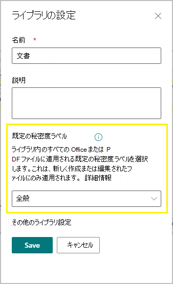

# <a name="configure-a-default-sensitivity-label-for-a-sharepoint-document-library"></a>SharePoint ドキュメント ライブラリの既定の秘密度ラベルを構成する

>*[セキュリティとコンプライアンスのための Microsoft 365 ライセンス ガイダンス](/office365/servicedescriptions/microsoft-365-service-descriptions/microsoft-365-tenantlevel-services-licensing-guidance/microsoft-365-security-compliance-licensing-guidance)。*

> [!NOTE]
> この機能はプレビュー段階で段階的に展開され、変更される可能性があります。 また、機能が一般公開 (GA) になったときに提供されるライセンスの詳細を含むプレミアム機能でもあります。
> 
> プレビューのお知らせを読むには、 [Yammer の投稿](https://www.yammer.com/askipteam/threads/1846702701985792)を参照してください。

[SharePoint で秘密度ラベルが有効になっている](sensitivity-labels-sharepoint-onedrive-files.md)場合は、ドキュメント ライブラリの既定のラベルを構成できます。 その後、そのライブラリにアップロードされた新しいファイル、またはライブラリで編集された既存のファイルには、秘密度ラベルがない場合、または秘密度ラベルが付いているが [優先度が低い](sensitivity-labels.md#label-priority-order-matters)場合に、そのラベルが適用されます。

たとえば、ドキュメント ライブラリの既定の秘密度ラベルとして **機密** ラベルを構成します。 ポリシーの既定のラベルとして **General** を持つユーザーは、そのライブラリに新しいファイルを保存します。 SharePoint では、そのラベルの優先度が高いため、このファイルに **機密** ラベルが付けられます。 考えられる結果の概要については、このページで [既存のラベルをオーバーライドする](#will-an-existing-label-be-overridden) 方法に関するページを参照してください。

既定のラベルは、ベースライン レベルの保護と、コンテンツ検査なしで自動ラベル付けの形式を提供します。 この機能の既定のラベルとラベル ポリシーの既定のラベルを区別するために、次の操作を行います。

- **ドキュメント ライブラリの既定の秘密度ラベル**: SharePoint にのみ適用される場所ベースのラベル付け。 手動で適用しない限り、優先度の低いラベルをオーバーライドします。
- **ポリシーの既定の秘密度ラベル**: 常にすべての場所に適用できます。 既存のラベルをオーバーライドしないでください。

Office on the webを使用してファイルを作成または編集する場合、ドキュメント ライブラリの既定の秘密度ラベルを遅延なく適用できます。 ただし、ファイルをアップロードするか、Windows、macOS、iOS、または Android 上でMicrosoft 365 Appsを使用してファイルを作成し、SharePoint に保存した場合、ラベル付けはすぐには行われません。

- ファイルのアップロード: ラベルが適用されるまで数分かかることがあります。
- Microsoft 365 Apps: アプリを閉じた後にラベルが適用されます。

## <a name="will-an-existing-label-be-overridden"></a>既存のラベルはオーバーライドされますか?

結果の概要:

|既存のラベル |ライブラリの既定のラベルでオーバーライドする |
|:-----|:-----|:-----|
|任意の優先順位で手動で適用| いいえ |
|自動的に適用され、優先度が低い | はい |
|自動的に適用され、優先度が高い | 不要 |
|ポリシーからの既定のラベル、優先度の低い | はい |
|ポリシーからの既定のラベル、優先度が高い | いいえ |

## <a name="requirements"></a>要件

- [SharePoint および OneDrive で Office ファイルの機密度ラベルを有効にしています](sensitivity-labels-sharepoint-onedrive-files.md)。

- [ライブラリに対して SharePoint Information Rights Management (IRM) が有効になっていません](set-up-irm-in-sp-admin-center.md#irm-enable-sharepoint-document-libraries-and-lists)。 この古いテクノロジは、SharePoint ドキュメント ライブラリの既定の秘密度ラベルの使用と互換性がありません。 ライブラリが IRM に対して有効になっている場合、既定の秘密度ラベルを選択することはできません。

## <a name="limitations"></a>制限事項

- SharePoint の保存時の既存のファイルには適用されません。

- [機密ラベルで暗号化されたファイルの共同編集を有効](sensitivity-labels-coauthoring.md)にしていない限り、ユーザーが [**ファイル** \> **として保存**] オプションを選択すると、ドキュメント ライブラリの既定の秘密度ラベルの適用に遅延が発生します。

- Office for the webの秘密度ラベルと同様に、[暗号化を適用する一部のラベル構成](encryption-sensitivity-labels.md#configure-encryption-settings)は SharePoint に適していないため、SharePoint ドキュメント ライブラリの既定の秘密度ラベルはサポートされていません。
    - **ラベルを適用する場合にユーザーがアクセス許可を割り当てられ**、**Word、PowerPoint、Excel でユーザーにアクセス許可を指定するように求める** のチェックボックスが選択されています。 この設定は、"ユーザー定義のアクセス許可" と呼ばれることもあります。
    - **コンテンツへのユーザー アクセスは有効期限が切れています** は、**[使用しない]** 以外の値が設定されています。
    - **二重キー暗号化** が選択されています。

## <a name="how-to-configure-a-default-sensitivity-label-for-a-sharepoint-document-library"></a>SharePoint ドキュメント ライブラリの既定の秘密度ラベルを構成する方法

既存のドキュメント ライブラリの場合:

1. SharePoint で、ドキュメント ライブラリの **[設定**] >移動します。

2. **[ライブラリ設定**] ポップアップ ウィンドウで、[**既定の秘密度ラベル**] を選択し、ドロップダウン ボックスからラベルを選択します。 以下に例を示します。
    
    
    
    この設定では PDF ファイルのサポートについて説明されていますが、このシナリオでは現在、このファイルの種類はサポートされていません。

新しいドキュメント ライブラリを作成する場合は、[**ドキュメント ライブラリの作成**] ポップアップ ウィンドウで同じ **既定の秘密度ラベル** 設定を構成できます。

> [!NOTE]
> これらの新しい設定は、テナントに段階的にロールアウトされます。 表示されない場合は、数日後にもう一度お試しください。

## <a name="monitoring-application-of-library-default-sensitivity-labels"></a>ライブラリの既定の秘密度ラベルのアプリケーションを監視する

[SharePoint **の秘密度** ] 列を使用して、ファイルに適用される秘密度ラベルの名前を確認します。 この機能によってラベルが適用されると、ラベル名のツールヒントに **[このファイルは自動的にラベル付けされました**]と表示されます。 ただし、このツールヒントは、ドキュメント ライブラリの既定の秘密度ラベルに限定されるわけではありません。 また、自動ラベル付けポリシーを使用するか、機密ラベル ポリシーからのユーザーの既定のラベルの結果として、秘密度ラベルが適用されたときにも表示されます。

ライブラリの既定の秘密度ラベルが原因でラベルが適用された時期を具体的に特定するには、[コンプライアンス ポータルの監査ログ](search-the-audit-log-in-security-and-compliance.md)と、**機密ラベル アクティビティ** グループの **機密ラベル ファイル** 監査イベントを使用します。 その後で以下の手順に従います。
1. ポップアップ ウィンドウで詳細を表示するエントリを選択します。

2. 詳細ウィンドウで、 **SensitivityLabelEventData セクション** までスクロールし、 **ActionScourceDetails** の値を特定します。

3. 値 **6** は、ドキュメント ライブラリの既定の秘密度ラベルが原因でラベルが適用された場合に使用されます。

この機能の構成設定を監査するには、**SharePoint リスト アクティビティ** グループの **更新されたリスト** 監査イベントを使用します。 ドキュメント ライブラリの詳細ポップアップ ウィンドウで、**OldSensitivityLabeld** と **SensitivityLabelId** が 3 つの状態の変更を反映できる **SensitivityLabelEventData** セクションまでスクロールします。

- 秘密度ラベルを適用済み
- 秘密度ラベルを 1 つのラベルから別のラベルに変更しました
- 秘密度ラベルを削除しました

秘密度ラベル GUID をラベル名にマップするには、 [Get-Label](/powershell/module/exchange/get-label) コマンドレットを使用します。

1. まず、[Office 365 セキュリティ/コンプライアンス センター PowerShell へ接続します](/powershell/exchange/office-365-scc/connect-to-scc-powershell/connect-to-scc-powershell)。

2. 次に、GUID を指定する次のコマンドを実行します。

    ```powershell
    Get-Label -Identity "<GUID>" | Name

## Next steps

Default labeling ensures a minimum level of protection but doesn't take into account the file contents that might require a higher level of protection. Consider supplementing this labeling method with [automatic labeling](apply-sensitivity-label-automatically.md) that uses content inspection, and encourage [manual labeling](https://support.microsoft.com/office/apply-sensitivity-labels-to-your-files-and-email-in-office-2f96e7cd-d5a4-403b-8bd7-4cc636bae0f9) for users to replace the default label when needed.