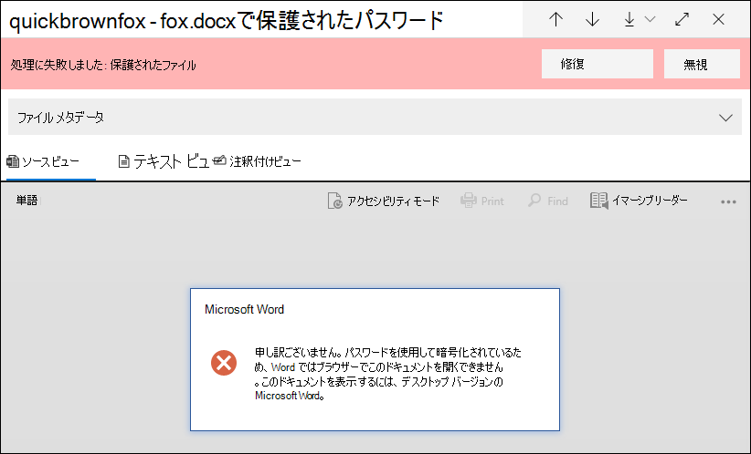
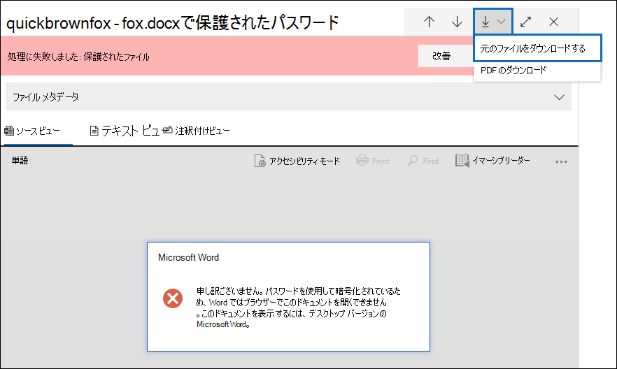
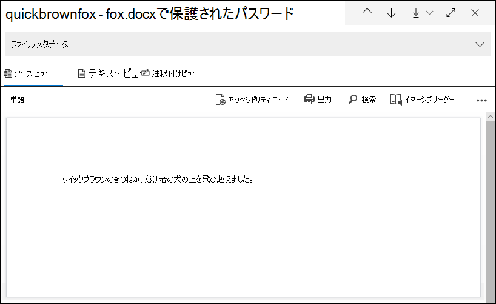

# 単一アイテムのエラー修復 (Advanced eDiscovery

エラー修復により、Advanced eDiscoveryユーザーは、ユーザーがコンテンツを適切に処理Advanced eDiscoveryデータの問題を修正できます。 たとえば、パスワードで保護されたファイルは、ロックまたは暗号化されたファイルなので処理できません。 以前は、このワークフローを使用してエラーを一括で [修復するのみ可能でした](error-remediation-when-processing-data-in-advanced-ediscovery.md)。 ただし、調査中のケースに対応するファイルが存在しない場合は、複数のファイルのエラーを修復しても意味がない場合があります。 また、ファイルのメタデータ (ファイルの場所やアクセス権を持ったユーザーなど) を確認して、応答性に関する意思決定を行う前に、エラーを修復する場合は意味がない場合があります。 単一アイテム エラー修復と呼ばれる新しい機能により、電子情報開示管理者は、処理エラーを含むファイルのメタデータを表示し、必要に応じてレビュー セットでエラーを直接修復できます。 この記事では、レビュー セットの処理エラーを含むファイルを識別、無視、修復する方法について説明します。

## エラーのあるドキュメントを特定する

レビュー セット内の処理エラーのあるドキュメントが識別されます (バナー付き)。 エラーを修復または無視できます。 次のスクリーンショットは、パスワードで保護されたレビュー セット内の Word 文書の処理エラー バナーを示しています。 また、処理エラーが発生したドキュメントのファイル メタデータを表示できます。

また、レビュー セット内のドキュメントにクエリを実行するときに処理状態条件を使用して、処理エラーが発生したドキュメント[を検索することもできます](review-set-search.md)。

### エラーを無視する

処理エラー バナーの [無視] **をクリックすると** 、処理エラーを無視できます。 エラーを無視すると、ドキュメントは一括エラー修復ワークフロー [から削除されます](error-remediation-when-processing-data-in-advanced-ediscovery.md)。 エラーが無視された後、ドキュメント バナーは色を変更し、処理エラーが無視されたかどうかを示します。 [元に戻す] をクリックすると、エラーを無視する決定をいつでも元に **戻します**。

![[無視] をクリックして、処理エラーを無視します。](../media/SIERimage3.png)

また、レビュー セット内のドキュメントを照会するときに無視処理エラー条件を使用して、無視された処理エラーが発生したすべてのドキュメントを検索することもできます。

## エラーのあるドキュメントを修復する

場合によっては、ドキュメントの処理エラー (パスワードの削除、暗号化されたファイルの暗号化解除、破損したドキュメントの回復) を修復し、修復されたドキュメントをレビュー セットに追加する必要がある場合があります。 これにより、エラー ドキュメントをレビュー セット内の他のドキュメントと共に確認およびエクスポートできます。 

1 つのドキュメントを修復するには、次の手順を実行します。

1. [**元の**  >  **ダウンロード] を** クリックして、ファイルのコピーをローカル コンピューターにダウンロードします。

   

2. ファイルのエラーをオフラインで修復します。 暗号化されたファイルの場合、暗号化解除ソフトウェアが必要な場合、パスワード保護を削除するには、パスワードを指定してファイルを保存するか、パスワードクラッカーを使用します。 ファイルを修復した後、次の手順に進みます。

3. レビュー セットで、修復した処理エラーが発生したファイルを選択し、[修復] を **クリックします**。

   ![処理エラーが発生したドキュメントのバナーにある [修復] をクリックします。](../media/SIERimage6.png)

4. [ **参照]** をクリックし、ローカル コンピューター上の修復されたファイルの場所に移動し、ファイルを選択します。

   ![[参照] をクリックし、ローカル コンピューターで修復されたファイルを選択します。](../media/SIERimage7.png)

    修復されたファイルを選択すると、レビュー セットに自動的にアップロードされます。 ファイルの処理状態を追跡できます。

    

   処理が完了したら、修復されたドキュメントを表示できます。

    

ドキュメントが修復された場合の対応の詳細については、「ファイルが修復された場合の対応 [」を参照してください](error-remediation-when-processing-data-in-advanced-ediscovery.md#what-happens-when-files-are-remediated)。

## 修復されたドキュメントを検索する

Keywords 条件を使用し、次のプロパティ:値のペアを指定することで、修復されたレビュー セット内のすべてのドキュメントを検索できます **。IsFromErrorRemediation:true** を指定します。 このプロパティは、レビュー セットからドキュメントをエクスポートするときに、エクスポート読み込みファイルでも使用できます。
