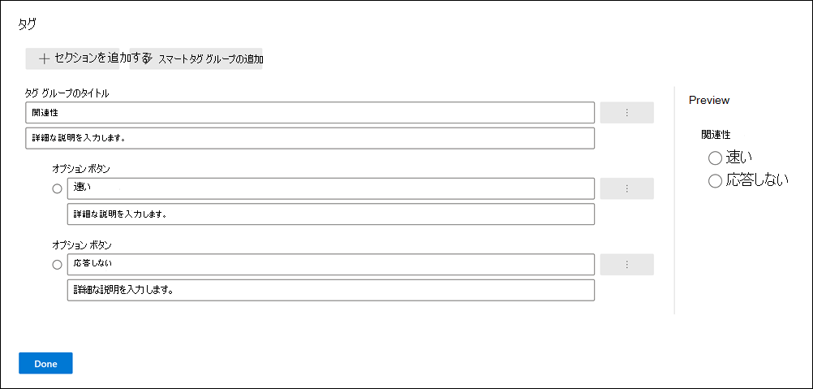

# レビュー セット内のドキュメントにタグを付Advanced eDiscovery

電子情報開示プロセスでさまざまなワークフローを完了するには、レビュー セットでコンテンツを整理することが重要です。 これには、次の内容が含まれます。

- 不要なコンテンツをカリングする

- 関連するコンテンツの識別

- 専門家または弁護士が確認する必要のあるコンテンツを識別する

専門家、弁護士、または他のユーザーがレビュー セット内のコンテンツを確認すると、コンテンツに関連する意見をタグを使用してキャプチャできます。 たとえば、不要なコンテンツを作成する目的がある場合、ユーザーは"応答しない" などのタグでドキュメントにタグを付けできます。 コンテンツがレビューおよびタグ付けされた後、レビュー セット検索を作成して、"応答しない" としてタグ付けされたコンテンツを除外できます。 このプロセスでは、電子情報開示ワークフローの次の手順から応答しないコンテンツが削除されます。 レビュー セットのタグ付けパネルは、ケースごとにカスタマイズして、タグがケースの意図したレビュー ワークフローをサポートします。

> [!NOTE]
> タグの範囲は、大文字と小文字Advanced eDiscoveryです。 つまり、レビュー担当者がレビュー セット ドキュメントにタグを付けできるタグのセットは 1 つのみケースに設定できます。 同じケースで異なるレビュー セットで使用する別のタグセットを設定することはできません。

## タグの種類

Advanced eDiscoveryには、次の 2 種類のタグがあります。

- **単一選択タグ**: グループ内で 1 つのタグを選択するレビュー担当者を制限します。 このような種類のタグは、レビュー担当者が "レスポンシブ" や "応答しない" などの競合するタグを選択しない場合に役立ちます。 単一選択タグはラジオ ボタンとして表示されます。

- **複数選択タグ**: グループ内で複数のタグを選択するレビューを許可します。 これらの種類のタグは、チェック ボックスとして表示されます。

## タグ構造

タグの種類に加えて、タグ パネルでのタグの整理方法の構造を使用して、タグ付けドキュメントをより直感的に作成できます。 タグはセクション別にグループ化されます。 レビュー セットの検索では、タグとタグセクションで検索する機能がサポートされています。 つまり、レビュー セット検索を作成して、セクション内の任意のタグでタグ付けされたドキュメントを取得できます。

セクション内にタグを入れ子にすることで、タグをさらに整理できます。 たとえば、特権コンテンツを識別してタグ付けする目的の場合、入れ子を使用して、レビューアーがドキュメントに "Privileged" としてタグ付けし、適切な入れ子になったタグをチェックして特権の種類を選択できます。

## タグの作成と適用

レビュー セット内のアイテムのタグ付けは、2 段階のプロセスです。 最初の手順は、セット アイテムを確認するために適用されるタグを作成します。 タグを作成した後、ユーザーや他のレビュー担当者は、それらをレビュー セット内のアイテムに適用できます。 前に説明したように、Advanced eDiscoveryケースには、レビュー担当者がレビュー セットアイテムにタグ付けするために使用できるタグのセットを 1 つしか持てない場合があります。

### タグの作成

レビュー セット内のアイテムにタグを適用する前に、タグ構造を作成する必要があります。

1. レビュー セットを開き、コマンド バーに移動し、[ファイルのタグ] **を選択します**。

2. [タグ ファイル **] フライアウト** ページで、[タグの作成 **と編集] をクリックします**。

   ![[フライアウト] ページの [タグの作成と編集] をクリックします。](../media/CreateAeDTags1.png)

3. [タグ] **ページで** 、[追加] **セクションを選択します**。

4. タグ グループのタイトルとオプションの説明を入力し、[保存] を **クリックします**。

5. タグ グループのタイトルの横にある [トリプル ドット] ドロップダウン メニューを選択し、[追加] チェック ボックス **または** [追加] **オプション ボタンをクリックします**。

6. チェック ボックスまたはオプション ボタンの名前と説明を入力します。

7. この手順を繰り返して、新しいタグ セクション、タグ オプション、およびチェック ボックスを作成します。 たとえば、次のスクリーンショットは、応答チェック ボックスと応答しないチェック ボックスで構成される **Review** という名前のタグ **グループを** 示しています。

   

### Apply tags

タグ構造を設定すると、レビュー担当者はタグ設定を構成することで、レビュー セット内のアイテムにタグを適用できます。

1. [レビュー セット] コマンド バーで、[タグファイル]**を選択して**、[タグ ファイル] フライアウト ページ (タグ付けパネルとも呼ばれる)*を表示します*。

   ![コマンド バーの [ファイルのタグ付け] をクリックして、タグ付けパネルを開きます。](../media/TagFilesFlyoutPage.png)

2. [タグ **ファイル] フライ** アウト ページで、次のオプションを設定して、レビュー セットに表示されるアイテムにタグを付ける方法を構成できます。 現在レビュー セットに適用されているフィルターまたはフィルター クエリによって、表示されるアイテム、およびタグを適用できるアイテムが決まれます。 詳細については、「レビュー セット [内のコンテンツのクエリとフィルター」を参照してください](review-set-search.md)。

   - **選択を選択します**。 タグを適用する項目の範囲を決定するには、次のいずれかのオプションを選択します。

      - **選択したアイテムにタグ** を付け: このオプションは、選択したアイテムにタグを適用します。 タグ付けパネルの起動前または起動後にアイテムを選択できます。 このオプションは、タグ付けされる選択されたアイテムの数をリアルタイムで表示します。

      - **リスト内のすべてのアイテムにタグ** を付け: このオプションは、レビュー セットに表示されるすべてのアイテムにタグを適用します。 このオプションは、タグ付けされるアイテムの総数を表示します。

   - **選択を展開** する: 次のオプションを使用して、レビュー セット内のタグ付けされたアイテムに関連する追加のアイテムにタグを付けします。

      - **関連付けられたファミリ アイテム** を含める: このオプションは、タグ付けされているアイテムの関連付けられたファミリ アイテムに同じタグを適用します。  *ファミリ アイテムは* 、同じ **FamilyId** メタデータ プロパティ値を共有するアイテムです。 たとえば、電子メール メッセージに添付されているドキュメントは、電子メール メッセージと **同じ FamilyId** を共有します。 したがって、この例でこのオプションを選択すると、レビュー セットアイテムの一覧にドキュメントが含まれていない場合でも、電子メール メッセージとドキュメントにタグが付きます。

      - **関連する会話アイテムを** 含める: このオプションは、タグ付けされているアイテムと同じ Teams または Yammer 会話内のすべてのアイテムに同じタグを適用します。 *会話アイテムは* 、同じ ConversationId メタデータ プロパティ **値を** 共有するアイテムです。 会話のすべてのメッセージ、投稿、および対応するトランスクリプト ファイルは、同じ **ConversationId を共有します**。 このオプションを選択すると、一部の会話アイテムがレビュー セット アイテムのリストに含まれていない場合でも、同じ会話 (およびトランスクリプト ファイル) 内のすべてのアイテムにタグが付きます。 会話アイテムの詳細については、「グループ化」セクションの「Advanced eDiscoveryワークフロー」[を](teams-workflow-in-advanced-ediscovery.md#grouping)参照Microsoft Teams。

      - **なし**: このオプションは、ファミリ アイテムや会話アイテムにはタグを適用されません。 タグは、選択されているアイテム、またはレビュー セット リスト内のすべてのアイテムにのみ適用されます。

   > [!NOTE]
   > 関連付けられた家族または会話アイテムを含めても、[選択したアイテムにタグを付け] または [リスト内のすべてのアイテムにタグを付け] オプションに表示されるアイテムの数 **は変更** されません。 つまり、タグ付けされる関連アイテムの数は表示されません。

   - **タグの割** り当て : このセクションには、ドキュメントに適用できるタグ (タグ グループ別に整理) が表示されます。 1 つのタグ グループにつき 1 つの単一選択タグ (ラジオ ボタンで識別) のみを適用できます。 ただし、複数の複数選択肢タグを適用できます (これは、チェック ボックスで識別されます)。

3. [ **タグの適用] を** クリックして、設定に基づいてタグを適用します。

   タグ **の適用の** 状態メッセージは、タグ付けパネルの各タグ グループに対して表示され、タグ付けジョブが開始されたかどうかを示します。 [タグの割り当て **]** セクションの各タグ グループのタグは、ジョブが完了するまで灰色で表示されます。

> [!TIP]
> タグ付けパネルで設定を構成する過程で、最初から開始する場合は、[タグの割り当てをリセット] をクリックして現在の設定をクリアします。 このコントロールは、既にタグ付けされているアイテムには適用されません。また、以前にタグ付けされたアイテムのタグを変更または削除したりは行わない。  

#### タグ付けジョブの監視

多数のアイテムにタグを付け (またはリスト内のすべてのアイテムにタグ付 **けする)** オプションを選択すると、タグ付けドキュメント ジョブ **が** 作成されます。 このジョブの状態は、ケースの [ **ジョブ]** タブで表示します。 これにより、完了に長い時間がかかる大きなタグ付けジョブを追跡できます。 場合によっては、タグ付けジョブが完了している可能性がありますが、タグ付けパネルの **[** タグの適用] 状態メッセージは引き続き表示されます。 タグ付けジョブの状態を更新するには、レビュー **セットコマンド** バーの [更新] をクリックします。

## タグの削除

レビュー セット内のアイテムからタグを削除できます。 ただし、レビュー セット アイテムに適用されている単一選択タグは削除できます。 単一選択タグは、同じタグ グループ内の別の単一選択肢タグにのみ変更できます。

タグを削除するには、次の方法を使用します。

1. タグを削除するアイテムを選択します。

2. [タグ **ファイル] を** クリックして、タグ付けパネルを表示します。

3. [タグ **の割り当** て] で、タグの選択を解除し、[タグの適用] **をクリックします**。

前の手順を使用して、選択したアイテムに適用されるタグを変更できます。 現在のタグの選択を解除した後、別のタグを選択できます。
